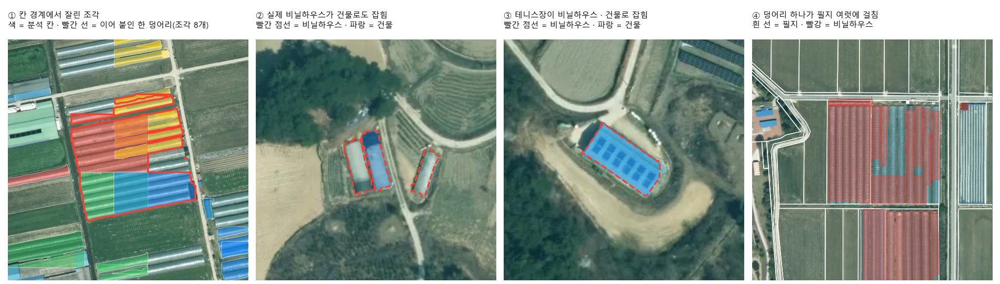
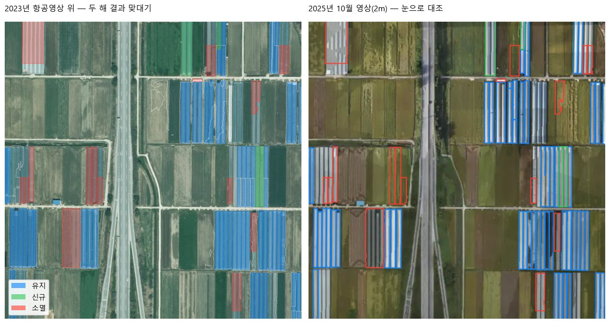

# 설계 11차 · 객체 묶기와 연도 비교 — 확인 대기

> 2026-10-07 · 근거: 확인 대장 '운영 · ChatGEO 고도화' **GEO-순서 확인** — ① 객체 묶기 ② 연도 비교 도구, 설계부터 확인을 받는다.
> 코드는 고치지 않았다. 숫자는 모두 이 PC에 이미 있는 남원 결과로 잰 값이다(GPU 0 · CPU만).

## 한 장 요약
- **지금 '비닐하우스 132,310건'은 분석 칸에서 나온 도형 조각 수다.** 비닐하우스만 고르고 칸 경계 조각을 이어 붙이면 **14,172덩어리**, 30㎡ 미만을 빼면 **12,999덩어리**, 필지로 모으면 **12,470필지**다. 남원 전역에서 CPU로 **약 40초**(이어 붙이기 7초 · 필지 붙이기 29초).
- **25cm 항공영상에서는 '동'을 셀 수 없다.** 붙어 있는 하우스 여러 동이 한 덩어리로 잡힌다(그림 ①). 그래서 **카드의 숫자는 '필지'와 '면적'으로**, 동은 드론처럼 동이 갈라 보이는 영상에서만 쓴다.
- **분류 거르기는 '빼기'가 아니라 '표시'로.** 비닐하우스와 건물이 같은 자리에 함께 잡힌 덩어리가 1,325개인데, 그중에는 실제 비닐하우스(그림 ②)와 테니스장(그림 ③)이 섞여 있다. 자동으로 빼면 진짜도 빠진다 → '분류 확인 필요'로 표시하고 결과 확인 화면에서 사람이 고른다.
- **연도 비교는 '같은 카드 · 같은 기준'으로 돈 두 결과끼리만.** 2023년(항공 25cm · 4분류 모델)과 2025년(드론 · 비닐하우스 전용 모델)을 맞대어 보니 남원 전역 '소멸'이 10,642개로 나왔지만, 눈으로 대조하면 상당수는 **2025년 결과가 그 하우스를 담지 않은 것**이었다(그림 ⑤). 모델과 범위가 다르면 숫자가 아니라 '참고용 비교'로만 보여 준다.

## ① 객체 묶기 — 측정(남원시 · 2023년 항공영상 · 비닐하우스 서비스 결과)
| 단계 | 남은 수 | 걸린 시간(CPU) |
|---|---|---|
| 분석 칸 도형 조각(모델의 네 분류 전부) | 132,310 | — |
| 비닐하우스 분류만 | 14,792 (칸 경계 조각 1,571) | 불러오기 1.7초 |
| 칸 경계 이어 붙이기(다른 칸 조각끼리 0.5m 이내 · 경계 조각이거나 겹칠 때) | **14,172** (445곳에서 조각을 합침) | 2.2초 |
| 건물과 50% 이상 겹치고 건물 쪽 확신이 더 높은 것 표시 | 13,534 + 표시 638 | 4.6초 |
| 30㎡ 미만 빼기 | **12,999 덩어리** | — |
| 필지에 붙이기(필지 안 하우스 면적 30㎡ 이상) | **12,470 필지** (가장 많이 걸친 필지 기준 9,271) | 29초(필지 33만 개 준비 3.6초 포함) |
| 참고 — 0.5m 안에 붙은 덩어리끼리 다시 묶기(다동 단지) | 11,271 | 2.3초 |

다른 분류도 같은 방법으로: 경작지 62,724 → 53,907 · 건물 52,540 → 51,745 · 주차장 2,254 → 2,236 (네 분류 합 27초).

같은 남원의 다른 두 결과(같은 방법으로 잼):
| 결과 | 조각 | 묶은 뒤 | 필지 | 판단 |
|---|---|---|---|---|
| 2025년 드론 비닐하우스 결과(이미 필지별로 정리됨) | — | 3,505동 | 1,674필지(30㎡ 이상 1,672) | 동이 갈라 보임 → 동 · 필지 둘 다 셀 수 있음 |
| 2023년 항공영상에 드론 모델을 옮겨 쓴 시험 결과 | 2,819 | 1,922덩어리(가운데 값 2,706㎡) | 12,281 | 한 덩어리가 너무 큼(밭까지 덮음) → 숫자로 쓰지 않음 |

*① 세 분석 칸에 걸친 하우스 단지가 조각 8개로 잘렸다가 한 덩어리로 · ② 실제 비닐하우스가 건물로도 잡힘 · ③ 테니스장이 비닐하우스 · 건물로 잡힘 · ④ 덩어리 하나가 필지 여럿에 걸침. 바탕: 남원 2023년 항공영상.*

### 정할 것과 추천
| 물음 | 선택지 | 추천 |
|---|---|---|
| 셈 단위 | ⓐ 동 ⓑ 필지 ⓒ 필지 + 면적 | **ⓒ** — 25cm 영상은 동이 갈라지지 않는다. 공무원 업무(현장 확인 · 대장 대조)는 필지로 움직인다. 동은 드론 결과에만 덧붙인다 |
| 칸 경계 | ⓐ 분석이 끝난 뒤 한 번에 이어 붙이기 ⓑ 칸마다 바로 | **ⓐ** — 남원 전역 7초. 칸마다 하면 이웃 칸을 기다려야 한다 |
| 분류가 겹칠 때 | ⓐ 자동으로 빼기 ⓑ '분류 확인 필요' 표시 | **ⓑ** — 그림 ②처럼 진짜가 빠진다 |
| 최소 면적 | 10 · 20 · **30** · 50㎡ (남는 수 14,169 · 14,084 · 12,999 · 11,992) | **30㎡** — 서비스 카드의 조건 칸에서 바꿀 수 있게 |
| 저장 | 탐지 조각 표는 그대로 두고, **객체 표**(한 줄 = 한 덩어리: 지역 · 카드 · 판 · 회차 · 영상 시점 · 분류 · 면적 · 조각 수 · 확신 · 분류 확인 필요 · 대표 필지) + **조각-객체 연결 표** + **필지 요약 표**(필지 · 회차 · 면적 · 덩어리 수). 기관별로 나누고 공간 색인. 판이 바뀌면 새 회차로 쌓고 지우지 않는다 | 이대로 |

## ② 연도 비교 도구 — 시험 계산
남원에서 두 시점 결과가 다 있는 것은 **2023년 항공(4분류 모델)** 과 **2025년 드론(비닐하우스 전용 모델)** 뿐이다. 영상 해상도(25cm ↔ 1.5cm)도 모델도 다르다 — 이번 시험은 '기준이 다를 때 무엇이 틀어지는가'를 보는 계산이다.

맞대는 법: 두 해 덩어리를 2m 넓혀 작은 쪽의 30% 이상 겹치면 같은 것으로 본다. 한쪽 한 덩어리가 다른 쪽 여러 동과 겹치면(해상도 차이) 묶음 하나로 센다.
| 범위 | 2023 | 2025 | 유지(묶음) | 신규 | 소멸 | 유지 묶음의 면적 | 걸린 시간 |
|---|---|---|---|---|---|---|---|
| 금지면 1km × 1km | 123덩어리 | 175동 | 61 (2023 70 · 2025 157) | 18 | 53 | 135,935㎡ → 113,399㎡ (늘어남 26 · 줄어듦 16) | 1초 미만 |
| 남원 전역 | 12,999 | 3,505 | 1,907 (2,357 · 2,798) | 707 | 10,642 | 2,360,401㎡ → 2,144,993㎡ | 4.8초 |
| 남원 전역 · 필지로 | 12,470필지 | 1,672필지 | 1,481필지 | 191필지 | 10,989필지 | — | — |

- 위치 허용: 한 동씩 짝지어진 776쌍의 중심 거리 가운데 값 **1.5m**, 열 중 아홉은 11m 안. 허용 거리 0.5 · 2 · 5m로 바꿔 보면 금지면 1km 칸의 소멸이 53 · 53 · 42 → **2m** 추천(5m는 이웃 하우스와 붙는다).
- 눈 대조(금지면 1km 칸 '소멸' 53 · '신규' 18개를 두 해 영상으로 하나씩 봄): '소멸'은 마을 안 작은 지붕(2023 모델이 잘못 본 것)과 2025년 영상이 없는 곳이 열 개 남짓씩, 밭 자리 가운데는 실제로 철거된 곳과 2025년에도 하우스가 그대로 있는 곳이 대략 반반이었다. '신규' 상당수도 2023년 영상에 이미 하우스가 보인다. **→ 두 결과의 차이 대부분이 모델 · 범위 차이다.**

*⑤ 왼쪽: 2023년 항공영상 위에 유지(파랑) · 신규(초록) · 소멸(빨강). 오른쪽: 2025년 10월 영상(2m)에 같은 선 — 왼쪽 위 빨강은 2025년에도 하우스가 있다(2025년 결과가 담지 않은 것), 가운데 왼쪽 빨강 두 줄은 실제로 밭이 되었다.*

### 정할 것과 추천
| 물음 | 추천 |
|---|---|
| 무엇끼리 맞대나 | **같은 서비스 카드(같은 모델 판 · 같은 조건)로 같은 범위를 돈 두 회차끼리.** 다르면 숫자 없이 '기준이 달라 참고용' 지도만 보여 주고, 같은 카드로 다른 해 영상을 분석하자고 버튼 하나(분석 요청 · LX 관리자 확인) |
| 기준 | 2m 넓혀 작은 쪽 30% 겹침 = 유지 · 면적 20% 넘게 늘면 '늘어남', 줄면 '줄어듦' · 한쪽 덩어리가 여러 동과 겹치면 묶음 하나 |
| 해상도가 다를 때 | 덩어리끼리가 아니라 **필지끼리** 맞댄다(필지 안 하우스 면적 30㎡ 기준). 동 수는 비교하지 않는다 |
| 한쪽만 영상이 있을 때 | 두 영상이 다 덮는 곳만 센다. 한쪽만 덮는 곳은 회색 '비교할 수 없는 곳' + 면적 한 줄 |
| 돌려줄 것 | 세 색 지도 층(신규 초록 · 유지 파랑 · 소멸 빨강) · 표(읍면동별 신규 · 유지 · 소멸 필지와 면적) · 내려받기(지도 파일) · XI ChatGEO 한 줄 · 지도 동작(두 시점 나란히 + 세 색 층 켜기 + 소멸 많은 읍면동으로 이동) |
| 저장 | 비교 한 번 = 비교 기록 한 줄(두 회차 · 기준 · 만든 때) + 짝 표(2023 객체 · 2025 객체 · 구분 · 면적 변화). 같은 두 회차 · 같은 기준이면 다시 계산하지 않음 |

## 카드 숫자 · XI ChatGEO 와 어떻게 이어지나
| 어디 | 무엇을 쓰나 | 지금 → 바뀐 뒤 |
|---|---|---|
| 서비스 카드 큰 숫자(의미 있는 숫자) | 필지 요약 표 | 비닐하우스 '필지 대조 뒤 표시' → **'비닐하우스 있는 필지 12,470'**(묶기 확인 뒤 · 분류 확인 필요는 따로 표시) |
| 같은 이름 숫자 | 객체 표 하나에서 | 카드 · 대시보드 · XI맵 · 보고서 · 채팅이 같은 표를 읽는다(조각 수는 어디에도 싣지 않음) |
| XI ChatGEO '남원 비닐하우스 몇 개야?' | 객체 도구(필지 요약) | '남원시에 비닐하우스가 있는 필지는 12,470곳입니다(2023년 항공영상 기준).' + 읍면동 차트 버튼 — 숫자는 도구 결과만 |
| XI ChatGEO '2023년과 2025년 비교해 줘' | 연도 비교 도구 | 같은 카드 두 회차가 있으면 '신규 n · 유지 n · 소멸 n필지' + 세 색 층 · 두 시점 나란히. 없으면 '두 해 결과의 기준이 달라 숫자로 비교하지 않았습니다' + 참고 지도 + `같은 기준으로 분석 요청` |
| 관할 가드 | 두 도구 모두 | 기관 계정은 관할 시군구의 객체 · 필지만(서버가 거름) — 범위 밖은 0 |

## 확인받을 것(items.json)
1. **G-1 객체 묶기** — 필지 + 면적으로 세기 · 경계 이어 붙이기 · 분류 겹침은 표시 · 30㎡ · 객체 표로 저장
2. **G-2 연도 비교** — 같은 카드 두 회차끼리만 숫자 · 해상도 다르면 필지끼리 · 세 색 + 표 + 한 줄
3. **G-3 첫 실제 비교에 쓸 분석** — 남원 2020년 항공영상(2023년과 같은 25cm · 이 PC에 있음)에 같은 비닐하우스 카드를 한 번 돌려 2020 ↔ 2023을 숫자로 비교(GPU 한 장 · 작업 대기열 · 사용자 허락 뒤). 2025년 남원 전역 드론 원본은 지금 이 PC에 연결돼 있지 않다

## 먼저 제안 — 이런 것도 필요하지 않을까요?
- **현장 확인 목록에 '연도 비교 소멸 필지' 넣기** — 지자체 농지 담당이 철거 · 용도 변경을 확인할 때 바로 쓰는 목록이다(이번 눈 대조에서도 실제 철거가 보였다).
- **결과 확인 화면의 '분류 확인 필요' 묶음 처리** — LX 직원이 1,325곳을 한 장씩 보지 않고 사진 격자로 고르면 재학습 표본도 같이 쌓인다.
- **2m 영상(2025년 4월 · 10월 남원 시가지)으로 '눈 대조' 층** — 다른 해 결과가 없을 때도 사람이 바로 대조할 수 있다.

## 증거
- 측정 값: `measure-objects.json` · `measure-compare.json` (스크립트는 스크래치 폴더 — 저장소에 두지 않음)
- 그림: `img/fig-objects.jpg` · `img/fig-compare.jpg` — 모두 이 PC의 실제 결과와 남원 2023년 항공영상 · 2025년 10월 남원 영상
