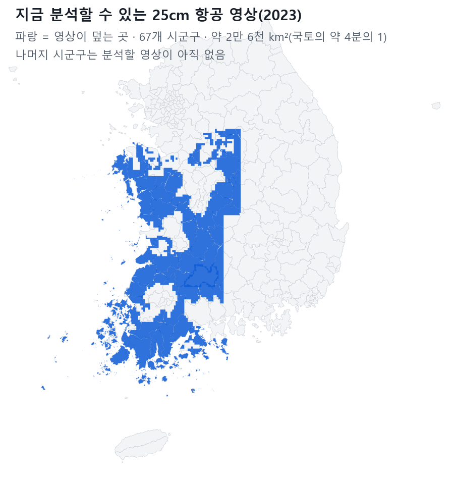

# 전국 단위 분석 — 할 수 있는 범위와 세 가지 안 (장면-2 검토)

> 2026-10-09 · 검토만(분석 실행 0 · GPU 사용 0). 확인 대장 '장면-2' 사용자 말: "지금 예시가 너무 작은 범위다. 차라리 분석을 전국으로 해서 만드는 과정을 검토해볼까?"
> 숫자는 모두 이 PC 서버 기록(영상 등록 표 · 분석 작업 기록 · 필지 대조 기록, 10-09 조회)에서 옮겼다. 추정은 '추정'으로, 확인하지 못한 것은 '확인 필요'로 적었다.

## 한 장 요약
- **지금 AI 분석에 쓸 수 있는 영상은 2023년 25cm 항공(비도시) 하나뿐이고, 67개 시군구 · 약 2만 6천 km²(국토의 약 4분의 1)만 덮는다.** 252곳 중 절반 이상 덮는 곳은 47곳. 경기 · 강원 · 경상 · 서울 · 광역시는 거의 없다. → 지금 영상으로 '전국'은 할 수 없다.
- **원판 모델은 한 번 돌리면 건물 · 주차장 · 경작지 · 비닐하우스를 함께 찾는다.** 서비스를 늘려도 GPU 시간은 늘지 않는다(늘어나는 것은 서비스마다의 필지 대조 — CPU).
- 가진 영상 전부를 한 번 돌리는 데 **GPU 한 장으로 약 9~12시간**(대기열이 한가할 때), 필지 대조 **약 6~12시간(CPU)**. 시군구 단위 작업으로 쪼개 낮은 순위로 넣으면 그 사이 다른 분석이 먼저 끼어든다.
- **추천 ⓒ: 전국 252곳은 공개 위성(10m) 토지피복으로 '같은 기준' 한 장 + 영상이 있는 67곳은 우리 AI(25cm)로 실제 도형.** 전국 층은 GPU 0으로 만들 수 있다.

---

## 1. 영상 — 전국으로 쓸 수 있는 것
| 영상 | 덮는 곳 | 해상도 · 연도 | AI 분석에 쓸 수 있나 | 비고 |
|---|---|---|---|---|
| 국토지리정보원 2023 항공 정사(비도시) — LX 보유 | 전남 20 · 충남 16 · 전북 12 · 충북 9 · 경남 4 · 경기 3 · 경북 2 · 강원 1 = **67곳**(절반 이상 덮는 곳 47) · 약 26,200 km² | 25cm · 2023 | **쓸 수 있음**(지금 원판의 입력) | 도심 도엽이 없다 — 여수 33% · 원주 14% · 여주 7%만 덮음. 원본 1.7TB |
| 남원 드론 · 국산리 · 익산 황등 · LX 본사 등 | 시군구 일부(수 km²) | 1.4~5cm | 쓸 수 있음(곤포 · 차량 등 드론 모델) | 전국 확장 불가 |
| AI Hub 토지피복 학습 칩(경상 · 전라 · 제주 · 경기) | 흩어진 칩 | 25cm · 2020 전후 | 학습용 — 시군구 전역 분석 불가 | 연속 영상이 아님 |
| V-World 위성(배경지도) | 전국 | 약 25cm급(줌 19) | **쓰지 않음**(9-29 판정) | 이용약관 원문 확인 불가 · 저장 · 복제 제한 조항 있음 → 불명확 = 쓰지 않음. 배경 표시는 그대로 |
| Sentinel-2 위성(유럽 공개) | 전국 · 해외 | 10m · 매달 | 쓸 수 있음(상업 포함 무료 · 출처 표기) | 비닐하우스 · 건물 한 동씩은 못 봄. 해외 화면에서 이미 쓰는 중 |
| 공개 AI 토지피복(Esri · ESA, Sentinel-2 기반) | 전국 · 해외 | 10m · 해마다(2017~) | 쓸 수 있음(CC BY 4.0 · 출처 표기) | 농지 · 시가지 · 숲 · 물 등 넓은 분류. 비닐하우스 분류 없음. 해외 구역 경작지 계산에 같은 도구가 있음 |
| 국토지리정보원 최신 전국 정사영상 | 전국 | 확인 필요 | **확인 필요** | LX가 이 PC에 가진 것은 위 2023 비도시뿐. 보안시설 가림 처리본만 제공되고, **해외 반출은 측량성과 국외 반출 제한 대상**(공간정보관리법 — 조항 · 절차 확인 필요). 해외 기관에는 원본 영상이 아니라 결과(도형 · 통계)만 |

**정리:** 252곳 중 우리 AI로 분석할 영상이 있는 곳 **67곳(절반 이상 덮음 47곳)**. 나머지 185곳은 영상을 새로 받아야 한다.

## 2. 비용 — 실제 기록으로 본 GPU · CPU · 저장
**실측(원판 한 번 = 네 가지 동시 · GPU 0 한 장 · 전력 상한 200W 안 · 최고 159W):**
| 지역 | 영상 넓이 | 걸린 시간 | 그때 대기열 |
|---|---|---|---|
| 남원시 | 1,011 km² | 20.6분 | 한가(10-07) |
| 함양군 | 486 km² | 11.4분 | 한가(10-07) |
| 원주시 | 118 km² | 3.1분 | 한가(10-07) |
| 구례군 | 397 km² | 20.0분 | 다른 분석과 섞임(9-29) |
| 보령시 | 581 km² | 38.7분 | 다른 분석과 섞임(9-30) |
→ **1 km²당 1.2~1.6초(한가) · 3~4초(섞임).** 필지 대조(CPU)는 시군구 한 곳 처음 3~40분(대부분 5분 안팎 · 필지를 처음 읽는 시간 포함), 다시 할 때는 수 초~수 분.

**추정:**
| 범위 | 넓이 | GPU 한 장(한가 / 섞임) | 필지 대조(CPU) | 저장 |
|---|---|---|---|---|
| 전라북도(영상 있는 12곳) | 약 6,300 km² | 2~3시간 / 5~7시간 | 2~4시간 | 결과 수백 MB · 필지 수 GB |
| 가진 영상 전부(67곳) | 약 26,200 km² | **9~12시간 / 22~29시간** | 6~12시간 | 결과 약 1GB · 필지 약 10~15GB |
| 전국(영상이 있다면 · 252곳) | 약 10만 km² | 34~44시간 / 3.5~4.6일 | 1~2일 | **원본 영상만 약 6~7TB** — 지금 남은 칸 D 0.36TB · E 1.8TB → 디스크 추가 필요 |

- **전력 규칙:** 분석은 GPU 0 한 장 · 대기열로만. GPU 1은 XI ChatGEO(vLLM)가 쓰고 있어 그대로 둔다. 두 장 동시 고부하 없음.
- **그동안 다른 분석:** 대기열은 순위가 높은(숫자 작은) 작업의 첫 묶음을 먼저 넣는다. 시군구마다 작업을 나눠 **낮은 순위**로 넣으면 XI맵 실시간 · 카드 분석이 사이사이 먼저 돈다 — 대신 전국 작업은 '섞임' 쪽 시간에 가까워진다. 밤 시간에 몰아 돌리는 것을 권한다.
- 곤포사일리지는 드론 모델이라 25cm 항공으로는 분석할 수 없다(전국 대상 아님).

**정확도 · 해상도 한계:**
| 서비스 | 원판 점수(같은 검증 묶음 3,000칸 · 1이 만점) | 한계 |
|---|---|---|
| 비닐하우스 | 0.906 | **남원 2023 영상에서는 하우스 단지를 크게 놓침**(카드 결과 703곳 — 실제보다 훨씬 적음). 전국 숫자로 내세우기에 가장 위험 |
| 건축물 | 0.887 | 비도시 영상이라 도심 건물이 빠짐 → 시군구 합계가 실제보다 작다 |
| 주차장 | 0.867 | 같음(도심 주차장 빠짐) |
| 경작지 | (같은 표 없음) | 필지 대조의 바탕(지목 대조)으로 씀 |
| 공개 10m 토지피복 | 공개 자료 자체 정확도(우리 측정 아님 · 확인 필요) | 한 동 · 한 필지 단위 판단 불가. '시군구 농지 · 시가지 면적과 변화'까지만 |
- 영상이 2023 한 시점뿐이라 25cm로는 '변화'를 전국으로 보일 수 없다.

## 3. 세 가지 안
| | ⓐ 가진 영상 전부 × 원판 한 번 | ⓑ 광역 한 곳(전라북도) × 여러 서비스 | ⓒ 전국은 공개 위성 10m + 영상 있는 곳은 25cm AI (추천) |
|---|---|---|---|
| 무엇을 | 67곳에서 네 가지(건물 · 주차장 · 경작지 · 비닐하우스) 동시 + 필지 대조 | 전북 12곳(전주 · 익산 영상 없음)에서 네 가지 + 필지 대조 + 사람이 결과 확인까지 | 252곳 전부: 공개 토지피복으로 시군구별 농지 · 시가지 면적과 2017→최근 변화(CPU) + 67곳: ⓐ |
| 걸리는 날 | 약 2일(GPU 밤 2번 · CPU 병행 · 화면 반영 포함) | 약 1일 | 약 3~4일(전국 층 1~2일은 CPU라 ⓐ와 동시에) |
| 결과 품질 | 우리 AI · 도형 단위. 도심 빠짐 · 비닐하우스 적게 잡힘 | 가장 높음 — 결과 확인으로 틀린 것을 걸러 낼 수 있음 | 전국 층은 넓은 분류뿐(공개 자료) · 지역 층은 ⓐ와 같음 |
| 메인에 보일 모습 | 서남부 넷 시도권만 파랗게 칠한 지도 + 네 숫자. 나머지 지역이 비어 '전국'이라 말할 수 없음 | 전북만 진하게 · 여러 서비스 결과가 겹쳐 보임. 넓이감은 오히려 줄어듦 | 252곳이 모두 같은 기준으로 칠해진 전국 지도 → 영상 있는 지역으로 다가가면 비닐하우스 · 건물 실제 면이 나타남 |
| 걸리는 점 | '전국'이 아님 | '너무 작은 범위' 문제를 그대로 남김 | 전국 층은 우리 AI 결과가 아님 → **'공개 위성 기준'을 표기**해야 함(과장 금지) |

**추천 ⓒ.** 사용자 말의 핵심은 '전국 단위라는 체감'이다. 지금 영상으로 252곳 전부를 우리 AI로 채울 수 있는 길은 없고, 공개 10m 자료는 252곳을 같은 기준으로 칠할 수 있는 유일한 길이다(GPU 0). 그 위에 우리 AI 25cm 결과를 '다가가면 보이는' 지역 층으로 얹으면 거짓 없이 '전국 → 필지'가 이어진다. 순서는 ⓐ(밤에 GPU 한 장) → 전국 층(CPU 병행) → 메인 둘째 장면 반영.

## 4. 제안(이런 것도 필요하지 않을까요?)
1. **국토지리정보원 최신 전국 정사영상 확보 요청** — 누가 왜: LX 관리자. 185곳은 영상이 없어 기관이 서비스를 신청해도 '영상 등록 필요'에서 멈춘다. 확보하면 디스크 약 8TB 추가가 함께 필요하다.
2. **전국 숫자 공개 전 '표본 결과 확인' 한 단계** — 누가 왜: LX 직원. 비닐하우스처럼 지역마다 놓치는 정도가 다른 결과를 메인에 숫자로 내기 전에 시군구 몇 곳을 사람이 확인해 두면 숫자 과장 시비를 막는다.
3. **지도에 '이 지역 영상: 2023 · 지역의 N%' 한 줄** — 누가 왜: 기관 담당자. 도심이 빈 시군구의 작은 숫자를 '없다'로 오해하지 않게.
