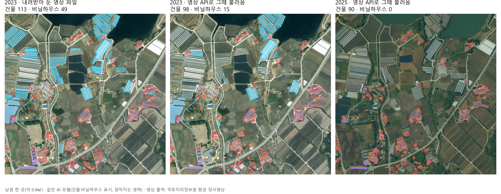
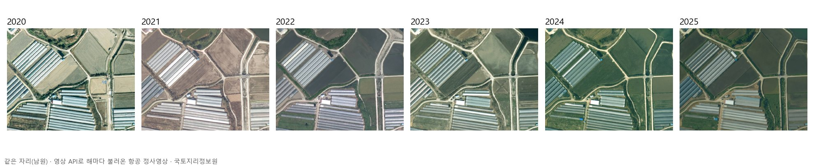

# 영상 API로 전국을 분석한다면 — 사실 확인 · 작은 실증 · 구조 제안

> 2026-10-09 · 오퍼스(최고 노력) · 평가 · 실증 · 제안만 했고 구현은 하지 않았다.
> 사용자 말(10-09): "전국단위 수시 변화 서비스를 위해서는 현재 항공영상 tif 로컬로 받고 분석하고 돌리고 하는 구조는 너무 1차원적이다. 브이월드 영상은 api 형태로 제공하고 있고. 이걸 기준으로 우린 분석결과만 수시 생산 이력관리 하는 등 효율적인 접근법을 검토해야 한다. 위성항공 모두 해당되겠다." / "지리원 API를 통해서 영상을 호출할 수 있는걸 예전에 확인한게 있다."
> 원칙 136 · 확인 대장 장면-2a(검토 필요) · 장면-2b(반려)에 대한 답이다.

## 한 장 요약
- **앞선 검토의 결론('25cm 항공 2023 비도시만 분석 가능 · 브이월드 위성은 분석 불가')을 바로잡는다.** 국토지리정보원 항공 정사영상은 **영상 API로 전국을 해마다 불러올 수 있다.** 2020~2025년 여섯 해는 약 25cm, 2011~2019년은 약 50cm다. 전국 여덟 곳(서울 · 부산 · 강릉 · 제주 · 대구 · 원주 · 진도 · 철원)에서 여섯 해 모두 영상이 나왔다.
- 브이월드 영상 지도(가장 크게 확대하면 약 24cm)는 **같은 국토지리정보원 항공영상의 가장 최근 판**이다. 남원 두 곳에서 2025년 영상과 거의 같았다(닮음 0.987). 다만 **촬영 연도를 알려 주지 않고 지난 해를 고를 수 없다.** 그래서 변화 이력을 만들 때는 국토지리정보원 연도별 영상이 바탕이고, 브이월드는 '새 영상이 올라왔나'를 알아채는 데 쓴다.
- **작은 실증(남원 0.8㎢):** 영상 파일 없이 API로 그 자리만 불렀다. 1㎢에 약 50초, 받은 양은 약 2MB였다. 분석은 지금 쓰는 모델로 작업 대기열에서 GPU 한 장만 썼고 몇 초 걸렸다. 같은 2023년 영상 파일 결과와 비교하면 **경작지 95% · 건물 85% · 주차장 77%를 같이 찾았다. 비닐하우스는 46%만 찾았다.** 원인은 API 영상의 압축이다. 같은 파일을 같은 방식으로 압축해 돌려 보니 비닐하우스가 같은 만큼 줄었다. 비닐하우스 모델은 API 영상으로 다시 학습해야 한다.
- **구조 제안:** 영상은 쌓지 않는다. 필요한 곳만 그때 불러 분석하고, **결과만 '연도별 이력'으로 쌓는다.** 전국 한 해 분량의 결과는 수 GB(추정)지만, 같은 범위의 영상 파일은 수 TB다. 방향은 둘이고, **추천은 ⓑ '해마다 전국 결과 장부 + 바뀐 곳만 다시'**다. ⓐ '부를 때만'이 그 첫 단계다.
- **앞 화면은 XI맵이다(4장).** 지금의 시군구 결과판을 정의대로 되돌린다. 국내 · 해외가 한 지도에 있고, 영상 원천과 연도를 고르고, 어디서든 바로 분석하고, 결과를 해마다 넘겨 변화를 본다.
- **약관:** 공공데이터포털에는 두 영상 API가 모두 '공공누리 제1유형(출처 표시 · 상업 이용 · 변경 가능)'으로 올라 있다. 반면 브이월드 자체 약관에는 '결과 데이터 저장 · 복제 제한' 조항이 있고, 우리가 쓴 국토지리정보원 호출 길은 공식 안내 문서가 없는 지도 화면용 길이다. **운영 전에 국토지리정보원 · 공간정보산업진흥원과 '영상은 저장하지 않고 분석 결과만 저장'하는 이용 범위와 호출량을 정식으로 확인받아야 한다**(결정 항목 영상API-2).

---

## 1. 사실 확인 (직접 호출로 확인한 것과 출처)

### 1-1. 국토지리정보원 항공 정사영상 — 연도별로 부를 수 있음
| 항목 | 확인한 사실 | 어떻게 확인했나 |
|---|---|---|
| 호출 길 | 국토정보플랫폼 지도 화면이 쓰는 항공영상 타일 서비스. 연도마다 층이 따로 있고(예: 2023년 층), 좌표계는 국토지리정보원 표준(UTM-K) | 10-09 직접 호출. 사양은 7월에 도로공사 과제에서 실측해 둔 기록(국토정보플랫폼 지도 스크립트에서 확인)을 그대로 씀 — 사용자가 말한 '예전에 확인한 것'이 이것 |
| 해상도 | 2020~2025 = 가장 크게 확대하면 **한 화소 25.5cm**. 2011~2019 = 한 단계 아래까지 **51cm**. 그보다 크게 확대하면 영상 없음 | 남원 시청 한 자리에서 2010~2026 · 확대 단계별로 한 장씩 호출 |
| 덮는 범위 | 서울 · 부산 · 강릉 · 제주 · 대구 · 원주 · 진도 · 철원 여덟 곳 모두 2020~2025 여섯 해 영상 있음(서로 다른 영상) | 여덟 곳 × 열다섯 해 = 120장 호출 |
| 촬영 시점 | **연도는 층 이름으로 안다.** 촬영 월 · 일 정보는 타일에 없음 | 응답 머리글 확인 |
| 2026년 | 아직 층 없음(요청 오류) → **새 해 층이 생겼는지 주기적으로 물어보면 '새 영상 공개'를 알 수 있다** | 직접 호출 |
| 키 | 이 길은 키 없이 열림(지도 화면용). 공식 오픈 API(영상지도 · 위성지도)는 회원 키 필요 — Land-XI 설정에는 국토지리정보원 키가 없다 | 설정 파일 이름만 확인 |
| 보안 지역 | 접경 · 군사 지역은 해마다 가림 처리 위치가 다름(빈 영상) — 7월 육군 과제 실측 기록 | 기록 |
| 이용 조건 | 공공데이터포털 '국토지리정보원 영상지도 · 배경지도 API' = **공공누리 제1유형(출처 표시) · 무료 · 호출량은 기관 정책** | [공공데이터포털 15059358](https://www.data.go.kr/data/15059358/openapi.do) |

### 1-2. 브이월드 영상 지도
| 항목 | 확인한 사실 | 출처 |
|---|---|---|
| 확대 범위 | 영상 지도는 6~19단계. 19단계 = 남원 위도에서 한 화소 약 24cm. 20단계는 오류 | [브이월드 WMTS 안내](https://www.vworld.kr/dev/v4dv_wmtsguide_s001.do) · 10-09 직접 호출 |
| 촬영 시점 | **응답에 촬영 연도 · 날짜 없음**(머리글은 날짜 · 캐시 기간뿐). 지난 해를 고르는 길 없음(국내). 해외 도시는 연도별 주제 지도가 따로 있음 | 직접 호출 · 위 안내 |
| 무슨 영상인가 | 남원 두 곳에서 국토지리정보원 2025년 영상과 닮음 0.987(2024년 0.50~0.73) → **국토지리정보원 최신 항공영상** | 직접 비교 |
| 이용 조건 | 공공데이터포털 '국토교통부 WMTS/TMS API' = 공공누리 제1유형 · 무료 · 호출량은 기관 정책 | [공공데이터포털 3046388](https://www.data.go.kr/data/3046388/openapi.do) |
| 약관상 걸리는 점 | 브이월드 자체 약관 제10조(서비스 이용) 6항 4호 · 제12조(저작권)에 저장 · 복제 제한이 있다. 공간정보산업진흥원이 저장 코드 삭제를 요청한 공개 사례가 있는데, 대상은 **3차원 건물 데이터**였다. 주소 검색 API 안내에는 "실시간으로 사용하고 별도 저장장치에 저장할 수 없다"고 적혀 있다 | [사례](https://www.vw-lab.com/53) · [주소 검색 안내](https://www.vworld.kr/dev/v4dv_geocoderguide2_s001.do) |
| 호출 한도 | 숫자는 공개 문서에서 찾지 못함 — 한도를 넘으면 '일일 제한량 초과' 오류. 우리 키는 개발 키(운영 키 신청은 미결 장부에 있음) | [안내 모음](https://blog.itcode.dev/projects/2022/03/21/gis-guide-for-programmer-11) · 미결 장부 |

### 1-3. 위성
| 영상 | 해상도 · 시점 | 쓸 수 있나 |
|---|---|---|
| 국토위성(국토위성 1호) 모자이크 — 국토지리정보원 공식 오픈 API '위성지도' 층 | 약 51cm · **한 시점**(연도 고르기 없음) | 7월 육군 과제 실측: 배경용으로 매끈하게 다듬은 영상이라 **건물 · 경작지는 되지만 차량 같은 작은 것은 거의 못 찾음.** 키가 있어야 함(Land-XI에는 없음) |
| 국토위성 원본 정사영상 | 50cm급 | 국토정보플랫폼에서 웹으로 신청해 받는 길(무료 · 로그인). API가 아니라 파일 — 원칙 136과 맞지 않아 보조로만 | 
| Sentinel-2(유럽 공개) | 10m · 5일마다 | 국내외 모두 쓸 수 있음(이미 해외 화면에서 씀). 한 동 · 한 필지는 못 봄 → **'어디가 바뀌었나'를 먼저 훑는 용도**로 알맞음 |

참고: [국토위성 0.5m 위성지도 공개 기사](https://v.daum.net/v/20240212122613055) · [국토위성센터 누리집 개설](https://www.molit.go.kr/USR/NEWS/m_71/dtl.jsp?lcmspage=1&id=95090842)

---

## 2. 작은 실증 — 남원 한 곳(약 0.8㎢)
**한 일:** 남원 하우스 단지 근처 1㎢를 영상 API로 그때 불렀다(2023 · 2025, 각 256장). 메모리에서 이어 붙여 분석에 넣었고, 끝난 뒤 영상과 시험 기록을 지웠다. 분석은 **지금 쓰는 25cm 원판 모델(건물 · 주차장 · 경작지 · 비닐하우스)**과 **비닐하우스 학습 모델** 두 가지로 했다. 모두 **게이트웨이 작업 대기열 · GPU 한 장 · 낮은 순위**로 돌렸다. 언어 모델은 건드리지 않았다.

| | 영상 받기 | 분석(GPU) |
|---|---|---|
| API로 1㎢ 부르기 | 약 50초(일부러 천천히 · 한 번에 하나씩) · 약 2MB | 0.8㎢ 몇 초(GPU 시간 약 2초) |

**같은 2023년 영상 — 파일 vs API (원판 모델 · 파일 결과 면적 중 API 결과가 같이 찾은 비율)**
| 대상 | 파일(2023) | API(2023) | 같이 찾은 비율 | API에만 있는 것 |
|---|---|---|---|---|
| 경작지 | 228곳 · 26.2만㎡ | 232곳 · 26.9만㎡ | **95%** | 7% |
| 건물 | 113동 · 2.8만㎡ | 98동 · 2.5만㎡ | **85%** | 4% |
| 주차장 | 10곳 | 7곳 | **77%** | 4% |
| 비닐하우스 | 49동 · 4.2만㎡ | 15동 · 2.3만㎡ | **46%** | 15% |

**비닐하우스가 빠진 까닭(같은 파일로 원인 나누기):**
| 같은 2023 파일을… | 원판 모델 비닐하우스 | 비닐하우스 학습 모델 |
|---|---|---|
| 그대로 | 49 | 28 |
| API 격자로 다시 맞춤(압축 없음) | 32 | 16 |
| 다시 맞춤 + API처럼 압축 | **13** | **3** |
| 실제 API 영상 | **15** | **3** |
→ 압축하면 API와 같은 수준으로 떨어진다. **얇은 비닐 줄무늬가 압축으로 뭉개지는 것이 주원인**이다(격자를 다시 맞추는 것도 일부 영향). 건물 · 경작지는 거의 흔들리지 않는다. 처방은 **API 영상으로 표본을 만들어 비닐하우스 모델을 다시 학습**하는 것이다. 표본은 결과 확인 화면에서 바로 만들 수 있다.

**2025년(API):** 같은 원판 모델로 건물 90동 · 비닐하우스 0동이 나왔다. 비닐하우스 학습 모델로는 10동이 나왔다. 2025년 영상은 계절 · 색이 달라 비닐하우스는 더 약하다 → 해마다 결과를 비교하려면 **해마다의 영상으로 학습한 표본**이 필요하다. 건물은 2023 파일과 2025 API 사이 겹침이 79%였다(실제 변화와 모델 흔들림이 섞인 값).

**정리:** 영상 파일 없이 'API로 그때 불러 분석'은 **된다.** 건물 · 경작지는 지금 모델로 바로 쓸 수 있다. 비닐하우스는 재학습한 뒤에 쓴다. 숫자는 이 한 곳(0.8㎢) 결과이므로 전국에 그대로 옮기지 않는다.

---

## 3. 구조 — 영상은 부르고, 결과만 쌓는다
**흐름(두 방향 공통):**
1. **영상 목록 = 장부 한 줄.** 실제 파일 대신 '국토지리정보원 항공 2023 · 25cm · 전국' 같은 영상 원천을 등록한다. 시군구마다 '어느 해 영상이 있는가'만 적는다(보안 가림 위치 포함).
2. **분석할 때만 부른다.** 작업 대기열이 맡은 칸(지금처럼 칩 단위)마다 그 자리 타일만 불러 메모리에서 이어 붙이고, 분석이 끝나면 버린다. 디스크에 영상이 남지 않는다.
3. **결과는 '영상 연도'와 함께 쌓는다.** 같은 칸 · 같은 대상의 결과가 해마다 한 벌씩 쌓여 **이력**이 된다. 서로 다른 해를 겹쳐 생긴 것 · 없어진 것 · 바뀐 것을 낸다(원칙 135: 현장 확인 대조가 아니라 AI 분석 결과의 변화).
4. **새 영상 알아채기.** (가) 국토지리정보원에 다음 해 층이 생겼는지 주기적으로 묻는다(지금은 2026년 층 없음). (나) 브이월드 대표 타일 몇 장의 지문을 주기적으로 비교해, 바뀐 시군구를 표시한다.
5. **다시 분석.** 새 해 영상이 생긴 시군구를 낮은 순위로 대기열에 넣는다. 결과 화면에는 '2025년 영상 기준'처럼 연도를 붙인다.

**전국 규모 추정(⚠ 추정 — 호출량은 기관과 협의 전):**
| 항목 | 전국 한 번(약 10만㎢) | 근거 |
|---|---|---|
| 불러올 타일 | 약 2,400만 장 · 약 200GB 내려받기(저장 안 함) | 1㎢ ≈ 235장 · 약 2MB(실측) |
| 받는 시간 | 1초 5장이면 약 55일 · 1초 50장이면 약 5~6일 | 실측은 1초 약 5장(일부러 천천히) — **허용 호출량에 달림** |
| GPU 시간(한 장) | 약 34~44시간 | 앞선 실측 1㎢당 1.2~1.6초 |
| 결과 저장 | 한 해 약 4GB · 여섯 해 이력 약 25GB | 앞선 실측(2.6만㎢ ≈ 1GB) 비례 |
| 비교: 영상 파일로 쌓으면 | 한 해 6~7TB · 여섯 해 약 40TB | 앞선 검토 추정 |
| '바뀐 곳만' 할 때 | 먼저 1m급(타일 16분의 1)이나 Sentinel-2(10m)로 변화를 훑고, 바뀐 칸만 25cm로 → 타일 · GPU 모두 몇 분의 일로(바뀐 비율에 달림) | 구조상 추정 |

### 방향 둘
| | ⓐ 부를 때만 — 요청 받은 곳만 그때 분석 | ⓑ 해마다 전국 결과 장부 + 바뀐 곳만 다시 (추천) |
|---|---|---|
| 무엇을 | 기관 · 직원이 지역과 연도를 고르면 그때 API로 불러 분석하고, 결과만 연도별로 쌓는다. 전국을 미리 돌리지 않는다 | ⓐ에 더해, 새 해 영상이 생기면 전국을 낮은 해상도로 먼저 훑는다. 바뀐 칸만 25cm로 분석해 전국 결과 장부를 해마다 채운다 |
| 메인 · XI맵 모습 | 쓰인 곳만 차오름. '전국'은 요청이 쌓여야 | 252곳이 모두 '2025년 영상 기준' 결과로 칠해지고, 연도를 넘기면 변화가 보임 |
| 영상 저장 | 0 | 0 |
| 호출 · GPU | 요청한 만큼만 · 가장 적음 | 전국 한 번은 많음(첫해) · 이듬해부터 바뀐 곳만 |
| 걸리는 점 | '전국 수시 변화'라는 말을 아직 할 수 없음 | 기관이 허용하는 호출량이 받는 날수를 정함 · 비닐하우스 재학습이 먼저 |
| 첫걸음 | 영상 원천 등록 · 칩마다 부르기 · 결과에 연도 붙이기(약 1주 · 추정) | ⓐ 첫걸음 + 새 영상 알아채기 · 변화 먼저 훑기 · 전국 장부(ⓐ 뒤 약 2~3주 · 추정) |

**추천 ⓑ.** 사용자 말의 핵심은 '전국 수시 변화 + 결과만 이력 관리'다. ⓐ는 그 엔진이고, ⓑ가 그 엔진으로 전국 장부를 해마다 채운다. 순서는 ⓐ(엔진) → 비닐하우스 재학습 → ⓑ다. 첫 전국 분량은 밤 시간 낮은 순위로 나눠 돌리고(GPU 한 장), 호출량은 정식 확인을 받은 범위 안에서 정한다.

**이 검토로 바뀌는 것(확인 뒤):** 앞 화면은 XI맵이다(4장). 장면-2a의 세 안(가진 영상 67곳 · 전라북도 · 공개 10m)은 모두 '가진 파일' 전제였다. 영상 API를 쓰면 **252곳 모두 25cm로 우리 AI 결과를 만들 수 있다.** 장면-2 메인은 'ⓑ 장부의 첫해(2025년 영상)'로 다시 짠다.

---

## 4. XI맵 — 이 구조의 앞 화면 (원칙 141 · 구조와 흐름만, 시안은 페블이 이어받음)
**정의(09-21 · 원칙 6 · 코어 C1):** 전국 · 해외의 위성 · 항공 · 드론 영상을 **실시간으로 분석하는 틀 + 그 결과 보기.** 플랫폼의 심장이고, 글로벌 버전이다.

**지금 XI맵의 빈틈(정의 대비)**
| 정의 | 지금 |
|---|---|
| 전국 · 해외 한 지도 | 시군구 하나로 도착해 큰 숫자 + 결과 점을 보여 주는 결과판. 해외는 따로 떨어진 화면 |
| 위성 · 항공 · 드론 영상 | 파일로 등록한 영상만 쓴다(64개 시군구 · 대부분 2023 한 해). 나머지는 '영상 등록 필요'에서 멈춘다. 위성은 해외 화면에만 있다 |
| 영상 시점 | 연도를 고르는 막대가 없다. 좌우 비교는 등록된 시점 사이에서만 된다 |
| 실시간 분석 틀 | 있다(읍면동 · 그린 범위 → 칸이 차오름). 다만 영상 파일이 있는 곳에서만 된다 |
| 결과 이력 · 변화 | 결과가 작업마다 따로 남는다. '해마다의 결과'와 '생김 · 없어짐'을 보는 층이 없다 |
| 화면 숫자 | 기관 계정은 아직 '의심 필지 · 현장 확인 필요'(원칙 135와 어긋남) |

**영상 API 위에서 XI맵이 동작하는 흐름**
1. **한 지도로 연다.** 첫 화면은 국내 전체(해외 기관은 그 나라)다. 위에는 결과 장부(3장 ⓑ)의 최근 해가 시군구마다 칠해져 있다. 지도를 움직이면 같은 지도에서 해외로 넘어간다.
2. **영상을 고른다 = 원천 + 시점.** 원천은 항공(국토지리정보원) · 위성(국토위성 · Sentinel-2) · 드론(기관이 맡긴 영상) 가운데 고른다. 시점은 연도 막대로 고른다(항공 2011~2025). 보이는 영상과 분석에 들어가는 영상이 같은 원천 · 같은 해다. 영상 위 작은 글에 '국토지리정보원 항공 2025 · 25cm'가 늘 보인다.
3. **어디서든 바로 분석한다.** 읍면동을 누르거나 범위를 그리거나 시군구 전체를 고른다. 그러면 작업 대기열이 그 자리 영상을 그때 불러 분석하고, 칸이 차오른다. 등록할 파일이 없으므로 '영상 등록 필요'가 없다. 영상이 없는 곳(가림 지역 · 그 해 미촬영)만 '이 해 영상 없음'이라고 말한다.
4. **결과를 해마다 넘긴다.** 연도 막대를 넘기면 그해 결과가 바뀐다. 두 해를 고르면 '생김 · 없어짐 · 바뀜'만 칠하고, 읍면동별 표 · 그림이 함께 나온다. 장부에 이미 있는 해는 다시 돌리지 않고 바로 보인다.
5. **새 영상이 오면 알려 준다.** '2026년 항공영상이 나왔습니다 — 시군구 n곳 분석 대기' 한 줄이 뜨고, 결과가 차례로 채워진다.
6. **말로도 같다.** XI ChatGEO에 "구례군 2021년과 2025년 비닐하우스 변화 보여 줘"라고 하면 같은 틀(원천 · 시점 · 범위 · 결과 이력)을 움직인다.

국내와 해외는 같은 틀을 쓴다. 해외는 원천만 다르다(Sentinel-2 · 기관이 맡긴 영상). 영상은 어디에도 쌓지 않는다.

---

## 5. 제안 — 이런 것도 필요하지 않을까요?
1. **결과 화면마다 '영상: 국토지리정보원 항공 2025 · 25cm' 한 줄** — 누가 왜: 기관 담당자. 같은 지역 숫자가 해마다 다른 이유(영상 연도)를 바로 알고, 출처 표시 의무(공공누리 제1유형)도 지킨다.
2. **'영상 원천' 관리 칸(LX 관리자)** — 누가 왜: LX 관리자. 원천마다(국토지리정보원 항공 · 브이월드 · 국토위성 · Sentinel-2) 호출량 · 오류 · 마지막 새 영상 · 이용 범위를 한 표로 보며, 한도를 넘기 전에 대기열 속도를 줄인다.
3. **해외는 같은 구조를 Sentinel-2(10m) + 기관이 맡긴 영상으로** — 누가 왜: 해외 기관 · 영업. 국내 항공영상은 해외로 내보낼 수 없지만, 결과만 쌓는 구조는 그대로 쓴다.

## 하지 않은 것 · 지킨 것
- 영상 파일은 남기지 않았다(실증 영상은 끝나고 지움). 타일은 두 해 × 256장 + 확인용 수백 장만 불렀고, 일부러 천천히 받았다.
- GPU는 작업 대기열 · 한 장 · 낮은 순위로만 썼다. 언어 모델은 그대로 두었다. 시험 작업과 그 결과는 지웠다(화면 숫자에 섞이지 않게).
- 키 값은 어디에도 적지 않았다.
