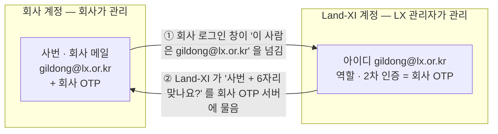

# 로그인 2차 인증 — 사내 OTP 짝짓기 · 정부 OTP (한 장 답)

> 2026-10-01 · Opus 5.5 · 지위: **사용자 확인 전 조사·제안**(문서만 · 코드 수정 0 · GPU 0 · 로그인 시도 0). 확인 요청 2개(`confirm-items.json`).
> 사용자 원문(10-01, 확인 요청 8차 답): "내가 잘 몰라서 그런데 사내 OTP 가 있긴 한데, 이걸 개인 아이디랑 어떻게 매칭해서 관리하는 거지??" · "공무원 정부 OTP 서비스를 우리에도 녹일 수 있나? 검토가 필요하겠네..."
> 근거 원칙 77(아이디는 메일 주소) · 89(2차 인증은 정식 오픈 때 모든 역할에 한꺼번에 — LX 직원은 회사 OTP 먼저, 기관은 정부 OTP 검토). 앞선 검토 `../../design-r6/mfa/`(lx-otp · public-sector).

## 1. 사내 OTP 를 개인 아이디와 어떻게 짝짓나 (`company-otp.md` · 그림 `shots/mfa2-1-company-otp.png`)
**회사 OTP 는 이미 회사 계정(사번 · 회사 메일)에 묶여 있습니다. Land-XI 는 직원 계정마다 그 회사 계정을 한 칸 적어 두고, 로그인 때 회사에 "이 사람 맞나요?"만 확인받습니다. Land-XI 아이디를 그 직원의 실제 회사 메일(@lx.or.kr)로 만들면 그 칸이 곧 아이디라 따로 짝지을 게 없습니다.**

| | ① 회사 로그인 창에서 다 하기(통합 로그인) | ② 회사 OTP 서버에 번호만 묻기 | ③ 회사 OTP 앱에 Land-XI 한 줄 더 |
|---|---|---|---|
| 짝짓는 칸 | 메일(아이디와 같으면 칸 없음) | 계정마다 사번 한 칸 | 없음(휴대폰과 Land-XI 사이만) |
| 처음 한 번 | 첫 로그인 때 같은 메일 계정에 자동 연결 — LX 관리자가 만든 계정만 | LX 관리자가 사번을 적고, 첫 회사 OTP 번호가 맞으면 확정 | 직원이 QR 등록 |
| 퇴사·전보 | 회사가 막으면 자동으로 막힘 · 부서도 반영 | 다음 로그인부터 막힘 · 역할은 LX 관리자가 고침 | **자동으로 안 끊김** — 따로 잠가야 |
| 누가 관리 | 본인 확인 회사 · 역할 LX 관리자 | 기기·서버 회사 · 사번 칸·역할 LX 관리자 | LX 관리자 |

**LX 정보보안 부서에서 받을 것**: 회사 OTP 종류(앱 · 실물 토큰 · 통합 로그인 유무) · 사람을 사번으로 찾는지 메일로 찾는지 · 연결 자료(① 연결 정보와 돌아올 주소 등록 / ② OTP 서버 주소 · 연동 문서 · 확인용 키 · 방화벽 허용) · 시험 계정 2개 · 보안성 검토 절차 · 회사 인증이 멈출 때 비상 로그인 규칙.
**제안**: 정식 오픈 때 LX 계정은 **사람마다 자기 회사 메일**로(지금의 공용 시험 계정은 그때 정리) · ① 이 되면 ①, 아니면 ② · 연결 전에는 표준 OTP 앱으로 정식 오픈을 맞춤.

## 2. 정부 OTP 를 녹일 수 있나 (`gov-otp.md` · 그림 `shots/mfa2-2-gov-otp.png`)
**길은 있습니다.** 정부 OTP 연계는 시스템을 운영하는 기관이 신청하는 구조라 **신청은 LX**, 공무원은 이미 가진 정부 OTP 번호를 넣습니다.

| | 정부 OTP | 행정전자서명 인증서 | 모바일 공무원증 |
|---|---|---|---|
| 제도상 | 기관 담당자가 인증센터에 연계 신청(공개) | 공공기관도 공문으로 확인 모듈 신청(공개) | 바깥 통로는 보안 인증 받은 **민간** 서비스용 |
| 우리 | **가장 맞는 길** — LX 가 대상인지 확인 필요 | 가능하지만 불편(업무망 PC 인증서) | Land-XI 가 쓸 수 있는지 **확인 필요** |

- **순서**: LX 안에서 정하기 → 인증관리센터에 LX 이름으로 연계 신청 공문 → 라이선스 · 연동 키 → 국가정보자원관리원 연결 허용 → 시험 → 공무원이 처음 한 번 자기 정부 OTP 기기 번호 등록.
- **조건**: 해외 기관 · 공무원이 아닌 기관 직원은 못 씀 → **표준 OTP 앱이 기본**, 정부 OTP 는 공무원이 고르는 추가 선택. 연결 허용은 고정된 운영 서버 기준이라 **LX 전산센터로 옮길 때 함께** 신청하는 것이 현실적.
- **비용 · 기간**: 공개 자료에 없음 — 확인 필요.
- **물어볼 곳**: 행정전자서명 인증관리센터(한국지역정보개발원) 1661-9088 · gpki@klid.or.kr / 국가정보자원관리원 서비스데스크 1577-0577 / 모바일 공무원증은 행정안전부(담당 부서 확인 필요) / 신청 공문은 LX 정보보안 부서.

## 3. 확인 못 한 것
- LX 가 쓰는 회사 OTP 의 제품 이름 · 방식 · 통합 로그인 유무(공개 자료 없음 — 사용자 · 정보보안 부서 확인).
- LX(공공기관)가 인터넷에 열린 Land-XI 용으로 정부 OTP 연계를 받을 수 있는지 · 비용 · 기간.
- 모바일 공무원증 로그인을 공공기관 운영 서비스에 붙이는 길.
- 공공기관이 운영하는 인터넷 서비스가 정부 OTP 를 지자체 공무원 로그인에 쓰는 공개 사례(찾지 못함).

## 파일
`company-otp.md` · `gov-otp.md` · `confirm-items.json` · 그림 원본 `fig/01-company-otp.html` · `fig/02-gov-otp.html` → `python docs/superpowers/final/process/design-r7/mfa2/shoot.py` 로 `shots/`(gitignore)에 찍음.
