# LX 관리자 — 결재함 · GPU 판정 · 한도 (구현 1차 · 2026-09-30)

브리핑 확인: (1) 숫자는 한 출처에서 온다 — 고부하 판정은 서버 판정 함수 하나, 한도 판정은 기관 화면 표와 같은 값. (2) GPU 두 장 동시 고부하 금지 — 판정 시험의 분석은 게이트웨이 대기열로 한 건씩만(두 번), 언어 모델은 건드리지 않음. (3) 확인은 로그인 폼과 화면 조작으로만(세션 주입 0).

캡처는 모두 1440×900, 로그인 폼으로 들어간 화면이다. 계정: LX 관리자 `lxadmin`(관리자 입구), 두 번째 관리자 `lx-admin`, LX 직원 `lx-staff`, 광주전남 담당자 `gj-manager`. 비밀번호는 대화로만 전달한다.

## 1. 결재함이 바로 열린다
| 전 | 후 |
|---|---|
| 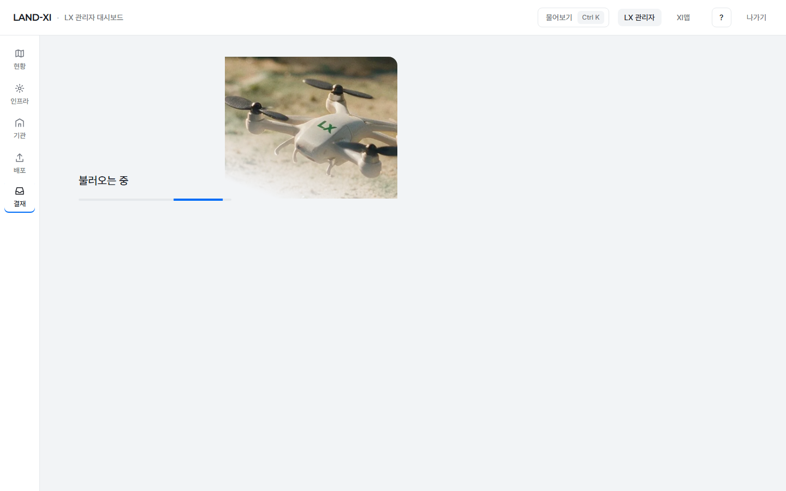 로그인 직후 '결재함 열기' → 약 9초 동안 '불러오는 중'(드론 사진) | 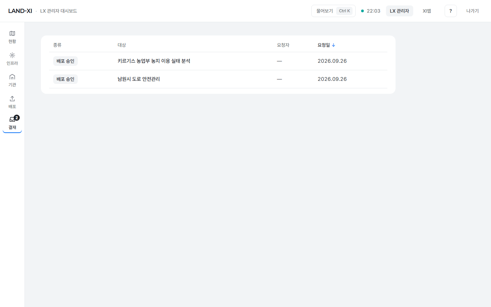 같은 조작 → 목록이 바로(0.07초) |

- 원인: 결재함이 결재 표와 함께 기관 사용량 집계(약 8초)·GPU·경보까지 한꺼번에 기다렸다.
- 고친 것: 결재 대기에 필요한 것(결재 표·배포 기록·기관·서비스 이름)만 먼저 읽고, 나머지는 뒤에서 읽어 할 일 칸만 다시 그린다. GPU·경보 값이 오기 전에는 그 줄을 만들지 않는다(값을 지어내지 않음).

## 2. 결재 한 건 — 누가 · 무엇을 · 왜 + 승인 / 반려(사유 필수)
| | |
|---|---|
| 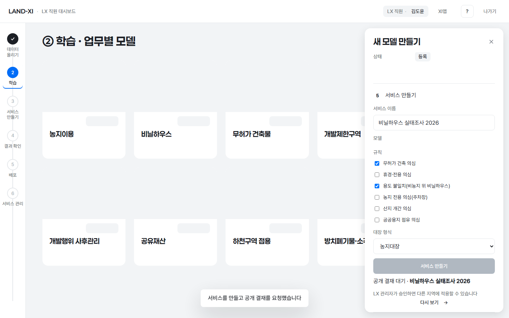 직원이 서비스를 만들면 곧바로 공개되지 않고 '공개 결재 대기' | 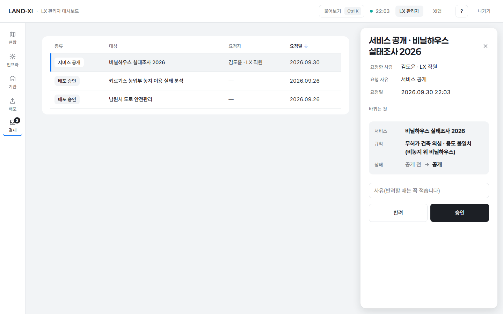 결재 한 건: 요청한 사람 · 요청 사유 · 요청일 · 바뀌는 것 |
| 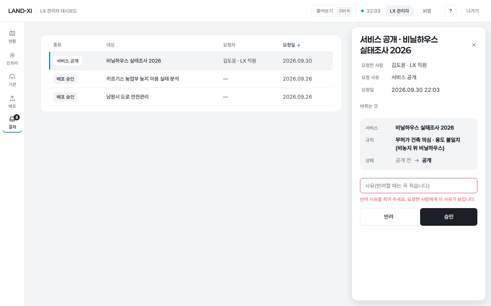 사유 없이 '반려' → 서버로 보내지 않고 "반려 사유를 적어 주세요. 요청한 사람에게 이 사유가 보입니다." | 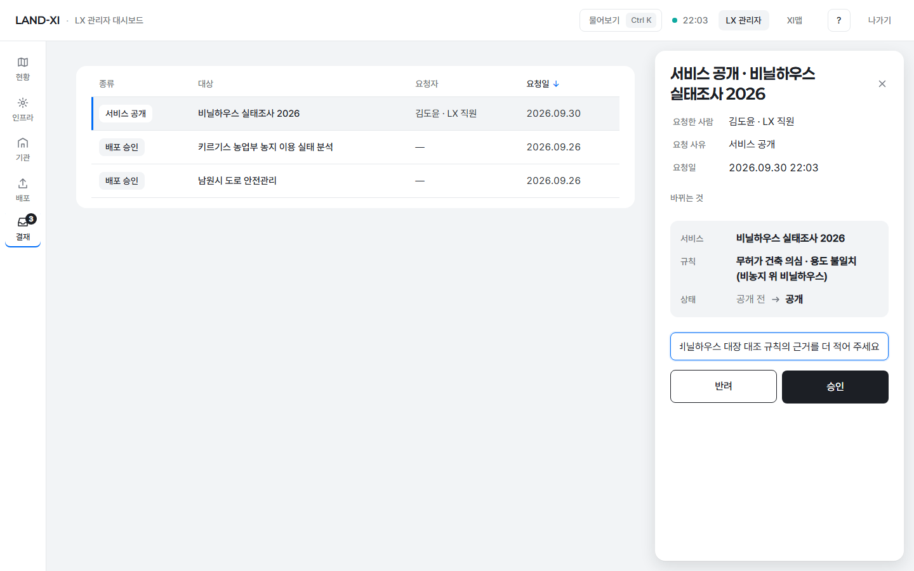 사유를 적고 반려 |
| 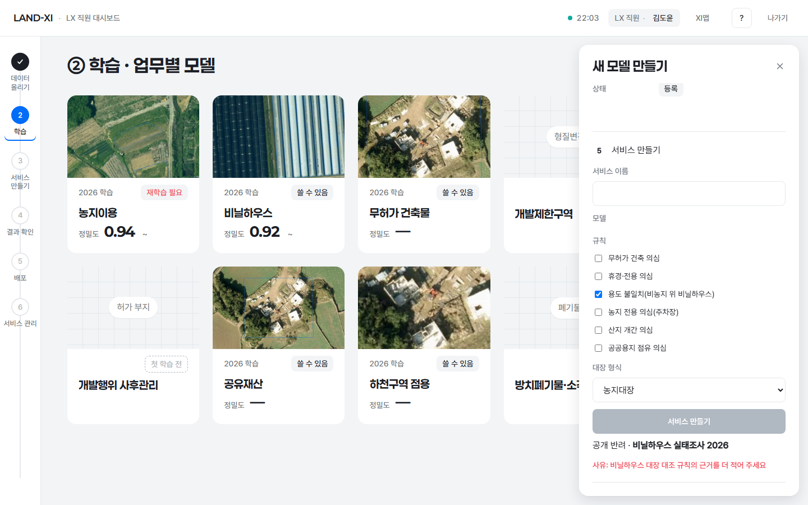 요청한 직원 화면(같은 주소를 다시 열면) '공개 반려 · 사유: …' | |

- 결재 한 건에는 지금 서버 결재 기록에 있는 것만 보인다. 판단 근거·분석 결과를 직접 보는 모습은 아직 확인 대기라 새로 만들지 않았다.
- 요청 사유와 결정 사유를 따로 남긴다(예전에는 결정 사유가 요청 사유를 덮어썼다).
- 반려 사유가 돌아가는 곳: 서비스 공개(서비스 만들기 단계) · 모델 등록(학습 결과 단계 '등록 반려 · 사유') · 다른 지역에 적용(배포 화면 '배포' 줄 '반려 · 사유').
- 학습 화면에 있던 관리자용 승인·반려 버튼은 '결재함에서 결재' 링크로 바꿨다(같은 일은 한 곳 · 같은 모양).

## 3. 요청과 승인이 같은 사람이 되지 않게
| | |
|---|---|
| 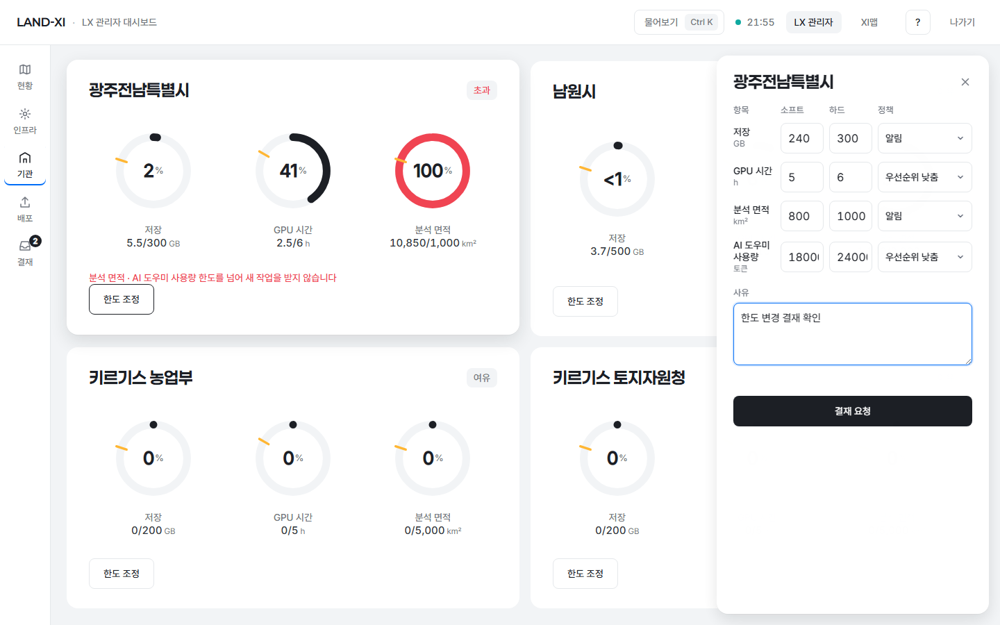 한도 조정은 결재 요청(바뀐 항목만) — 바로 바뀌지 않는다 | 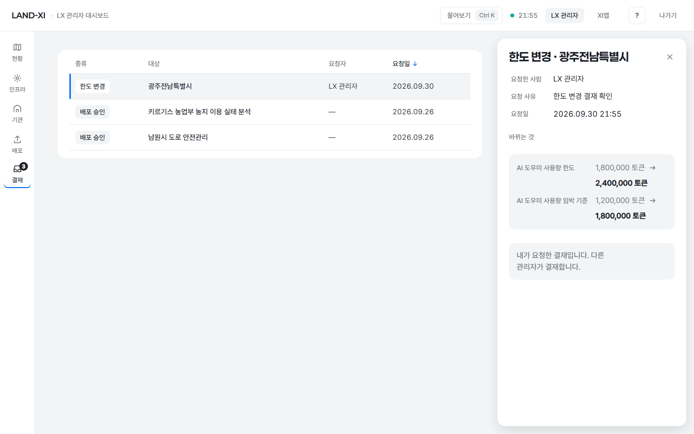 요청한 관리자가 열면 "내가 요청한 결재입니다. 다른 관리자가 결재합니다." — 승인·반려 없음 |

- 서비스 공개: 만든 직원을 승인자로 적지 않는다. 결재함에서 승인한 관리자가 승인자로 적힌다. 공개 결재가 대기·반려인 서비스는 다른 지역에 적용되지 않는다(적용 화면에 이유 한 줄).
- 한도 변경: 예전에는 관리자가 '결재 요청'을 누르면 바로 바뀌고 스스로 승인자로 적혔다. 이제 결재 요청 한 건만 생기고, 요청하지 않은 다른 관리자가 승인해야 바뀐다.
- 서버도 막는다: 요청한 사람이 결정하면 거절(결재함 · 모델 등록 결정 모두), 사유 없는 반려는 거절. 요청 없이 관리자가 바로 정한 운영 전환 승인은 요청자 칸을 비워 둔다(스스로 요청·스스로 승인으로 적지 않음).

## 4. GPU 고부하 판정 — 실제 전력으로
| 전 | 후 |
|---|---|
| 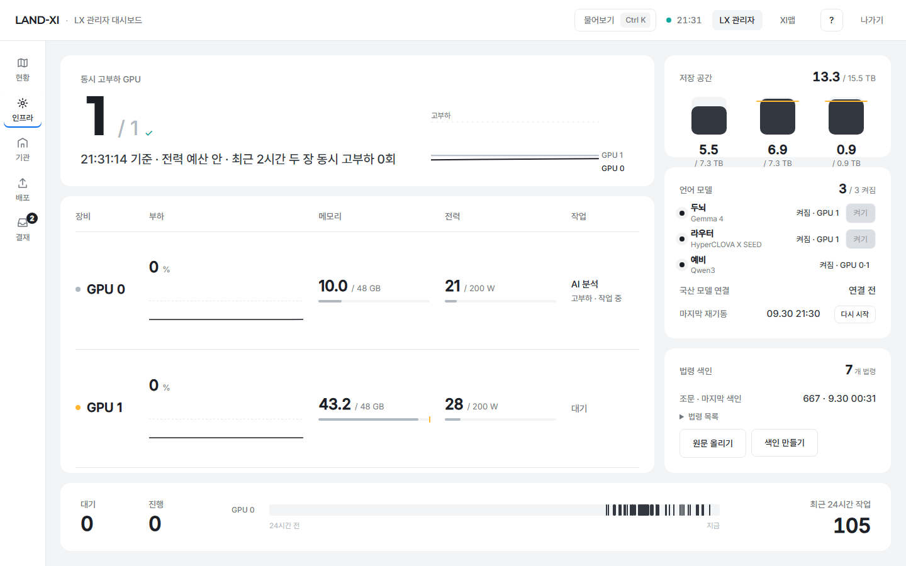 분석 작업이 GPU 0 을 쥐고 모델을 올리는 중(0%, 21 W)인데 '고부하 · 작업 중' · 1 / 1 | 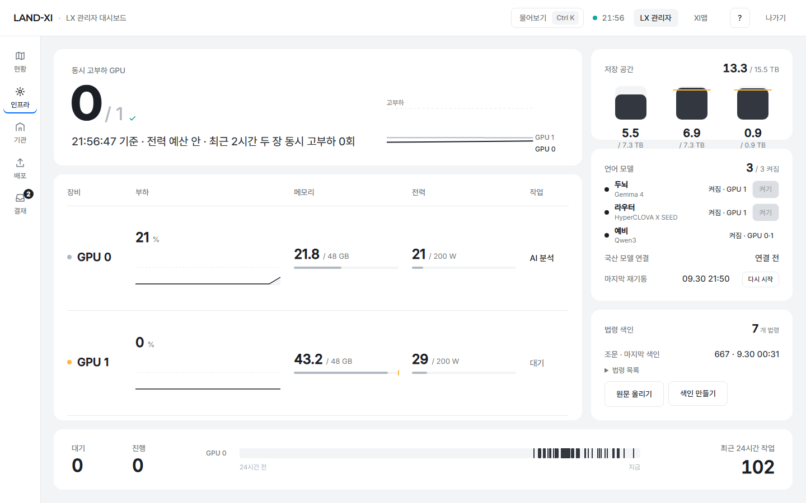 같은 순간(21 W) → 작업 'AI 분석', 고부하 표시 없음 · 0 / 1 |
| | 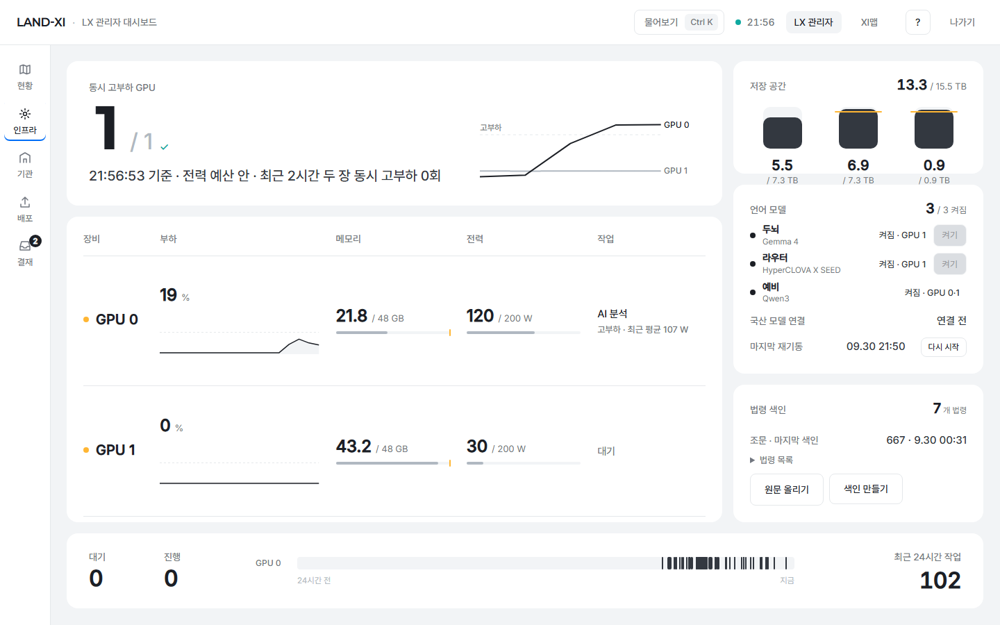 분석이 실제로 돌 때(120 W) → '고부하 · 최근 평균 107 W' · 1 / 1 |

- 판정: GPU 한 장이 고부하 = 최근 전력 평균이 100 W 를 넘을 때. 전력 값이 없는 장만 사용률(이동평균 50% 이상)로 본다. 작업이 쥐고 있기만 한 장은 세지 않는다.
- 실측(판정 시험 · 분석 한 건): 분석이 도는 동안 사용률은 5–38% 인데 전력은 110–128 W 였다 — 그래서 전력이 기준이다.
- 이전 실증에서 '2 / 1 · 전력 예산 초과'(빨강)가 떴던 순간(GPU 0 부하 0% · 20 W, GPU 1 언어 모델 147 W)은 이제 '1 / 1 · 전력 예산 안'이다(시험으로 고정). 두 장이 실제로 기준을 넘으면 그대로 초과(빨강)다.
- AI 도우미 운영 답도 같은 판정: 쥐고만 있는 GPU 는 '분석 작업 중'(고부하 아님).

## 5. 한도를 넘으면 새 작업 거절 + 이유 한 줄
| 전 | 후 |
|---|---|
| 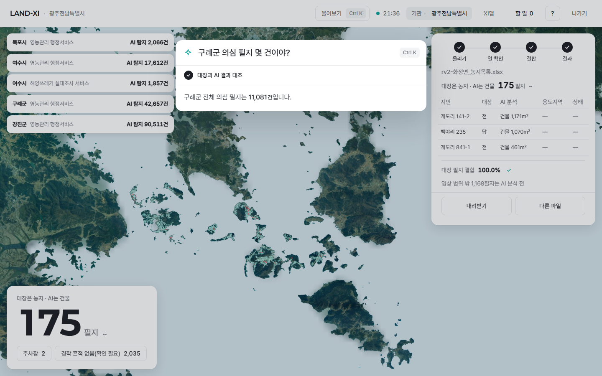 광주전남 AI 도우미 사용량 1,977,210 / 한도 1,800,000 토큰인데 질문에 계속 답함 | 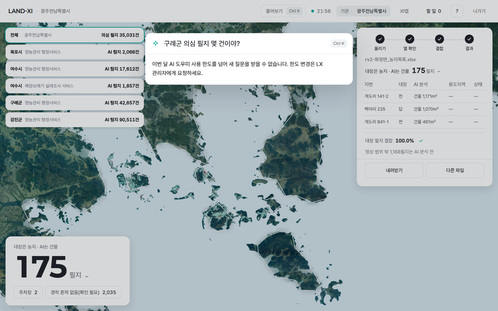 같은 질문 → "이번 달 AI 도우미 사용 한도를 넘어 새 질문을 받을 수 없습니다. 한도 변경은 LX 관리자에게 요청하세요." |
| | 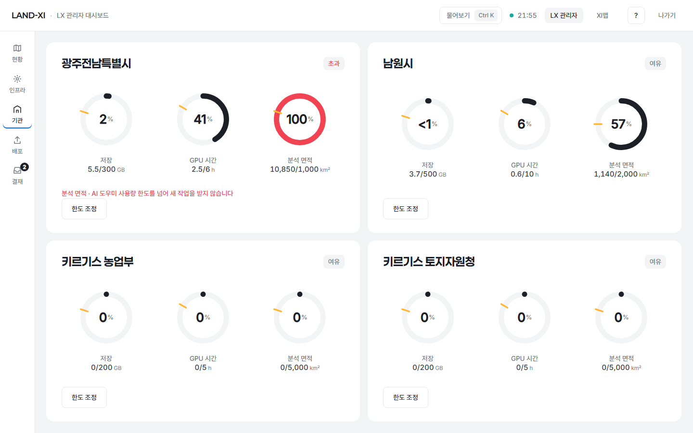 관리자 기관 화면: "분석 면적 · AI 도우미 사용량 한도를 넘어 새 작업을 받지 않습니다" |

- AI 도우미: 한도를 넘은 기관의 새 질문·보고서 초안은 언어 모델을 부르지 않고 한 줄로 닫는다(영어 질문엔 영어 한 줄).
- 분석: 기관이 낸 새 AI 분석은 GPU 시간·분석 면적·저장 한도 중 하나라도 넘었으면 대기열에 넣지 않고 같은 식의 한 줄로 거절한다(견적 단계부터).
- LX(한도 없음)는 막지 않는다. 한도를 넘긴 그 한 건의 처리(우선순위 낮춤 등)는 기관별 정책 칸 그대로.

## 6. 답 받기 연결이 막혀도 답을 받는다
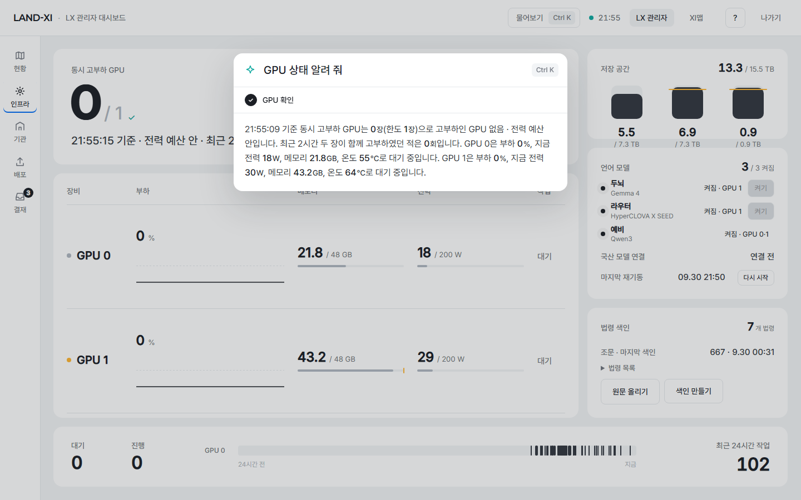

- 탭이 많은 브라우저에서 답 받기 연결 칸이 모자라면 서버가 끝낸 답이 화면에 오지 않았다(이전 실증 0/5).
- 이제 4초 안에 사건이 하나도 안 오면 짧은 조회로 같은 사건을 받아 같은 모양으로 그린다. 캡처는 이 탭 안에서 답 받기 연결을 막아 둔 상태(흉내)에서 'GPU 상태 알려 줘' → 4.1초에 답.

## 바깥 주소
https://admin.land-xi.dev — 로그인 폼(lxadmin) → LX 관리자 대시보드 → '결재함 열기' 0.76초에 목록 · 인프라 '0 / 1 · 전력 예산 안' · 기관 화면 한도 줄 확인. 

## 시험
- 새 시험: `server/tests/test_impl1_admin.py` 10 통과(자기 결재 거절 · 사유 없는 반려 거절 · 서비스 공개 결재와 반려 사유 · 승인자 기록 · 한도 초과 분석 거절 · 한도 초과 AI 도우미 거절(한국어·영어) · 조회 경로). `server/ops/tests/test_impl1_power.py` 7 통과(고부하 판정).
- 기존: `server/ops/tests` 108 통과(판정 규칙이 바뀐 시험 5개를 새 규칙으로 고침), `server/agent/tests` 전부 통과, 결재·배포·학습 관련 서버 시험 86 통과. 실패 4건은 다른 갈래 작업 중인 부분(지역 관할 · 필지 조회 · 로그인 화면 문구)이다.
- 화면: `tests/e2e/impl1-admin.spec.mjs` 3 통과, 로그인 관리자 입구 5 통과, 금지어 검사(결재함 · 기관 · 인프라) 0건.

## 시험 데이터 정리
- 반려 확인용으로 만든 서비스 '비닐하우스 실태조사 2026' 두 개와 그 결재, 한도 변경 결재 요청 두 건은 캡처 뒤 지웠다(한도 값은 바뀌지 않음).
- 판정 시험 분석 두 건은 시험 표시로 게이트웨이 대기열에 한 건씩 넣었다(남원 25cm 영상 일부 · 두 장 동시 고부하 0회).

## 남은 것
- 결재 한 건의 판단 근거·분석 결과 직접 보기 — 확인 대기(사용자 결정 뒤 구현).
- 한도 정책 칸(알림 · 우선순위 낮춤 · 거절)의 뜻 정리 — 이제 하드 한도를 넘으면 정책과 관계없이 새 작업을 받지 않는다. 칸을 '한도 넘기는 한 건 처리'로 부를지 결정 필요.
- 광주전남은 지금 분석 면적(10,850 / 1,000㎢)·AI 도우미 사용량 한도를 넘어 새 질문·분석이 거절된다. 분석 면적 대부분은 LX 가 대신 돌린 전국 분석이 기관 몫으로 잡힌 것 — 한도 값 조정은 결재로(두 관리자).
- 예전에 만든 서비스 4개는 만든 직원이 승인자로 적혀 있다(기록은 고치지 않음).
