# 입구 셋 · 로그인 — 구현 1차(확인 대장 6 · 7)

> 확인 대장 6 "입구 셋 주소 — 일단 그렇게 하자, 나중에 도메인 따라 달라질 부분도 있지만" · 7 "lxadmin 계정으로 일단 일괄로" (09-30 사용자 확인)
> 상태: **구현 확인 대기** — 아래 세 주소에서 직접 열어 보고 완료 / 다시를 정해 주세요.

## 한 줄
로그인 화면의 역할 탭(LX 직원 / LX 관리자 / 기관)을 없앴습니다. **어느 주소로 들어왔는지가 로그인 화면의 모습과 들어가는 화면을 정합니다.**

| 주소 | 누가 | 로그인 화면 | lxadmin 으로 들어가면 |
|---|---|---|---|
| https://app.land-xi.dev | LX 직원 · 영업(아이디로 구분) | 아이디 · 비밀번호 | LX 직원 대시보드 |
| https://admin.land-xi.dev | LX 관리자 | 아이디 · 비밀번호 (머리 오른쪽에 'LX 관리자') | LX 관리자 대시보드 |
| https://gov.land-xi.dev | 기관(국내 · 해외) | 기관 고르기 + 아이디 · 비밀번호 (머리 오른쪽에 '기관') | 고른 기관의 화면 |

- 영업 계정은 app 주소에서 아이디로 영업 화면(서비스 카탈로그)에 들어갑니다.
- 로그인 문구·줄바꿈은 확정본 그대로입니다("AI 기반 국토정보 / 통합조사" + 설명 3줄).
- 기관 가입 신청 · 기관 마크 등 기관 분기 모습은 확인 대기라 만들지 않았습니다.

## 전 / 후 — 로그인 화면(바깥 주소에서 캡처)

| 주소 | 전 | 후 |
|---|---|---|
| app (PC) |  | 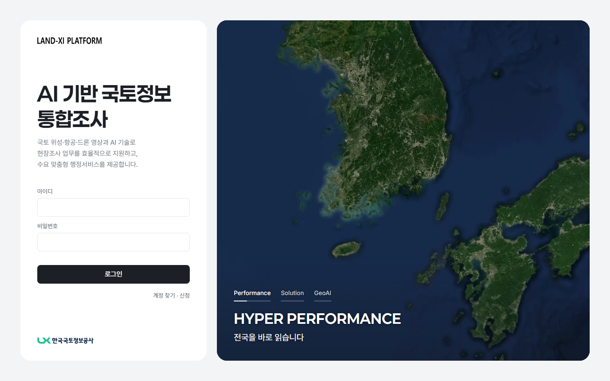 |
| admin (PC) |  | 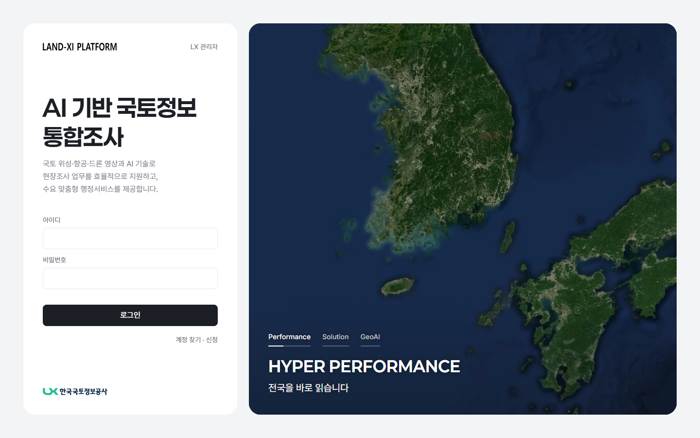 |
| gov (PC) | 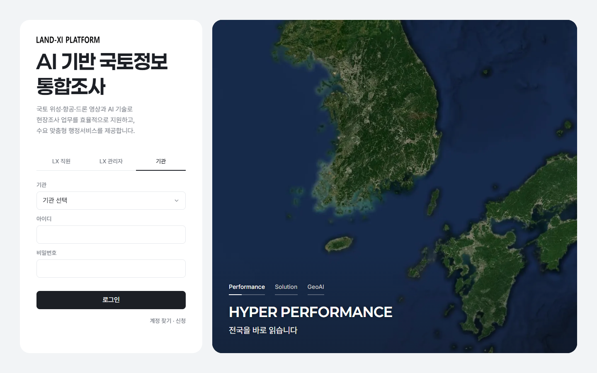 | 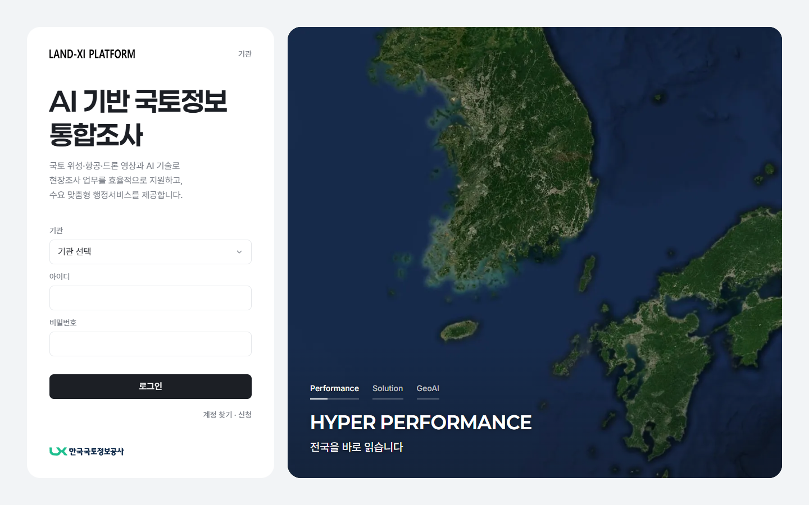 |
| app (휴대폰) |  | 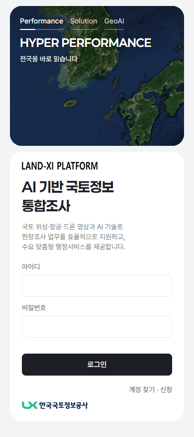 |
| admin (휴대폰) | 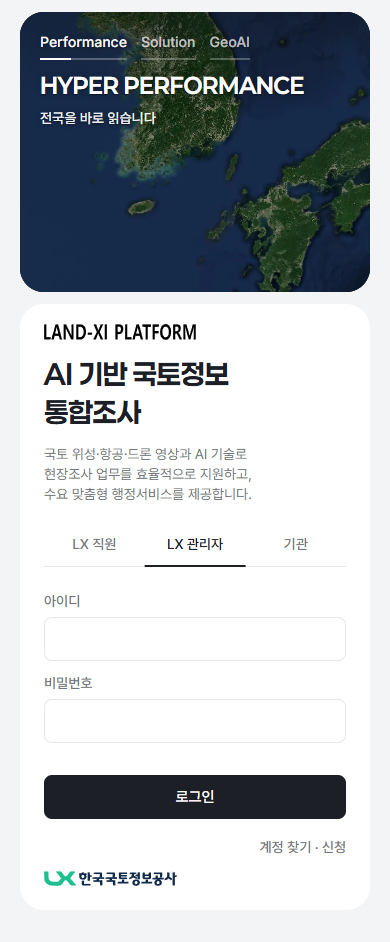 | 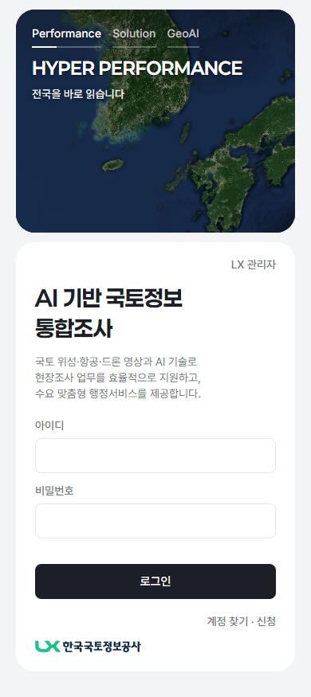 |
| gov (휴대폰) | 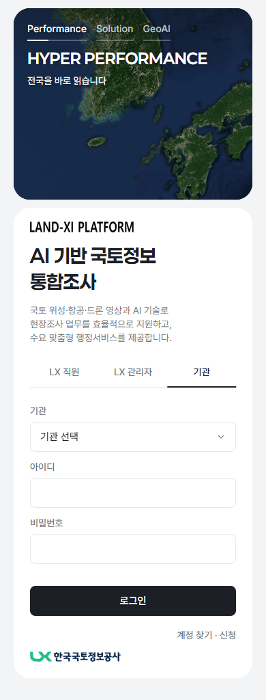 |  |

- 전: 세 주소 모두 탭 셋이 있고, 주소에 따라 탭만 미리 골라져 있었습니다. 기관 탭에서는 PC 900 높이에서 아래 LX 표기가 카드 밖으로 밀렸습니다.
- 후: 탭이 빠진 자리 없이 설명 → 입력 칸 → 로그인이 한 줄 왼쪽 선으로 이어집니다. 기관 주소도 카드 안에 다 들어갑니다(1280×720 · 1366×768 · 1440×900 · 1920×1080 모두 넘침 없음, 오류 문구를 켠 상태 포함).
- '계정 찾기 · 신청'은 그 주소의 계정 한 줄 + 문의만 보여 줍니다(LX 주소 = LX 직원 · 관리자 / 기관 주소 = 기관).

## 도착 화면 — 바깥 주소에서 로그인 폼으로 직접

| 들어간 곳 | PC | 휴대폰 |
|---|---|---|
| app · lxadmin → LX 직원 대시보드 | 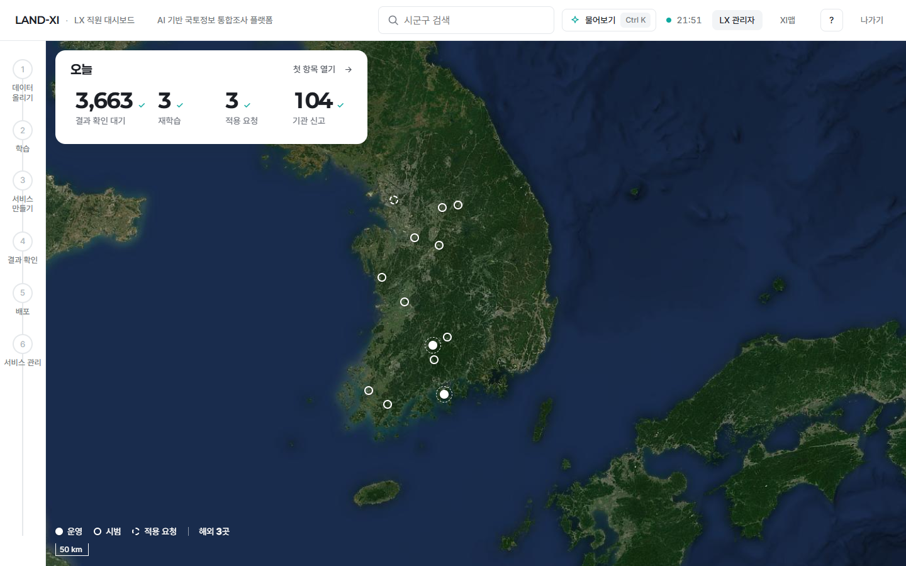 | 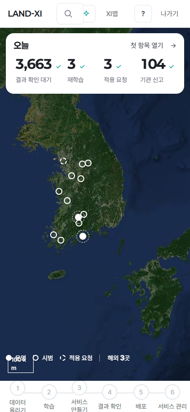 |
| admin · lxadmin → LX 관리자 대시보드 | 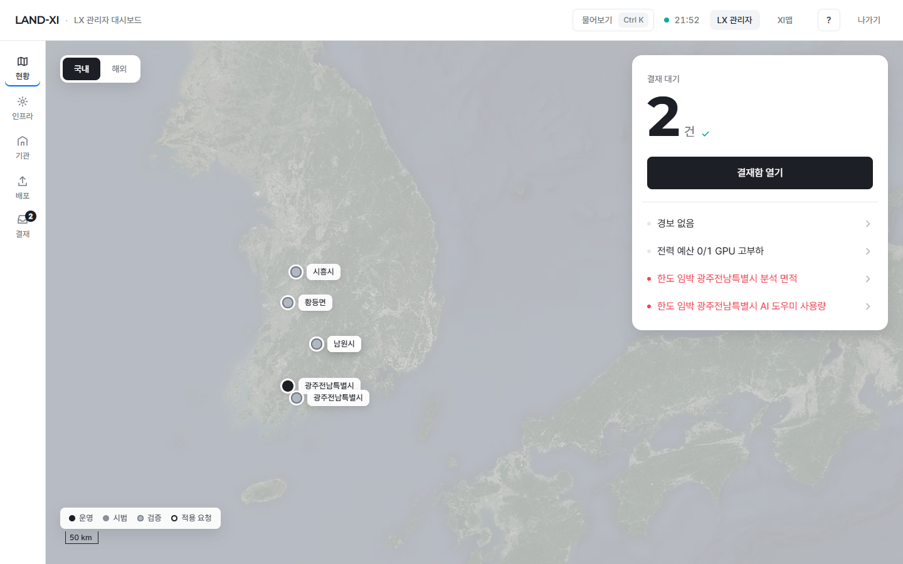 | 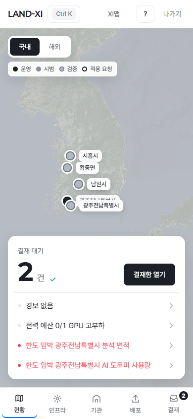 |
| gov · lxadmin · 남원시 → 기관 화면 | 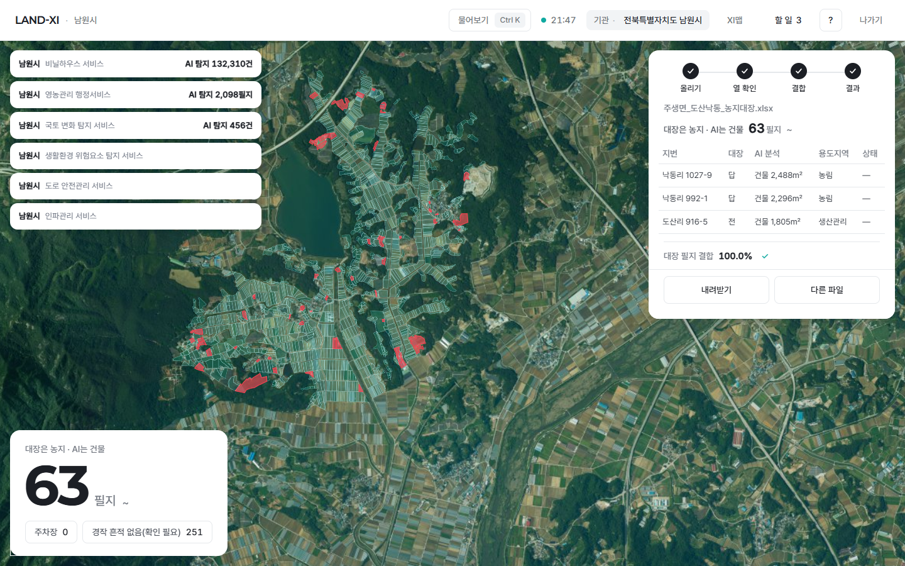 | 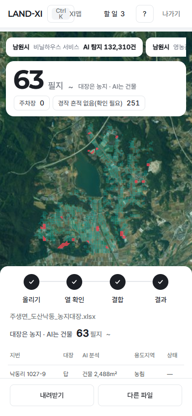 |
| gov · lxadmin · 키르기스 농업부 → 해외 기관 화면 | 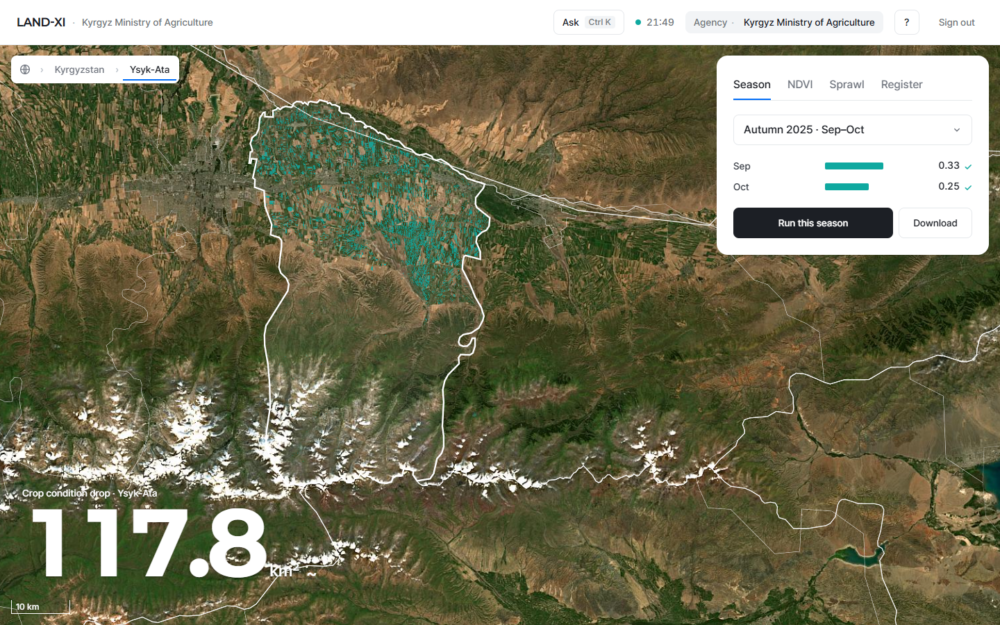 | 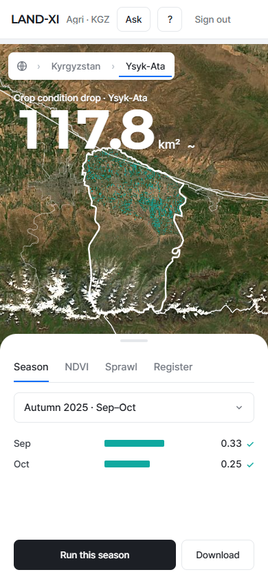 |
| app · 영업 계정 → 서비스 카탈로그 | 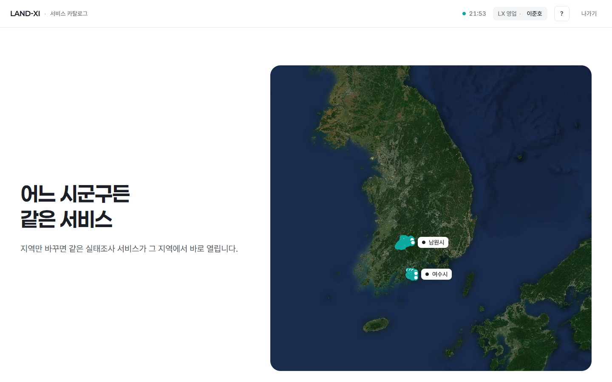 | 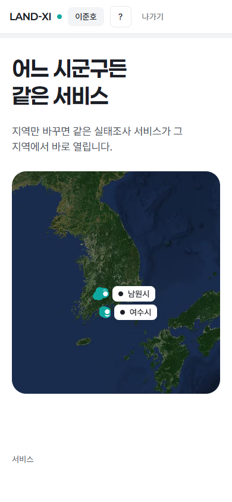 |

같은 lxadmin 이 app 에서는 LX 직원 대시보드, admin 에서는 LX 관리자 대시보드, gov 에서는 고른 기관 화면으로 갑니다. 화면 왼쪽 위 'LAND-XI'(처음으로)도 들어온 주소의 첫 화면으로 갑니다.

## 확인 방법(직접 해 보기)
1. https://app.land-xi.dev 를 엽니다 → 탭 없이 아이디 · 비밀번호만 보입니다 → lxadmin 으로 로그인 → LX 직원 대시보드.
2. https://admin.land-xi.dev 를 엽니다 → 머리 오른쪽 'LX 관리자' → lxadmin 으로 로그인 → LX 관리자 대시보드.
   - 관리자 아닌 계정(예: lx-staff)으로 해 보면 '관리자 계정이 아닙니다'가 뜨고 들어가지지 않습니다.
3. https://gov.land-xi.dev 를 엽니다 → 머리 오른쪽 '기관' + 기관 고르기 칸 → 남원시(또는 다른 기관)를 고르고 lxadmin 으로 로그인 → 그 기관 화면.
4. 영업 계정은 1번 주소에서 로그인하면 서비스 카탈로그로 갑니다.
- 비밀번호는 임시 공통 비밀번호(대화로 전달한 것)입니다. 이 문서에는 적지 않습니다.
- 세 주소는 각각 따로 로그인합니다(한 주소에서 로그인해도 다른 주소는 로그인 전 상태).

## 서버가 정본
- 입구마다 들어가는 문이 정해져 있습니다: app · admin = LX 계정, gov = 기관 계정. 다른 문으로 보내면 서버가 거절합니다.
- admin 주소는 서버가 관리자 계정인지 확인하고, 아니면 로그인 자체를 내주지 않습니다(화면이 막는 것이 아니라 서버가 막음).
- 바깥 주소에서는 입구를 주소 이름으로만 정합니다 — 화면이나 요청에 다른 입구를 적어 보내도 무시됩니다(확인함: admin 주소로 'app 입구'라고 적어 보낸 직원 계정 → 거절).
- 로그인 없이 화면 주소를 열면 로그인으로, 권한 밖 화면은 들어가지지 않습니다(기관 계정 → LX 화면 거절 그대로).

## 시험 결과
- 로그인 · 첫 화면 · 이동 통합 시험 20건 모두 통과(탭 없음 · 입구별 모습 · lxadmin 세 입구 · 관리자 입구에 직원 계정 거절 · 입구별 문 서버 거절 · 화면 코드가 늦게 올라와도 먼저 누른 로그인이 오류 화면으로 가지 않음 · 틀린 비밀번호 · 다른 곳으로 넘기기 막기 · 기관 계정의 LX 화면 거절 · 화면 사이 이동).
- 금지어 · 글 예산 검사(세 주소 로그인): 금지어 0 · 첫 화면 글 139~144자(예산 200) · 버튼 2 · 화면 오류 0.
- 자동 점검 도구의 로그인(옛 호출 · 새 호출) 7가지 모두 제 첫 화면 도착.
- GitHub Pages(보기 전용 사본)의 로그인 → 운영 주소(app)로 넘어감 그대로.

## 주소 이름 바꾸기(개발 참고)
- 주소 이름은 한 곳: `landxi/v3/kit/sites.js`. 로그인 화면 · 화면 관문 · 공개 관문이 모두 여기서 읽습니다.
- 이 PC 밖 설정 두 곳도 같은 이름으로 바꿉니다: Cloudflare 터널 설정(사용자 폴더 `.cloudflared/landxi.yml`) · `server/.env` 의 LX_PUBLIC_HOSTS.
- 이 PC 에서 확인할 때는 로그인 주소 끝에 `?site=app` · `?site=admin` · `?site=gov` 를 붙이면 같은 모습이 됩니다.

## 남은 것
- 기관 주소의 기관별 모습(마크 · 이름 · 색 · 가입 신청)은 확인 요청 6차(기관 분기 흐름) 답을 받은 뒤.
- 해외 기관을 영문 로그인으로 보여 줄지는 기관 분기 결정과 함께.
- 정식 오픈 때 계정 · 비밀번호 체계 다시 정하기(원칙 30).
