# 구현 2차 정리 작업 — 메일 아이디 · LX 전용 로그인 · 한도 없음 · 장부 고장 · 화면 잇기 (2026-10-01)

> 어느 플랫폼: **둘 다**(Land-XI 화면 — LX 직원 · LX 관리자 / 기관 분기 화면 — 남원시 · 광주전남).
> 근거(확인된 것 · 사용자 지시만): 아이디는 메일 주소 · Land-XI 로그인은 LX 전용 · LX 관리자는 기관 가입 승인에 관여하지 않음(보기 · 잠금 · 지원) ·
> 기관에는 막는 한도 없음(11차 답 — "GPU 는 무상 정책", "우리 직원도 분석 시간 같은 한도가 없어야지") · 확인 없이 고칠 장부 고장 셋 ·
> 같은 날 사용자 결정 넷 — 관리자 계정 하나 유지 · 공유한 영상은 그 기관 지도에도 · app 주소는 메인 소개 페이지 · 메인 다듬기(바로 이동 · 표기 · 글자 2배 · 글자 긁기).
> 상태: **구현 확인 대기** — 아래 주소에서 직접 눌러 보고 완료 / 다시를 정해 주세요. 비밀번호는 대화로만.

## 한 줄
옛 아이디가 가진 일을 모두 메일 아이디로 옮기고 옛 아이디는 **사용 중지**했습니다. Land-XI 로그인은 **LX 전용**이 되었고(기관은 자기 기관 주소의 로그인), 기관 · 직원에게 **막는 한도는 없습니다**(사용량 기록은 남김). 관리자 · 기관 메뉴와 알림 칸에서 계정 · 분석 의뢰 · 가입 신청으로 **한 번에** 갑니다.

## 1. 옛 아이디 → 메일 아이디(옛 계정은 사용 중지)
| 옛 아이디 | 옮긴 곳 | 옛 계정 |
|---|---|---|
| LX 직원 lx-staff | test@lx.or.kr(LX 직원) | 사용 중지 |
| LX 관리자 lx-admin · lxadmin | lxadmin@lx.or.kr(LX 관리자) | 사용 중지 |
| 남원시 namwon-manager · lxadmin | 남원시 lxadmin@lx.or.kr | 사용 중지 |
| 광주전남 gj-manager · gwangju-jeonnam-manager · lxadmin | 광주전남 lxadmin@lx.or.kr | 사용 중지 |
| 키르기스 농업부 · 토지자원청 {기관}-manager · lxadmin | 그 기관 lxadmin@lx.or.kr | 사용 중지 |
| 영업 lx-sales | **sales@lx.or.kr**(아이디만 바꿈 · 같은 임시 비밀번호 · 이름 'LX 영업') — 사용자가 정하지 않아 기본값 | — |

**옮긴 것(모두 4,303건)** — 프로젝트(프로젝트장 4 · 만든 사람 4 · 회차 기록 4) · 프로젝트에 이은 카드 12 · 결재 기록(요청 77 · 결재 77) · 서비스 공개 승인 12 · 분석 작업 837 · 영상 등록 1 · 학습 표본 5 · 대장 128 · 사람별 최근 대장 13 · 해외 구역 대장 9 · 실태조사 처리(조치 11 · 이력 72 · 판정 26 · 확인 2) · AI 도우미 대화 2,879 · 확인 카드 116 · 처리 담당 이름 14(옛 계정 이름 → 새 계정 이름 '담당자').
분석 의뢰 · 검토 요청 · 메시지는 옛 아이디로 남은 것이 없었습니다(0). 옛 아이디로 열려 있던 세션 1,379개는 닫았습니다.
- **사용 중지 = 로그인 0**(없는 아이디와 같은 답 — 계정이 있었는지 알리지 않음) · 아이디 찾기 · 비밀번호 찾기에도 안 나옴 · 계정 화면에 '사용 중지'로 남고 잠금 풀기 · 역할 · 임시 비밀번호로 되살릴 수 없음. 지우지는 않았습니다.
- 누가 언제 무엇을 했는지의 기록(처리 기록 · 로그인 실패)은 그대로 둡니다.
- 시험 · 도구도 메일 아이디로: 서버 시험 · 화면 시험 · 로그인 도구(옛 호출 'lx-staff' 등은 같은 역할의 메일 아이디로 바꿔 부름 · 기관은 기관 주소의 로그인으로).

| | 전 | 후 |
|---|---|---|
| 계정 목록(LX 관리자) | 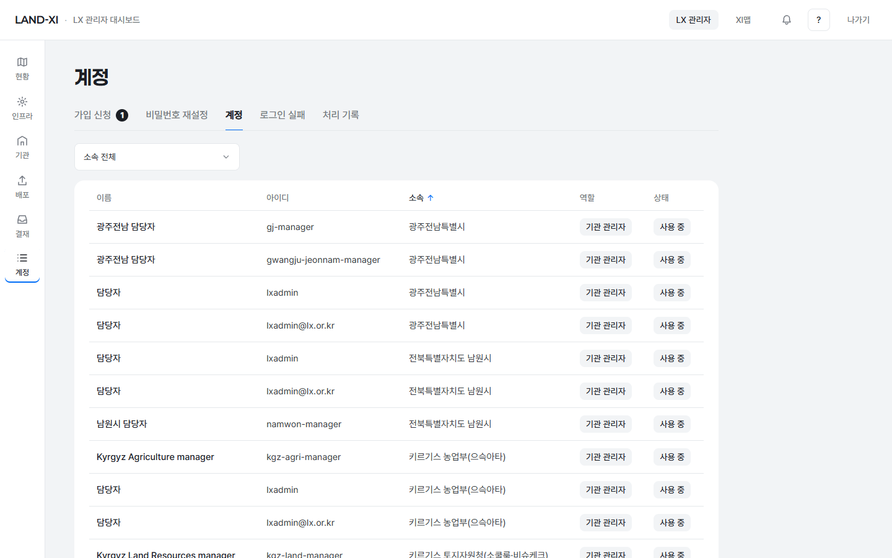 | 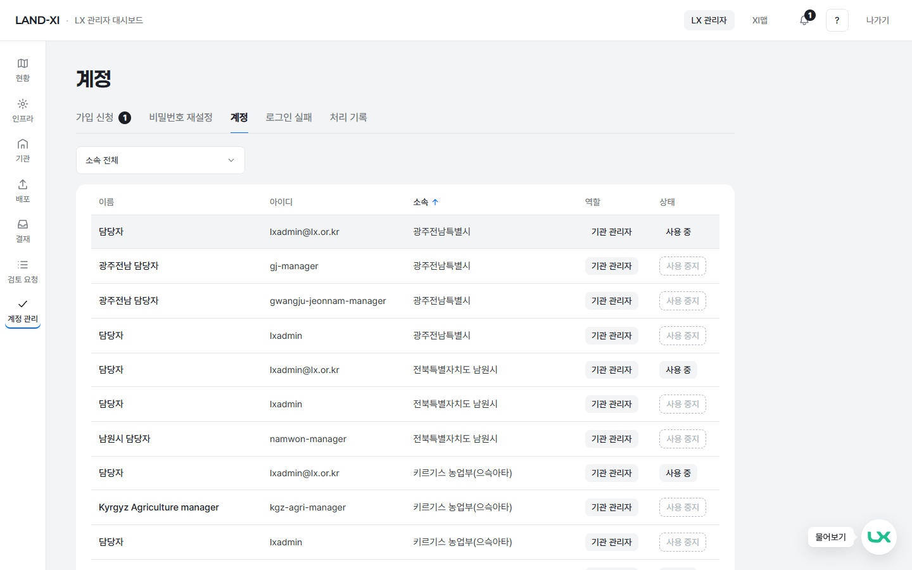 |
| 사용 중지 계정 한 건 | — | 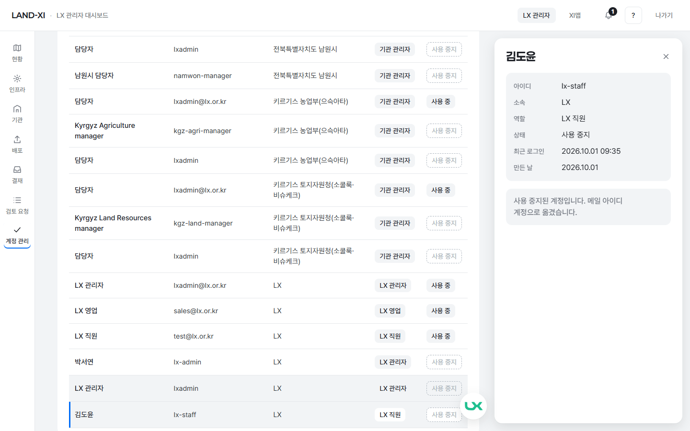 |
| 바깥 주소에서 옛 아이디로 로그인 | — | 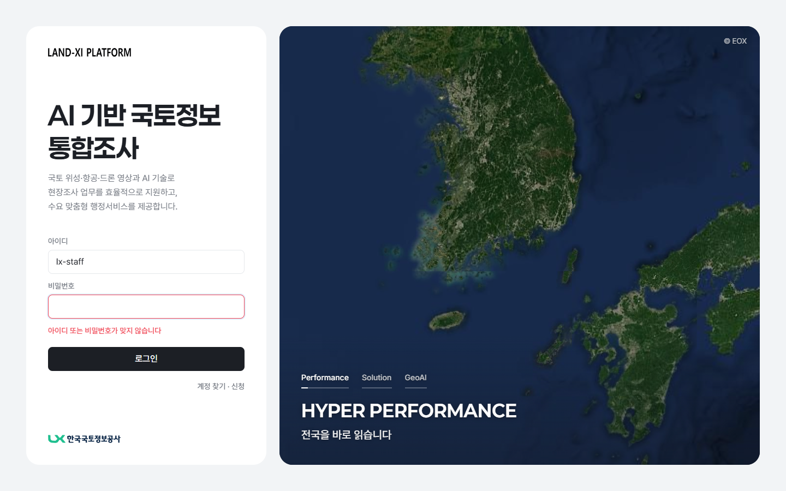 거절 |

## 2. Land-XI 로그인은 LX 전용
- Land-XI 로그인의 '기관 고르기'를 없앴습니다. 기관 입구(gov.land-xi.dev)로 Land-XI 로그인 주소를 열면 **기관 목록**으로, 이 PC 에서 기관 입구로 열면 **그 기관 메인**(마지막으로 들어온 기관)으로 넘어갑니다.
- 기관 사용자는 자기 기관 주소({기관}.land-xi.dev)의 그 기관 모습 로그인으로만 들어옵니다(가입 신청 · 찾기 창도 그 기관 하나로).

| | 전 | 후 |
|---|---|---|
| gov.land-xi.dev 의 Land-XI 로그인 주소 | 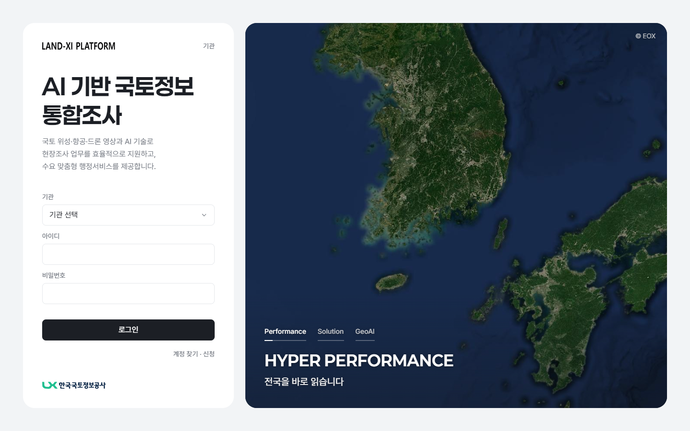 기관 고르기 |  기관 목록 |
| app.land-xi.dev 로그인 |  | 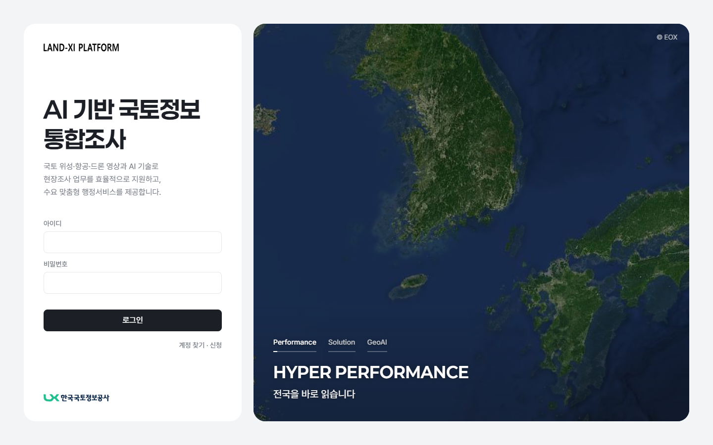 |

## 3. LX 관리자는 기관 가입 승인에 관여하지 않음
- 계정 화면에서 LX 관리자는 기관 가입 신청을 **보기만** 합니다 — 서랍에 "기관 가입 신청은 그 기관 관리자가 승인합니다." 한 줄, 승인 · 반려 버튼 없음. 서버도 거절합니다.
- 기관 계정은 지금처럼 확인 · 잠금 · 지원(임시 비밀번호 · 재설정 요청 처리). LX 직원 가입 신청 승인은 그대로 LX 관리자.

| 전 | 후 |
|---|---|
| 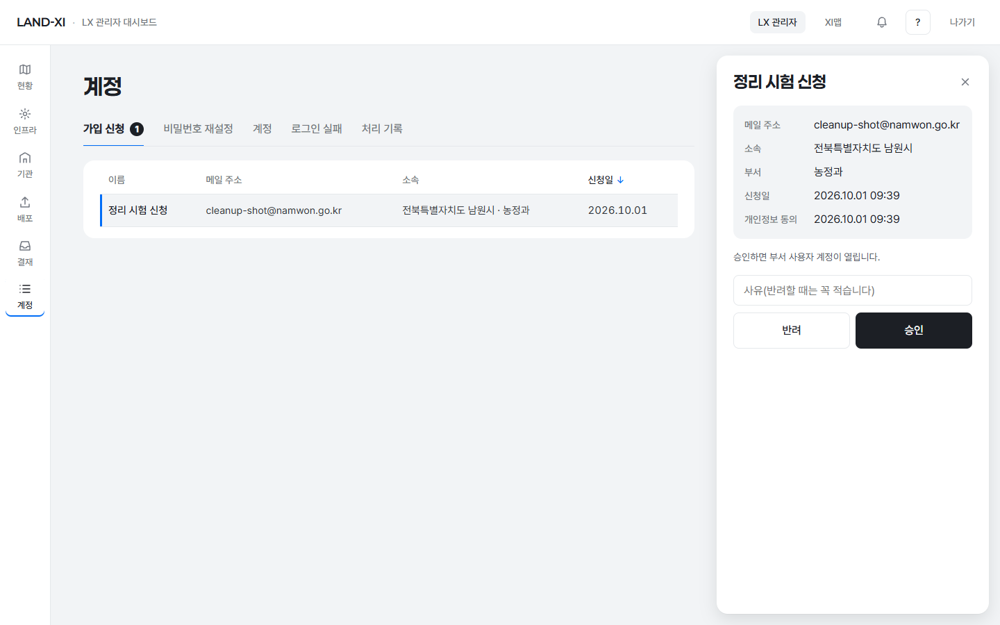 | 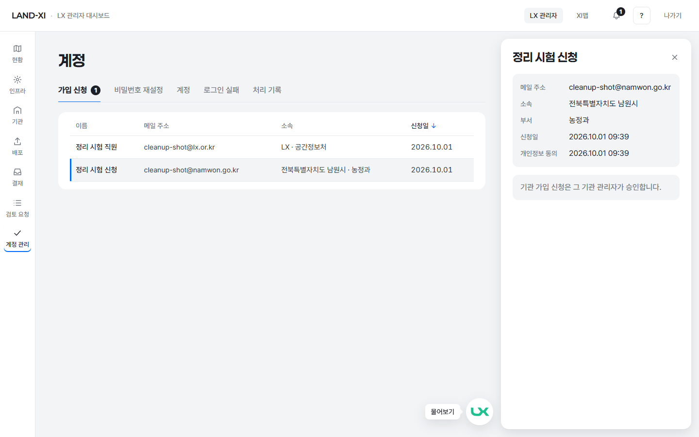 |

## 4. 막는 한도 없음(기관 · LX 직원 모두)
- 새 분석(XI맵 직접 분석 · 시군구 전역 · 실시간) · AI 도우미 질문 · 보고서 초안 · 분석 의뢰를 **한도로 거절하는 곳을 모두 없앴습니다.** 한도에 따라 순서를 뒤로 미루던 것도 없앴습니다. 순번 · 승인 · 크기 천장 · 전력 규칙은 그대로.
- **사용량 기록은 그대로** 남깁니다. 서버 저장 공간이 모자랄 때만 올리기를 받지 않는 보호(설정 한 곳)는 유지.
- 화면 말에서 기관 · 직원의 '한도'를 걷었습니다: 관리자 대시보드 할 일 '한도 임박' 줄 0 · 기관 카드의 고리 · % · 여유/임박/초과 · '한도 조정' 0 → 이번 달 사용량 숫자만(저장 · GPU 시간 · 분석 면적) + '공유 영상' · '기관 정보'. AI 도우미는 토큰 대신 **요청 건수**.
- 새 '사용 현황 화면'은 확인 대기라 만들지 않았습니다(있던 카드에서 한도 표시만 걷음).

| | 전 | 후 |
|---|---|---|
| 관리자 '기관' | 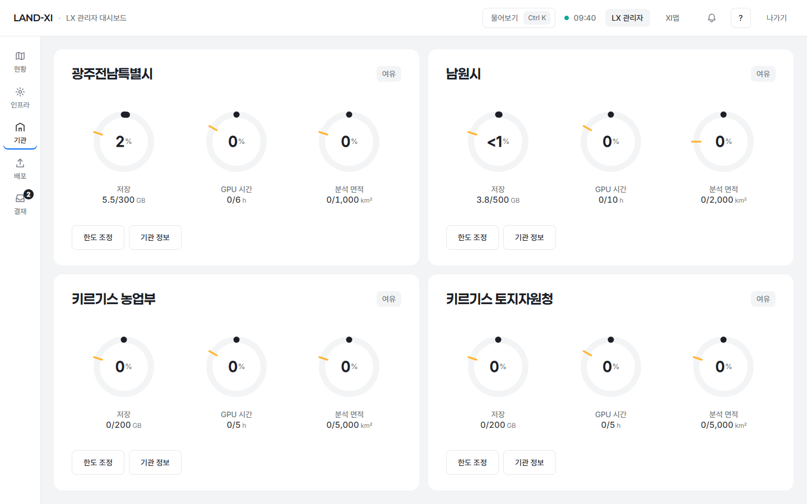 | 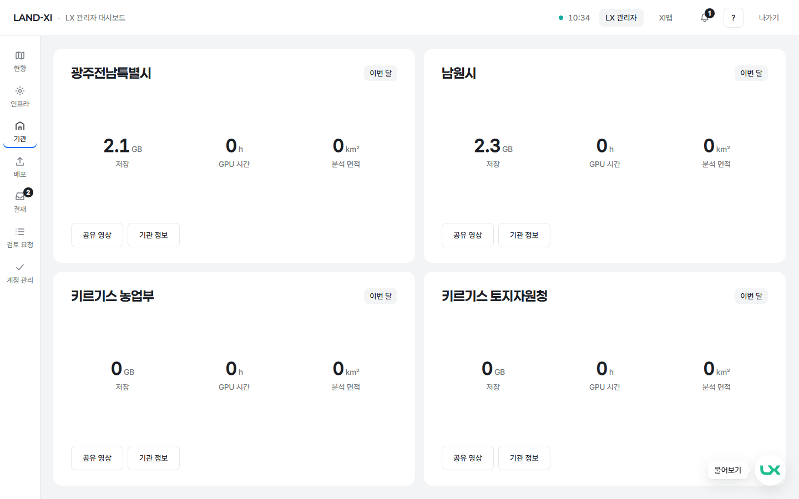 |
| 기관 서랍(공유 영상) | — | 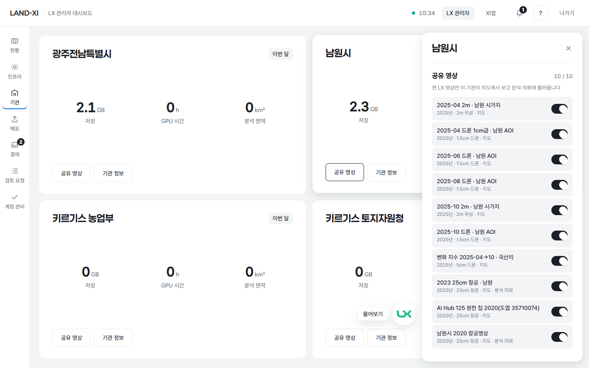 |
| 관리자 대시보드(할 일 · 메뉴) | 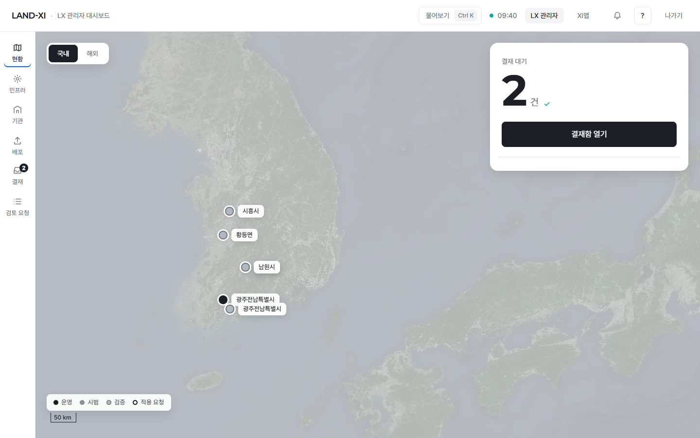 | 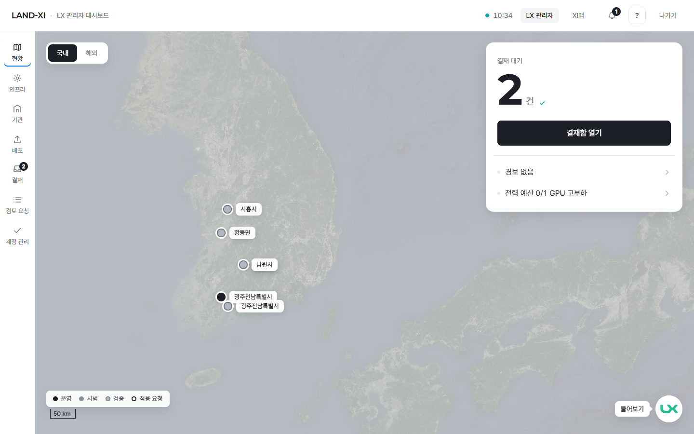 |

## 5. 장부 고장 셋(앞으로의 기록부터)
1. **넓이** — 바깥 테두리(바다 포함) 대신 실제 분석한 땅: 시군구 전역은 '읍면동 ∩ 영상' 넓이, 그 밖은 범위 ∩ 영상.
2. **귀속** — 다른 지역 분석이 이웃 기관 몫으로 적히던 짐작 규칙을 없앰: 분석을 요청한 기관 몫(LX 가 돌린 것은 LX 몫, 기관 의뢰 승인 작업은 그 기관). 이번 달 합계도 적힌 그대로 읽어 지난 기록이 바뀌지 않습니다. 저장 공간은 지금 남은 파일이라 지금 규칙으로 셉니다(그 기관 서비스로 낸 결과는 그 기관).
3. **학습 GPU 시간** — 학습이 끝나면(성공 · 실패 모두) 사용 기록에 한 줄(학습 시간 − 전력 대기 시간).
- 지난 기록은 고치지 않았습니다. 새 규칙으로 다시 세어 **보여 주기만** 하는 도구를 두었습니다(9월: 귀속이 달라지는 4묶음 — 남원 · 하동 분석이 광주전남 몫이던 것 → LX · 넓이가 달라지는 31행 — 여수 한 번 3,617㎢ → 실제 145.7㎢ · 기록이 없던 학습 7건). 지난 기록까지 고칠지는 사용자가 정합니다.

## 6. 화면 잇기
| 어디 | 무엇 |
|---|---|
| LX 관리자 메뉴(현황 · 인프라 · 기관 · 배포 · 결재 · 검토 요청 · **계정 관리**) | 관리자 화면 네 곳이 같은 메뉴 |
| 기관 메뉴(내 서비스 · **분석 의뢰** · **내가 보낸 요청** · 기관 관리자는 기관 정보 · **계정**) | 서비스 선택 · 분석 의뢰 · 계정 화면이 같은 메뉴. 서비스 대시보드에서는 '분석 의뢰'가 그 서비스로 열림 |
| 서비스 대시보드 | 탭 '분석 의뢰' · 오른쪽 '**결과 시점**'(서비스 결과 + 의뢰로 더해진 시점 — 의뢰 시점은 '내 의뢰'로) |
| 알림 칸 | 대화 위에 처리를 기다리는 것 한 줄씩: **분석 의뢰**(LX 관리자 → 결재함 · 담당 LX 직원 → 관리자 승인 대기 알림) · **가입 신청** · **비밀번호 재설정 요청**(LX 관리자 = LX 직원 신청 + 재설정 지원 · 기관 관리자 = 자기 기관 → 계정 화면) |
| 로그인 뒤 되돌아가기 | 계정 관리 · 기관 계정 · 분석 의뢰 · 프로젝트 · 검토 요청 화면 주소로 들어오면 로그인 뒤 그 화면으로 |

| | 전 | 후 |
|---|---|---|
| 기관 서비스 선택(메뉴) | 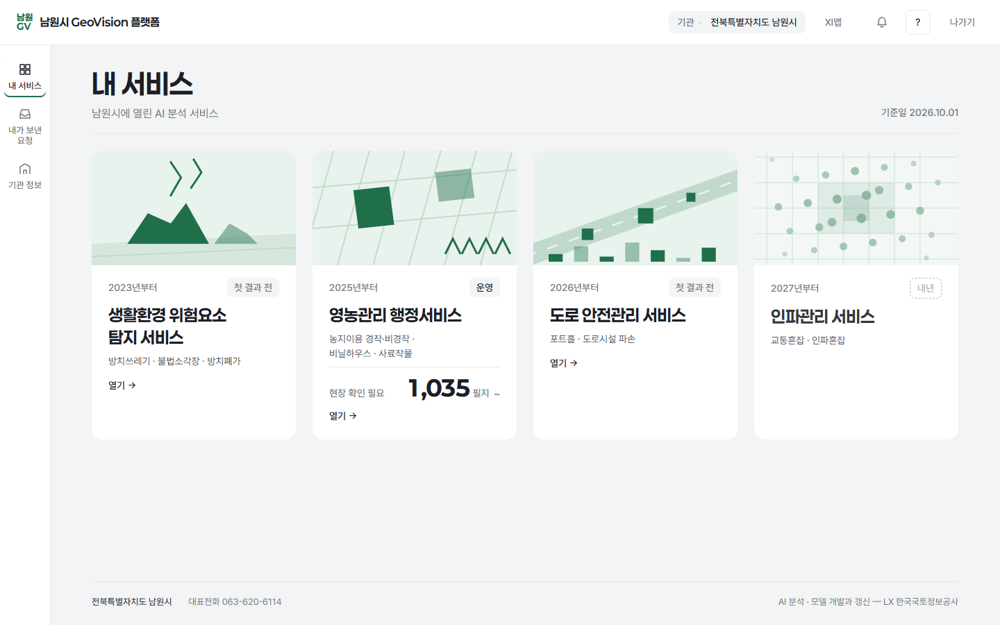 | 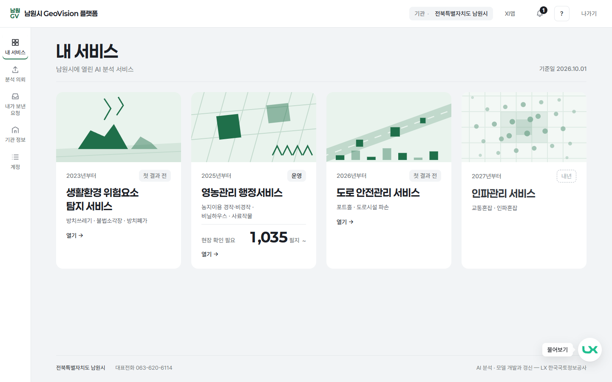 |
| 서비스 대시보드(분석 의뢰 · 결과 시점) | 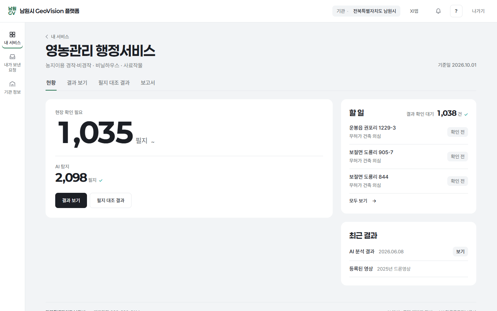 | 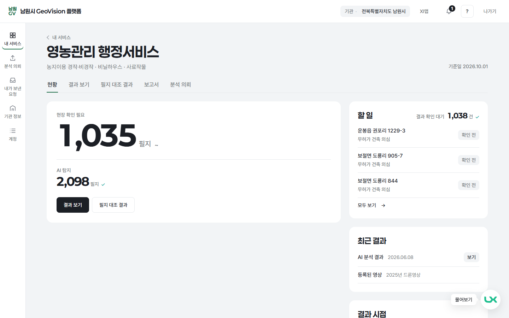 |
| 기관 알림 칸(가입 신청) | 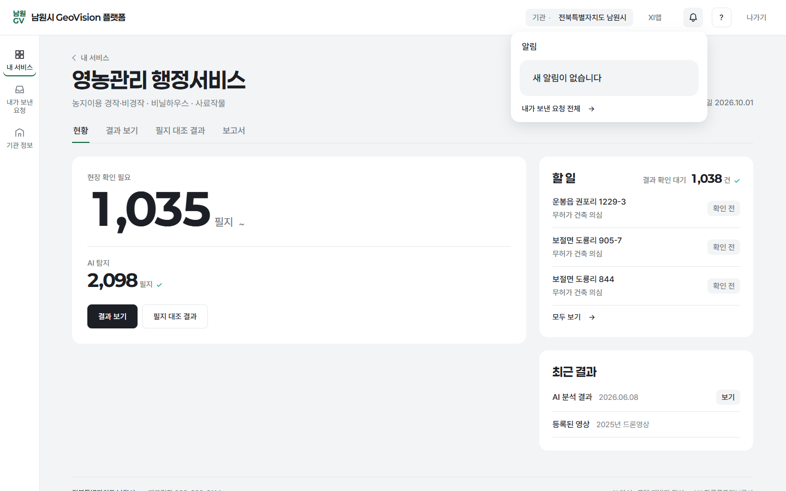 | 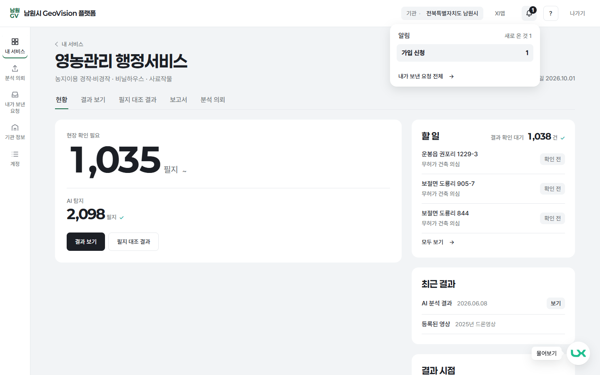 |
| 관리자 알림 칸(가입 신청) | 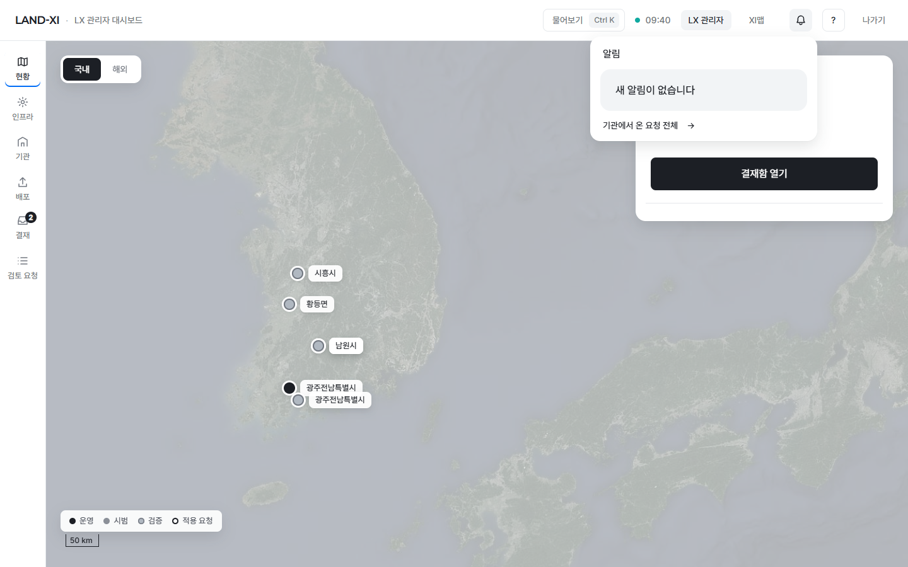 | 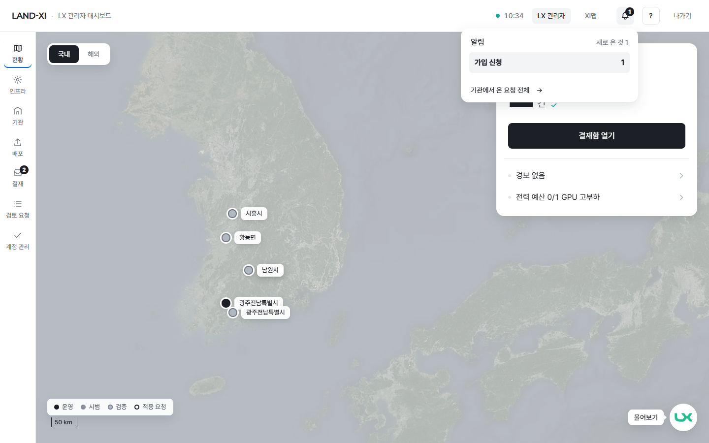 |
| 분석 의뢰(기관 메뉴) · 기관 계정 | — | 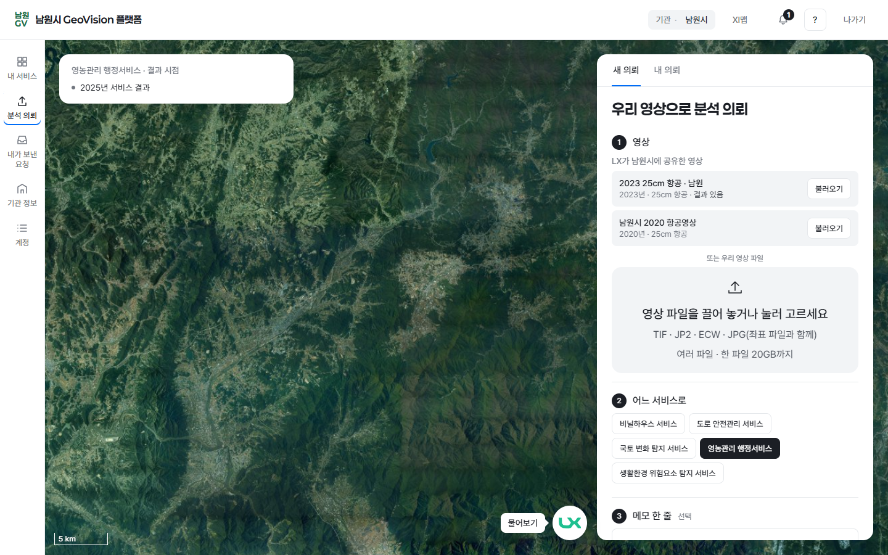 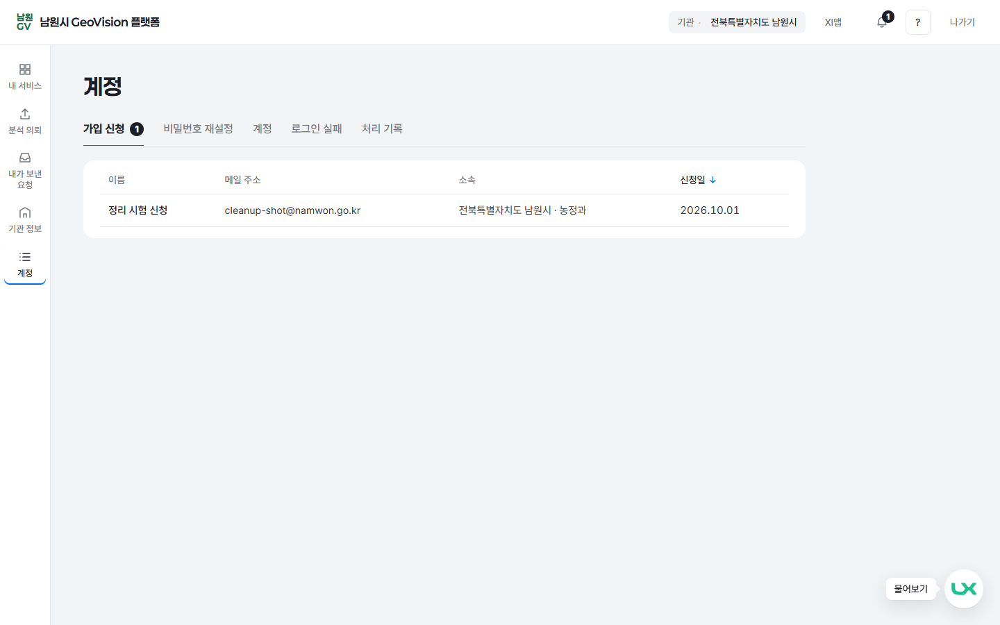 |

## 7. 같은 날 사용자 결정 넷
1. **관리자 계정 하나 유지** — 다른 LX 관리자 계정이 없으면 요청한 관리자 계정이 스스로 결재할 수 있습니다(관리자가 올린 요청이 영원히 기다리지 않게). 결재 서랍에 "관리자 계정이 하나라 이 계정이 결재합니다…" 한 줄 · 처리 기록에 **'관리자 계정 승인(단일 계정)'**. 관리자 계정이 둘 이상이 되면 지금 규칙(스스로 결재 0) 그대로. 직원이 올린 요청은 지금처럼 관리자가 결재.
2. **공유한 영상은 그 기관 지도에도** — 원본만 있는 LX 영상(지도 조각이 없던 영상)도 관리자가 그 기관에 공유하면 그 기관 지도에 보입니다(서명 지도 조각 · 서명할 때 공유와 관할을 다시 확인). 공유 안 된 기관 · 관할 밖은 계속 0. 확인용으로 **남원시 2020 항공영상을 남원시에 공유해 두었습니다**(관리자 '기관' → 남원시 '공유 영상'에서 끌 수 있음).
   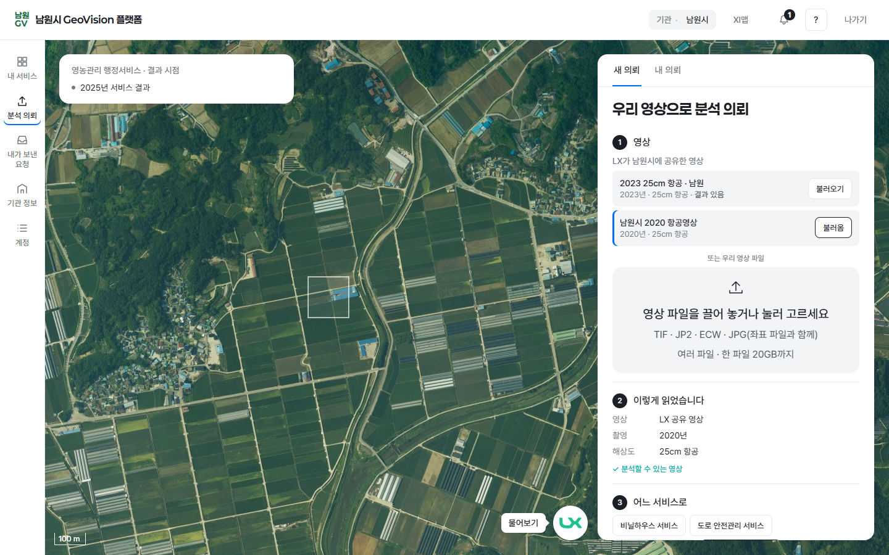 남원 분석 의뢰 화면 — 공유된 2020 영상 '불러옴' → 지도에 그 영상(흰 네모 = 영상 범위)
3. **app.land-xi.dev 주소만 치면 메인 소개 페이지**(스크롤 소개). 메인의 '로그인'은 Land-XI(LX 전용) 로그인으로. 로그인한 LX 계정이면 그 자리가 **'내 화면으로'**(자동 이동 없음). admin 주소는 관리자 로그인, 기관 주소는 기관 메인 그대로.
4. **메인 다듬기** — 메인 안 이동(서비스 보기 · 서비스 · 활용 사례 · 처음으로)은 부드러운 스크롤 없이 **바로 그 자리**(지나가는 장면 없이 목적지 장면으로) · 왼쪽 위 표기와 제목 **LAND-XI PLATFORM** · 표기 · 메뉴 · 첫 장면 설명 글자 **2배**(설명은 의미 단위 세 줄) · 글자를 마우스로 **긁어 복사** 가능.
   휴대폰(390)은 2배면 한 줄에 넘쳐 **줄 수 있는 만큼만** 키웠습니다: 표기 17 · 메뉴 15 · 설명 20(전 18 · 14 · 15). 태블릿은 28 · 22 · 26.

| | 전 | 후 |
|---|---|---|
| 메인(PC) | 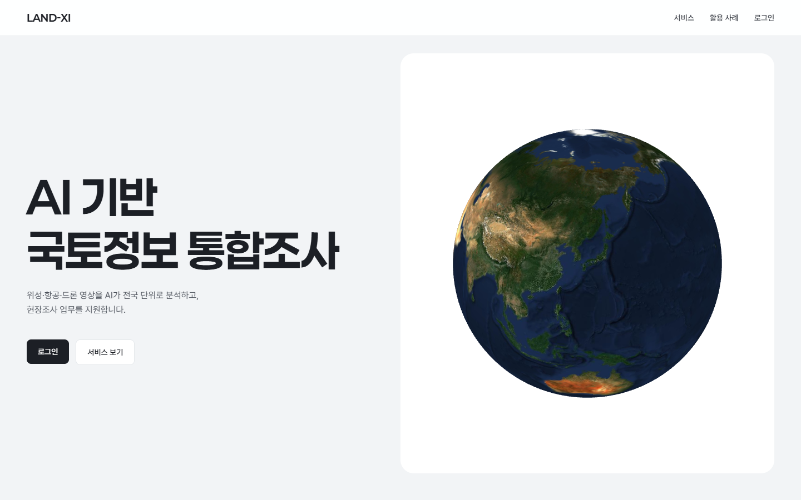 |  |
| 메인(휴대폰) | 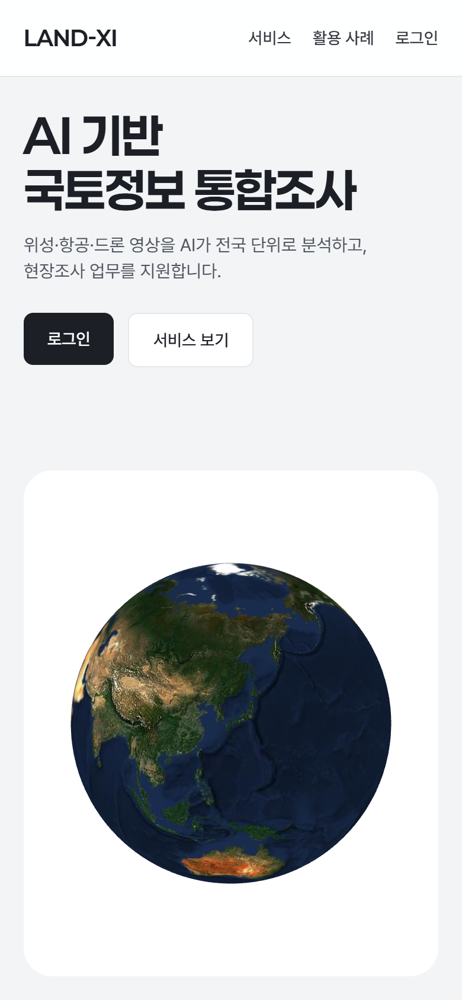 | 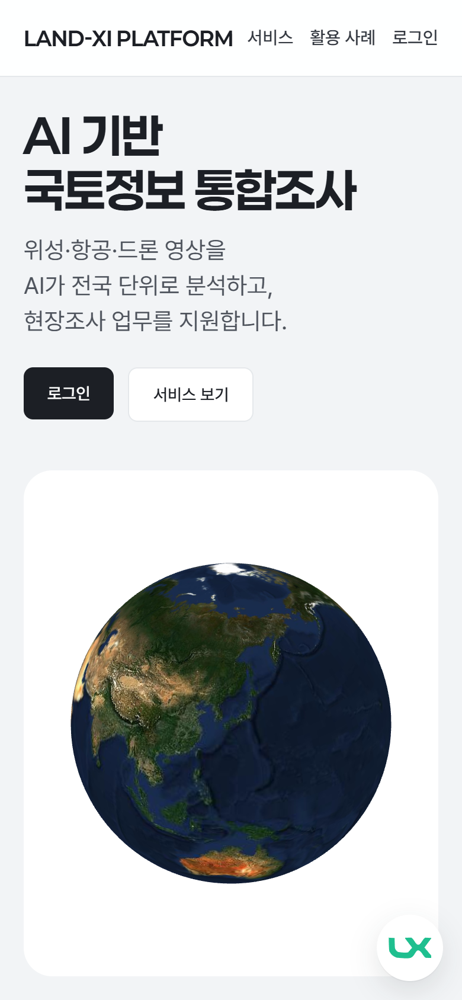 |
| '서비스 보기' 누르고 0.15초 | 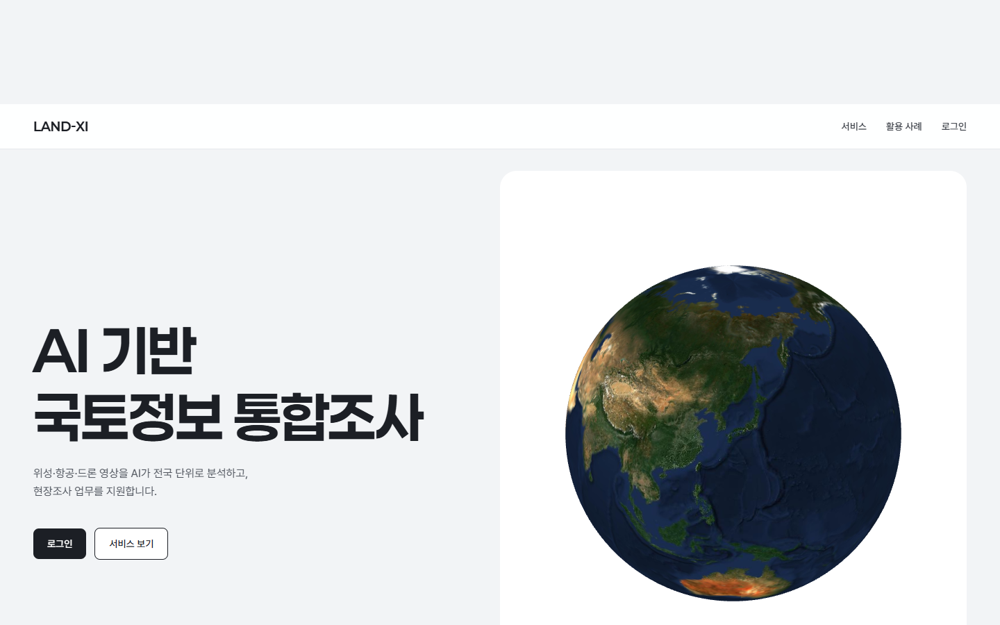 스크롤 도중 | 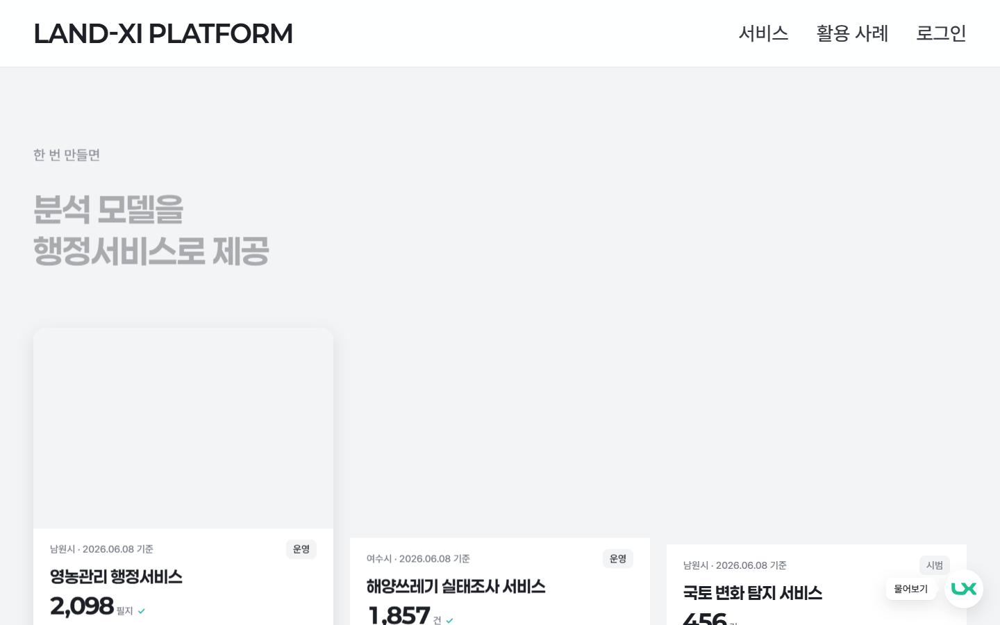 바로 도착 |
| 로그인한 LX 계정 | — | 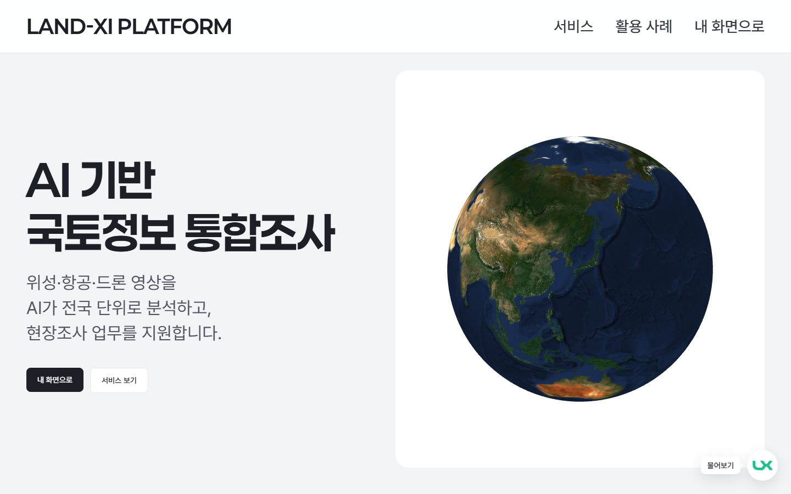 '내 화면으로' |

## 바깥 주소에서 확인(메일 아이디 · 로그인 폼 · 10-01 10시 반)
| 주소 | 계정 | 도착 |
|---|---|---|
| https://app.land-xi.dev/ | (로그인 전) | 메인 소개 페이지 |
| https://app.land-xi.dev | test@lx.or.kr | LX 직원 대시보드 |
| https://app.land-xi.dev | sales@lx.or.kr | 영업 서비스 카탈로그 |
| https://app.land-xi.dev | lx-staff(옛 아이디) | 거절 '아이디 또는 비밀번호가 맞지 않습니다' |
| https://admin.land-xi.dev | lxadmin@lx.or.kr | LX 관리자 대시보드(메뉴 계정 관리) |
| https://gov.land-xi.dev/landxi/v3/login/ | — | 기관 목록으로 넘어감 |
| https://namwon.land-xi.dev | lxadmin@lx.or.kr | 남원시 서비스 선택(기관 메뉴) |
| https://gwangju-jeonnam.land-xi.dev | lxadmin@lx.or.kr | 광주전남 해양쓰레기 서비스 대시보드  |

## 시험
- 서버: 계정 · 검토 요청 · 프로젝트 · 브랜드 · 정리(새 5) · 관리자 결재 · 사용량 · 계약 · 관문 · 의뢰(분석 실행 1건 빼고) · 흐름 · 요약 · 관할 · 실태조사 등 **191 + 11 통과** · 실태조사 묶음 44 통과 · AI 도우미 · 운영 묶음 505 중 502 통과(남은 2건은 이번 작업과 무관 — 1차에서 지운 대기 그림을 쓰는 시험 1 · 다른 갈래가 고치는 중인 명령 바 파일을 읽는 시험 1).
- 깨진 시험 둘: 로그인 파일 기대값(입구별 첫 화면 표로) · 서비스 카드 목록 계약(프로젝트 · 담당 칸) — 새 동작에 맞게 고쳐 통과.
- 화면: 통합 · 구현 2차(계정 · 프로젝트 · 검토 요청 · 의뢰 · 기관 분기) · 관리자 · 정리(새 4) — 마지막 실행 **48 통과 · 실패 0**(메일 아이디 · 로그인 폼만). 분석을 실제로 돌리는 시험(의뢰 승인 → 결과 도착)은 GPU 를 쓰므로 돌리지 않았습니다.
- 금지어 검사: 계정 · 기관 · 관리자 대시보드 · 서비스 선택 · 서비스 대시보드 · 분석 의뢰 · 기관 계정 · 메인 · 로그인 모두 0건.

## 남은 것 · 확인 못 한 것(정직하게)
- 사용 현황 화면(기관 비교 · 추이 · 기관 관리자 '우리 기관 이용 현황')은 확인 대기라 만들지 않았습니다.
- 지난 사용 기록(9월)은 고치지 않았습니다 — 다시 세어 보기 도구로 차이만 봅니다.
- 관리자 계정이 하나뿐인 동안 결재는 그 계정이 스스로 합니다(기록에 표시). 두 번째 관리자 계정을 만들면 자동으로 '다른 관리자가 결재'로 돌아갑니다.
- 남원시 2020 항공영상은 아주 작은 칸(약 128m 네모)이라 지도에서 가까이 가야 보입니다. 큰 원본 영상이 필요한 기관은 관리자가 공유하면 같은 방식으로 보입니다.
- 해외 기관 화면(영문)에는 기관 메뉴를 붙이지 않았습니다(그 화면은 따로).

## 이런 것도 필요하지 않을까요
1. **두 번째 관리자 계정**(정식 오픈 전) — 지금은 한 계정이 요청 · 결재를 다 하므로 기록상 '혼자 결재'가 쌓입니다. 누가: LX 관리자 팀.
2. **알림 칸의 분석 의뢰를 담당 직원이 바로 볼 화면** — 지금 담당 직원은 '관리자 승인 대기' 알림만 받습니다. 의뢰 한 건(범위 · 영상 · 판단 근거)을 직원도 읽기 전용으로 열면 승인 전에 준비할 수 있습니다. 누가: 서비스 담당 LX 직원.

## 개발 참고
- 계정 이전: `server/migrations/0015_mail_accounts.sql`(멱등 · 게이트웨이 기동 때 적용) · 시드 `server/seed/accounts.dev.json`(메일 계정 + 옛 아이디는 사용 중지 목록).
- 다시 세어 보기: `python server/ops/recount_usage.py --since 2026-09-01 --until 2026-10-01`(보기만 · `--write` 는 사용자 결정 뒤).
- 시험 계정 도우미: `server/tests/conftest.py`(메일 아이디 · 두 번째 관리자 등은 `temp_account` 로 시험 안에서 만들고 지움).
