# 구현 2차 · 프로젝트 — LX 직원의 일 단위

> 2026-10-01 · Land-XI 화면(LX 직원 · LX 관리자). 확인받은 것만: 프로젝트는 직원이 바로 만든다(관리자 승인 없음) · 입력은 이름 · 무엇을 · 어디 세 칸 ·
> 첫 화면 '오늘 할 일' → '내 프로젝트' · 프로젝트 → 서비스 카드 발행 요청 · 공개된 서비스의 재학습은 프로젝트장이 시작하고 배포만 관리자 승인 ·
> LX 직원 흐름 13단계 중 프로젝트 안 단계 6. 같은 날 추가 지시: 프로젝트 목록 · 관리 화면(내가 만든 · 참여한 · 보관 · 새 프로젝트) + 머리 줄에서 바로 가기.

## 무엇이 바뀌었나
| 무엇 | 전 | 후 |
|---|---|---|
| LX 직원 첫 화면 | '오늘' 네 칸(전국 합계 3,663 · 3 · 3 · 104) | **내 프로젝트**(진행 중 프로젝트마다 이름 · 지금 단계 · 다음 할 일 하나 → 누르면 그 단계 화면) · **돌고 있는 서비스**(서비스 · 지역) · **만들 수 있는 것**(만드는 중 · 업무 n/10 · 재학습) — 숫자는 배포 기록 · 프로젝트 · 서비스 만들기 판정에서 센 값 |
| 프로젝트 만들기 | 없음 | 첫 화면 '새 프로젝트' → 세 칸(이름은 무엇을 · 어디를 고르면 저절로) → '만들기'를 누르면 바로 생김 · 프로젝트장 = 만든 직원 |
| 프로젝트 한 장 | 없음 | 지금 단계와 다음 할 일 하나(그 단계 화면 열기) · 단계 6(완료 조건을 서버가 자동 판정) · 사람(프로젝트장 · 구성원 더하기/빼기 · 프로젝트장 바꾸기는 LX 관리자) · 재학습 · 끝난 프로젝트 보관 |
| 프로젝트 목록 · 관리 | 없음 | 머리 줄 '프로젝트' · 첫 화면 '전체 보기' → 내가 만든 · 참여한 · 보관 · 전체 묶음, 줄마다 무엇을 · 어디 · 지금 단계 · 다음 할 일 · 마지막 활동 |
| 기존 화면 | 프로젝트와 무관 | 데이터 올리기 · 학습(학습데이터 구축 · 학습 · 발행 요청) · 결과 확인 · 서비스 관리가 프로젝트에서 열리면 레일이 그 프로젝트의 단계 6이 되고 맨 위에 프로젝트 이름 · 지역은 프로젝트가 고른 곳 · 화면은 그대로 |
| 서비스 카드 발행 요청 | 누가 어느 일로 냈는지 없음 | 공개 결재 요청에 프로젝트 이름이 붙고, 공개된 카드의 담당 = 그 프로젝트장 · 다음 회차는 같은 카드의 새 판으로 결재 |
| 재학습 | 누구나 '학습 시작' | 공개된 서비스는 프로젝트장 · 구성원만 버튼이 있고 서버도 거절(다른 직원 · 관리자 포함) · 재학습 = 같은 프로젝트 2차로 학습 단계에 돌아감 · 배포는 관리자 승인(모델 등록 · 새 판 공개 결재) |

### 단계 6과 완료 조건(자동 · 길잡이 — 순서를 막지 않음)
| 단계 | 끝났다고 보는 때 | 열리는 화면 |
|---|---|---|
| 데이터 올리기 | 대상 지역마다 영상이 있다 | 데이터 올리기(그 지역) |
| 학습데이터 구축 | 이 프로젝트의 라벨 묶음(학습 표본)이 있다 | 학습 — 라벨 묶음 올리기 · 라벨 확인(보관된 표본을 골라 이 프로젝트에 더할 수도 있음) |
| 학습 | 이 프로젝트 표본으로 학습한 모델이 '쓸 수 있음'(등록 승인)까지 | 학습 — 학습 · 결과 확인 · 등록 |
| 결과 확인 | 대상 지역에서 표본 한 묶음(20건)을 확인했다 | 결과 확인(그 지역 · 그 업무 규칙) |
| 발행 요청 | 이번 회차 서비스 카드(또는 새 판)가 공개 승인됐다 | 학습 — 서비스 카드 발행 요청 |
| 서비스 관리 | 끝이 없는 단계 | 서비스 관리 |
- 라벨링 도구는 확인 대기라 만들지 않았다. 학습데이터 구축은 지금 있는 방식(라벨 묶음 올리기 · 라벨 확인)만 보이고, 프로젝트 안에서는 '연결 전' 같은 안내 줄을 두지 않는다.
- 판단 기준 표시 · 결과 직접 보기 결재 화면은 확인 대기라 만들지 않았다.

### 기존 일을 프로젝트로 묶음
9/30 원스톱 학습으로 LX 직원(김도윤)이 만든 서비스 넷(비닐하우스 · 곤포사일리지 · 주차장 · 건축물)은 표본 · 모델 · 카드 · 배포본을 그대로 두고
프로젝트 넷('비닐하우스 2026' 등 · 대상 지역 = 그 서비스가 시범 중인 시군구)으로 묶었다. 그래서 김도윤 계정의 '내 프로젝트'에 서비스 관리 단계 넷이 보인다.

## 화면(1440×900 · 모바일 390)
| | 그림 |
|---|---|
| 첫 화면 — 전 | 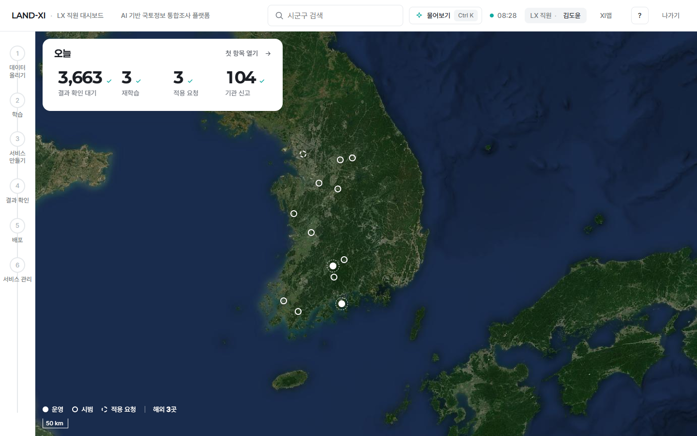 |
| 첫 화면 — 후(내 프로젝트 · 돌고 있는 서비스 · 만들 수 있는 것 · 머리 줄 '프로젝트') | 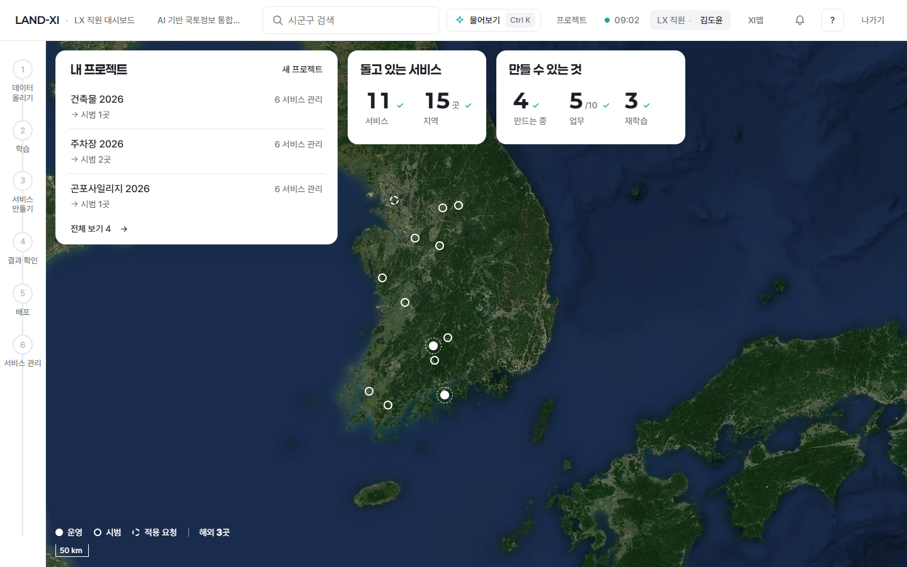 |
| 프로젝트 만들기(세 칸 · 이름 저절로) | 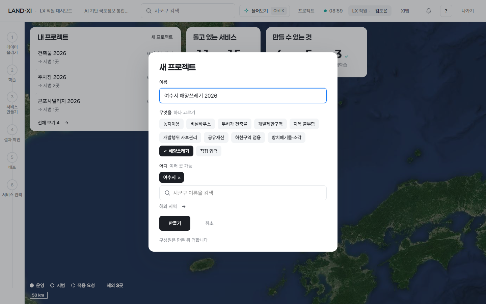 |
| 만들자마자 프로젝트 한 장(레일 = 프로젝트 단계 + 이름) | 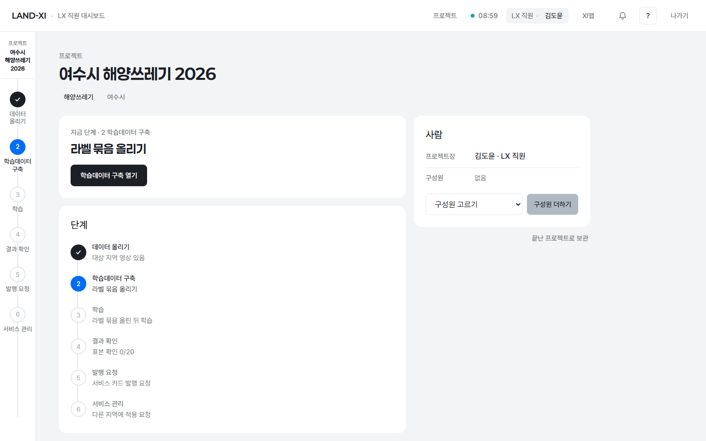 |
| 첫 화면에 한 줄 늘어남 |  |
| 줄을 누르면 그 단계 화면(학습데이터 구축 — 업무 · 지역이 프로젝트 값으로) | 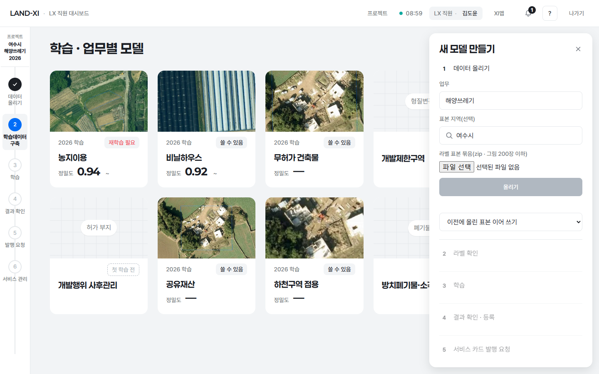 |
| 프로젝트 목록 · 관리(내가 만든 · 참여한 · 보관 · 전체) | 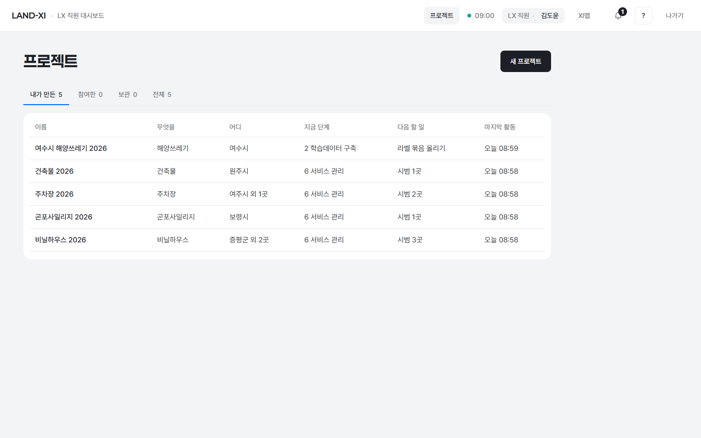 |
| 공개된 프로젝트 — 프로젝트장: 재학습 버튼 있음 | 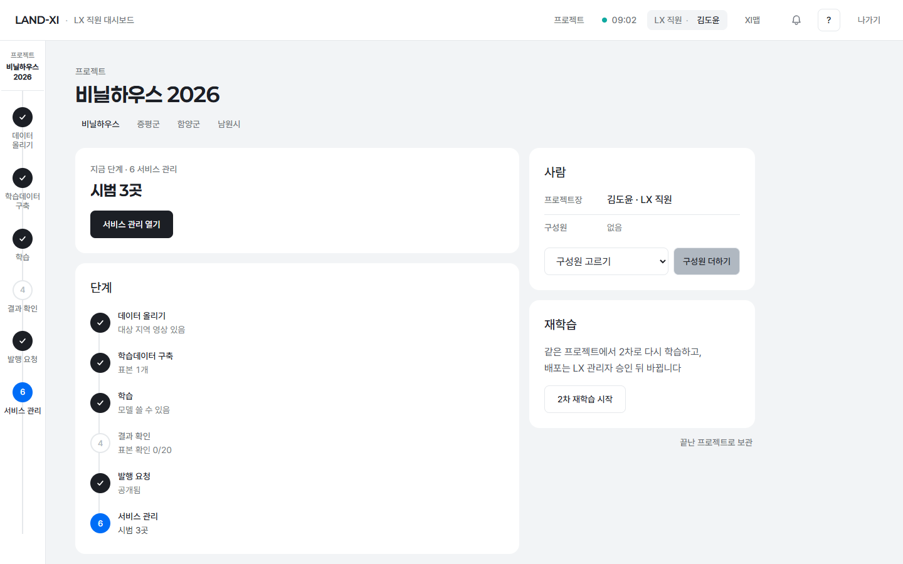 |
| 서비스 관리 단계 화면(프로젝트 맥락) | 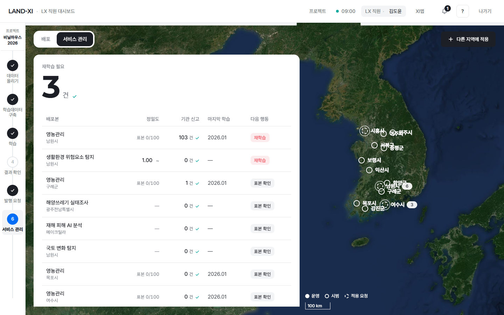 |
| 같은 프로젝트 — 다른 직원: 재학습 버튼 없음(서버도 거절) | 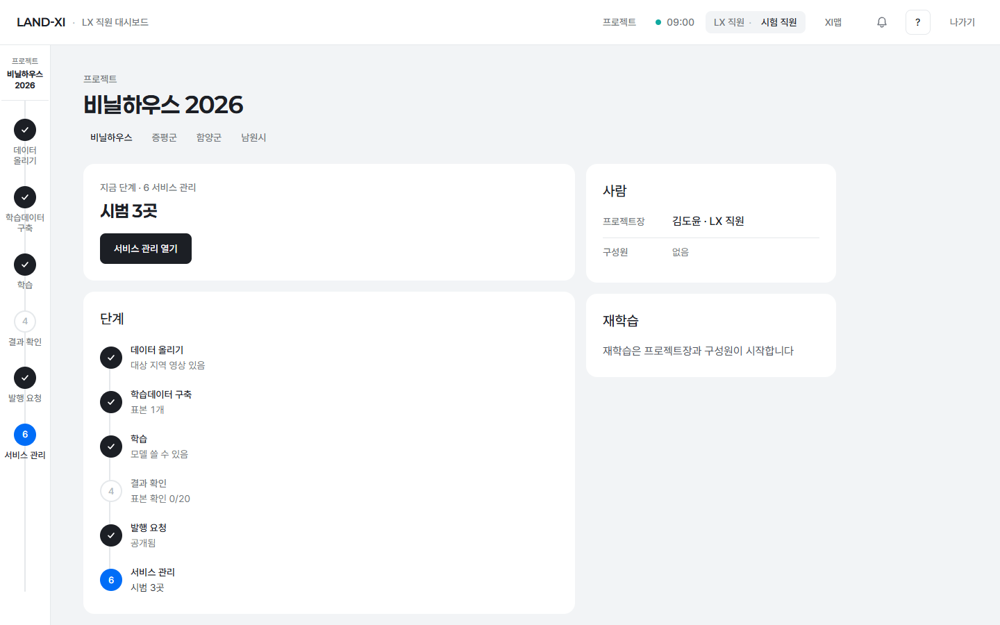 |
| 모바일 첫 화면 · 프로젝트 한 장 | 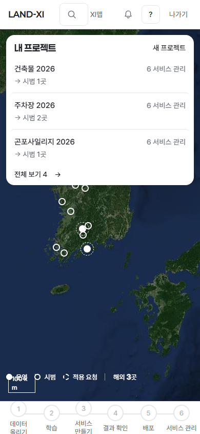 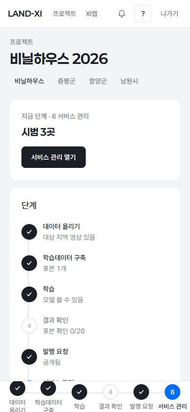 |
| 학습 화면 — 전(프로젝트 없이) | 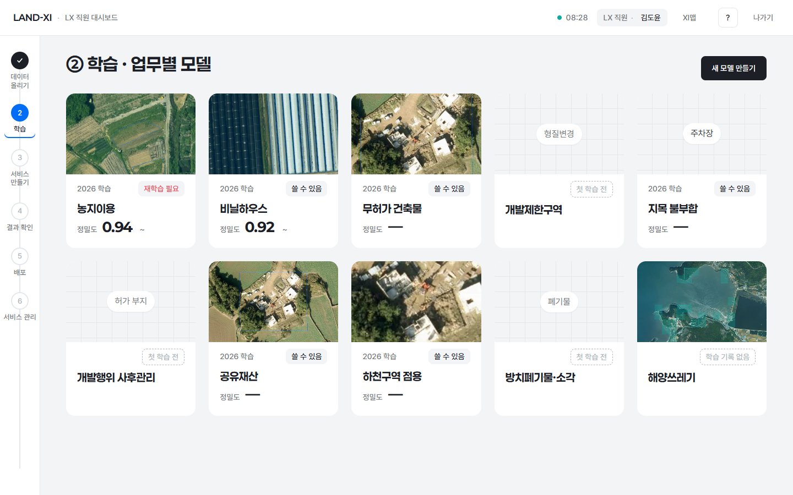 |
'다른 직원' 캡처는 시험 계정으로 찍고 계정은 지웠다. '여수시 해양쓰레기 2026'은 만들기 캡처용으로 만들었다가 지웠다.

## 확인 방법(바깥 주소)
1. https://app.land-xi.dev 에 lxadmin(또는 lx-staff)으로 로그인 → LX 직원 대시보드 왼쪽 위 '내 프로젝트'.
   lxadmin 은 아직 프로젝트가 없어 '진행 중인 프로젝트가 없습니다 · 새 프로젝트'가 보인다 — 눌러서 만들어 보면 된다.
2. 머리 줄 '프로젝트' 또는 https://app.land-xi.dev/landxi/v3/lx-project/ → 내가 만든 · 참여한 · 보관 · 전체.
3. 프로젝트 한 장 예: https://app.land-xi.dev/landxi/v3/lx-project/?project=prj_3fdba452d5 (비닐하우스 2026 · 프로젝트장 김도윤)
   — lx-staff 로 열면 '2차 재학습 시작'이 있고, lxadmin 으로 열면 '재학습은 프로젝트장과 구성원이 시작합니다'만 보인다(관리자는 '프로젝트장 바꾸기'가 있다).
4. 프로젝트 안 단계 화면: 한 장의 '○○ 열기' 또는 왼쪽 레일 단계를 누르면 그 화면이 프로젝트 레일 · 이름과 함께 열린다.

## 시험
- 서버: `server/tests/test_impl2_project.py` 7건 통과 — 바로 만들기 · 입력 거절(지역 없음 · 없는 지역 · 이름 없음 · 영업 · 기관) · 단계 판정(영상 · 표본 · 등록 모델 → 결과 확인 단계) ·
  발행 요청에 프로젝트 · 담당 · 대기 표시 · 재학습 권한(다른 직원 · 관리자 거절, 프로젝트장 · 구성원 허용, 2차로 학습 단계) · 프로젝트장 바꾸기 = 관리자 · 보관.
- 화면: `tests/e2e/impl2-project.spec.mjs` 2건 통과 — 로그인 폼 → '내 프로젝트' → 새 프로젝트 → 프로젝트 한 장 → 첫 화면 줄 → 그 단계 화면(프로젝트 레일 · 이름) · 목록 묶음 넷.
- 금지어 검사: 첫 화면 · 목록 · 한 장 · 학습(프로젝트) 0건 · 첫 뷰 글자 216 · 218 · 275.

## 남은 것
- 기간 · 사업(묶음 이름표)은 입력 칸을 늘리지 않으려고 넣지 않았다(필요하면 한 장에서 나중에 더하는 칸으로).
- 결과 확인 '표본 20건'은 결과 확인 화면이 한 번에 보는 표본 수를 그대로 쓴 길잡이다 — 판단 기준(확인 대기)이 정해지면 그 기준으로 바꾼다.
- 기관이 보낸 검토 요청 · 알림을 담당 프로젝트장에게 보내는 일은 알림 갈래가 카드 → 프로젝트장 한 곳(서버)을 쓰면 이어진다.
- 개인 자원 할당 · 요청 · 승인(7차 답)은 설계 확인 대기 — 프로젝트가 쓴 저장 공간은 이을 때마다 크기를 적어 두어 나중에 프로젝트장별로 셀 수 있다.
