# 기관 영상 분석 의뢰 · LX 영상 공유 (구현 2차 · 2026-10-01)

브리핑 확인: (1) 계정 범위 밖은 없다 — 관할 밖 영상은 읽은 자리에서 거절하고, 일부만 밖이면 관할 안만 분석한다(서버가 판정). (2) GPU 두 장 동시 고부하 금지 — 승인된 의뢰는 기존 분석 대기열로만 돌고, 시험 분석은 작은 영상(2048×2048 · 0.26㎢)으로만 했다. (3) 무상 · 기관에는 막는 한도를 두지 않는다 — 비용 · 수수료 표시 0, 올린 양은 사용 현황으로만 기록하고 서버 저장 공간이 모자랄 때만 막는다(10-01 사용자 답).

확인된 것만 만들었다: 우리 영상으로 분석 의뢰(무상 · LX 관리자 승인/반려) · 기관 영상 올리기 + LX 공유 영상 불러오기 · LX 영상을 어느 기관에 열지 관리자가 기관마다 고름 · 파일을 실제로 받기(여러 파일 · 멈춤 · 이어 올리기 · 취소). 기관 가입 · 부서, 비용 · 수수료 화면은 만들지 않았다.

캡처는 모두 1440×900(모바일 1장 390×844), 로그인 폼으로 들어간 화면이다. 계정: 기관 입구 lxadmin(남원시) · 관리자 입구 lxadmin. 비밀번호는 대화로만 전달한다.

## 1. 의뢰 화면 — 파일에서 읽은 값
| 전 | 후 |
|---|---|
| 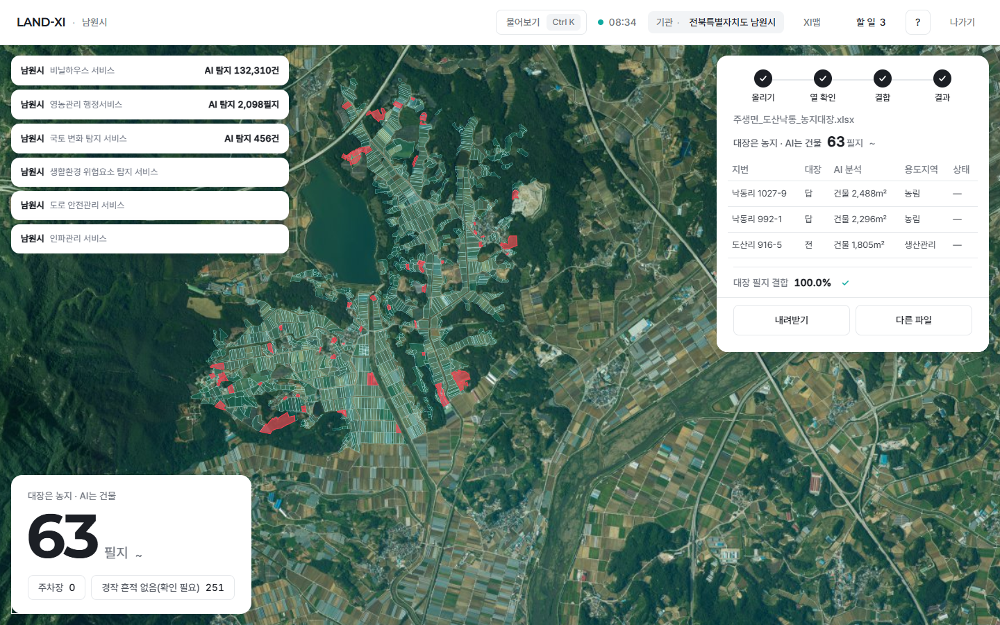 기관 화면에 영상을 맡길 곳이 없었다 | 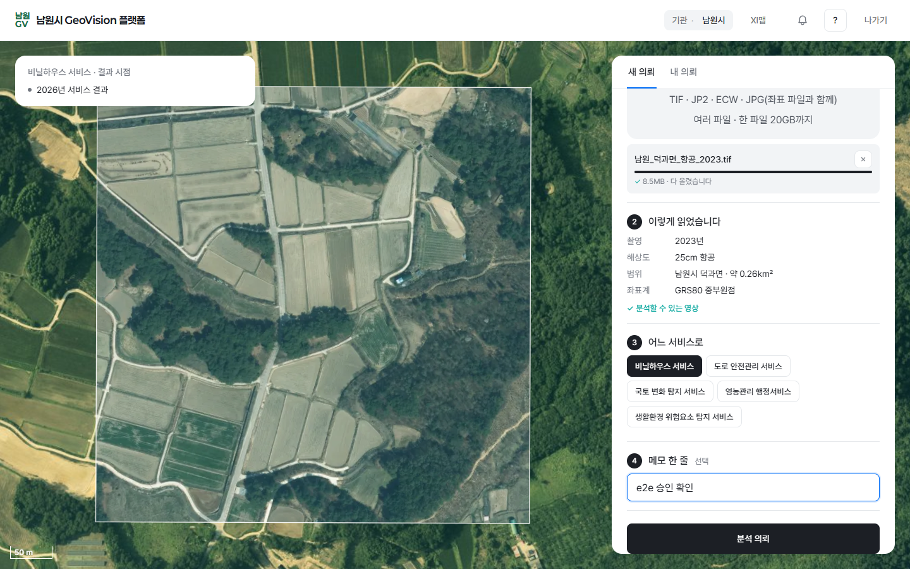 파일을 끌어 놓으면 '이렇게 읽었습니다' — 촬영 · 해상도 · 범위 · 좌표계, 지도에 올린 영상이 바로 얹힌다 |

- 들어오는 길: 서비스 대시보드의 '분석 의뢰'(다른 갈래가 링크를 넣는다)가 이 화면을 그 서비스로 연다. 주소는 `…/landxi/v3/gov-request/?service=서비스`.
- 입력 칸은 메모 한 줄(선택)뿐이다. 나머지는 파일에서 읽는다: 촬영일(파일 안 기록 → 파일 이름 → 없으면 '파일에 기록이 없습니다') · 해상도(25cm 항공 · 3cm 드론 같은 말로) · 범위(읍면동 이름 · 면적) · 좌표계(기록이 없는 JPG 는 위치로 가려낸다 — '위치로 확인').
- 올리기: 여러 파일 · 파일마다 진행 막대 · 멈춤 · 이어 올리기 · 취소. 큰 파일은 조각으로 보내고(한 조각 약 30초 분량 · 1–8MB), 끊기면 서버가 받은 자리부터 잇는다. 형식은 TIF · JP2 · ECW · JPG(좌표 파일과 함께), 한 파일 20GB까지.
- 여러 파일은 서버가 한 영상으로 묶어 읽는다(복사 없이). 좌표계가 섞이면 '좌표계별로 따로 의뢰해 주세요'.
- 영상 해상도에 맞는 분석 모델이 없는 서비스는 고를 수 없다(회색). 관할 밖 영상은 '관할 밖 영상입니다' 한 줄과 '지우고 다시 고르기'.
- 모바일: 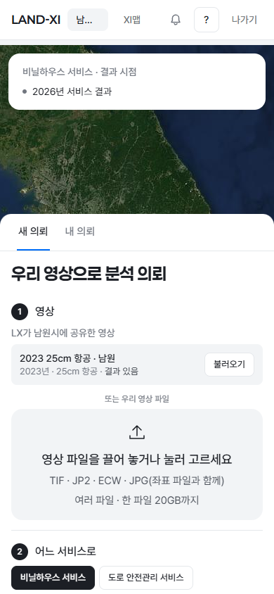

## 2. LX 공유 영상 불러오기
| | |
|---|---|
| 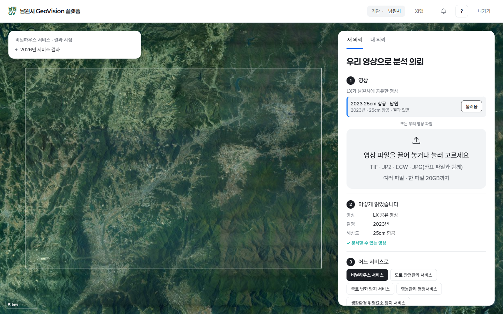 'LX가 남원시에 공유한 영상'에서 불러오기 — 이미 그 서비스로 분석한 영상이면 '결과 있음'이고 다시 의뢰하지 않게 막는다 | 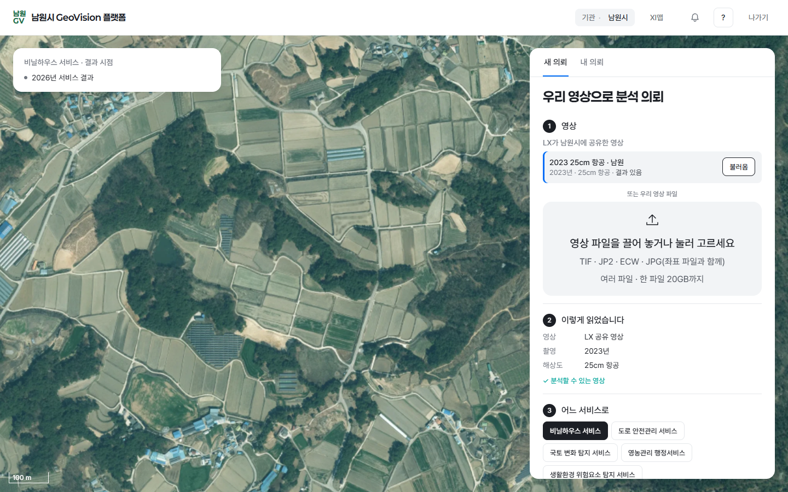 공유된 LX 영상은 기관 지도에서도 보인다(가까이 가면 LX 25cm 항공 영상) |

- 기관에 보이는 LX 영상 = 관리자가 그 기관에 켠 영상만(서버가 거른다). 불러오기 목록 · 기관 지도 영상 층이 같은 한 표를 본다.
- 바로잡은 것: 예전에는 기관 공개 지도 영상이 모든 기관에 보였다(예: 광주전남 계정에서도 남원 영상). 이제 공유한 기관에만.

## 3. 결재함 — 분석 의뢰 한 건
| 전 | 후 |
|---|---|
| 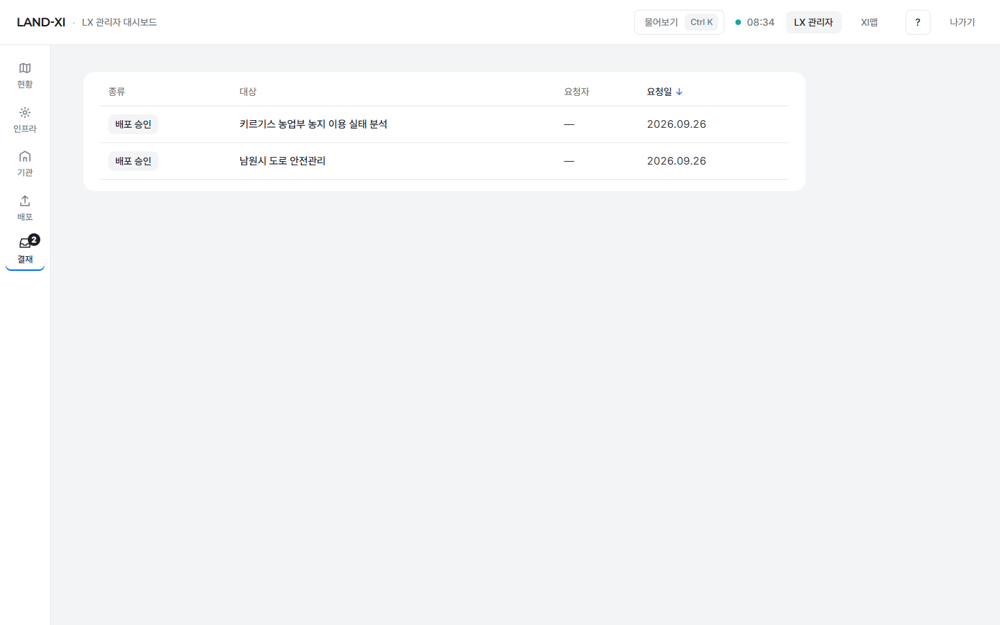 | 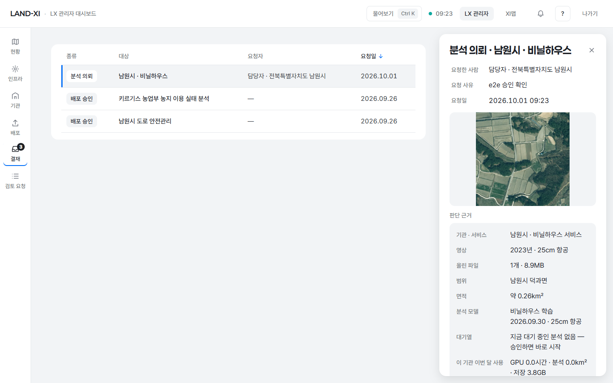 종류 '분석 의뢰' · 누가 · 요청 사유(메모) · 올린 영상 미리 보기 · 판단 근거 |

- 판단 근거(지금 있는 값만 — 없으면 줄을 만들지 않는다): 기관 · 서비스 · 영상(촬영 · 해상도) · 올린 파일 · 범위 · 면적 · 예상 시간(모델 실측 속도가 있을 때만) · 분석 모델 · 대기열(앞에 몇 건) · 이 기관 이번 달 사용(GPU · 분석 면적 · 저장).
- 승인 · 반려는 결재함 공통 모양 그대로: 반려는 사유가 있어야 하고, 요청한 사람이 스스로 결재할 수 없다.
- 승인 = 기존 분석 작업 대기열(기관 몫 작업 · 대기열 순서). 기관 한도로는 막지 않는다.

## 4. 승인 뒤 결과 — 그 서비스의 새 시점
| 보낸 뒤 | 결과 도착 |
|---|---|
| 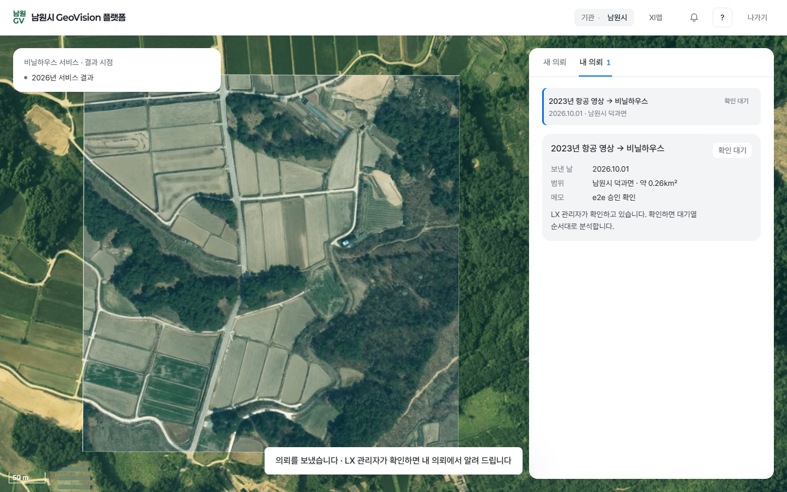 '내 의뢰' — 확인 대기 | 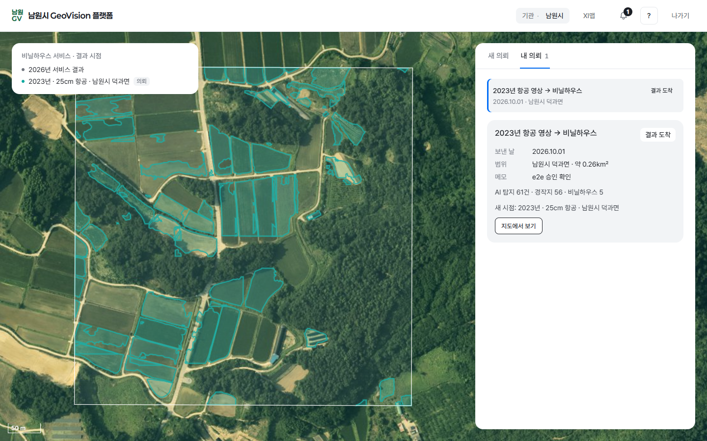 AI 탐지 61건(경작지 56 · 비닐하우스 5) · 지도에 결과 · 왼쪽 위 '결과 시점'에 '2023년 · 25cm 항공 · 남원시 덕과면 [의뢰]'가 더해짐 |

- 실측(시험 영상 1장 · 2048×2048 · 0.26㎢): 승인 → 분석 시작 1초 · 결과 도착까지 6초. GPU 는 한 장만 썼다.
- 상태는 넷: 확인 대기 → 분석 중 → 결과 도착, 또는 반려 · 분석하지 못함(사유 한 줄).
- 서비스 대시보드가 같은 시점 목록을 읽을 수 있다(그 서비스의 결과 시점 = 서비스 결과 + 의뢰로 더해진 시점).
- 올린 영상은 그 의뢰의 분석에만 쓴다 — 분석이 끝나면 다른 분석 · 지역 영상 목록이 고르지 않게 뺀다.

## 5. 반려 — 사유가 기관 '내 의뢰'에
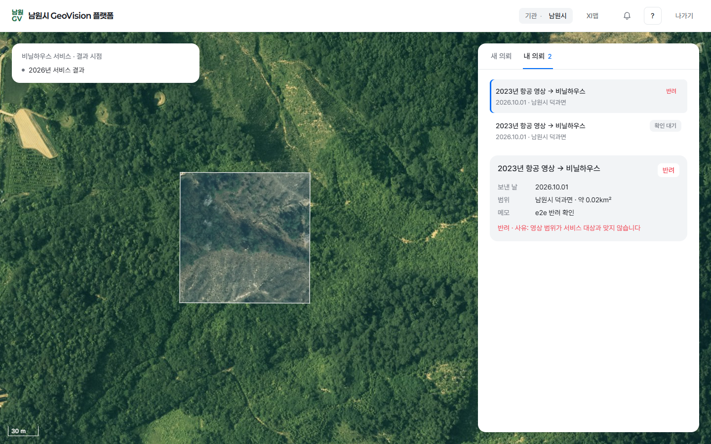

## 6. 관리자 기관 서랍 — '공유 영상' 칸
| 전 | 후 |
|---|---|
| 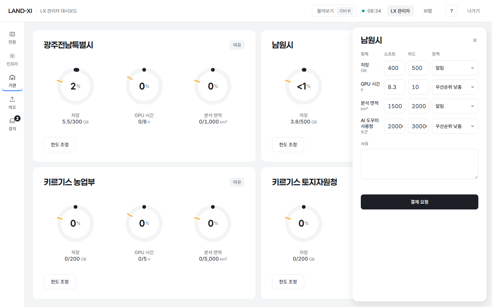 한도 칸뿐 | 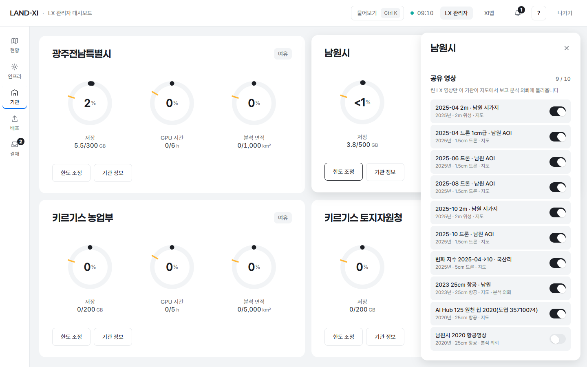 관할 안 LX 영상 목록 · 켜고 끄기 · 무엇에 쓰이는지(지도 · 분석 의뢰) |

- 처음 상태는 지금까지 남원시에 보이던 관할 안 지도 영상 9개를 그대로 옮겨 적었다(화면이 바뀌지 않게). 그 뒤로는 관리자가 켜고 끈 것만.
- 관할 밖 영상은 켤 수 없다. 원본만 있는 LX 영상(예: 남원시 2020 항공영상)은 켜면 분석 의뢰에 쓰이고, 기관 지도에는 아직 나오지 않는다(아래 남은 것).

## 7. 저장 공간
- 기관이 올린 원본은 기관 저장 사용량에 잡히고(관리자 기관 화면 '저장' · 사용 현황 '올린 영상 원본'), 기관 한도로 올리기를 막지 않는다.
- 서버 디스크 남은 공간이 200GB(설정 한 곳) 아래로 내려가면 올리기를 받지 않는다 — '지금은 서버 저장 공간이 모자라 올릴 수 없습니다'.
- 같은 파일 두 번 올리기 방지: 올리기 전 빠른 지문(크기 + 앞 · 뒤 1MB) · 다 받은 뒤 전체 지문. 이름만 바꿔도 알아본다.
- 보관: 분석이 끝난 원본은 지금 '보관'(기본값 설계 대기) · 끝내지 못한 올리기와 의뢰하지 않은 파일은 7일 뒤 정리. 원본은 이 PC 디스크(02. 데이터 아래 기관 폴더)에 둔다. 값은 모두 설정 파일 한 곳.

## 바깥 주소
- https://gov.land-xi.dev — 기관 남원시 · lxadmin → 첫 화면의 서비스 → '분석 의뢰'(또는 주소 `https://gov.land-xi.dev/landxi/v3/gov-request/`). 화면 준비 약 2.6초. 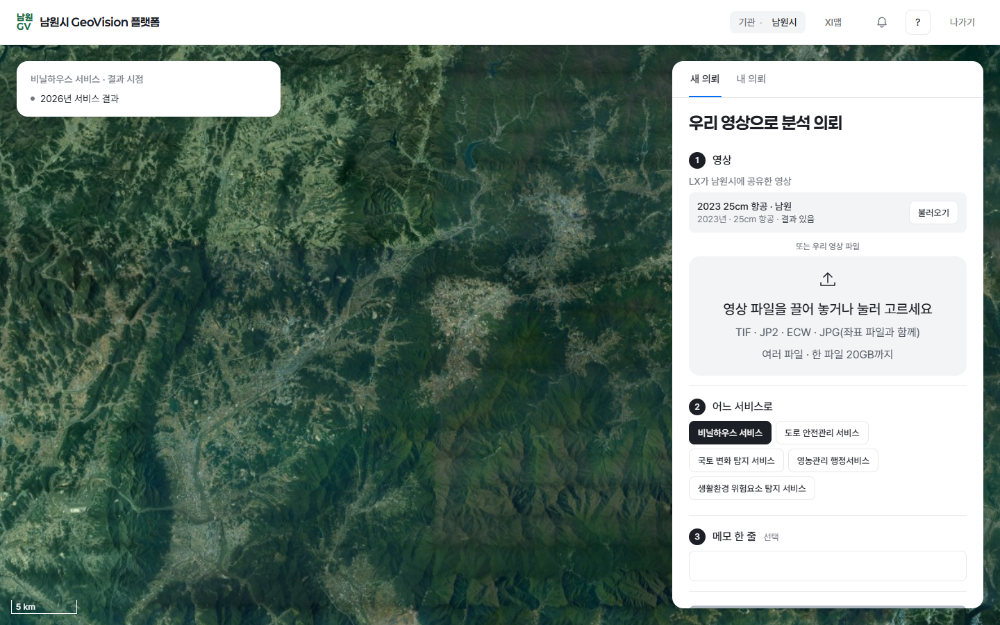
- 바깥 주소로 8.9MB 영상을 4MB 조각으로 올려 7.3초 · 읽기 · 지우기까지 확인했다(시험 파일은 지움).
- https://admin.land-xi.dev — 결재 → '분석 의뢰' 한 건 · 기관 → 남원시 카드 → 서랍 아래 '공유 영상'.

## 시험
- 서버: 새 시험 8 통과 — 조각 올리기 · 이어 올리기 · 취소 / 형식 · 계정 막기 / 파일에서 읽기 · 관할 밖 거절 / 의뢰 → 결재함 → 반려(사유) · 승인(기관 한도를 넘어도 대기열로 — 들어간 것을 보고 곧바로 취소) / 같은 파일 막기 / 저장(기관 한도로는 막지 않음 · 서버 여유 선 · 한 파일 한도) / 공유된 영상만 보임 · 관할 밖 공유 거절 / 공유 안 된 영상으로 의뢰 거절. 관련 기존 시험 49 통과(결재 · 한도 · 관할) · 결재 종류 목록 시험 한 줄을 '분석 의뢰'까지로 고침.
- 화면: 새 e2e 4 통과(공유 영상 불러오기 · 우리 영상 → 의뢰 → 결재 → 승인 → 결과 도착 · 반려 사유 · 관리자 공유 영상 칸) · 기존 관리자 e2e 6 통과 · 금지어 검사(의뢰 화면 · 결재함) 0건.

## 시험 데이터 정리
- 시험 의뢰 · 결재 · 분석 작업 · 결과 · 올린 영상 파일 · 폴더를 모두 지웠다(의뢰 0 · 올린 파일 0 · 기관 폴더 파일 0). 분석 작업자가 열어 둔 시험 영상은 작업자를 다시 띄워 놓아 준 뒤 지웠다.
- 공유 · 한도 값은 시험 전으로 되돌렸다.

## 남은 것
- 알림 칸: 다른 갈래의 알림은 아직 의뢰를 담지 않는다(지금은 결재함 목록만). 의뢰마다 담당 프로젝트장(서비스 카드 담당 직원 → 없으면 그 서비스 공개를 요청한 직원)을 적어 두었다 — 알림 칸이 읽으면 된다.
- 로그인이 끊긴 상태로 이 화면 주소를 열면 로그인 뒤 기관 첫 화면으로 간다(되돌아갈 화면 허용표는 공용 관문 파일 — 다른 갈래 소유). 한 줄 추가로 풀린다.
- 원본만 있는 LX 영상을 기관 지도에 보여 주려면 '기관에 원본 타일을 열지 않는다'(09-24 결정)와 부딪힌다 — 공유한 영상만 열지 결정 필요.
- ECW 는 이 서버 구성 요소로 읽지 못한다 — 화면이 'TIF 로 저장해 올려 주세요' 한 줄로 알린다. ECW 구성 요소(상용) 설치 여부 결정 필요.
- 시군구 전체를 덮는 공유 영상을 의뢰하면 시군구 전역 분석(무거움 · 대기열 뒤쪽)으로 들어간다 — 읍면동으로 좁혀 고르는 칸은 아직 없다.
- 기관 한도로 막지 않는 것은 이 의뢰 흐름만이다. 1차 구현의 기관 직접 분석(XI맵) · AI 도우미 한도 거절은 그대로 — 10-01 답에 맞춰 바꿀지 결정 필요.
- 분석 작업자는 읽은 영상 파일을 계속 열어 둔다(속도용) — 보관 기간이 숫자로 정해지면 그 파일은 작업자가 다시 뜬 뒤 다음 정리 때 지워진다.
- 부서 구분은 확인 대기라 '내 의뢰'는 기관 단위(같은 기관 사용자의 의뢰가 함께 보인다).

## 이런 것도 필요하지 않을까요
1. 의뢰 범위 고르기(읍면동 몇 곳) — 공유 영상이 시군구 전체일 때 필요한 곳만 빠르게 분석(대기열 · GPU 를 덜 쓴다). 누가: 기관 부서 사용자 · LX 관리자.
2. 결과 도착 알림 + 서비스 대시보드 시점 고르기에 '의뢰' 시점 표시 — 기관이 매번 들어와 확인하지 않게, 결과를 업무 화면에서 바로 이어 쓰게. 누가: 기관 부서 사용자.
