# 서비스 카드 한 벌 · 분석하기 · 서비스 카드 관리 · 기관 분석 의뢰 쉬운 판 (구현 3차 · 2026-10-01)

브리핑 확인: (1) 확인된 것만 만든다 — 14차 카드-1 ⓐ(카드 한 벌 · 여덟 칸 · 네 자리) · 길-1 ⓑ(분석하기는 카드 먼저만) · 13차 분기-4 ⓐ(2차 서비스 카드는 모양까지) · 구현 확인 2차 J-9(공무원은 영상 넣고 카드 고르고 요청만). (2) 숫자는 서버 값 한 출처 — 카드의 결과 숫자 · 상태는 대표 수치 요약(`/summary`)과 같은 값, 지어낸 숫자 0. (3) 지역은 화면이 대신 고르지 않는다 · 계정 범위 밖은 0 — 분석할 곳은 직원이 검색해 고르고, 기관 화면에는 그 기관 관할의 결과 장면만 나온다(서버가 거른다).

캡처는 모두 바깥 주소에서 로그인 폼으로 들어간 화면이다(1440×900 · 휴대폰 390×844). 계정: LX 직원 `test@lx.or.kr` · LX 관리자 `lxadmin@lx.or.kr` · 기관(남원시 · 광주전남) `lxadmin@lx.or.kr`. 비밀번호는 임시 비밀번호(대화로만).

## 어디서 보나
| 무엇 | 주소 | 누를 곳 |
|---|---|---|
| 분석하기(카드 갤러리 → 카드 상세 → 분석 시작) | https://app.land-xi.dev/landxi/v3/lx-analyze/ | 로그인(LX 직원) → 왼쪽 메뉴 '분석하기' → 카드의 '자세히' 또는 '이 카드로 분석' |
| 서비스 카드 관리 | https://app.land-xi.dev/landxi/v3/lx-cards/ | 왼쪽 메뉴 '서비스 카드' → 카드의 '관리' |
| 기관 서비스 선택(남원시) | https://namwon.land-xi.dev/ | 로그인(기관) → '내 서비스' |
| 기관 서비스 선택(광주전남) | https://gwangju-jeonnam.land-xi.dev/landxi/v3/gov-select/?list=1 | 로그인(기관) → 왼쪽 '내 서비스' |
| 기관 분석 의뢰(쉬운 판) | https://namwon.land-xi.dev/ | 로그인(기관) → 왼쪽 '분석 의뢰' |

## 1. 카드 한 벌 — 같은 부품, 네 자리
| ① 분석하기 갤러리(LX) | ② 서비스 카드 관리(LX) | ③ 기관 서비스 선택 | ④ 기관 공간의 2차 서비스(모양만) |
|---|---|---|---|
| 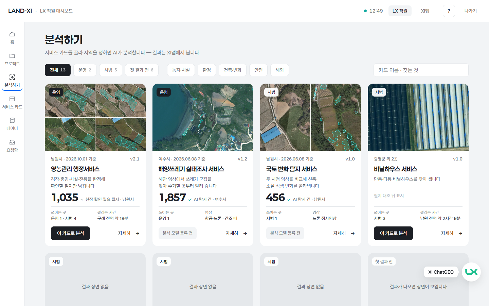 | 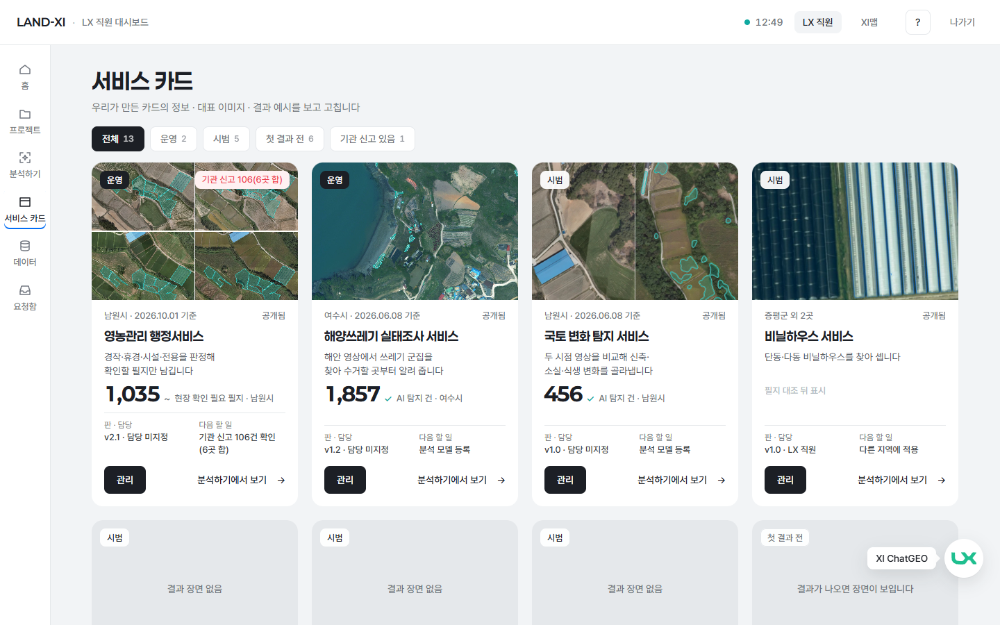 | 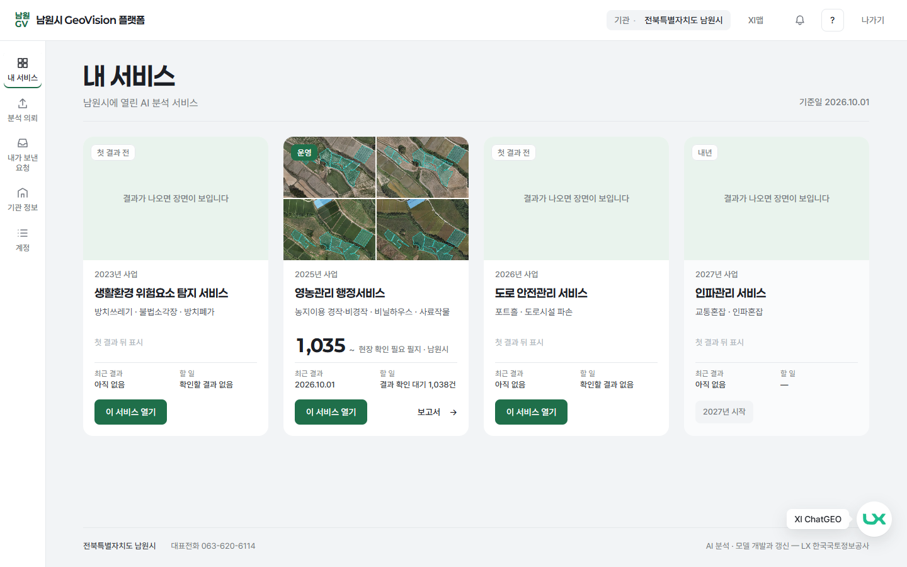 | 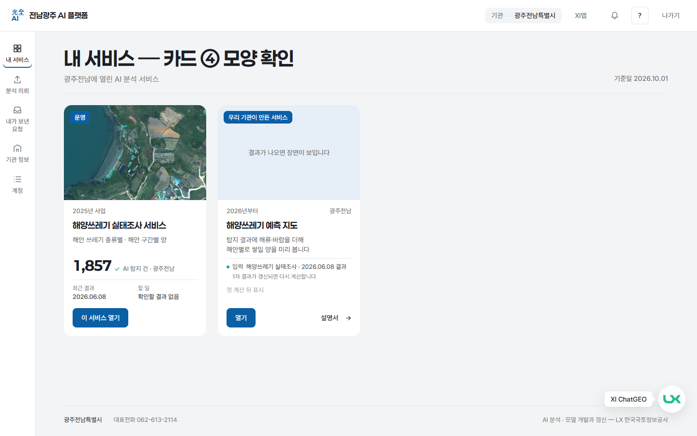 |

- 정보 여덟 칸이 모든 자리에서 같은 순서다: 결과 장면 · 상태 · 어디 · 기준일 · 이름 · 무엇을 찾나 · 결과 예시 · 조건 두 칸 · 1차 버튼 + 자세히.
- 자리마다 다른 것은 배지와 아래 두 칸뿐이다: ① 쓰이는 곳 · 영상 조건(또는 실제 걸린 시간) / '이 카드로 분석' ② 판 · 담당 / 다음 할 일 / '관리'(공개 결재 중 · 기관 신고 표시) ③ 최근 결과 · 할 일 / '이 서비스 열기' · '보고서'(기관 색) ④ '우리 기관이 만든 서비스' 배지 · 입력이 된 1차 결과와 기준 시점 / '열기' · '설명서'.
- 결과 장면은 이미 공개된 실제 결과 조각만 쓴다(남원 드론 4시점 · 남원 비닐하우스 · 여수 해양쓰레기 · 남원 변화). 장면이 없는 카드는 회백 판 한 장 — 그림을 지어 넣지 않았다.
- ④ 자리는 부품 모양까지만 만들었다(기관 공간 화면은 다음 작업). 캡처의 2차 카드 글은 모양 확인용이며 실제 서비스가 아니다.
- 같은 부품을 LX 직원 대시보드의 '서비스 장면'도 쓴다(다른 작업이 붙였다).

## 2. 분석하기 — 카드 먼저(갤러리 → 카드 상세 → 어디 → 분석 시작 → 결과는 XI맵)
| 전 | 후 — 갤러리 | 후 — 카드 상세 |
|---|---|---|
| 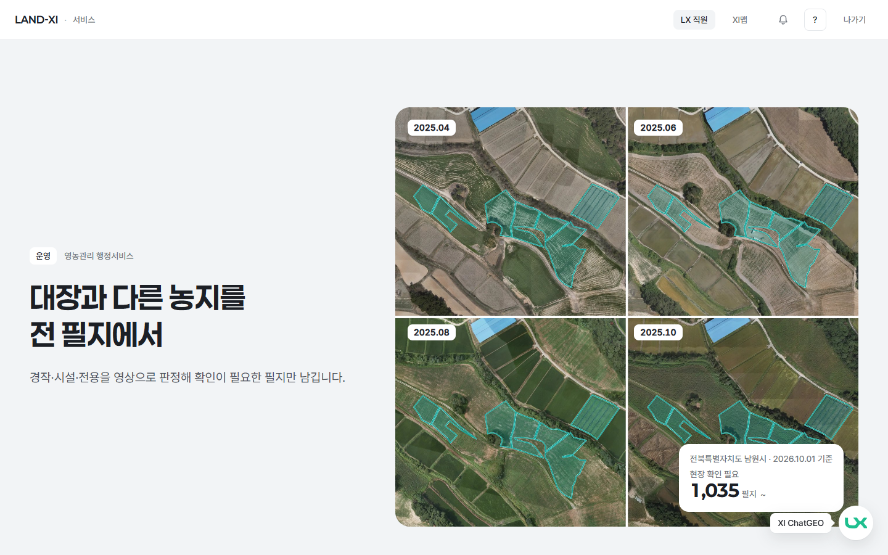 분석하기 메뉴가 없었다(서비스 소개 화면뿐 · 분석은 XI맵 도구로만) |  | 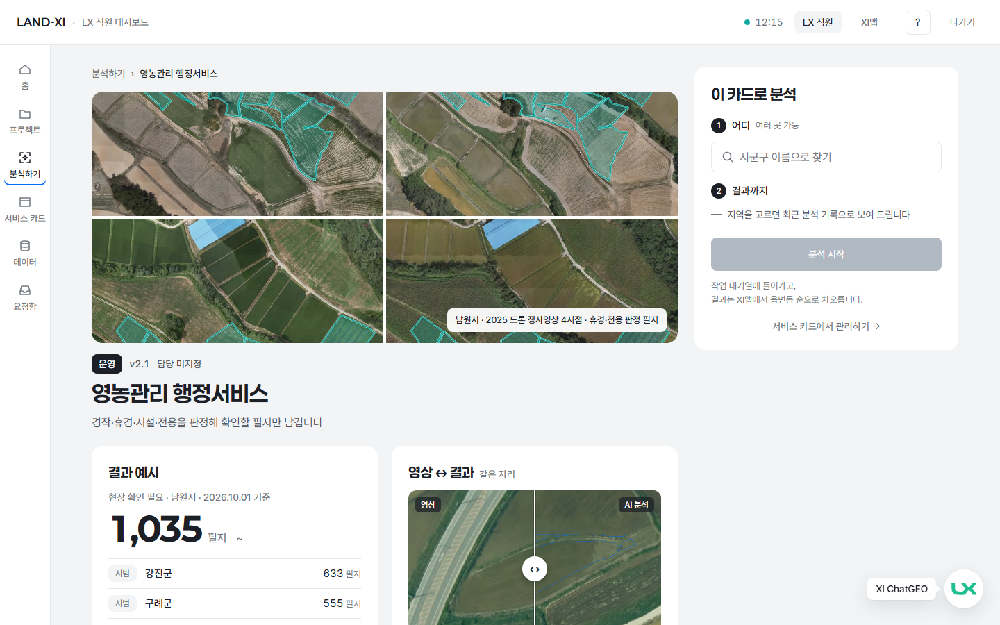 |

| 지역 고르기 → 걸릴 시간 | 분석 시작 | XI맵에서 결과가 차오름 |
|---|---|---|
| 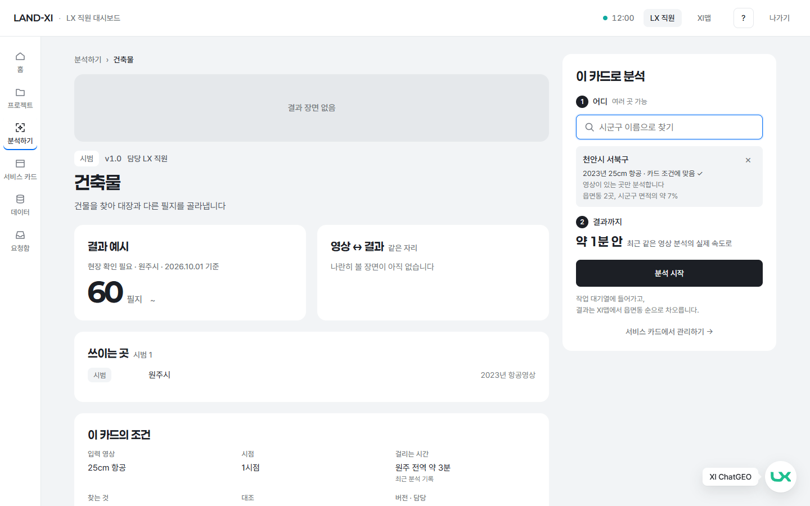 | 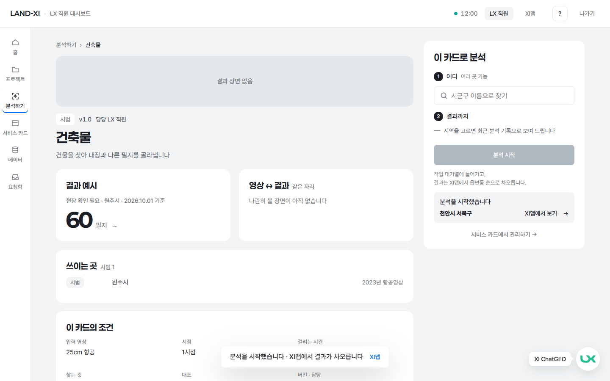 | 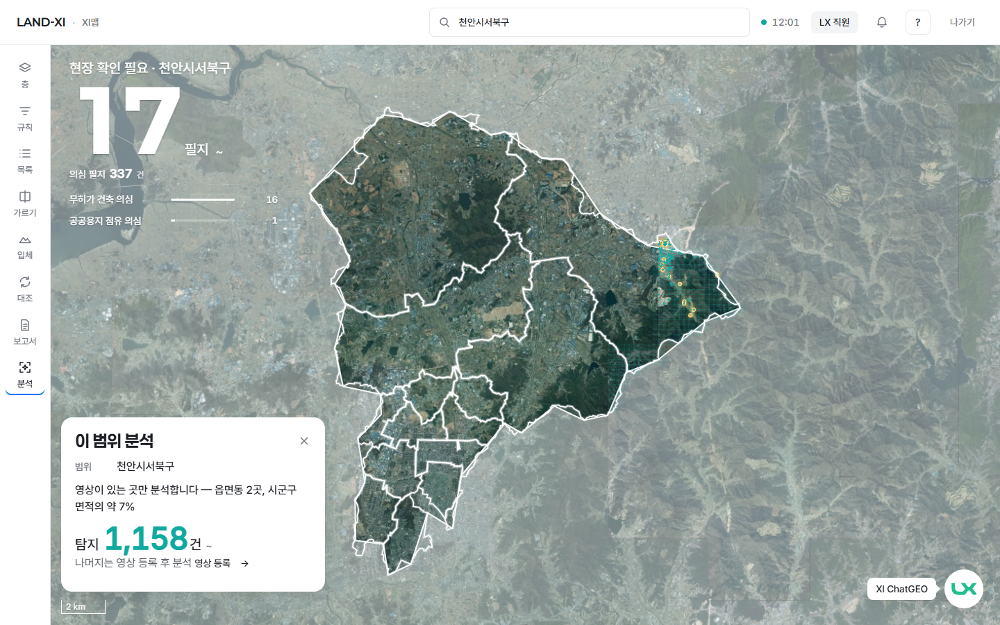 |

- 갤러리: 상태(전체 · 운영 · 시범 · 첫 결과 전) · 분류(농지·시설 · 환경 · 건축·변화 · 안전 · 해외) 거르기 · 찾기. 카드 4열 · 휴대폰 1열.
- 카드 상세: 큰 결과 장면 · 결과 예시(지역별 표 — 누르면 그 지역 XI맵) · 영상 ↔ 결과(같은 자리 · 손잡이로 나눠 보기) · 장면 여러 장 · 쓰이는 곳(운영 · 시범 · 첫 결과 전 · 기관 신고) · 이 카드의 조건.
- 오른쪽 '이 카드로 분석': ① 어디 — 직원이 시군구를 검색해 고른다(여러 곳 가능 · 화면이 미리 고르지 않음). 고르면 그 지역 영상이 카드 조건에 맞는지 한 줄(맞음 ✓ / 영상 없음 → 데이터 올리기 / 해상도가 맞지 않음). ② 결과까지 — 최근 같은 영상 분석의 실제 속도로 계산. '분석 시작' = 지금 XI맵 전역 분석과 같은 작업 대기열(GPU 한 장 · 전력 규칙 그대로). 끝나면 'XI맵에서 보기'.
- 홈의 '바로 분석하기'에서 고른 지역은 그대로 들고 와 '어디'에 담겨 있다.
- 분석 모델이 아직 없는 카드(해양쓰레기 · 국토 변화 · 생활환경 · 도로 · 인파 등)는 버튼 대신 '분석 모델 등록 전' 한 줄 — 누를 수 없는 버튼을 두지 않았다.
- 실제로 한 번 돌렸다: 건축물 카드 · 천안시 서북구(영상이 있는 읍면동 2곳 · 약 30초) → XI맵에서 탐지 1,158건 · 현장 확인 필요 17필지(XI맵 숫자 그대로).
- 휴대폰: 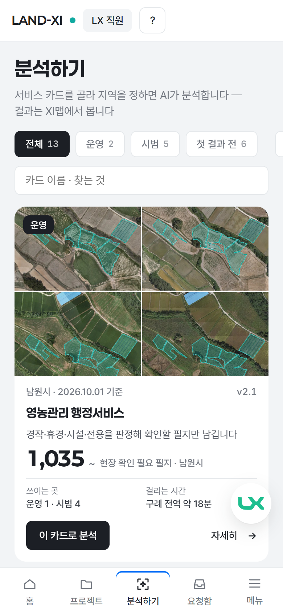 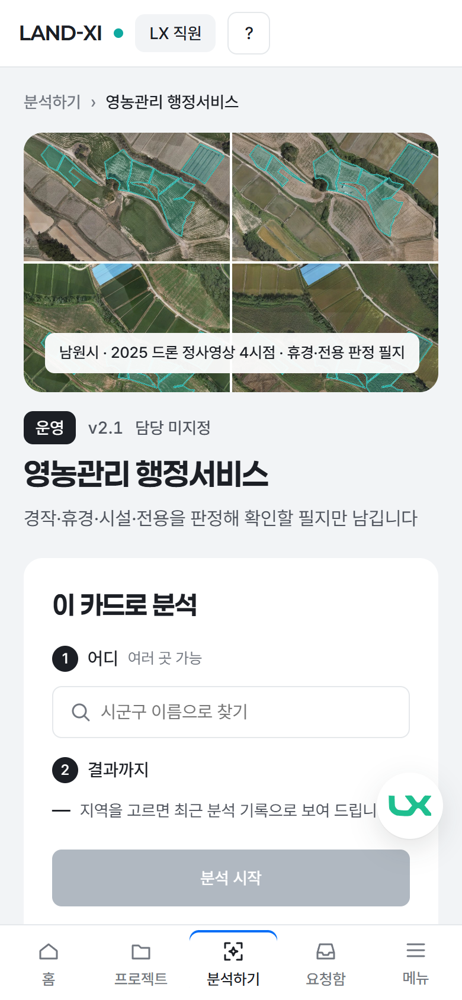

## 3. 서비스 카드 관리 — 카드 정보를 보고 고친다
| 전 | 후 — 목록 | 후 — 한 장 고치기 |
|---|---|---|
| 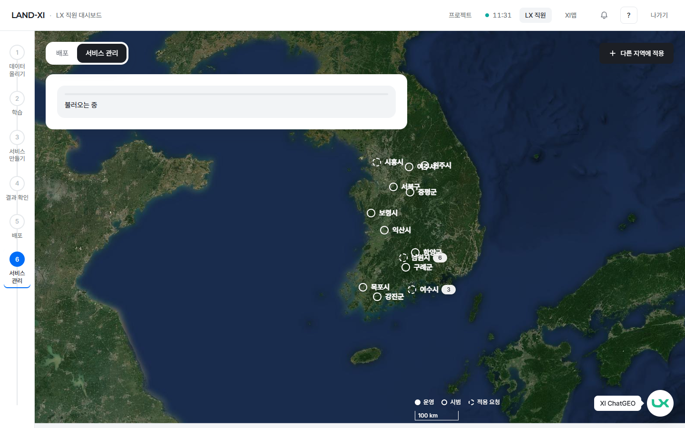 서비스 관리 탭(배포 지도 · 표) |  | 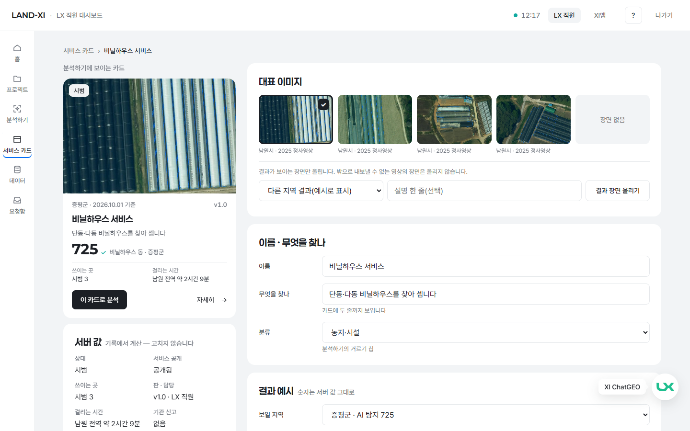 |

- 목록: 우리가 만든 카드 전부(만드는 중 포함) · 거르기(운영 · 시범 · 첫 결과 전 · 공개 결재 중 · 기관 신고 있음) · 카드마다 '다음 할 일'(공개 결재 기다림 · 기관 신고 확인 · 첫 분석 · 분석 모델 등록 · 다른 지역에 적용).
- 한 장 고치기: 왼쪽 = 분석하기에 보이는 카드 미리 보기(고치면 바로 바뀜) · 오른쪽 = 고칠 칸 — 대표 이미지(고를 수 있는 결과 장면 · 장면 없음 · 결과 장면 올리기) · 이름 · 무엇을 찾나 · 분류 · 결과 예시(어느 지역 값을 보일지 · 말) · 입력 영상 · 시점 · 찾는 것 · 대조.
- 숫자는 고치지 않는다: 상태 · 서비스 공개 · 쓰이는 곳 · 판 · 담당 · 걸리는 시간 · 기관 신고는 '서버 값' 칸에 기록 그대로. 서비스 공개는 결재 기록 그대로(공개 결재 중 · 공개됨 · 공개 반려 · 공개 전) — 새 승인 규칙은 만들지 않았다.
- 고칠 수 있는 사람: 그 카드의 담당 프로젝트장과 LX 관리자(담당이 없는 옛 카드는 LX 직원도). 고친 기록은 서버 처리 기록에 남는다.
- 결과 장면 올리기: 어느 지역 결과인지 고르면 그 기관 화면에도 그 장면이 보이고, '다른 지역 결과'로 올리면 카드에 '다른 지역 결과 · 예시'가 붙는다(기관 화면에는 안 보임).
- 휴대폰: 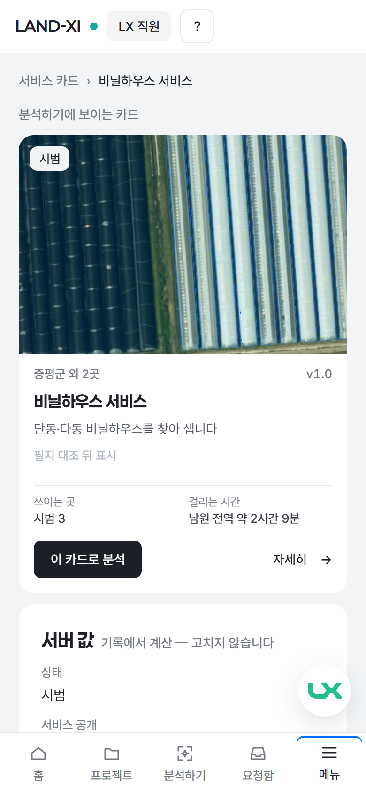

## 4. 기관 서비스 선택 — 카드 ③
| 전 | 후 — 남원시 | 후 — 광주전남 |
|---|---|---|
| 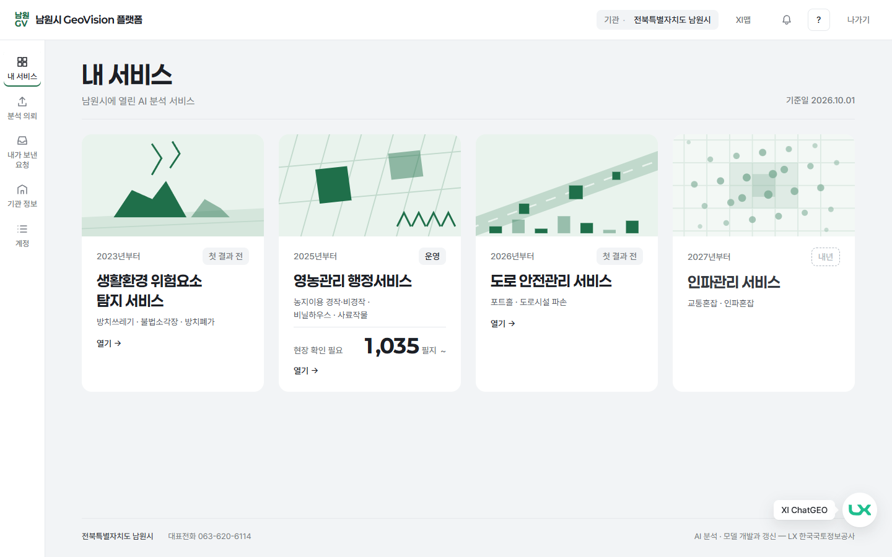 서비스마다 그린 그림판 |  | 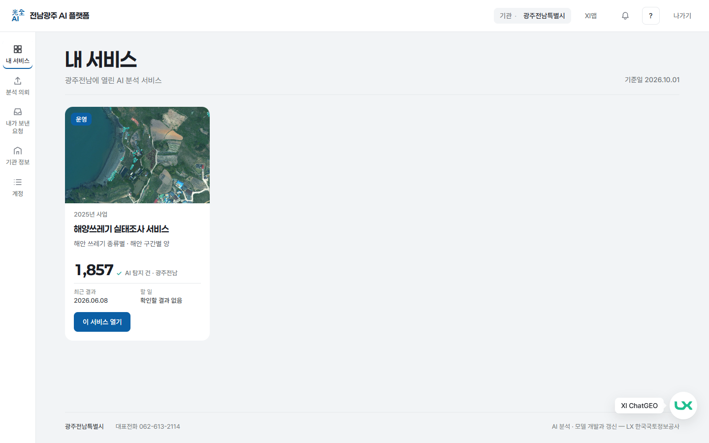 |

- 그림판 대신 그 기관 관할의 실제 결과 장면(남원시 영농관리 = 남원 드론 4시점 · 광주전남 해양쓰레기 = 여수 항공). 결과가 없는 서비스는 기관 색의 회백 판.
- 결과 예시 = 우리 기관 값(남원시 현장 확인 필요 1,035필지 · 광주전남 쓰레기 군집 1,857 — 서비스 대시보드 · LX 화면과 같은 값). 최근 결과 날짜 · 할 일(결과 확인 대기 n건) · '이 서비스 열기' · 필지 대조가 있는 서비스만 '보고서'.
- 내년 사업(인파관리)은 버튼 대신 '2027년 시작'.
- 다른 기관의 서비스 · 다른 기관 관할 장면은 서버가 내주지 않는다(광주전남 계정의 영농 카드에는 남원 장면 0).
- 휴대폰: 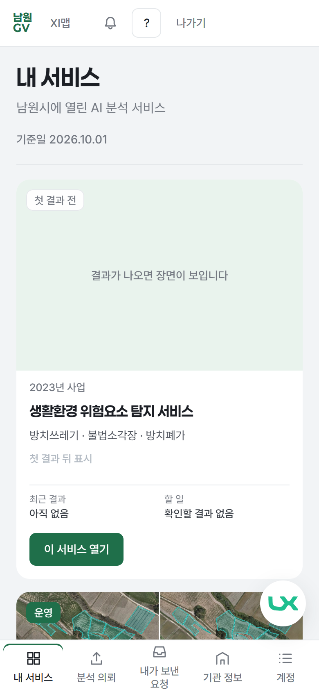

## 5. 기관 분석 의뢰 — 쉬운 판(J-9)
| 전 | 후 | 공유 영상을 불러오면 | 위치 정보가 없는 사진을 넣으면 |
|---|---|---|---|
| 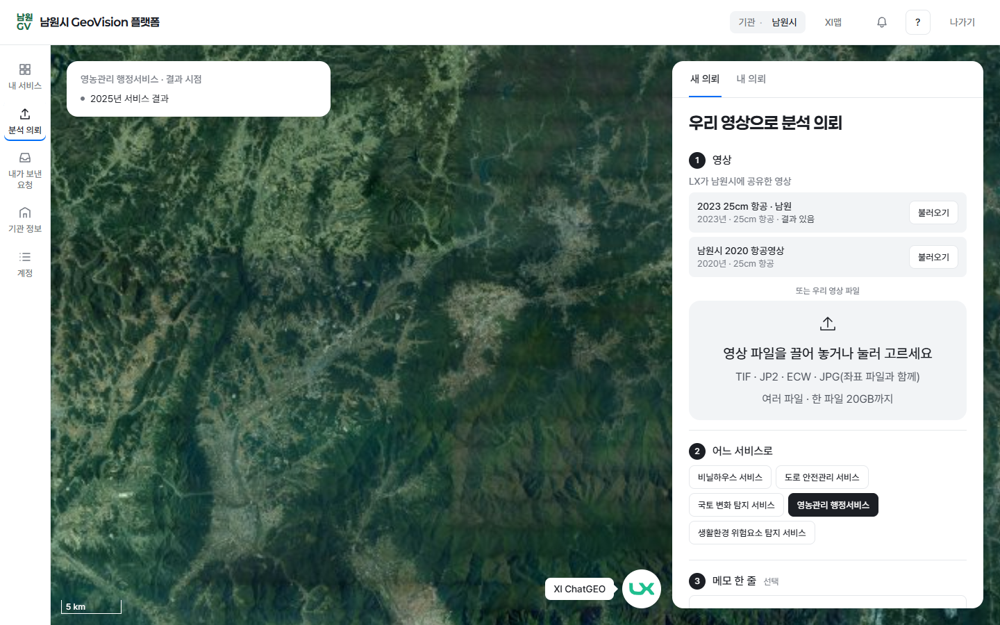 '이렇게 읽었습니다 · 해상도 · 좌표계' · 'TIF · JP2 · ECW · JPG(좌표 파일과 함께)' | 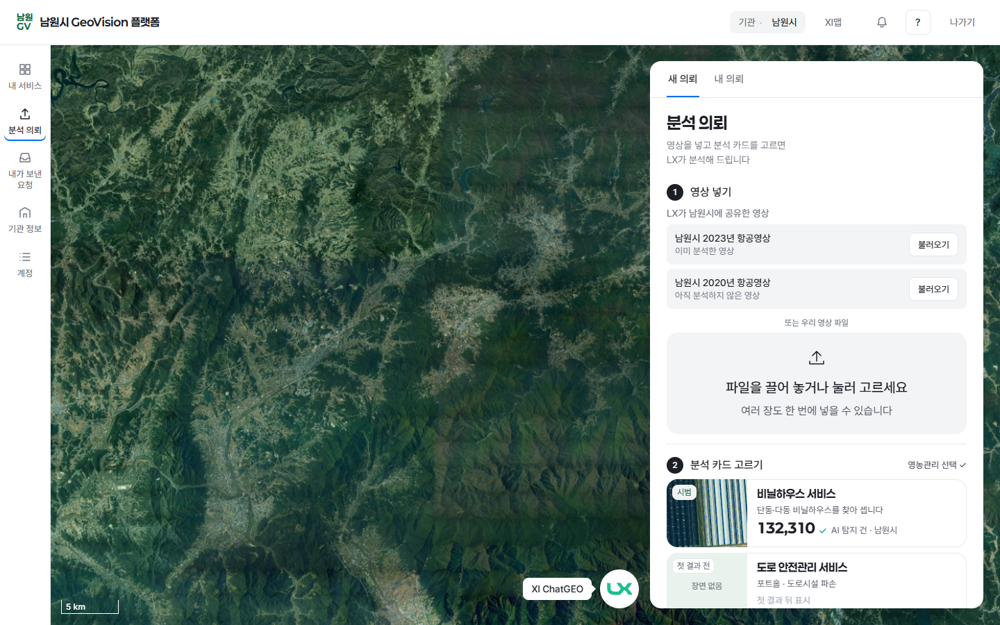 | 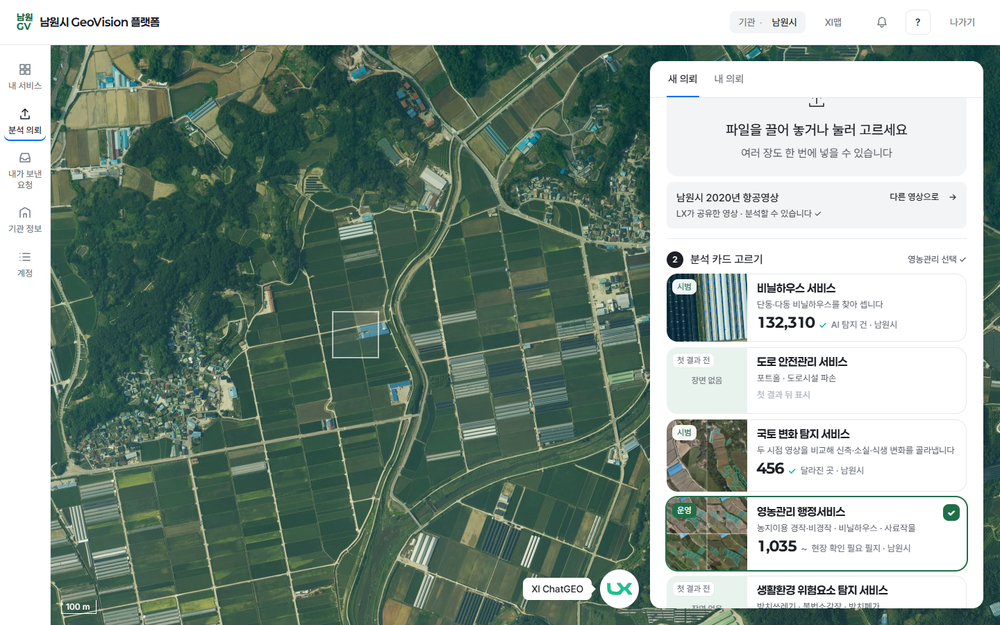 | 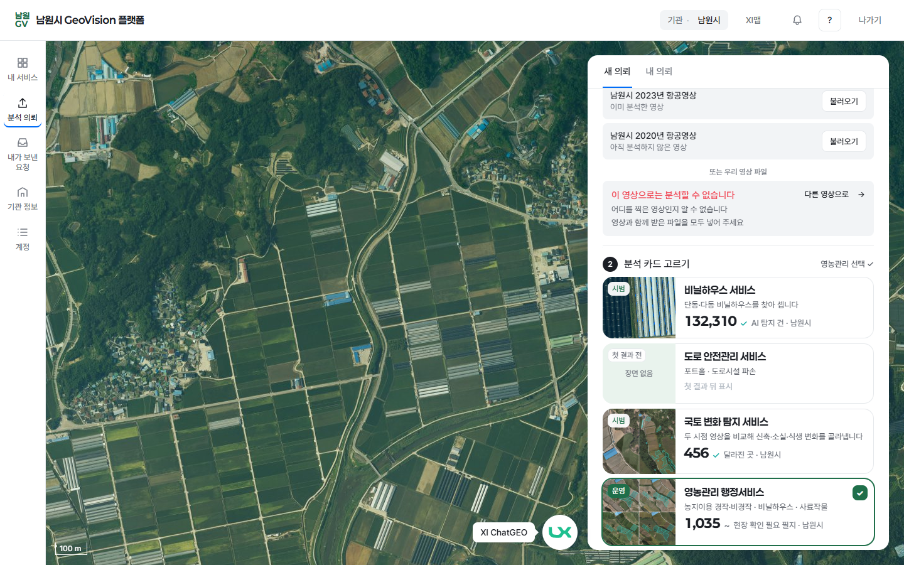 |

- 세 단계뿐이다: ① 영상 넣기(LX가 공유한 영상 '불러오기' 또는 파일 끌어 놓기 — 여러 장 · 이어 올리기 그대로) ② 분석 카드 고르기(카드 한 벌의 가로 모양 · 고른 카드에 ✓) ③ 요청하기(메모 한 줄 · 선택) → '분석 요청'.
- 화면에서 뺀 말: 형식 목록(TIF · JP2 · ECW · JPG) · '이렇게 읽었습니다' · 해상도 · 좌표계 · 결과 시점 칸. 영상은 '남원시 2020년 항공영상', 넣은 파일은 '○○ 일대 항공영상 · 1장 — 2025년 4월에 찍은 영상입니다 — 분석할 수 있습니다 ✓'처럼 어디 · 언제만 쉬운 말로.
- 서버 검사는 그대로다(관할 밖 · 위치 없는 파일 · 섞인 파일). 문제일 때만 쉬운 말 한 줄 + 할 일: 예) '어디를 찍은 영상인지 알 수 없습니다 / 영상과 함께 받은 파일을 모두 넣어 주세요' + '다른 영상으로'. 관할 밖 = '남원시 밖을 찍은 영상입니다 — 남원시 안을 찍은 영상만 분석합니다'.
- 이 영상으로 못 하는 카드 = 흐린 카드 + '이 영상으로는 어렵습니다 — 다른 영상이 필요합니다'. 이미 그 카드로 분석한 공유 영상 = '이 영상은 이 카드로 이미 분석했습니다'.
- 단계 이름 · 버튼 말은 페블 기관 화면 시안(확인 대기)과 같게 맞췄다 — 확인 뒤 모양만 바꾸면 된다.
- 휴대폰: 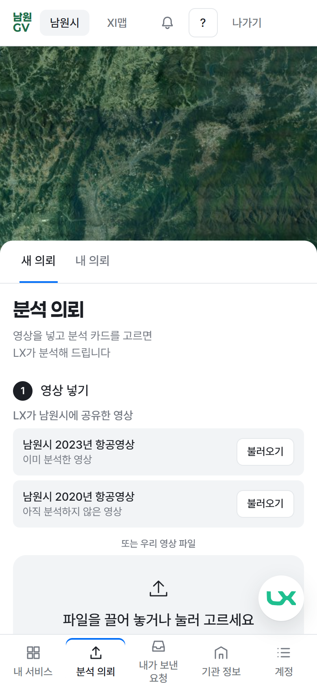 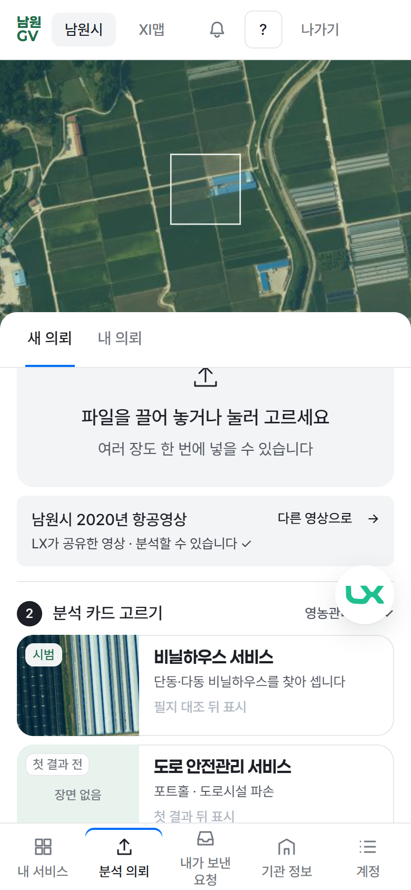 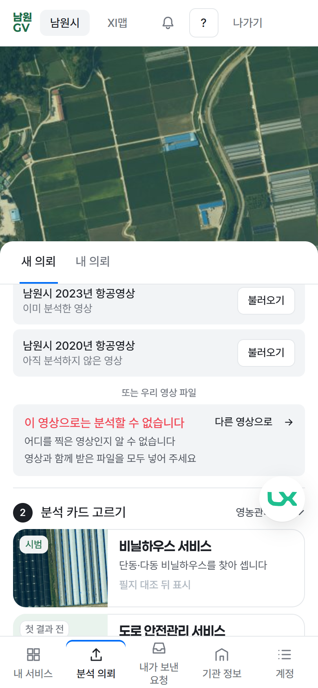

## 시험
- 새 시험 `tests/e2e/impl3-cards.spec.mjs` 4건 통과: 갤러리 · 숫자 한 출처(/summary) · 거르기 · 카드 상세 · 지역 고르기(견적) / 카드 고치기 → 미리 보기 · 덱 반영 → 되돌리기 / 기관 서비스 선택 카드 · 덱은 자기 기관만 · 남원 장면은 광주전남에 0 · 카드 상세는 LX 만 / 분석 의뢰 세 단계 · 전문 글 0.
- 기존 기관 시험 갱신 후 통과: `impl2-gov-branch` 6건 · `impl2-cleanup` 4건 · `impl2-request` 4건(분석 실행 단계는 GPU 를 쓰지 않게 건너뜀).
- 금지어 검사(용어표 · 개발 정보): 분석하기 · 서비스 카드(목록 · 한 장) · 기관 서비스 선택 · 분석 의뢰 모두 0건(카드 원천 이름에 남은 옛 말은 서버가 용어표의 말로 바꿔 내준다).

## 남은 것
- 기관 공간 화면 자체(④ 자리)는 다음 작업(분기 공간 1단) — 이번에는 카드 모양까지.
- 기관 카드의 '담당 부서' 칸은 서비스별 담당 부서 정보가 서버에 없어 비워 두었다(사업 연도 · LX 담당만).
- 건축물 카드의 장면: 시안의 산청 장면은 밖으로 내보낼 수 없는 항공영상이 바탕이라 쓰지 않았다 → 회백 판. 원주 결과 장면을 '결과 장면 올리기'로 넣으면 채워진다.
- 장면이 없는 카드 8장(곤포사일리지 · 주차장 · 건축물 · 생활환경 · 도로 · 인파 · 산림 · 해외 둘).
- 갤러리는 카드 목록이라 첫 화면 글 · 버튼 예산(300자 · 8개)을 넘는다(글 약 560자 · 칩 포함 단추 18) — 설계 때 '카드당 60자'로 재자는 제안이 있었고 아직 확인 전.

## 이런 것도 필요하지 않을까요?
- **분석이 끝나면 결과 장면 자동 후보** — 누가: LX 직원(카드 담당). 왜: 장면 없는 카드가 8장이다. 분석이 끝난 지역의 결과 조각을 서버가 잘라 '고를 수 있는 장면'에 넣으면 고르기만 하면 된다.
- **기관 카드의 담당 부서** — 누가: 기관 사용자 · LX 직원. 왜: 원칙 102(기관 쪽 담당자도 보인다). 서비스마다 기관 안 담당 부서를 기관 관리자가 한 칸 적으면 카드 ③과 LX 요청함에 같이 보인다.
- **오래 걸리는 분석은 한 번 더 확인** — 누가: LX 직원. 왜: 남원 비닐하우스처럼 시군구 전역이 2시간 넘게 걸리는 경우가 있다. 걸릴 시간이 1시간을 넘으면 '분석 시작' 전에 한 줄 확인.
- **AI 탐지 수의 셈 단위 점검** — 누가: LX 직원 · 기관. 왜: 남원 비닐하우스 서비스의 AI 탐지 132,310건이 기관 카드에 그대로 보인다(조각 단위 수일 수 있음). 결과 말(예: '비닐하우스 동')은 셈 단위를 확인한 지역에만 붙이도록 해 두었다.
