# 기관 분기 공간 1단 — 우리 공간 · 결과 설명서 · 내려받기 · LX 관리자 기관 공간 목록 (구현 3차 · 2026-10-01)

브리핑 확인: (1) 확인된 것만 만든다 — 13차 분기-2 확인(1차 결과는 결과 설명서에서) · 분기-3 ⓒ의 1단(모든 기관의 가벼운 칸만) · 분기-4 ⓐ(2차 칸 자리는 만들지 않음) · 8차 API-형식 ⓐ(GeoJSON · 필지 엑셀 · 요약). API 키(보류) · 상자 · 2차 올리기(2단)는 만들지 않았다. (2) 계정 범위 밖은 0 — 관할 밖 결과는 서버가 잘라 내고, 다른 기관 서비스는 '없는 서비스'로 답한다. (3) 숫자는 서버 값 한 출처 — 설명서의 결과 수 = 서비스 대시보드 · 대표 수치 요약의 같은 값, 지어낸 숫자 0.

캡처는 모두 바깥 주소에서 로그인 폼으로 들어간 화면이다(1440×900 · 휴대폰 390×844). '전' 캡처는 같은 바깥 주소에서 이번에 고친 화면 파일 셋만 지난 판으로 바꿔 끼워 찍었다(서버 · 자료는 같다). 계정: 기관(남원시 · 광주전남) `lxadmin@lx.or.kr` · LX 관리자 `lxadmin@lx.or.kr`. 비밀번호는 임시 비밀번호(대화로만).

## 어디서 보나
| 무엇 | 주소 | 누를 곳 |
|---|---|---|
| [기관 분기] 우리 공간 — 남원시 | https://namwon.land-xi.dev/ | 로그인 → 왼쪽 '우리 공간' → 위 탭에서 서비스 고르기 |
| [기관 분기] 우리 공간 — 광주전남 | https://gwangju-jeonnam.land-xi.dev/ | 로그인 → 왼쪽 '우리 공간' |
| [Land-XI] 기관 공간 목록 | https://admin.land-xi.dev/landxi/v3/ops-infra/#/tenants/space | 로그인 → 왼쪽 '기관' → 위 탭 '기관 공간' → 한 줄 누르기 |

## 1. 우리 공간 — 받은 서비스마다 결과 설명서 한 장
| 전 — 기관 메뉴에 결과를 확인 · 내려받는 곳이 없었다 | 후 — 남원시 영농관리 행정서비스 | 후 — 광주전남 해양쓰레기 |
|---|---|---|
| 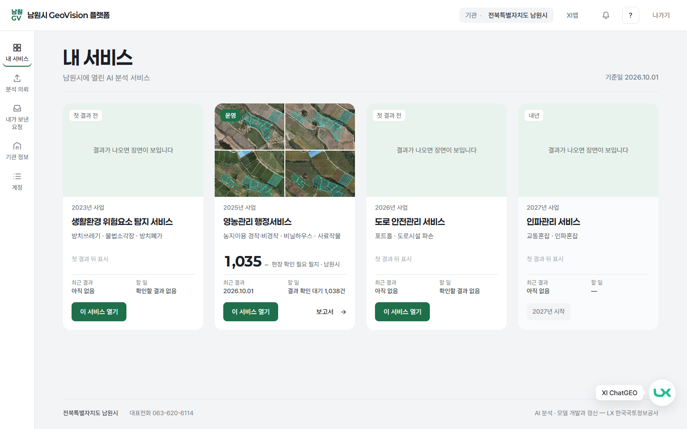 | 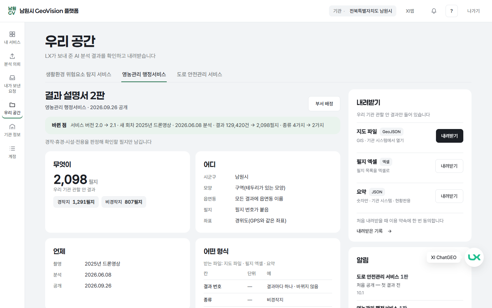 | 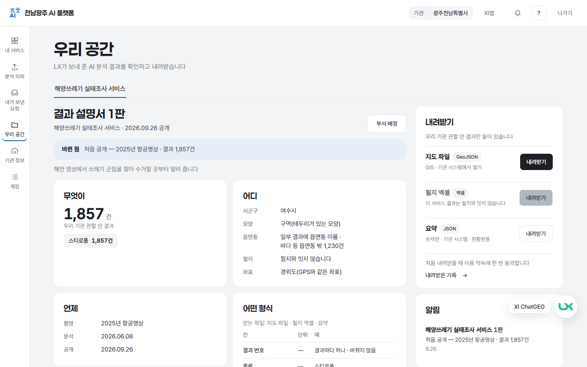 |

| 후 — 아래로(언제 · 어떤 형식 · 믿을 만한 정도 · 버전 · 알림) | 휴대폰 |
|---|---|
| 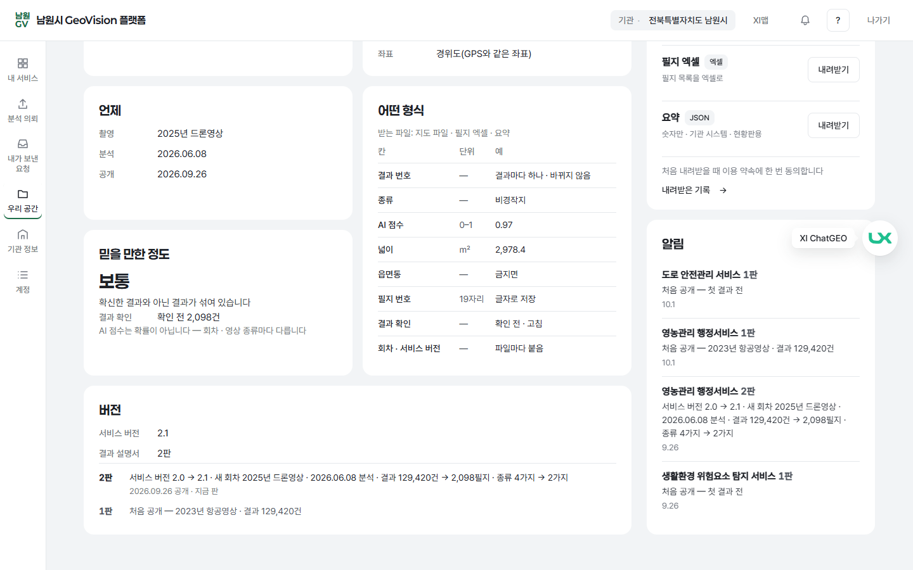 | 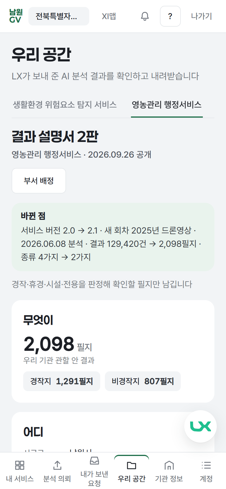 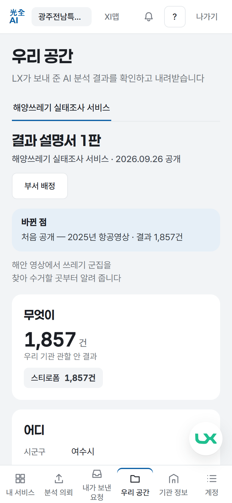 |

- 기관 왼쪽 메뉴에 '우리 공간' 한 칸(기존 메뉴 끝에 더함 · 다른 칸은 그대로). 위 탭 = 그 기관이 받은 1차 서비스(기관 서비스 선택에 켜진 서비스와 같음 — 남원시 셋 · 광주전남 하나).
- 결과 설명서 여섯 칸:
  | 칸 | 무엇이 나오나 |
  |---|---|
  | 무엇이 | 우리 기관 관할 안 결과 수 · 종류별 개수(경작지 1,291필지 · 비경작지 807필지 / 스티로폼 1,857건) |
  | 어디 | 시군구 · 모양 · 읍면동 이름이 붙었는지(바다 등 읍면동 밖 몇 건) · 필지 번호가 붙었는지 · 좌표(경위도) |
  | 언제 | 촬영(2025년 드론영상) · 분석한 날 · 공개한 날 — 모두 기록에서(기록이 없으면 '기록 없음') |
  | 어떤 형식 | 받는 파일 셋 · 파일 속 칸(이름 · 단위 · 예) |
  | 믿을 만한 정도 | 점수 대신 높음 · 보통 · 낮음 + 한 줄 뜻(광주전남 해양쓰레기 = 낮음 '다른 회차와 점수를 그대로 견주지 마십시오') · 결과 확인(확인 전 · 고침) |
  | 버전 | 서비스 버전 · 결과 설명서 몇 판 · 지난 판과 바뀐 점 |
- 설명서는 사람이 쓰지 않는다. LX가 그 기관에 서비스를 공개하거나 새 회차 · 새 서비스 버전이 나오면 서버가 기록에서 저절로 새 판을 만들고, 앞 판과 견준 '바뀐 점' 한 줄을 붙인다(예: 서비스 버전 2.0 → 2.1 · 새 회차 2025년 드론영상 · 2026.06.08 분석 · 결과 129,420건 → 2,098필지 · 종류 4가지 → 2가지). 되돌리면 새 판을 만들지 않고 그 판으로 돌아간다.
- 지난 공개분도 한 번 채웠다(백필): 남원 영농관리 1판 = 직전 회차(2023년 항공영상), 2판 = 지금 회차(2025년 드론영상). 결과가 아직 없는 서비스(생활환경 · 도로안전)는 '처음 공개 — 첫 결과 전' 1판.
- 숫자 한 출처: 남원 영농 2,098필지 · 광주전남 해양쓰레기 1,857건 = 서비스 대시보드 · LX 화면의 같은 값.

## 2. 내려받기 세 가지 — 관할 안만 · 처음 한 번 동의 · 기록
| 처음 받을 때 이용 약속(남원) | 같은 창(광주전남) | 휴대폰 — 필지와 잇지 않는 결과 |
|---|---|---|
| 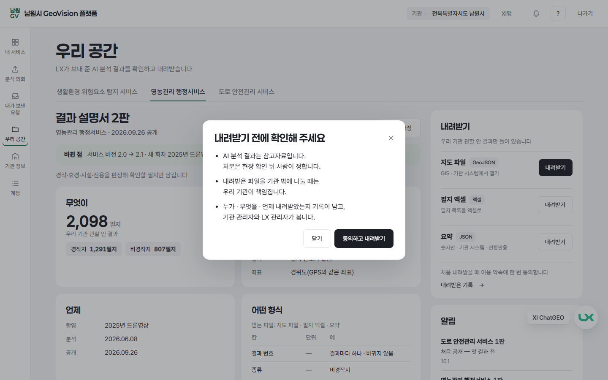 | 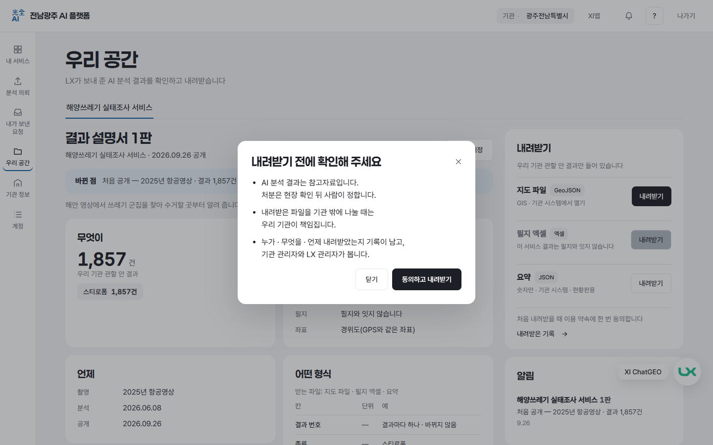 | 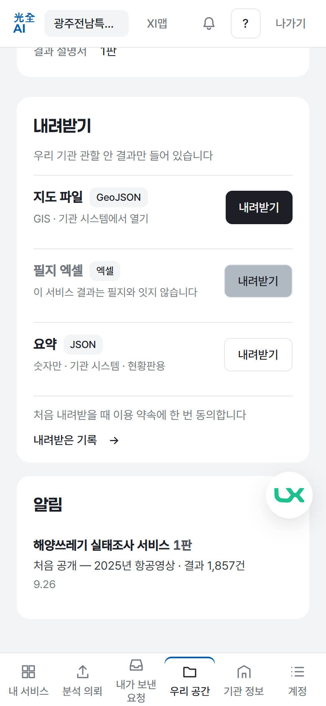 |

- 지도 파일(GeoJSON) · 필지 엑셀 · 요약(숫자만). 모든 파일에 기관 · 서비스 · 판 · 회차 · 서비스 버전 · '참고자료' 안내가 붙고, 내부 값(작업 번호 · 조각 번호 등)은 빠진다.
- 관할 밖 0: 읍면동 · 필지 번호로 관할을 가르고, 그것이 없는 결과(바다 등)는 결과 모양의 한 점으로 관할 땅 · 연안 바다 안인지 서버가 판정한다. 다른 기관 서비스는 설명서도 파일도 '없는 서비스'.
- 필지 엑셀: 필지 번호는 글자로 저장(엑셀이 숫자로 바꾸지 않게) · '열 설명' · '안내' 장. 바다 결과처럼 필지와 잇지 않으면 그 자리에 이유 한 줄('이 서비스 결과는 필지와 잇지 않습니다').
- 내려받기 정책: 처음 한 번 이용 약속 세 줄에 동의 → 누가 · 무엇을 · 언제 받았는지 공간 기록에 남고, 기관 관리자는 '내려받은 기록'으로, LX 관리자는 기관 공간 서랍으로 본다.

## 3. 공간 안 알림 · 부서 사용자
| 부서 배정(기관 관리자) | 알림(휴대폰) | 결과 전 서비스의 설명서 |
|---|---|---|
| 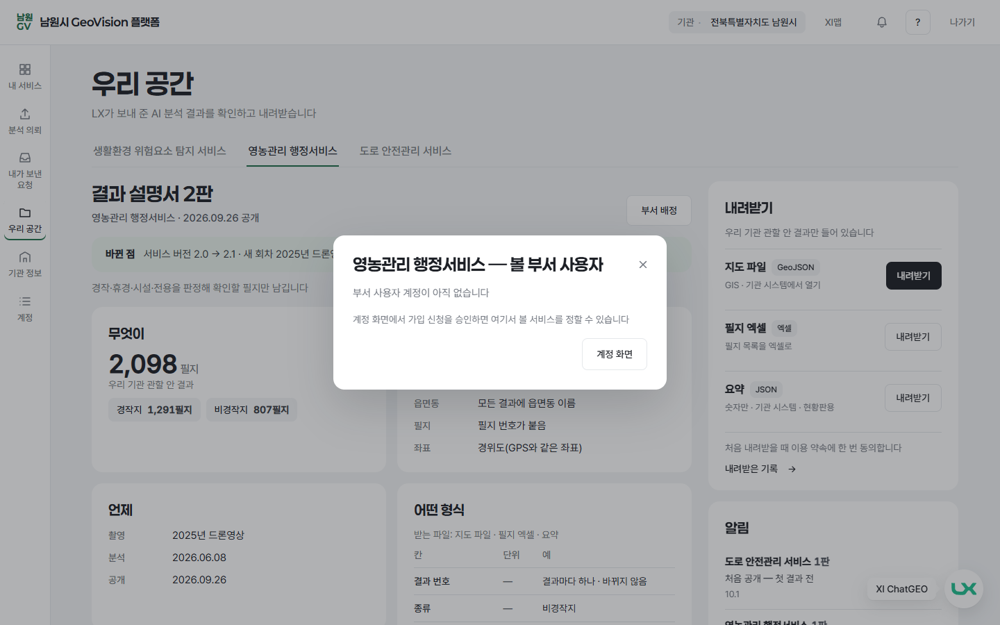 | 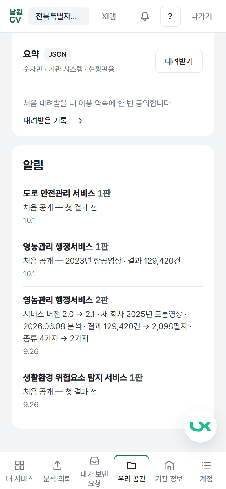 | 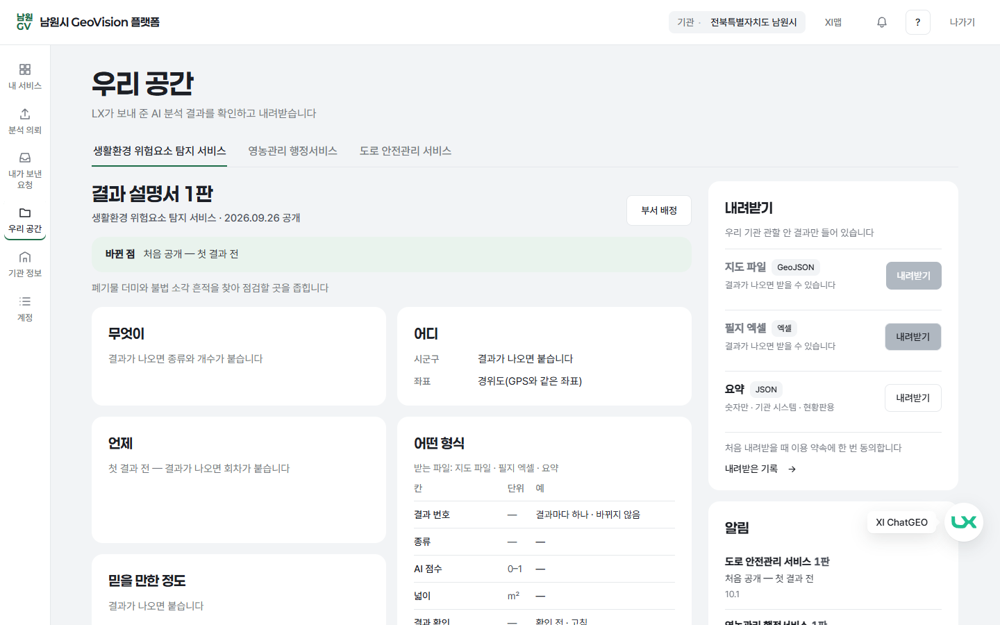 |

- 새 판이 생기면: 우리 공간 위에 '새 결과 설명서' 한 줄 + 탭에 점 + 오른쪽 '알림'에 바뀐 점 한 줄. 다음에 열면 점이 꺼진다. 지금은 공간을 만든 뒤 새 회차가 공개되지 않아 '새' 표시가 화면에 없다 — 새 회차 → 새 판 → 알림은 자동 시험으로 확인했다.
- 기관 관리자 = 받은 서비스 전부 + '부서 배정'(그 서비스를 볼 부서 사용자 고르기) + '내려받은 기록'. 부서 사용자 = 정해 준 서비스만(다른 서비스는 '없는 서비스') · 정해 준 서비스가 없으면 '아직 맡은 서비스가 없습니다'. 지금 남원시 · 광주전남에는 부서 사용자 계정이 없어 배정 창이 '계정 화면'으로 안내한다.

## 4. [Land-XI] LX 관리자 대시보드 → 기관 → '기관 공간' 탭
| 전 — 기관별 사용량 카드만 | 후 — 기관 공간 목록 | 후 — 한 줄을 누르면 서랍 | 휴대폰 |
|---|---|---|---|
| 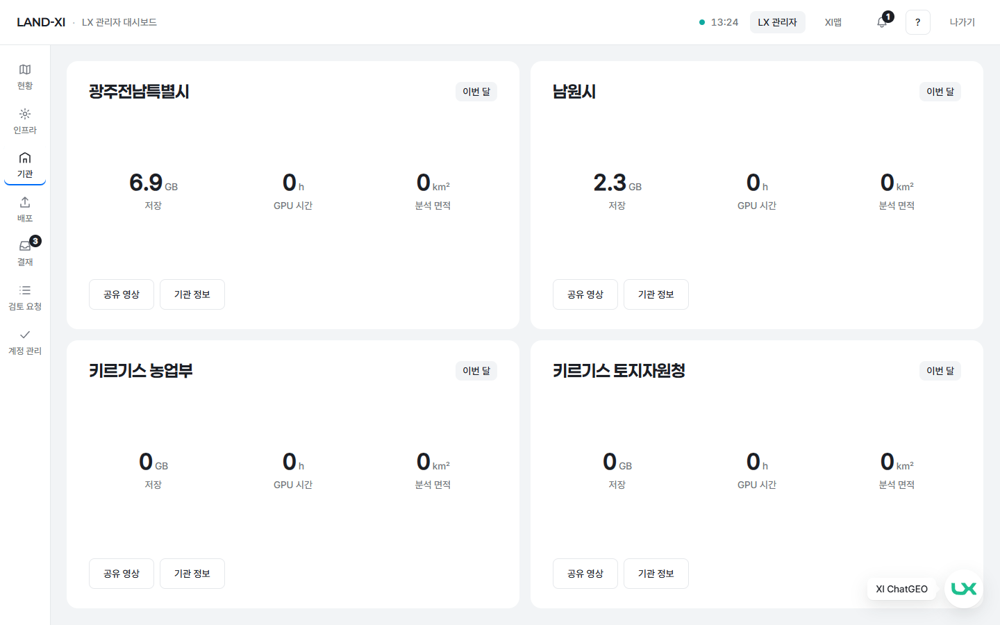 | 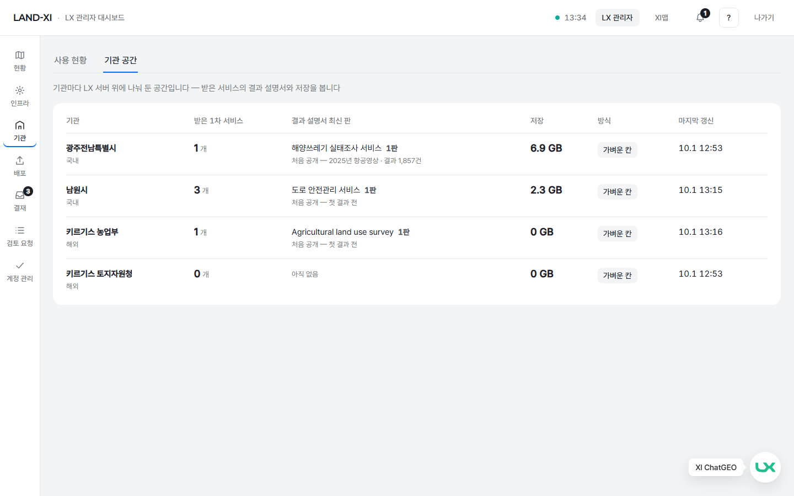 | 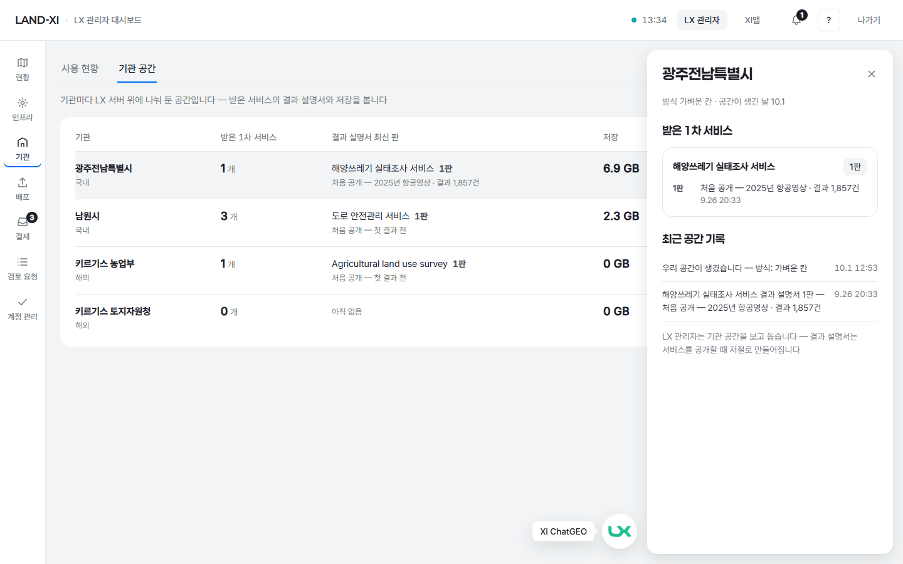 | 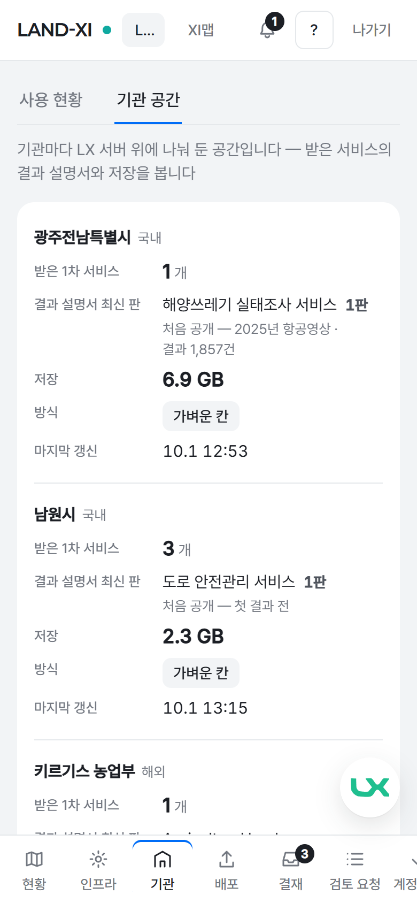 |

- 기관 화면 위에 탭 둘(사용 현황 · 기관 공간) — 새 큰 화면을 만들지 않았다. 사용 현황 탭은 전과 같다.
- 기관마다 한 줄: 받은 1차 서비스 수 · 결과 설명서 최신 판(바뀐 점 한 줄) · 저장 · 방식(가벼운 칸) · 마지막 갱신. 저장 = 사용 현황 탭 기관 카드의 '저장'과 같은 값(남원시 2.3 GB · 광주전남 6.9 GB — 캡처 시각 값).
- 서랍: 서비스별 판 기록(바뀐 점 · 날짜) · 최근 공간 기록. LX 관리자는 보고 돕기만 한다 — 고치는 단추 없음(결과 설명서는 공개할 때 저절로).
- 가벼운 칸(모든 기관 · 기관을 처음 볼 때 저절로 생김): 자료 칸(데이터베이스 안 기관 전용 칸 — 2단의 기관 자료 · 2차 결과 자리, 지금은 빈 칸) · 저장 폴더(결과 설명서 판이 파일로도 한 벌씩 남음 · 그 기관 '저장'에 더해짐) · 공간 기록(공간 생김 · 새 판 · 내려받기 · 동의 · 부서 배정).

## 2단으로 남긴 것(이번에 만들지 않음 · 화면에 자리도 없음)
- 상자(필요한 기관만 별도 실행 공간) · 코드 2차 올리기 · 자동 점검 다섯 · LX 관리자 승인 · 자원 배정 · 끄기 · 폐기.
- 기관 '내 서비스'의 2차 서비스 칸(2차가 아직 없음 — 카드 부품의 2차 모양은 그대로 둠).
- 서비스별 키(API 키 — 보류) · 공간 안 결과 받기 · 시험판 · 다음 바뀜 예고.
- 기관 자료 올리기(해류 예보 · 직불 신청 명단 등)와 공간 사용 현황(이번 달 2차 실행 · 저장).
- 해외 기관 영어 화면(서버는 해외 기관도 같은 공간을 만든다 — 화면은 한국어만).

## 시험
- 새 서버 시험 `server/tests/test_impl3_spaces.py` 11건 통과: 받은 서비스마다 설명서 · 여섯 칸 · 바뀐 점(남원 · 광주전남) / 설명서 숫자 = 대표 수치 요약 / 새 회차 → 새 판 + 알림 · 되돌리면 그 판(새 판 없음) · 지난 공개분 채우기 / 가벼운 칸(공간 줄 · 자료 칸 · 저장 폴더) / 관할 판정(남원 점 · 여수 앞바다 점 · 서울 점) / 다른 기관 설명서 · 파일 0(404) / 지도 파일 = 관할 안 · 서로의 결과 0 / 필지 엑셀(글자 필지 번호 · 관할 안 · 열 설명) · 바다 결과는 막힘 · 요약 숫자 같음 · 내려받은 기록 / 부서 사용자(정해 준 서비스만 · 동의 전 409 · 다른 기관 사람 · 받지 않은 서비스 배정 불가) / LX 관리자 목록(저장 = 사용 현황 같은 값 · 기관 세션 403).
- 새 화면 시험 `tests/e2e/impl3-space.spec.mjs` 3건 통과: 남원 · 광주전남 우리 공간(메뉴 → 탭 = 켜진 서비스 · 여섯 칸 · 숫자 한 출처 · 금지어 0 · 동의 → 내려받기 · 다른 기관 0) / LX 관리자 기관 공간 탭(머리 · 두 기관 · 저장 같은 값 · 서랍).
- 기존 시험: 서버 사용량 · 브랜드 · 대표 수치 · 계약 · 관문 · 관리자 · 정리 · 관할 · 검토 요청 시험 통과(65 + 50건). 화면 시험 정리 · 기관 분기 · LX 직원 메뉴 18건 통과. 따로 깨져 있던 것(이번 작업과 무관 · 손대지 않음): 계정 시험 7건(LX 직원 가입은 @lx.or.kr 만 — 10-01 결정 뒤 시험이 옛 메일을 씀) · 관문 시험 1건(공유 영상이 기관 지도에 보임 — 10-01 결정 뒤 시험이 옛 규칙).

## 확인 못 한 것(정직하게)
- 믿을 만한 정도의 세 말은 AI 점수 가운데값으로 정했다(0.6 이상 높음 · 0.35 이상 보통 · 그 아래 낮음 — 기본값, 서비스마다 다를 수 있어 확인이 필요하다).
- 공개한 날: 기록에 공개 결재가 없으면 비워 둔다(남원 도로안전 1판 · 영농관리 1판(직전 회차)). 남원 영농관리 1판의 '분석한 날'도 기록이 없어 비어 있다.
- 결과 종류의 한글 이름은 결과 파일의 영문 코드를 옮긴 것이 있다(스티로폼 등) — 정식 이름은 담당 프로젝트장이 정해야 한다.
- 화면 시험은 한 번 실행할 때 기관 관리자 계정에 '요약 내려받기' 기록 한 줄과 동의 한 건을 남긴다(서버 시험은 끝나면 지운다). 이번 캡처 전에 지웠다.
