# 구현 4차 · 못 한 요청 → 개선 후보 → '이제 됩니다' — 구현 확인 대기

> 2026-10-01 · 어느 플랫폼: **Land-XI 화면**(LX 관리자 대시보드 · LX 직원 요청함)과 **XI ChatGEO 채팅창**(로그인한 모든 화면 · 기관 분기 포함)
> 근거(사용자가 확인한 것만): 확인 요청 16차 **개선-1 확인** — "못 한 요청을 모아 '개선 후보'로 — 이 고리로". 원칙 98(못 한 것은 개선 재료) · 72(LX 관리자는 다 보고 돕는다) · 39(계정 범위 밖 0) · 59(개인정보는 정책과 함께).
> 채팅창 쪽(도움 안 됐어요 버튼 · 맨 위 한 줄 · 안내 줄)은 같은 시간에 채팅 갈래가 만들었고, 이 갈래는 서버 · 목록 화면 · 대장 잇기 · 90일 지우기를 만들었다.

## 한 줄
**XI ChatGEO 가 못 한 요청을 서버가 저절로 모아 비슷한 것끼리 묶고, LX 관리자 대시보드 → 배포 → '개선 후보' 탭에서 채택 · 보류 · 이미 됨을 고른다. 채택한 것이 만들어지면 '이제 됩니다 보내기' → 그 요청을 했던 사람이 다음에 채팅창을 열 때 맨 위에 한 줄이 보인다.**

## 한 바퀴를 실제로 돌린 기록(바깥 주소 · 로그인 폼 · 10-01 17:13–17:27)
| # | 누가 · 어디서 | 한 일 | 화면 |
|---|---|---|---|
| ① 막힌 요청 | LX 직원(test@lx.or.kr) · 첫 화면(지도 없음) | "지도 화면을 이미지로 저장해 줘" → 답 "이 화면에는 지도가 없어 그림 파일로 만들지 못했습니다. XI맵에서 크게 볼 수 있습니다." — 서버가 이 요청을 저절로 모음(요지 · 분류 '이 화면에 없음' · 역할 · 화면만) | 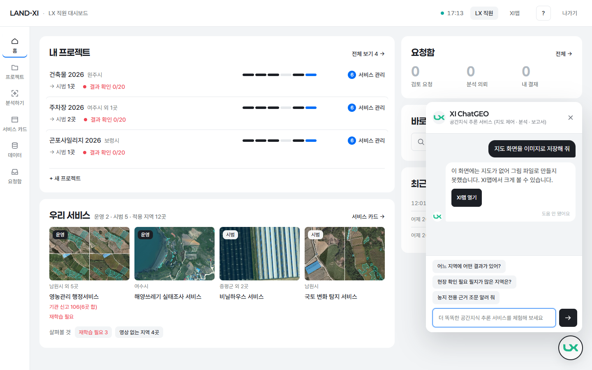 |
| ② 목록 | LX 관리자(lxadmin@lx.or.kr) · 배포 → 개선 후보 | 그 줄 "지도 화면을 이미지로 저장 · 2번 · LX 직원 · 첫 화면 · 이 화면에 없음"이 보임(옅은 색으로 표시한 줄) | 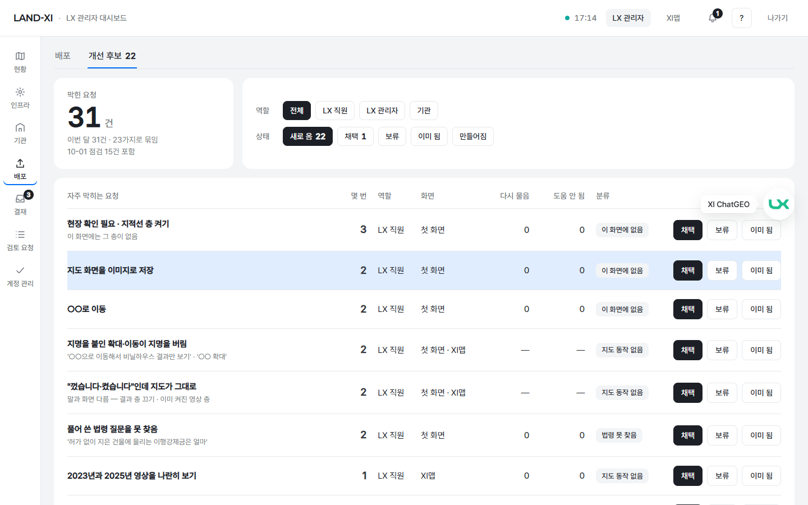 |
| ③ 채택 | LX 관리자 | 채택 → "채택 · 확인 대기" + 제안 방법 한 줄 · '이제 됩니다 보내기' 버튼이 생김. 확인 대장으로 옮길 목록에 바로 나타남(아래 ⑤) | 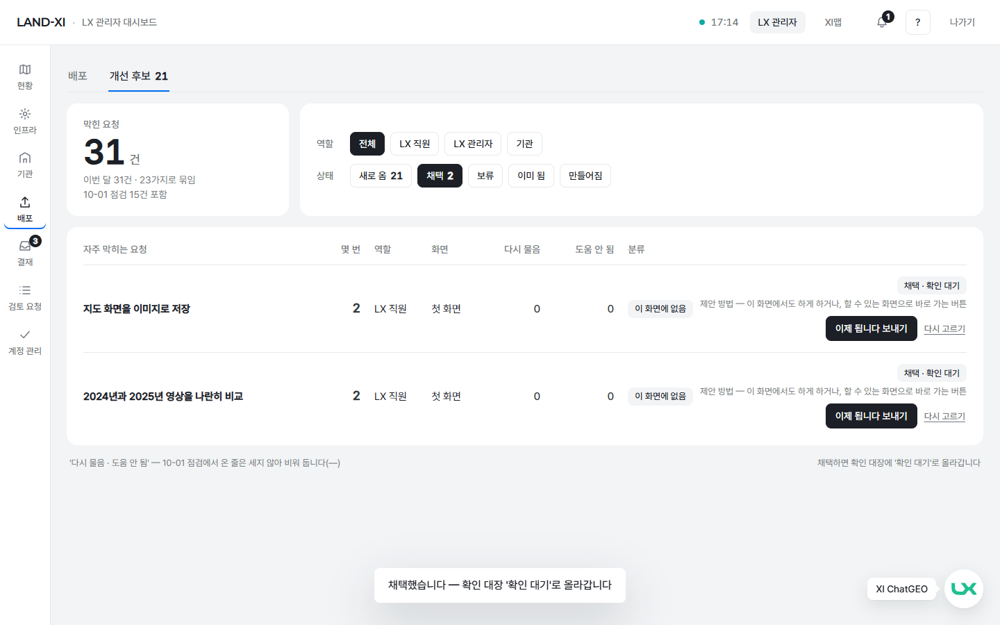 |
| ④ 만들어졌나 직접 확인 | LX 직원 · XI맵(남원시) | 같은 일을 지도가 있는 화면에서 "지금 보이는 지도를 그림 파일로 저장해 줘" → "지금 보이는 지도 한 장을 그림 파일로 만들었습니다(아래 내려받기)" — 실제로 그림 파일이 나옴. **되지 않으면 보내지 않도록** 돌렸다(아래 '첫 시도') | 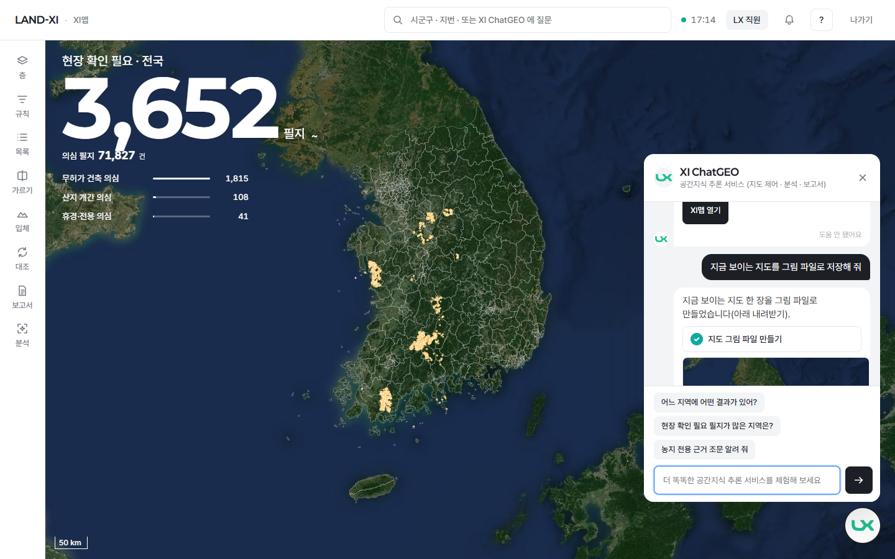 |
| ⑤ 이제 됩니다 보내기 | LX 관리자 | 창에서 한 줄과 '해 보기' 질문을 확인 → 보내기 → "1명에게 보냈습니다" · 줄은 "만들어짐 · 1명에게 '이제 됩니다' 보냄 · 10.1" | 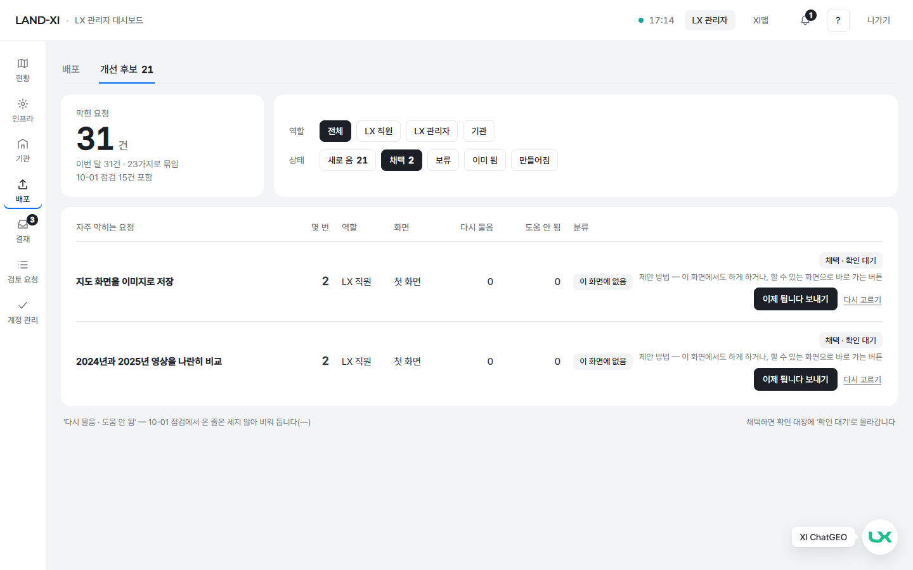 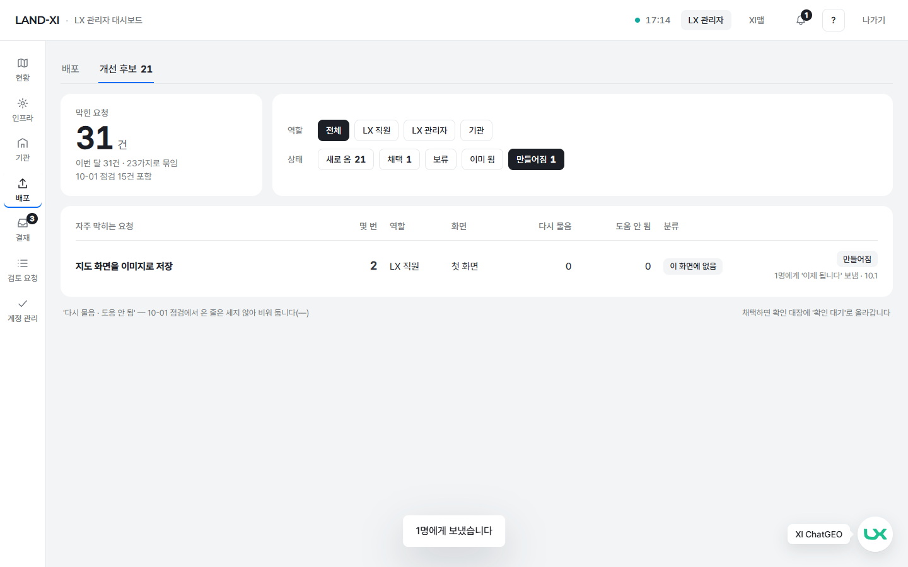 |
| ⑥ 채팅창 맨 위 한 줄 | LX 직원 · XI맵 · XI ChatGEO 를 다시 엶 | 맨 위에 "지난번에 물으신 '지도 화면을 이미지로 저장'이 이제 됩니다 — XI맵에서 해 보세요. [해 보기] ×" — 메일 · 문자 없음 | 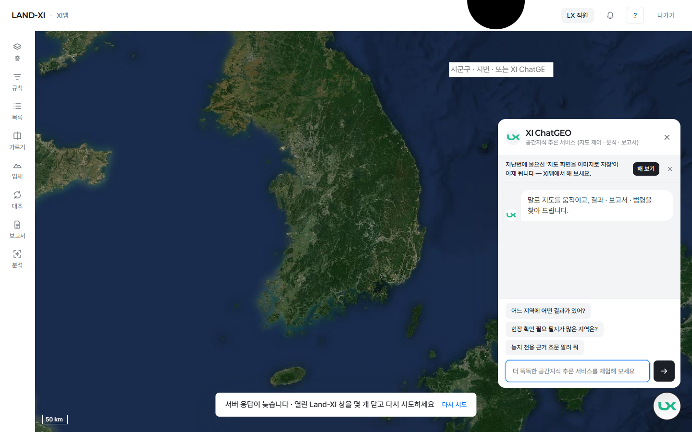 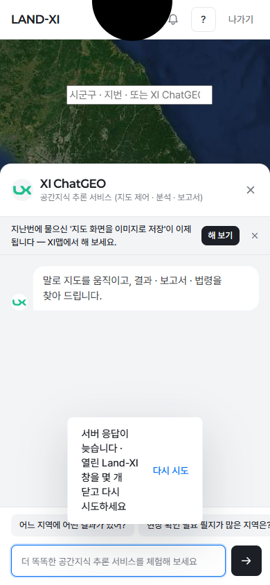 |
| ⑦ 해 보기 | LX 직원 | 누르면 그 질문이 바로 보내지고 그림 파일이 만들어짐 | 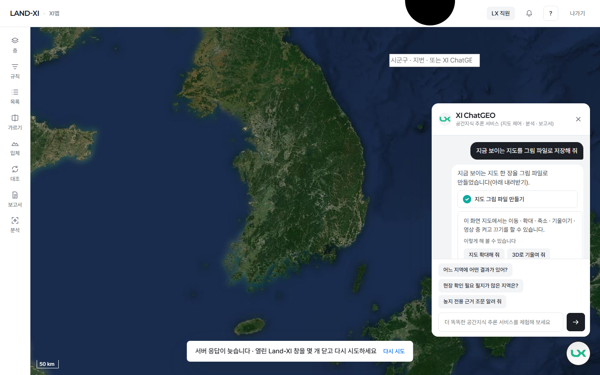 |

- **첫 시도는 일부러 멈췄다.** "2024년과 2025년 영상을 나란히 비교해 줘"로 같은 길을 돌렸는데, 지도가 있는 XI맵에서도 그때는 "어느 지역 영상을 비교할지 정하지 못했습니다"로 막혀 '이제 됩니다'를 보내지 않았다(캡처 `try1-loop-*`). 그 줄은 지금 "채택 · 확인 대기"로 남아 있고, XI맵에서 막힌 그 한 번도 새 막힌 요청으로 모였다. 시험 중에 고른 '채택'이므로 마음에 안 드시면 그 줄의 '다시 고르기'로 되돌리시면 됩니다.
- **한 줄 고침 한 번.** 처음 보낸 한 줄은 "…이 이제 XI맵에서 됩니다."였는데, 채팅창이 '이제 됩니다'라는 말이 붙어 있지 않은 한 줄을 요지로 보고 "지난번에 물으신 '…'가 이제 됩니다"로 한 번 더 감쌌다. 그 한 줄만 문구를 바꿔 다시 보이게 했다(감사 기록 남김). 채팅 갈래에 '서버가 준 한 줄은 그대로 보이기'를 전달 요청.
- 캡처 ②의 '2번'에는 같은 시간 채팅 갈래의 자동 시험 한 번이 들어 있었다. 시험 번호로 돈 답은 모으지 않도록 고치고 그 기록을 지워, 지금 그 줄은 1번이다.
- ⑥ 캡처 아래쪽 "서버 응답이 늦습니다" 알림은 그 시각 바깥 주소가 느렸던 XI맵 자체 알림이다(개선 고리와 무관).

## 10-01 정리 — 점검 · 시험이 만든 기록을 '시험'으로 표시(18:45)
채팅 갈래가 알려 온 점검 · 시험 시각(16:40–16:49 · 17:22–17:28 · 17:29–18:01 · 18:01–18:16 · 18:24–18:27)과 계정(test@lx.or.kr · lxadmin@lx.or.kr LX 관리자 · lxadmin@lx.or.kr 남원시)의 기록, 그리고 이 갈래가 한 바퀴를 돌리며 넣은 질문 셋(17:12–17:14)을 **지우지 않고 '시험'으로 표시**해 목록 · 횟수 · '이제 됩니다' 받는 사람에서 뺐다. 감사 기록 한 줄에 몇 줄을 표시했는지 남겼다.

| | 표시한 수 |
|---|---|
| 신호 | 118 (재측정 17:29–18:01 88 · 화면 시험 17:22–17:28 12 · 화면 시험 18:01–18:16 14 · 채팅창 흐름 시험 1 · 한 바퀴 시험 3 · 16:40–16:49 은 개선 고리를 켜기 전이라 0) |
| 물은 사람 | 23 (시험으로만 물은 사람 — '이제 됩니다'를 보내지 않음) |
| 감춘 줄 | 시험으로만 모인 '새로 온' 줄 15 |
| 남긴 줄 | 10-01 점검 첫 목록 12줄(점검 횟수 그대로) · #18 '2024년과 2025년 영상을 나란히 비교'(채택 · 확인 대기) · #23 '지도 화면을 이미지로 저장'(만들어짐) — 둘은 한 바퀴 시험으로 만든 줄이라 횟수 0, 줄 아래에 '시험으로 모인 줄 — 횟수에서 뺐습니다' |

정리 뒤 관리자 '개선 후보' 탭: **막힌 요청 24건 · 17줄**(새로 옴 15 · 채택 1 · 만들어짐 1 · 10-01 점검 15건 포함). 그 밖에 시각 · 계정이 목록에 없어 그대로 둔 것: 'sales@lx.or.kr'의 '이번 달 한도 늘려'(17:28 · 17:51 · 18:04 · 18:41 — 같은 초에 두 번씩 들어오는 자동 시험 꼴) · 남원시 '○○ 해안 쓰레기 몇 곳'(18:41) · test@lx.or.kr 의 확인 카드 취소 1번(17:21:55 — 화면 시험 시작 5초 전).
**두 번째 정리(18:55)** — 위 세 건도 같은 방법으로 '시험' 표시: 신호 14(sales@lx.or.kr '이번 달 한도 늘려' 12 · 남원시 '해안 쓰레기 몇 곳' 1 · test@ 확인 카드 취소 1) · 물은 사람 3 · 감사 기록 한 줄. 정리 뒤 탭: **막힌 요청 15건 · 14줄**(10-01 점검 첫 목록 12줄 + #18 채택 · #23 만들어짐 — 둘은 시험으로 모인 줄이라 횟수 0).

**시험 표시 없이 XI ChatGEO 를 부르는 시험 · 점검 스크립트(목록만 · 고치지 않음 — 다른 갈래 파일)** — 시험 표시(context.test → 답 번호 run_test…)를 달면 개선 고리가 모으지 않는다. 화면을 눌러 묻는 스크립트는 채팅 갈래의 점검 스크립트(impl-4/chat-rules · shoot · audit)처럼 질문 보내는 요청에 context.test 를 끼워 넣는 길로 맞출 수 있다.
| 스크립트 | 묻는 길 | 이번에 모인 것 |
|---|---|---|
| `server/tests/test_impl1_admin.py` — `_run_events`(LX 영업 '이번 달 한도 늘려 줘' 두 번) | 서버에 바로(질문 · 답 받기) | sales@ '이번 달 한도 늘려' — 같은 초 두 번씩 네 차례 |
| `server/tests/test_f3_server.py` — 남원시 '여수시 해안 쓰레기 몇 곳이야?' | 서버에 바로 | 남원시 '해안 쓰레기 몇 곳'(같은 꼴) |
| `docs/superpowers/final/process/impl-3/chat/e2e.mjs` | 채팅창 화면 + 서버 | — |
| `docs/superpowers/final/process/impl-3/shell/shoot.mjs` | 채팅창 추천 질문 누르기 | — |
| `docs/superpowers/final/process/design-r7/chatgeo-talk/audit.mjs`(10-01 실태 31문) | 채팅창 화면 | — |
| `tests/e2e/f2e-cmdk.spec.mjs` · `f2e-confirm.spec.mjs` · `f2e-law.spec.mjs` · `f2e-redteam.spec.mjs` · `f2e-unverified.spec.mjs` · `f2e-off.spec.mjs` · `f2e-unavailable.spec.mjs` | 옛 질문 창(Ctrl K)에 묻기 | — (답 서버가 켜져 있으면 모임) |
| `docs/superpowers/final/process/impl-4/improve/loop.mjs` · `notice.mjs`(이 갈래) | 채팅창 화면 | 한 바퀴 증명이라 일부러 표시 없이 돌림 — 돌린 뒤 '시험'으로 표시했다 |
(서버 안에서 돌리는 에이전트 시험 — `server/agent/tests/*` — 은 시험 번호(run_test0001 등)를 써서 모이지 않는다. `test_redteam.py` 의 서버 호출은 로그인 없는 401 확인이라 답이 생기지 않는다.)

앞으로: 채팅 쪽이 시험 · 점검 질문에 매기는 답 번호(run_test…)는 모이지 않고, 그 답에 붙은 화면 신호도 받지 않는다(실제로 한 번 물어 확인 — 답 번호 run_test… · 모인 신호 0).
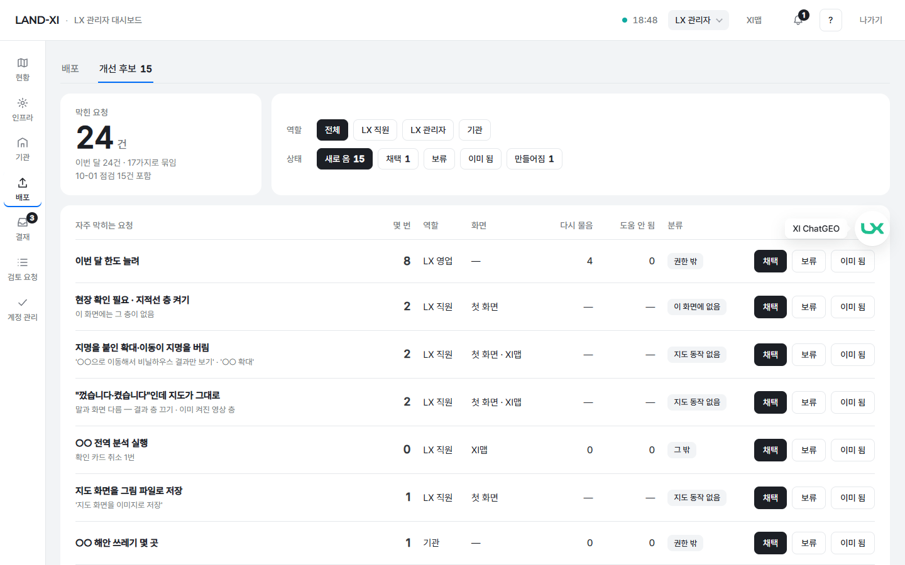 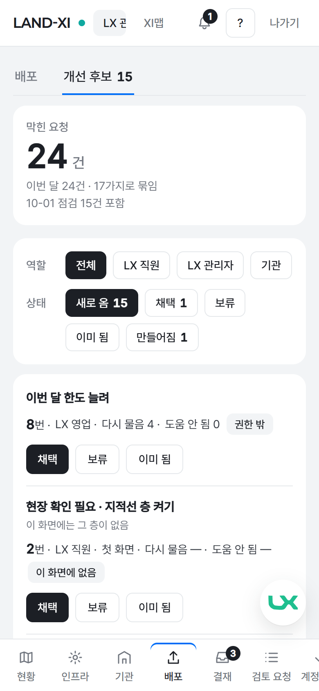 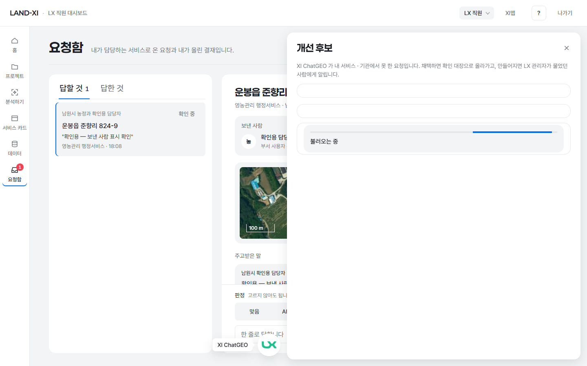 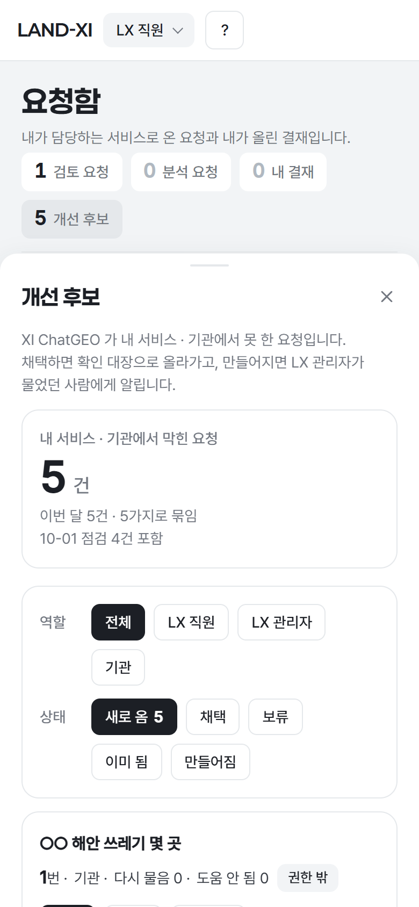

## 무엇을 만들었나
| 부분 | 모습 |
|---|---|
| 모으기(서버가 저절로) | XI ChatGEO 답이 끝날 때마다 — 못 한 요청(지도 동작 없음 · 이 화면에 없음 · 자료 없음 · 권한 밖 · 법령 못 찾음 · 필지 못 찾음 · 서버 응답 없음 · 그 밖), **3분 안에 같은 뜻으로 다시 물은 것**(다른 지역을 물으면 다른 질문), 확인 카드 취소. 채팅창이 보내는 '도움 안 됐어요' · 확인 카드 취소 · 지도에 못 그림도 받는다. 기록은 답을 보낸 뒤 따로 돌아 답이 늦어지지 않고, 기록이 실패해도 답은 그대로 나간다. 시험 번호로 도는 답은 모으지 않는다 |
| 남기는 것 | **대화 원문은 남기지 않는다.** 요지 한 줄(지명 · 지번 · 사람 이름 · 전화 · 메일 · 필지 번호는 '○○')과 분류 · 역할 · 화면 · 기관만. 누가 물었는지는 '이제 됩니다'를 보내기 위해서만 두고 **90일 지나면 지운다**(알림도 90일) |
| 묶기 | 규칙으로(분류 + 요지 낱말 — 조사 · 끝맺음 · 해 · 건수를 덜고 '이미지 = 그림'처럼 같은 말을 맞춤). 언어 모델 · GPU 를 쓰지 않는다 |
| 개선 후보 탭 | LX 관리자 대시보드 → 왼쪽 '배포' → 위 탭 **배포 · 개선 후보 n**(n = 새로 옴). 새 메뉴 없음. 왼쪽 위 큰 숫자 = 막힌 요청 몇 건(이번 달 · 몇 가지로 묶였나 · 10-01 점검 몇 건 포함), 오른쪽 위 = 역할 · 상태로 걸러 보기. 표 = 자주 막히는 요청(요지 + 한 줄) · 몇 번 · 역할 · 화면 · 다시 물음 · 도움 안 됨 · 분류 · 누르기 |
| 누를 것 | **채택**(한 번 누름 → '채택 · 확인 대기' + 제안 방법 한 줄) · **보류**(가운데 창: 사유 한 줄 + 다시 볼 날짜 — 그날이 되면 다시 새로 옴으로) · **이미 됨**(가운데 창: 안내 문구 한 줄 + 누르면 보낼 질문 — 다음부터 같은 요청이 막히면 그 답에 이 문구와 버튼이 바로 나감). 반려는 없다. 잘못 골랐으면 '다시 고르기'. 채택한 줄에는 LX 관리자만 '이제 됩니다 보내기' |
| 담당 프로젝트장 보기 | LX 직원 요청함 위 숫자 칸에 **개선 후보 n** 한 칸이 늘었다 → 누르면 오른쪽 서랍에 같은 모양(카드형). 보이는 것은 **내가 담당하는 서비스와 그 서비스를 받는 기관에서 온 것만**(담당 = 검토 요청과 같은 규칙). 채택 · 보류 · 이미 됨은 할 수 있고, '이제 됩니다'는 LX 관리자가 보낸다 |
| 이제 됩니다 | 그 요청을 했던 사람(90일 안)마다 한 줄. 다음에 채팅창을 열 때 맨 위 — 한 줄 + 해 보기 + 닫기. 기관 사용자에게도 같은 한 줄(자기 것만) |
| 확인 대장과 잇기 | '채택' = 서버에 '확인 대기'. 서버는 확인 대장 파일을 고치지 않고, **옮길 목록을 뽑는 도구**가 '채택됐지만 대장에 없는 것'(무엇 · 몇 번 · 역할 · 화면 · 제안 방법)과 대장에 그대로 붙일 표 줄을 낸다(아래). 대장에 옮긴 줄은 '개선 후보 #번호'로 알아본다 |
| 첫 목록 | 10-01 점검에서 막힌 15건 → 12줄을 출처 '10-01 점검'으로 넣었다. 횟수는 점검 값 그대로(2 · 2 · 2 · 1 × 9) · 때는 그 질문을 찍은 시각 · '다시 물음 · 도움 안 됨'은 세지 않아 '—' |
| 90일 지우기 | CPU 정기 작업(하루 한 번 · 작업기 여럿 중 하나만)으로 물은 사람 · 알림에서 90일 지난 줄을 지우고 지운 수를 감사 기록에 남긴다. GPU 0 |

## 전 / 후 캡처(로그인 폼 · 1440 · 390)
> '전'과 한 바퀴는 바깥 주소(app · admin.land-xi.dev)에서 찍었다. '후' 화면 캡처는 17:40–18:10 바깥 주소가 붐벼(이 PC 의 관문은 파일 하나 0.003초인데 바깥 길은 8–20초 — 접속 터널 쪽) 로그인 화면이 다 뜨지 않아, **이 PC 주소(같은 서버 · 같은 자료)**에서 18:10 에 찍었다. 바깥 주소 화면은 같은 파일을 내준다(17:08 바깥 주소에서 찍은 같은 화면은 표 버튼 줄바꿈을 고치기 전 판이라 바꿔 넣었다).
> 숫자는 찍은 때의 서버 값 그대로다 — 채팅 갈래가 같은 시간 실제 답 번호로 자동 점검을 돌려(같은 질문 수십 번) 막힌 요청이 빠르게 늘었다(17:27 54건 → 18:10 124건).
| 장면 | 전 | 후 |
|---|---|---|
| LX 관리자 배포 화면 — 배포 표만 → 위에 **배포 · 개선 후보 n** 탭 | 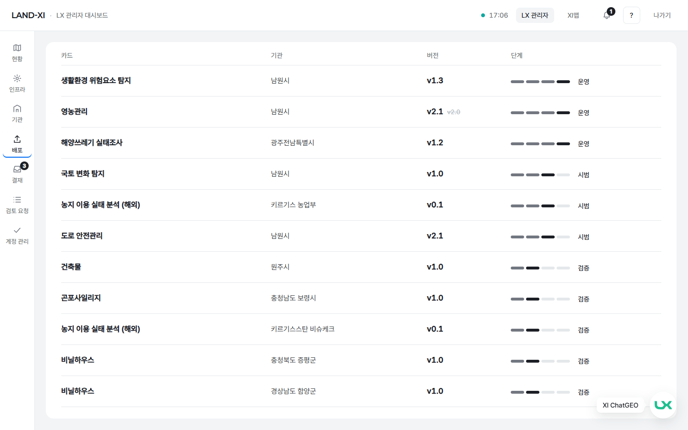 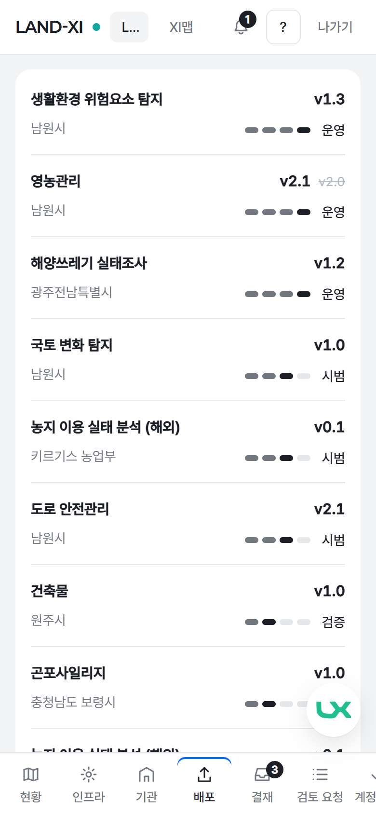 | 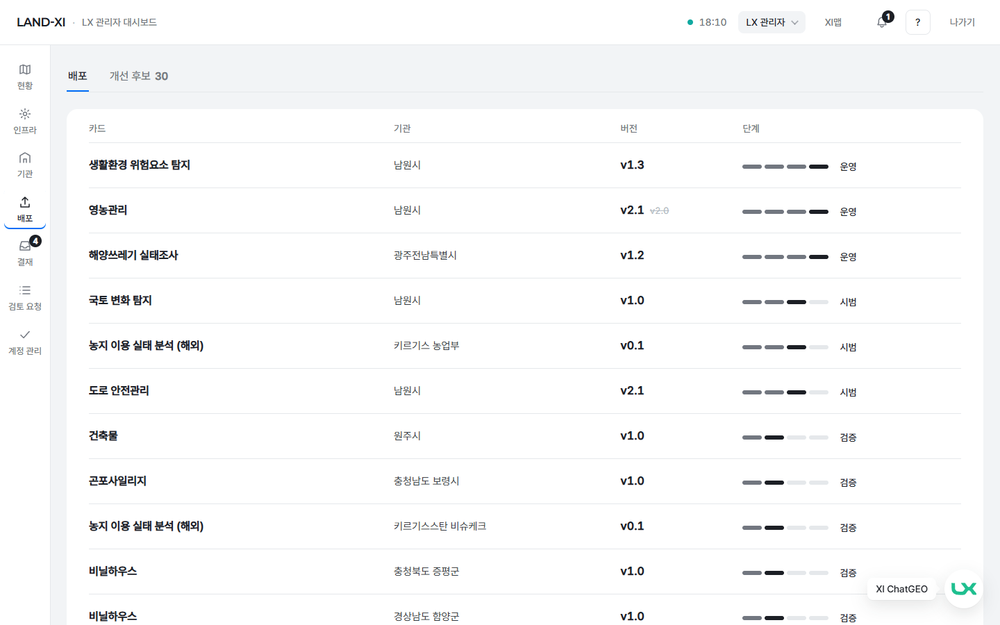 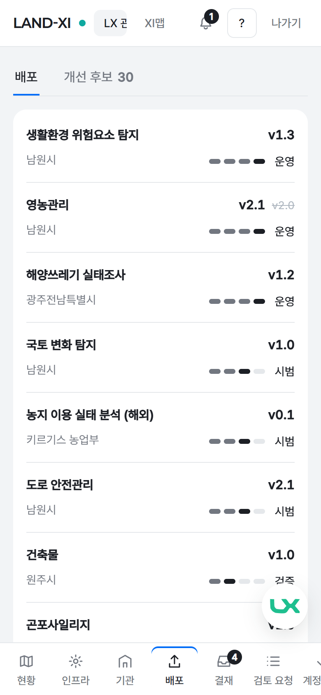 |
| 개선 후보 탭 | (없음) | 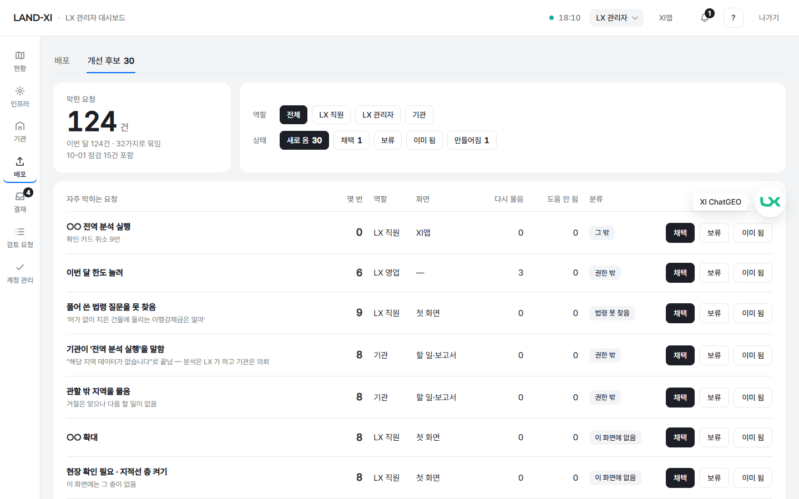 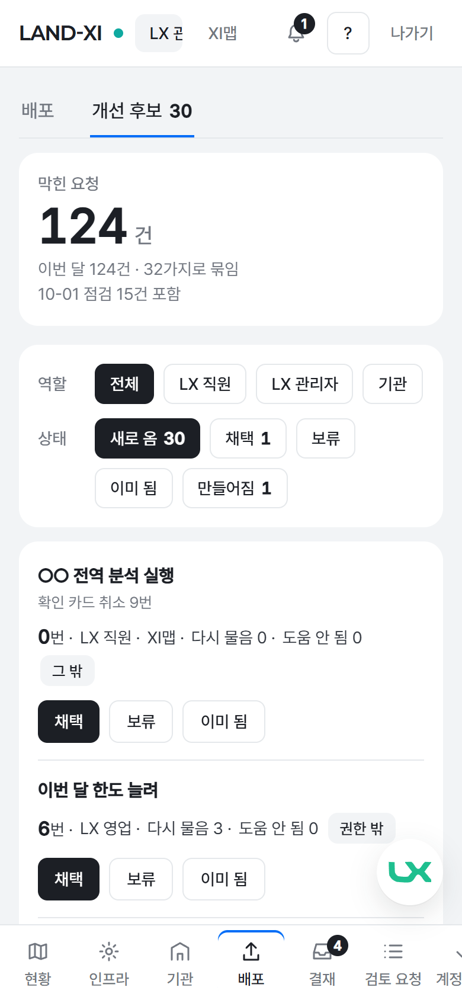 |
| 보류 · 이미 됨 창 | (없음) | 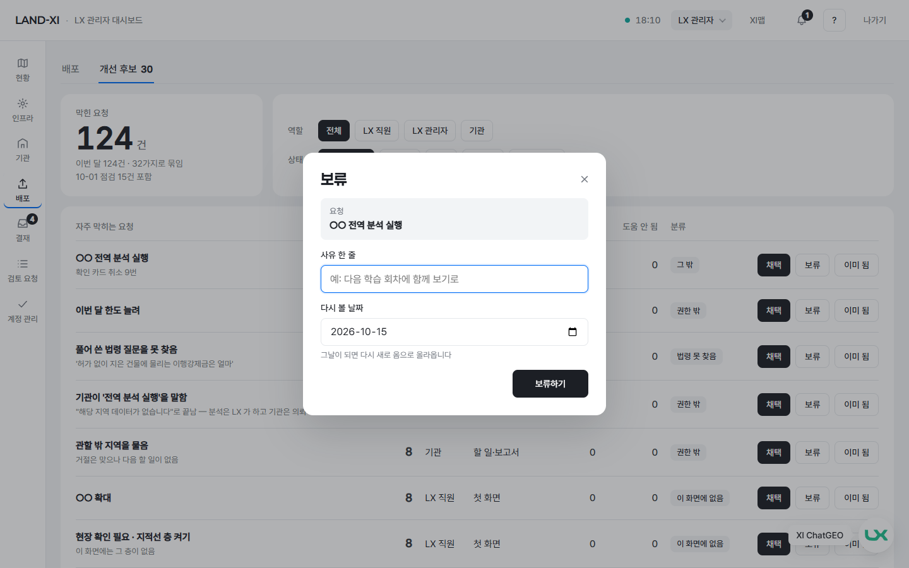 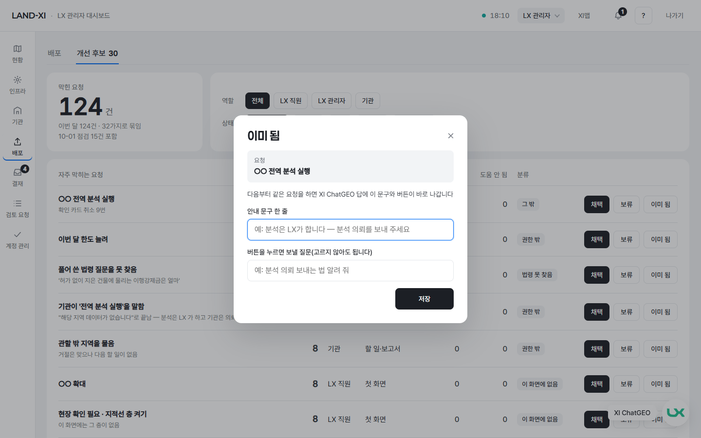 |
| LX 직원 요청함 — 숫자 셋 → **개선 후보** 칸 하나 더 · 누르면 서랍 | 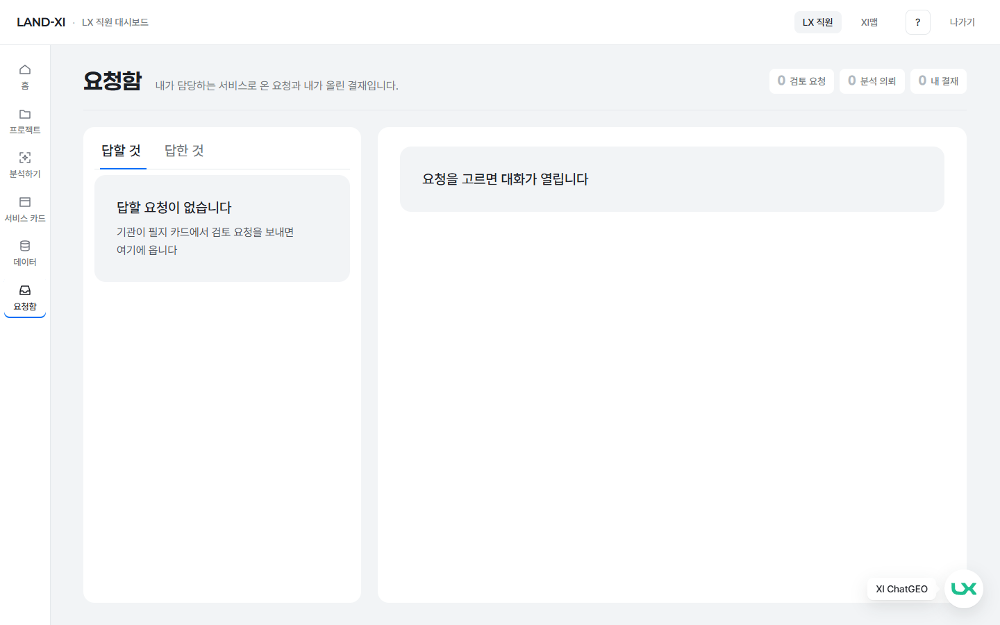 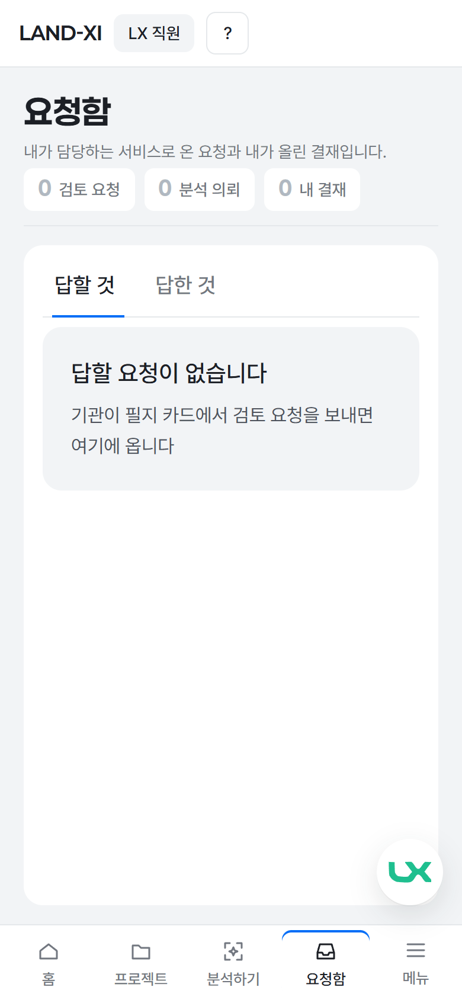 | 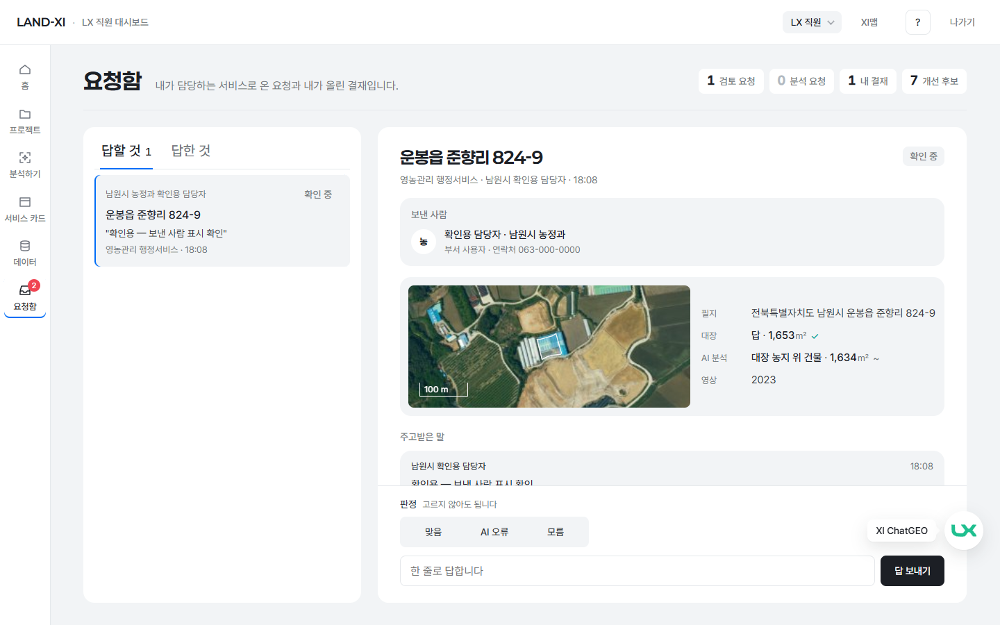 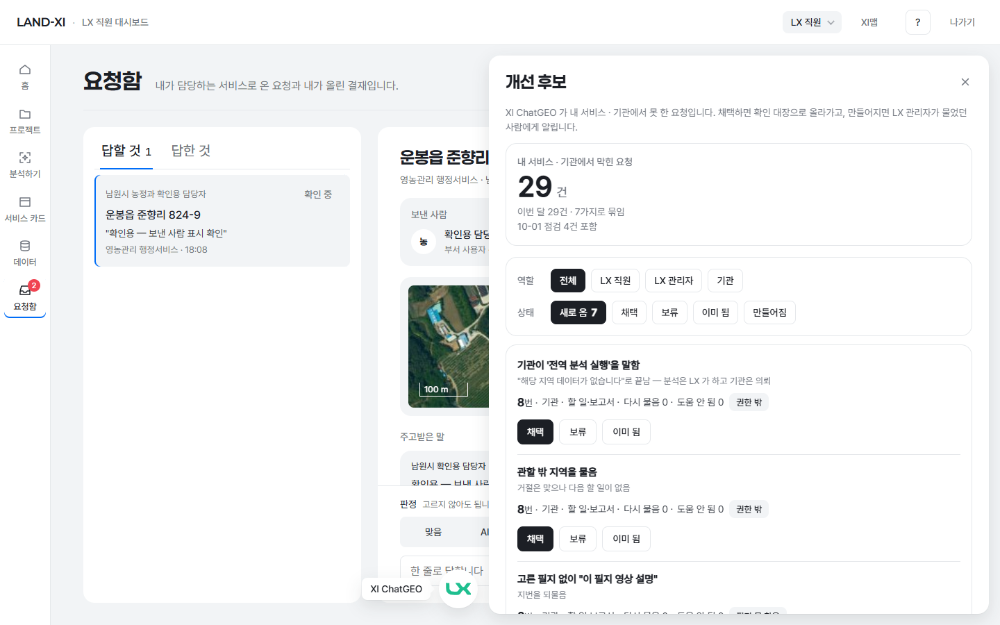 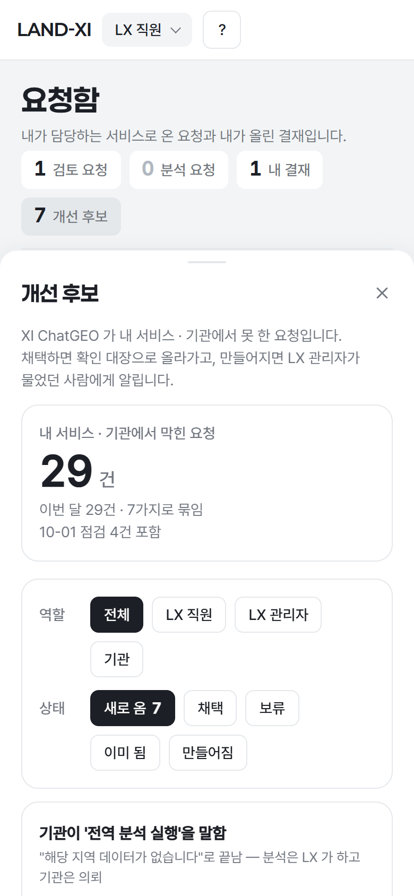 |

## 확인 대장으로 옮길 목록(채택 → 확인 대기)
지금(17:27) 뽑은 결과 — `pull-output.txt`
```
채택됐지만 확인 대장에 없는 개선 후보 1건
#18  2024년과 2025년 영상을 나란히 비교
  무엇: XI ChatGEO 가 못 한 요청 — 분류 '이 화면에 없음'
  몇 번: 막힘 3 · 다시 물음 0 · 도움 안 됨 0
  역할: LX 직원   화면: 첫 화면
  제안 방법: 이 화면에서도 하게 하거나, 할 수 있는 화면으로 바로 가는 버튼
| 개선-? | [화면][Land-XI] 2024년과 2025년 영상을 나란히 비교 — 개선 후보 #18 | 확인 대기 | 막힘 3번 · LX 직원 · 첫 화면 · 제안: … |
```
(만들어져 '이제 됩니다'까지 보낸 #23 은 '채택'이 아니라 '만들어짐'이라 목록에 나오지 않는다 — 모두 보려면 `--all`.)

## 개인정보 — 원문 0 · 가림 · 90일(시험으로 증명)
- **가림 시험** — 지명(시군구 · 읍면동 · 리 · 해외 지명 · '종로1가' 꼴) · 지번(산 12-3 · 123-45 · 번지) · 필지 번호 19자리 · 사람 이름(계정 이름 · '○○ 주무관/님') · 전화 · 메일이 요지에서 모두 '○○'. 해 · 건수 · 넓이 · '이동 · 화면 · 우리 시' 같은 흔한 말은 그대로.
- **원문 0 시험** — "남원시 운봉읍 산내면 대정리 123-4 김도윤 010-…-… 메일 필지 번호 Bishkek …" 같은 질문을 실제 기록 길로 넣고, 개선 표 네 개 어디에도 그 글자들이 없는지 확인.
- **운영 기록 훑기**(17:27) — 개선 표의 요지 · 비고 · 알림 99줄을 지명 사전 · 전화 · 메일 · 지번 꼴로 다시 훑어 **의심 0**. 3분 다시 물음 비교용 기록은 낱말의 짧은 해시와 가린 요지만, 3분 뒤 사라진다.
- **90일 지우기 시험** — 운영 표는 **보기만**(지울 수만 셈 · 지우지 않음) → 같은 모양의 **사본 표**에 91일 · 89일 지난 줄을 넣고 실제로 돌려 91일 줄만 지워진 것을 확인 · 운영 표 줄 수는 그대로.
- 기관 계정은 '이제 됩니다' · 신호 모두 자기 것만(다른 기관 · LX 답에 '도움 안 됐어요'를 보내면 '없는 답'과 같은 답). 개선 후보 목록은 LX 만 본다(기관 · 영업 계정은 열 수 없음).

## 시험
- 서버 시험 14개 통과(시험 표시는 목록 · 횟수에서 빠짐 · 채팅 쪽 시험 답 번호(run_test…)는 모이지 않음 · 가림 · 묶기 · 분류 · 원문 0 · 다시 물음(3분 · 다른 지역은 아님) · 시험 번호는 모으지 않음 · 이미 됨 안내가 답에 실림(된 답에는 안 실림) · 목록 범위(관리자 전부 · 직원 담당분 · 기관 · 영업 · 로그인 전 0) · 보류(사유 · 날짜 · 다시 볼 날 새로 옴) · 채택 · 이제 됩니다(관리자만 · 물은 사람에게만 · 본 것 처리) · 이미 됨 · 다시 고르기 · 화면 신호(기관은 자기 답만) · 90일).
- 화면: 1440 · 390 캡처에서 줄바꿈(가운뎃점이 줄 머리로 가지 않게 · 숫자와 '번'이 갈라지지 않게)을 고쳐 다시 찍음. 금지어 검사 0 · 콘솔 오류 0.

## 확인 못 한 것 · 남은 것(정직)
- **'이미 됨' 안내가 실제 답에 나가는 화면 캡처는 없다** — 서버가 같은 요청의 막힌 답에 안내 문구와 버튼을 싣는 것은 시험으로 확인했고 채팅창도 그 칸을 그린다. 지금 '이미 됨'으로 고른 줄이 없어(고르는 것은 LX 관리자 몫) 실제 화면으로는 찍지 않았다.
- **90일 정기 작업은 다음 작업기 재기동 때부터 돈다** — 돌던 분석 작업을 끊지 않으려고 작업기를 다시 띄우지 않았다(가장 이른 지울 날은 12-30).
- 화면 이름은 채팅창이 알려 주는 화면(첫 화면 · XI맵 · 할 일·보고서 …)으로 남는다. 채팅창이 화면을 알리지 않은 예전 답은 '—'.
- 채팅 갈래의 점검 · 시험 기록과 자동 시험 기록은 18:45 · 18:55 에 '시험'으로 표시해 뺐다(위 '10-01 정리'). 시험 표시 없이 묻는 스크립트 목록은 위에 — 그 갈래들이 맞추기 전까지는 돌릴 때마다 다시 모인다.

## 다시 돌리기
- 캡처: `node docs/superpowers/final/process/impl-4/improve/shoot.mjs --tag after` · 한 바퀴: `loop.mjs` · 맨 위 한 줄만: `notice.mjs` (로그인 폼 · 비밀번호는 서버 설정 파일에서 읽고 출력하지 않음)
- 옮길 목록: `python tools/review/pull-improvements.py` (`--json` · `--all`)
- 시험: `python -m pytest server/tests/test_impl4_improve.py -q`
