# 구현 4차 · 프로젝트 목록과 대시보드 — 진행 막대와 막힌 곳 (구현 확인 대기)

> 2026-10-01 · 어느 플랫폼: **Land-XI 화면**(LX 직원 · 프로젝트 목록 · 대시보드 '내 프로젝트')
> 근거(사용자가 확인한 것만): 제안 2 **S-14 — ⓑ 진행 막대 + 막힌 곳만**("걸러 보기는 나중에")

## 한 줄
**프로젝트 목록의 '지금 단계' 글자 칸이 6칸 진행 막대로 바뀌었고, '막힌 곳' 한 칸이 생겼습니다. 네 프로젝트 모두 '서비스 관리'로 보였지만 실제로는 결과 확인이 0/20이라는 것이 이제 한눈에 보입니다.**

## 대시보드 '내 프로젝트'도 같은 부품으로(추가)
같은 프로젝트가 두 화면에서 다르게 보이지 않도록, 대시보드 '내 프로젝트' 줄의 막대를 **프로젝트 목록과 같은 부품**으로 바꿨습니다.
- 막대: 칸 상태를 서버가 목록에 주는 값 그대로 칠합니다(건너뛴 칸도 대시보드에서 속 빈 테두리). 전에는 프로젝트마다 한 장을 따로 불러 칠했고 건너뛴 칸이 없었습니다.
- 막힌 곳: 각 줄의 '→ 다음 할 일' 옆에 같은 규칙 · 같은 모양으로 한 줄(없으면 안 보임). 휴대폰에서도 같습니다.
- 대시보드의 다른 칸(요청함 · 우리 서비스 · 바로 분석하기 · 최근 활동)은 그대로입니다.

## 무엇이 바뀌었나
| 부분 | 모습 |
|---|---|
| 진행 | 6칸 막대 — 끝난 칸 검정 · 지금 칸 파랑 · 남은 칸 회색 · 건너뛴 칸(해외 지역만 있는 프로젝트의 결과 확인)은 속이 빈 테두리. 막대 밑에 지금 단계(번호 · 이름). 칸에 마우스를 올리면 그 단계 이름과 상태. 대시보드 '내 프로젝트' 막대와 같은 모양이고, 칸 상태는 프로젝트 한 장의 단계 판정과 같은 값입니다 |
| 막힌 곳 | 앞 단계가 남았거나(예: **결과 확인 0/20**) · 결재 대기(노란 점) · 반려(빨간 글자)인 것을 한 줄로. 막힌 것이 없으면 —. 여러 개면 '외 1건'. 순서는 내가 손댈 것부터 — 반려, 앞 단계 남음, 결재 대기 |
| 열 | 이름 · 진행 · 다음 할 일 · 막힌 곳 · 무엇을 · 어디 · 마지막 활동(참여한 · 전체 묶음에는 프로젝트장). 시안대로 '무엇을'과 '어디'를 한 칸으로 합쳤습니다 |
| 보관 묶음 | 막대 대신 '보관'(끝난 프로젝트라 지금 칸 · 막힌 곳이 뜻이 없음) |
| 휴대폰 | 표가 아니라 프로젝트마다 한 장 — 이름과 마지막 활동 · 무엇을 · 어디 · 막대 · 막힌 곳 · 다음 할 일. 막힌 곳이 없으면 그 줄이 사라집니다. 가로 넘침 없음 |
| 없는 것 | 걸러 보기(무엇을 · 어디 · 상태 칩)는 만들지 않았습니다(나중) |

## 네 프로젝트가 실제로 어떻게 나오나(서버 값 · 10-01 16:40)
| 프로젝트 | 진행 막대 | 지금 단계 | 막힌 곳 |
|---|---|---|---|
| 건축물 2026 | 끝 · 끝 · 끝 · 빔 · 끝 · 지금 | 6 서비스 관리 | 결과 확인 0/20 |
| 주차장 2026 | 같음 | 6 서비스 관리 | 결과 확인 0/20 |
| 곤포사일리지 2026 | 같음 | 6 서비스 관리 | 결과 확인 0/20 |
| 비닐하우스 2026 | 같음 | 6 서비스 관리 | 결과 확인 0/20 |

## 결재 대기 · 반려는 어떻게 나오나(실제 서버 값으로 잠깐 만들어 찍고 지움)
시험 프로젝트 셋(이름 끝에 '곧 지움')을 만들어 하나는 공개 결재를 올려 둔 채, 하나는 관리자가 반려한 채로, 하나는 해외 지역만 넣어(결과 확인 칸을 건너뜀) 찍었습니다. 찍은 뒤 프로젝트 · 서비스 카드 · 결재를 모두 지웠습니다(남은 것 0).
- 결재 대기 → 노란 점 + **공개 결재 대기**
- 반려 → 빨간 글자 **공개 반려 · 사유 확인**

## 전 / 후 캡처(로그인 폼 · 바깥 주소 app.land-xi.dev)
| 장면 | 전 | 후 |
|---|---|---|
| 대시보드 '내 프로젝트' PC(1440) | 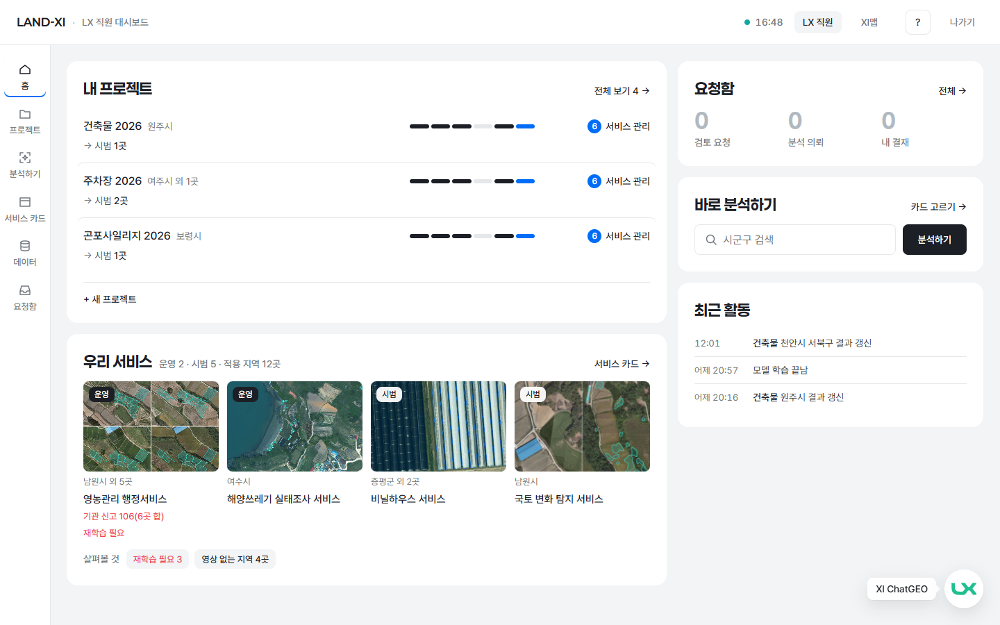 | 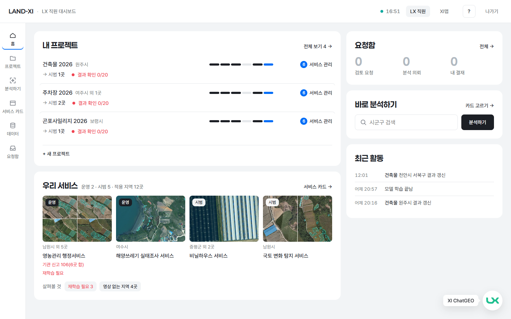 |
| 대시보드 '내 프로젝트' 휴대폰(390) | 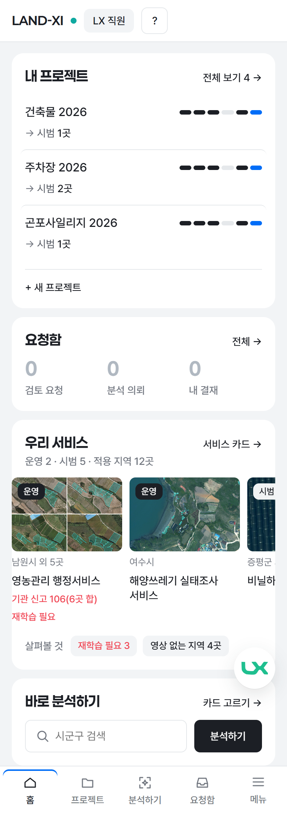 | 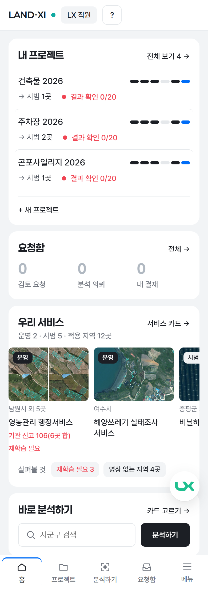 |
| 프로젝트 목록 PC(1440) | 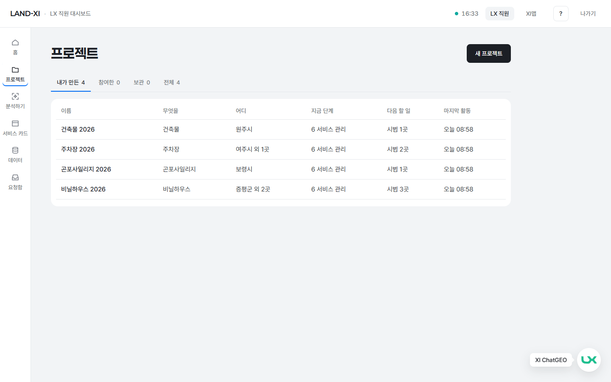 | 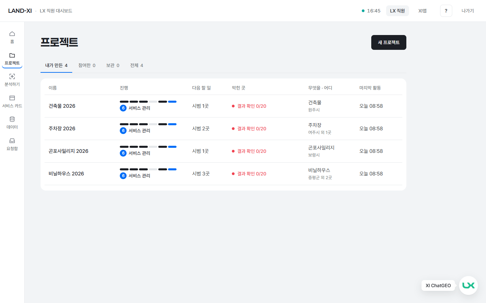 |
| 프로젝트 목록 휴대폰(390) | 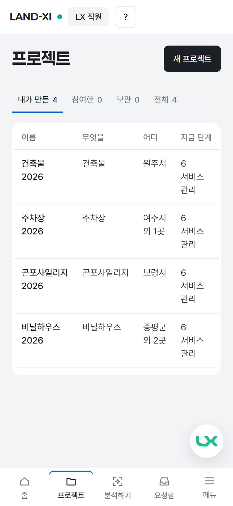 | 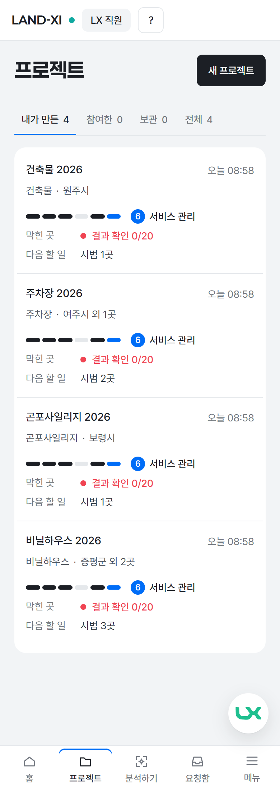 |
| 결재 대기 · 반려 · 건너뛴 칸이 있을 때 — 목록 PC · 휴대폰 | — | 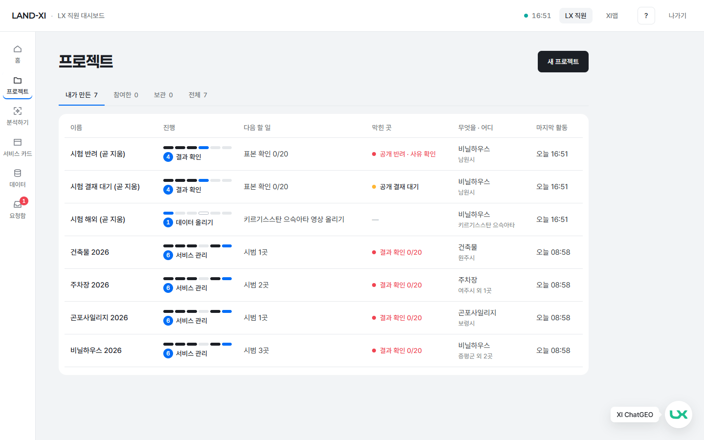 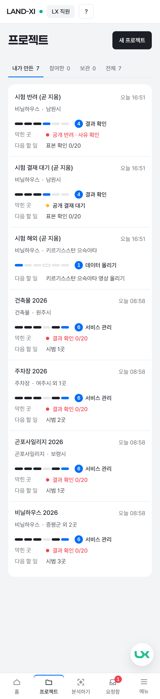 |
| 같은 장면 — 대시보드 PC · 휴대폰(같은 막대 · 같은 막힌 곳) | — | 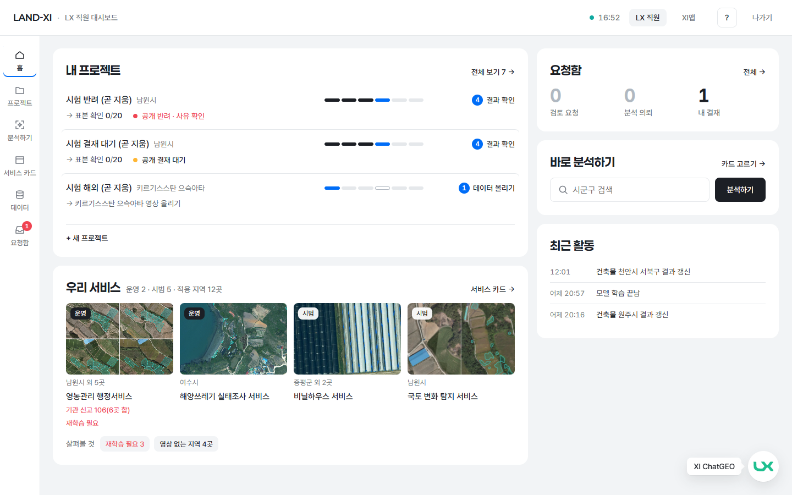 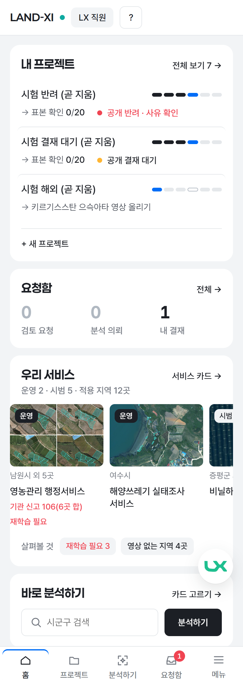 |

## 서버에 더한 것(최소)
프로젝트 목록 응답에는 단계별 상태가 없어서, 막대를 그리려면 프로젝트마다 한 장을 다시 불러야 했습니다(대시보드는 3개라 괜찮지만 목록은 최대 200개). 그래서 **이미 하던 단계 판정의 결과를 목록 줄에도 실어 줍니다** — 칸 상태 6개와 막힌 곳. 새로 세는 숫자는 없습니다(결과 확인 n/20 은 프로젝트 한 장과 같은 값). 프로젝트 한 장에도 같은 두 값이 붙습니다.

## 시험
- 서버: 프로젝트 시험에 셋 더함 — 새 프로젝트 칸 6 · 결재 대기 → 반려 · 공개 뒤에도 '결과 확인 0/20' · 해외 지역만 있으면 건너뛴 칸. 11건 통과.
- 화면: 목록 시험 셋 — 열 · 칸 6 · 막힌 곳이 서버 판정과 같음 · 걸러 보기 없음 / 대시보드 줄이 목록과 같은 부품 · 같은 값(막대 · 건너뛴 칸 · 막힌 곳) / 휴대폰 390 가로 넘침 0 · 한 장으로 접힘. 기존 프로젝트 · 메뉴 시험까지 13건 통과.
- 폭 10가지(1440 ~ 360) 가로 넘침 0, 금지어 0.

## 이런 것도 필요하지 않을까요? (제안)
1. **막힌 곳을 누르면 그 단계 화면으로 바로** — '결과 확인 0/20'을 보고 한 번에 결과 확인 화면으로 가면 좋겠습니다(LX 직원이 막힌 것을 바로 풀기 위해).
2. **막힌 곳이 있는 프로젝트를 위로** — 목록이 많아지면 반려 · 결과 확인 남은 것부터 보이게(걸러 보기를 만들 때 함께 정하면 좋겠습니다).
