# 구현 5차 · 계정 · 프로젝트 셋 — 저장 용량 할당 · 늘리기 요청 · 승인 · 메모 · 파일 지우기 · 부서를 LX 조직도에서 고르기

> 2026-10-01 저녁 · 오퍼스(구현). 확인 대장 '제안 — 계정 · 프로젝트 셋'에서 확인하신 셋만 만들었습니다 — **S-19 · S-20 · S-21**(사용자: "3개다 필요하다").
> 부서 목록은 사용자 지시 "https://www.lx.or.kr/kor/sub06_06_01.do 부서는 일단 여기에 보자. 나중엔 사내 시스템에서 불러오는 작업을 할 예정이다"에 따라 **LX 누리집 조직도**를 처음 목록으로 넣었습니다(지사 명단은 누리집에 없어 넣지 않았습니다 — 지사는 직접 적기).
> 화면은 바깥 주소(https://app.land-xi.dev · 관리자는 https://admin.land-xi.dev)에 바로 올라가 있고, 캡처도 바깥 주소에서 로그인 폼으로 들어가 찍었습니다(세션 주입 없음). GPU 는 쓰지 않았습니다.

## 어디서 보나
| 무엇 | 주소 · 계정 | 누를 곳 |
|---|---|---|
| 내 정보 — 저장 용량 · 늘리기 요청 · 부서 고르기 | https://app.land-xi.dev · test@lx.or.kr · 임시 비밀번호 | 머리 오른쪽 'LX 직원 ▾' → 내 정보 (지금은 할당이 '할당 없음'이라 '용량 늘리기 요청'이 보이지 않습니다 — 아래 '보는 법') |
| 메모 · 파일 지우기 | 같은 계정 · 왼쪽 메뉴 '프로젝트' → '비닐하우스 2026' | 오른쪽 아래 '기록 · 메모 · 파일' — 메모를 하나 남기면 그 줄 끝에 '지우기' |
| 저장 용량 요청 · 사람마다 할당 · 기본 할당 | https://admin.land-xi.dev/landxi/v3/ops-accounts/#storage · lxadmin@lx.or.kr · 임시 비밀번호 | 계정 관리 → '저장 용량 요청' 탭(위 줄 '기본 할당 · 바꾸기') · '계정' 탭 → 사람을 누르면 서랍 맨 아래 '저장 용량' |
| 부서 목록 | 같은 관리자 화면 · '부서 목록' 탭 | 출처 · 엑셀 · CSV 올리기 · 출처에서 다시 불러오기 · 더하기 · 빼기 |
| 가입 신청의 부서 칸 | https://app.land-xi.dev/landxi/v3/login/ · 로그인 없이 | '계정 찾기 · 신청' → 가입 신청 → '소속 부서'에 '지역본부'처럼 적어 보기(보내지 않아도 됩니다) |

**보는 법(저장 용량)** — 할당은 처음에 모두 '할당 없음'입니다(지어내지 않았습니다). 관리자 화면 '계정' 탭에서 test@lx.or.kr 을 눌러 '저장 용량'에 값을 넣으면(예: 0.03 GB = 지금 쓴 양의 99%) 직원 쪽 내 정보에 막대 · 90% 넘음 한 줄 · '용량 늘리기 요청'이 나옵니다. 다 보신 뒤 '기본 할당으로'를 누르면 처음대로 돌아갑니다.

## 1. 저장 용량 할당 · 늘리기 요청 · 승인 (S-19)
| 직원 — 내 정보(할당의 99%) | 늘리기 요청 창 | 보낸 뒤 '요청 중' | 휴대폰 |
|---|---|---|---|
| 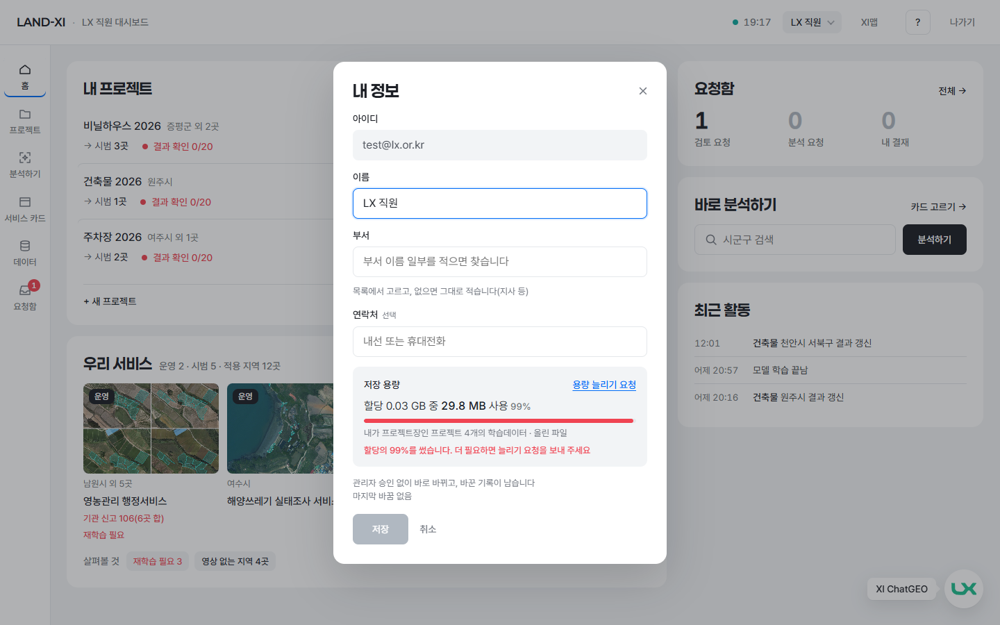 | 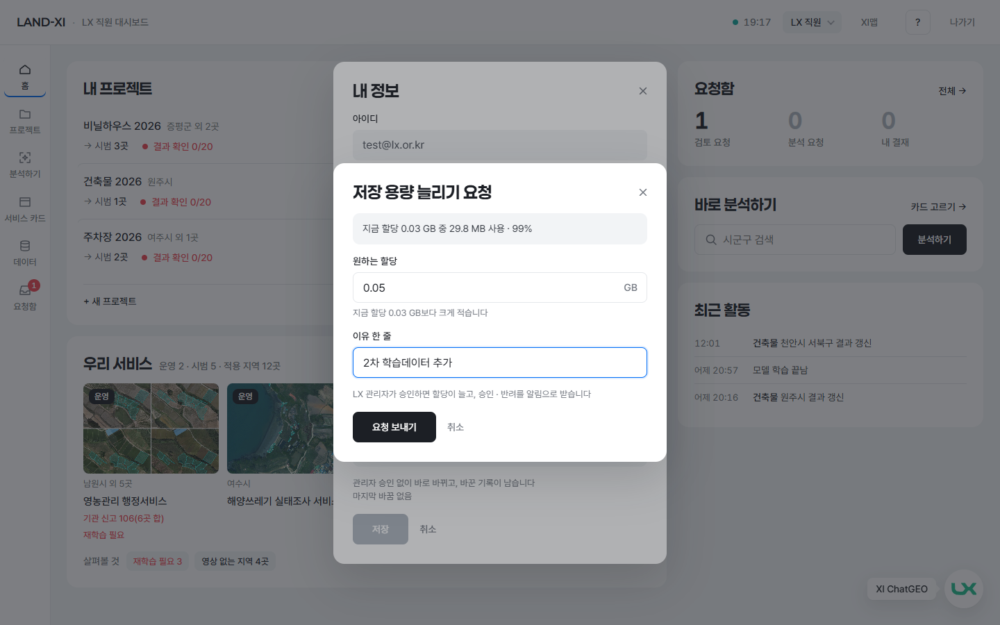 | 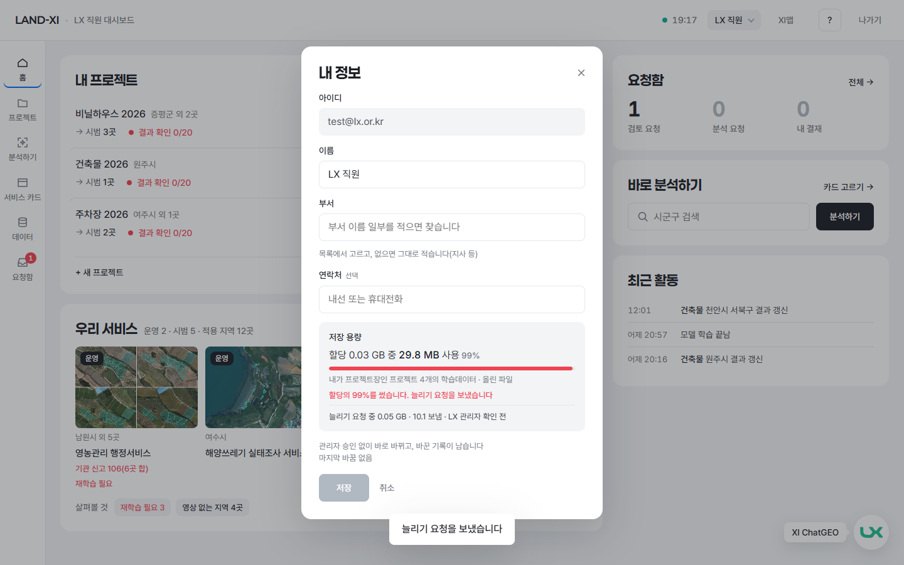 | 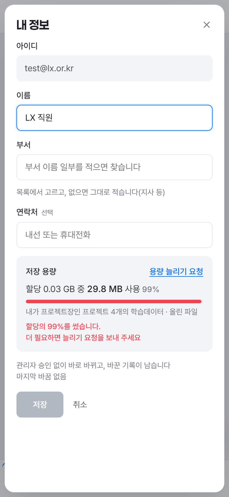 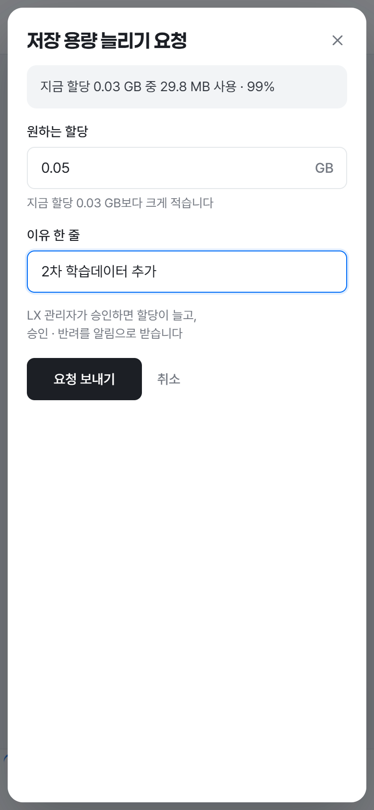 |

| 관리자 — 저장 용량 요청(가입 신청 · 재설정과 같은 자리 · 같은 모양) | 한 건 서랍 — 승인 · 반려(사유) | 휴대폰 |
|---|---|---|
| 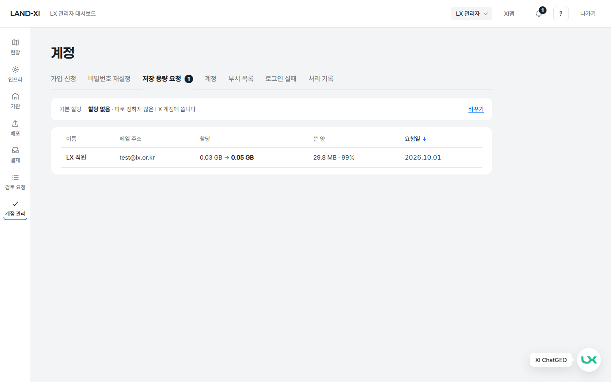 | 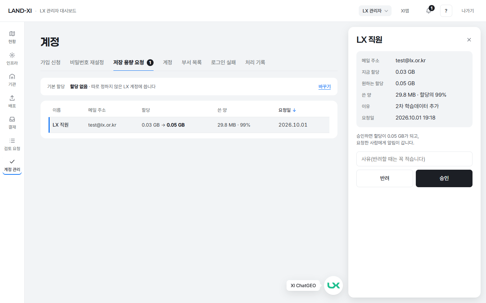 | 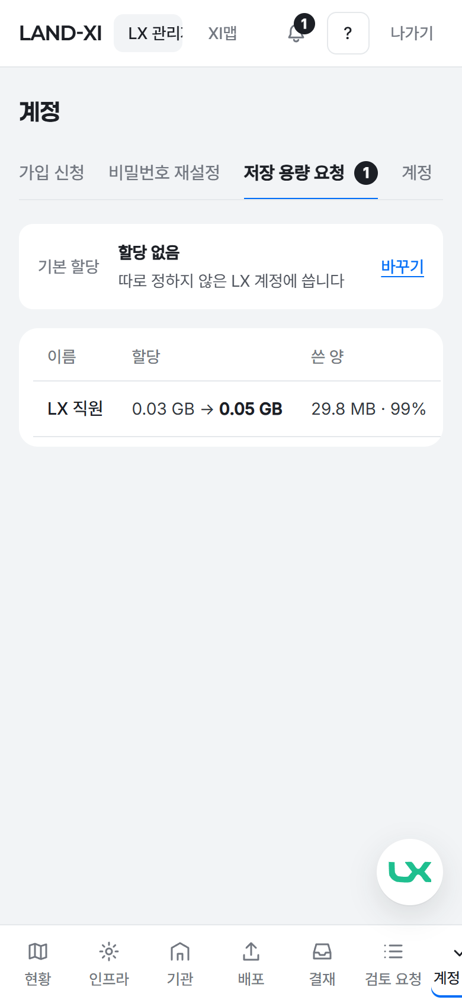 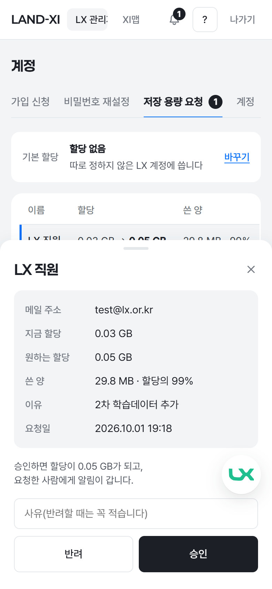 |

| 승인한 뒤 | 계정 목록의 '저장 용량' 칸 | 사람마다 할당 정하기(서랍 맨 아래) |
|---|---|---|
| 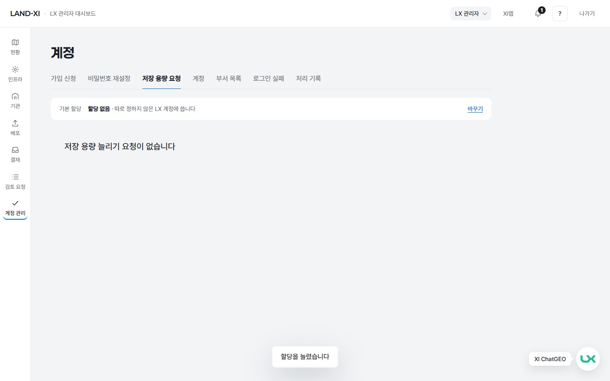 | 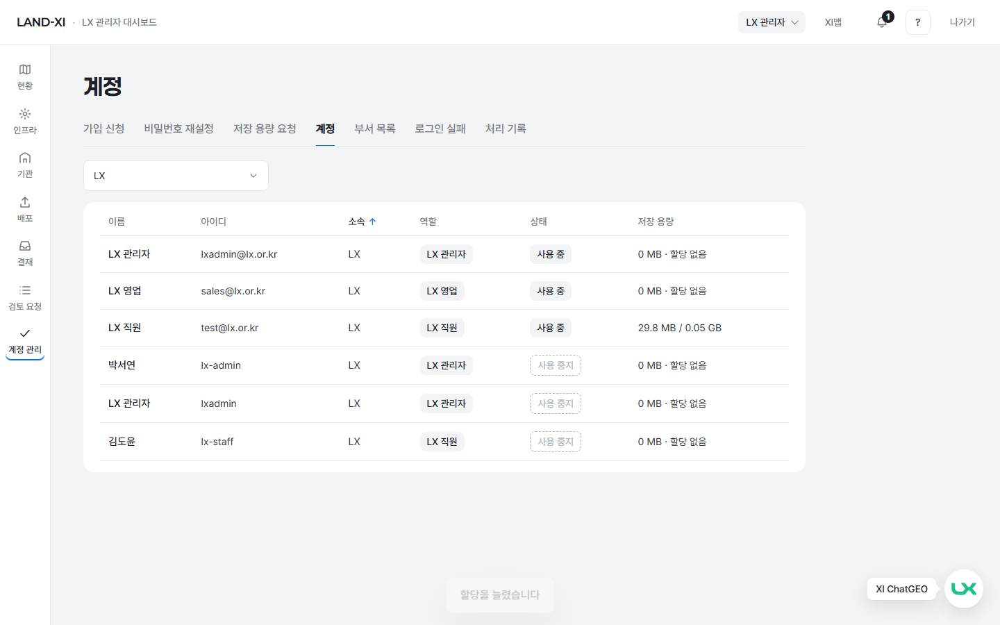 | 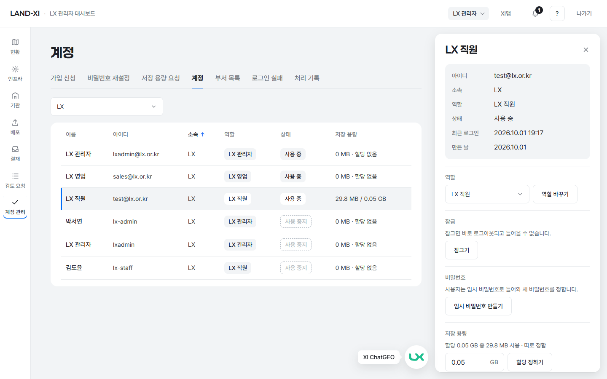 |

| 요청한 사람 — 대시보드 알림 한 줄 | 내 정보 '지난 요청 · 승인' | 휴대폰 |
|---|---|---|
| 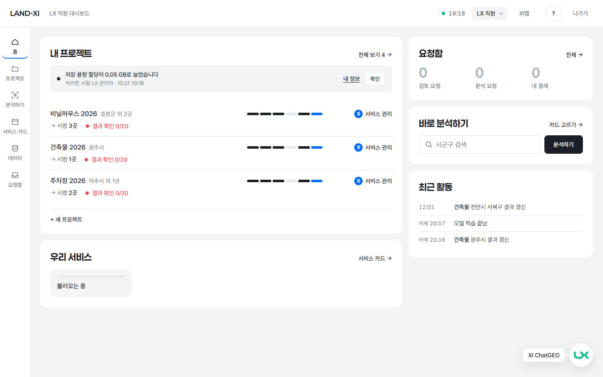 | 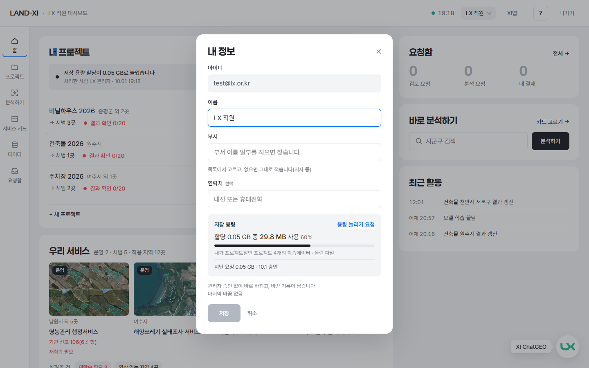 | 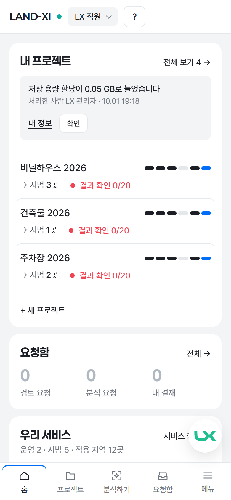 |

- **할당은 사람마다 한 칸 → 비어 있으면 기본 할당 → 기본 할당도 없으면 '할당 없음'.** 기본 할당은 관리자 '저장 용량 요청' 탭 위의 한 줄(설정 한 곳)이고 처음 값은 '할당 없음'입니다.
- **쓴 양은 한 곳에서 셉니다** — 내가 프로젝트장인 프로젝트의 저장 공간 합(이은 학습데이터 파일 + 올린 파일). 프로젝트 한 장의 '저장 공간', 내 정보, 관리자 계정 목록, 요청 서랍이 모두 같은 계산입니다(위 캡처 모두 29.8 MB).
- **내 정보** — 할당이 있으면 '할당 n GB 중 m 사용' + 막대 + '용량 늘리기 요청'(원하는 할당 · 이유 한 줄). 대기 중 요청은 한 사람에 하나('늘리기 요청 중 · 보낸 날 · LX 관리자 확인 전'), 처리되면 '지난 요청 · 승인 / 반려 · 사유'. 할당이 없으면 지금처럼 '할당 없음 · 지금 쓴 양'만(늘릴 것이 없으니 요청 버튼 없음).
- **관리자** — 승인하면 그 사람의 할당이 원하는 값이 되고, 반려는 사유가 있어야 합니다. 어느 쪽이든 요청한 사람의 대시보드 '내 프로젝트' 맨 위와 프로젝트 목록 맨 위에 알림 한 줄('처리한 사람 · 시각 · 사유', '내 정보' · '확인')이 뜹니다. 처리 기록 탭에 '저장 용량 할당 · 늘리기 요청 · 승인 · 반려 · 기본 할당 바꿈'이 전 → 후와 함께 남습니다. 관리자 자신의 요청 · 할당은 다른 관리자가 하고, 관리자 계정이 하나뿐이면 스스로 합니다(결재함과 같은 규칙).
- **90% 를 넘으면(막지 않고 알리기만)** — 내 정보에 빨간 한 줄 '할당의 99%를 썼습니다. 더 필요하면 늘리기 요청을 보내 주세요', 파일 올리는 자리(프로젝트 기록 칸)에 '내 저장 용량 할당의 99%를 썼습니다. 올리기는 그대로 됩니다 · 늘리기 요청', 그리고 파일을 올린 뒤 창 하나(원칙 109 — 이 창을 연 동안 한 번만). 프로젝트 구성원이 올리면 '프로젝트장 저장 용량 …'으로 보이고 요청 버튼은 프로젝트장에게만.

| 기록 칸의 90% 한 줄 | 올린 뒤 창 |
|---|---|
| 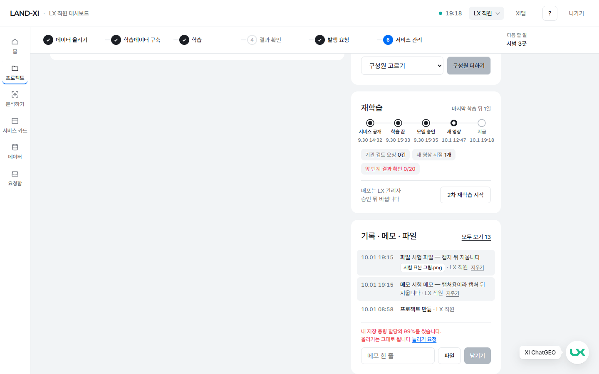 | 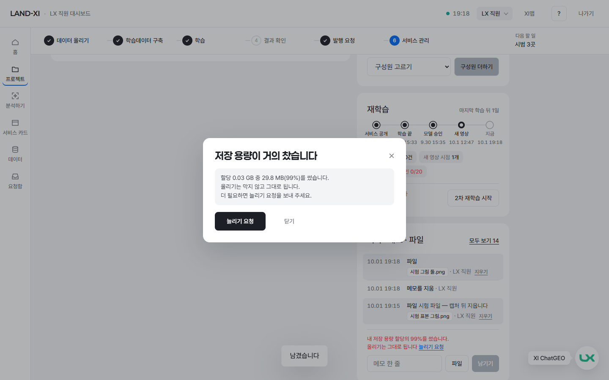 |

### 여쭐 것 — 할당을 넘었을 때 막을까요? (S-19-넘을 때)
지금은 **ⓐ 알리기만**입니다(원칙 91 '한도는 하드웨어에만' · 기본값). 예시 장면: 할당 50 GB 인 직원이 49 GB 를 썼고 2 GB 학습 표본을 더 올리려 합니다.
- **ⓐ 알리기만(지금)** — 올라갑니다. 51 GB(102%)가 되고 내 정보 · 올리는 자리에 빨간 한 줄 + 창으로 늘리기 요청을 권합니다. 관리자는 계정 목록에서 빨간 칸으로 봅니다. 일은 멈추지 않지만, 여럿이 넘으면 서버 디스크가 먼저 찰 수 있습니다(그때는 지금처럼 서버 전체 디스크 선에서만 막힙니다).
- **ⓑ 올리기 막음** — 올리기 전에 '할당을 넘습니다 — 늘리기 요청을 보내 주세요' 창으로 멈춥니다. 디스크는 지켜지지만, 관리자가 승인할 때까지 그 직원의 데이터 올리기가 멈춥니다.
- 예외(어느 쪽이든): 할당이 없는 사람(할당 없음)은 막지 않습니다. 서버 전체 디스크가 모자라면 지금처럼 누구든 막힙니다. 이미 올린 데이터를 지우거나 줄이지는 않습니다.

## 2. 메모 · 파일 지우기 (S-20)
| 기록 칸 — 메모 · 파일 줄 끝 '지우기' | 확인 창 | 지운 뒤 — '메모를 지움' 한 줄 | 휴대폰(파일) |
|---|---|---|---|
|  | 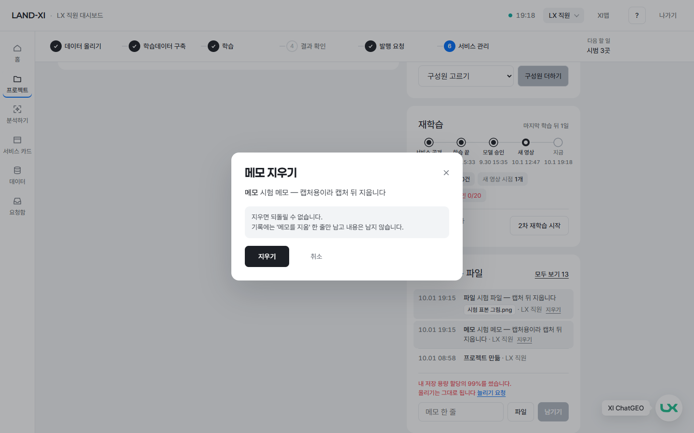 | 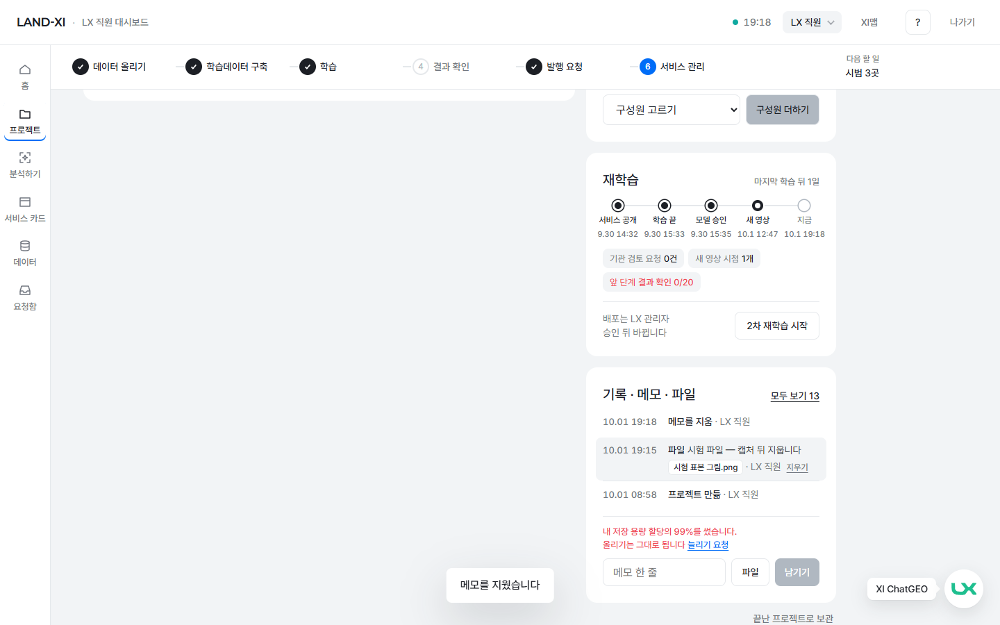 | 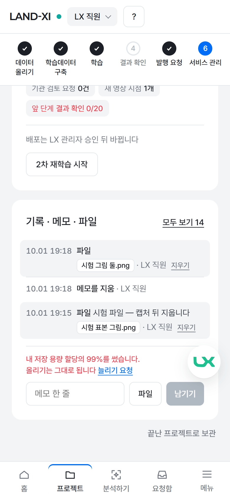 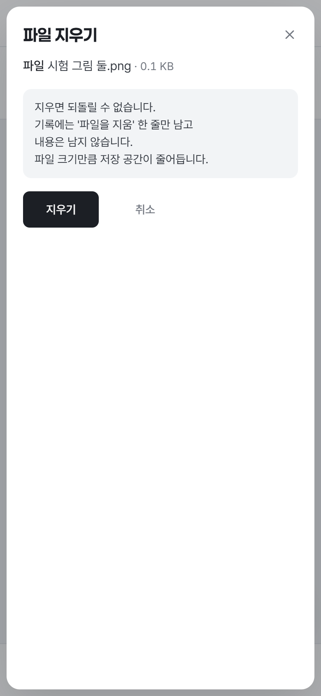 |

- '지우기'는 **쓴 사람 본인 · 프로젝트장 · LX 관리자**에게만 보입니다(다른 구성원의 메모에는 없음 — 서버도 같은 규칙으로 거절).
- 확인 창: '지우면 되돌릴 수 없습니다. 기록에는 ○○을 지움 한 줄만 남고 내용은 남지 않습니다'(파일이면 '파일 크기만큼 저장 공간이 줄어듭니다').
- 지우면 그 줄이 빠지고 **'메모를 지움 / 파일을 지움 · 지운 사람'** 한 줄이 기록에 남습니다. 글 · 파일 이름은 서버에도 남기지 않습니다(올릴 때 처리 기록에 적힌 파일 이름도 지움 — 크기만 남음).
- 파일은 **프로젝트 저장 폴더에서 빠지고**, 저장 공간 숫자가 그만큼 줄어듭니다(위 1의 한 곳 계산 그대로 — 프로젝트 한 장 · 내 정보 · 관리자 목록이 함께 줄어듦).

## 3. 부서를 LX 조직도에서 고르기 (S-21)
| 내 정보 — '플랫폼' 적으면 | 가입 신청 — '지역본부' 적으면 | 휴대폰 |
|---|---|---|
| 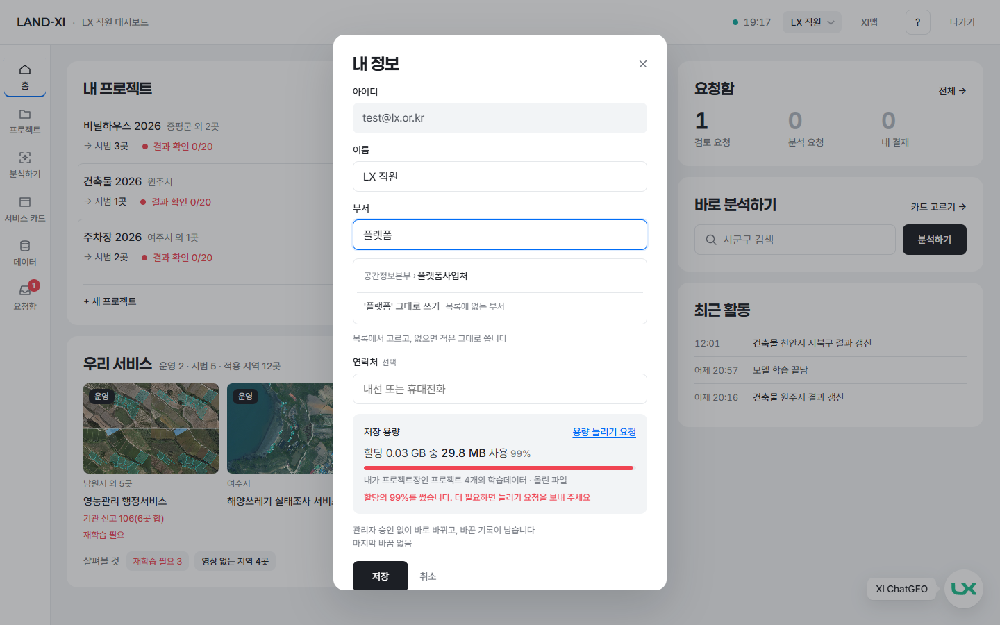 | 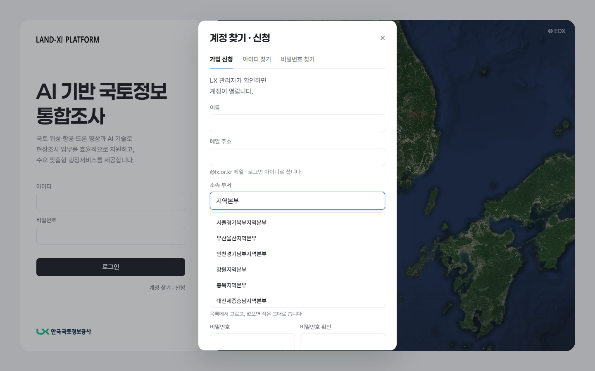 | 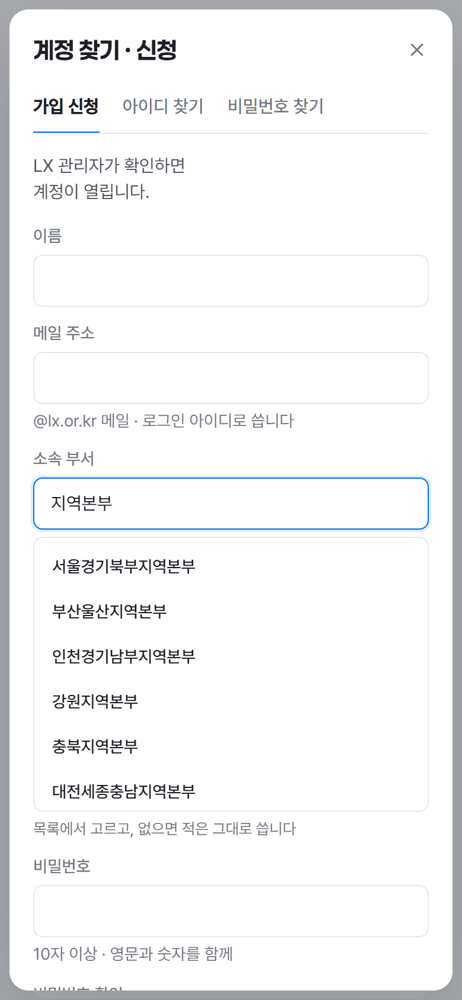 |

| 관리자 — 부서 목록(출처 · 올리기 · 다시 불러오기 · 더하기 · 빼기) | 엑셀 · CSV 올리기 → 미리 보기(바꾸기 전) | 휴대폰 |
|---|---|---|
| 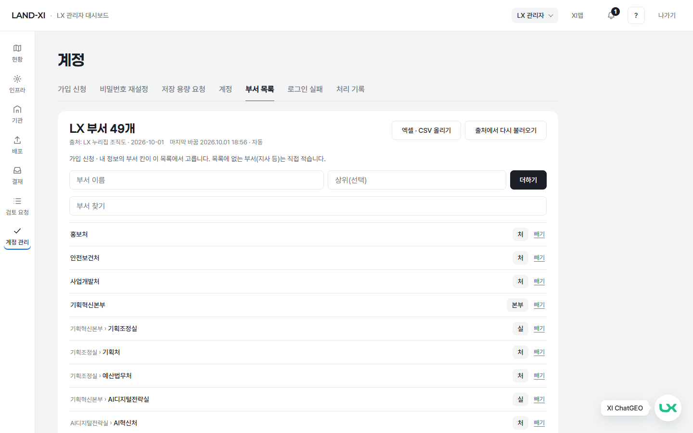 | 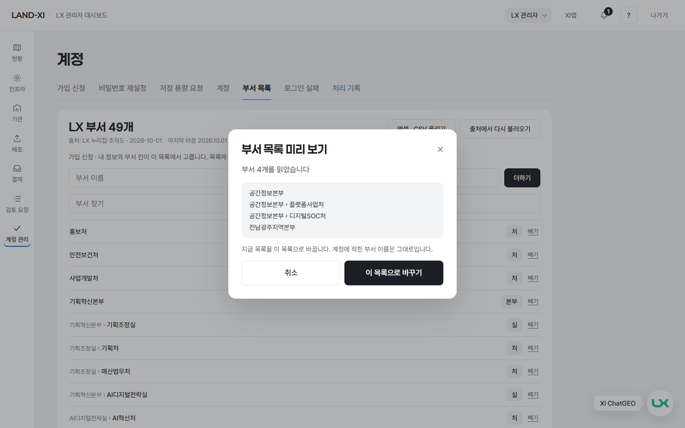 | 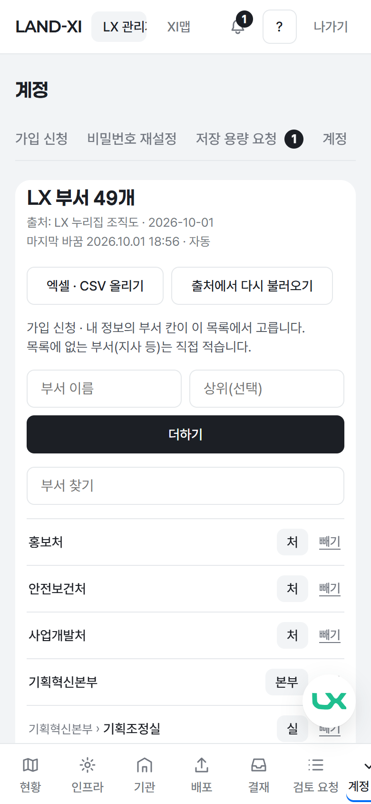 |

- **처음 목록 = LX 누리집 조직도(2026-10-01)** — 본부 · 실 · 처 · 센터 · 지역본부 11 · 교육원 · 연구원, 고를 수 있는 부서 49개. 사장 · 부사장 · 감사는 조직도의 뼈대라 고르는 칸에 내지 않습니다. 관리자 화면에 '출처: LX 누리집 조직도 · 2026-10-01'.
- 고르는 칸의 이름은 **'상위 › 부서'**(예: 공간정보본부 › 플랫폼사업처 · 기획조정실 › 기획처), 상위가 사장 · 부사장 · 감사면 부서만(예: 전남광주지역본부 · 감사실). 계정에도 이 이름 그대로 적힙니다.
- 부서 칸에 몇 글자 적으면 맞는 부서가 아래에 나오고 누르면 들어갑니다. **목록에 없는 부서(지역본부 아래 지사 등)는 적은 그대로 씁니다** — 목록 끝의 ''○○' 그대로 쓰기 · 목록에 없는 부서'. '플랫폼사업처'처럼 부서만 적어도 서버가 목록 이름으로 맞춥니다.
- **이미 적힌 부서 이름은 바꾸지 않습니다** — 내 정보에서 지금 이름이 목록에 없으면 '지금 적힌 이름은 목록에 없습니다. 맞는 부서가 있으면 고르세요' 안내만. 관리자 부서 목록 탭 아래 '목록에 없는 부서 이름을 쓰는 계정 n'(접어 둠)과 계정 서랍의 한 줄로도 보입니다(고치는 사람은 본인 — 원칙 105).
- 관리자: **엑셀(xlsx) · CSV 올리기**(첫 줄 '상위 · 부서 · 단위'면 조직도 모양, 아니면 첫 열 한 줄에 부서 하나 · '#' 줄은 메모) → 미리 보기 → '이 목록으로 바꾸기' · **출처에서 다시 불러오기** · 하나 더하기(상위 선택) · 빼기(확인 창). 바꿔도 계정에 적힌 이름은 그대로입니다.
- 기관 계정의 부서는 이번 범위 밖입니다(기관 관리자 화면에는 이 탭이 없습니다).

## 시험
| 무엇 | 결과 |
|---|---|
| 서버 시험(실서버) — 새 3개: 할당 · 기본 할당 · 늘리기 요청(할당 없으면 409 · 작으면 400 · 하나만 대기) · 반려(사유 필수 · 알림 · 처리한 사람) · 승인(할당 = 원하는 값) · 기관 관리자에게 없음 / 메모 · 파일 지우기(쓴 사람 · 프로젝트장 · 관리자만 · 다른 구성원 403 · 내용 비움 · 파일 폴더에서 빠짐 · 저장 공간 줄어듦 · '지움' 한 줄) / 부서 목록(로그인 없이 이름만 · 최상위 뺌 · 가입 신청 · 내 정보가 목록 이름으로 맞춤 · 지사는 그대로 · 한 열 CSV · 조직도 엑셀 미리 보기 · 바꾸기 · 더하기 · 빼기 · 출처에서 다시) | 통과 |
| 서버 시험 — 기존 프로젝트 · 계정 · 구현 5차 프로젝트 한 장 | 27개 통과 |
| 화면 시험(로그인 폼) — 새 4개: 내 정보 부서 고르기(목록 이름으로 저장 · 지사는 그대로) · 메모 지우기 창 → '메모를 지움' · 늘리기 요청 → 관리자 승인 → 할당 늘어남 · 알림 / 가입 신청 부서 칸 + 기존 구현 5차 프로젝트 한 장 3개 · 계정 화면(구현 2차) | 통과 |
| 화면 시험 — 구현 2차 정리 2개 | 실패 2 — 이번 일과 무관(관리자 '기관' 화면의 선택자 · 기관 메뉴 '분석 의뢰' 이름이 바뀐 것 — 다른 갈래 진행 중). 같은 시험의 계정 화면 부분은 통과 |
| 캡처 점검(바깥 주소 · 1440 · 390 · 27장) | 가로 넘침 0 · 금지어 0 · 화면 오류 0 · 한 단어만 남은 줄 0(점검기가 짚은 줄은 눈으로 확인 — 숫자 뒤 '99%' 같은 작은 글자) |
| 되돌림 | 시험 할당 · 기본 할당 · 요청 · 알림 · 메모 · 파일 · 부서 · 부서 목록 · 시험 처리 기록 모두 원래대로. test@lx.or.kr 할당 '할당 없음' · 부서 비어 있음 · 비닐하우스 2026 기록은 다시 11줄 · 부서 목록은 누리집 조직도 49개 |

캡처에 보이는 '시험 메모 — 캡처용이라 캡처 뒤 지웁니다' · '시험 표본 그림.png' · '시험 그림 둘.png' · '0.03 GB → 0.05 GB 요청'은 장면을 보이려고 잠깐 만든 것이며 찍은 뒤 모두 지웠습니다(0.03 GB 는 지금 쓴 양 29.8 MB 가 90% 를 넘게 하려고 고른 시험 값입니다).

## 정직하게 밝힐 점
- 쓴 양은 **프로젝트에 이어진 학습데이터 파일과 올린 파일**만 사람(프로젝트장) 몫으로 셉니다. 영상 원본 · 분석 결과처럼 프로젝트에 이어지지 않은 저장은 사람에게 나누지 않았습니다(지난 구현과 같음).
- 부서 목록은 로그인 전 가입 신청 창이 써야 해서 **로그인 없이 부서 이름만** 내줍니다(누리집 조직도와 같은 정보 · 계정 · 출처 · 바꾼 사람은 관리자에게만).
- 같은 계정 화면 파일에 기관 갈래가 '볼 수 있는 서비스'(기관 관리자의 부서 사용자 배정) 줄을 동시에 넣는 중이었고, LX 계정 서랍에 'null' 글자가 찍히는 것을 봐서 그 줄을 비어 있으면 넣지 않게 막아 두었습니다(그 갈래의 변경이라 이번 커밋에는 넣지 않았습니다 — 그 갈래가 함께 올립니다).

## 먼저 드리는 제안(원칙 57)
| 제안 | 누가 · 왜 |
|---|---|
| 할당 합계와 서버 디스크를 한 줄로(인프라 화면 '저장 공간' 옆에 '나눠 준 할당 합 n GB / 디스크 m GB') | LX 관리자 — 할당은 막지 않는 약속이라, 나눠 준 합이 실제 디스크를 넘는지 한눈에 봐야 증설 시점을 잡습니다 |
| 90% 를 넘은 사람만 계정 관리 위에 모아 보기(이름 · 쓴 비율 · 마지막 올린 날) | LX 관리자 — 요청이 오기 전에 먼저 늘려 주거나 정리를 권할 수 있게 |
| 지운 파일을 7일 동안 되살리는 휴지통(지금은 지우면 바로 사라짐) | 프로젝트장 — 잘못 지운 근거 파일을 되찾게. 대신 그동안은 저장 공간에서 빠지지 않습니다(어느 쪽이 좋은지 여쭘) |
| 사내 인사 시스템과 이을 때 부서 이동을 저절로 반영 + 지사 명단 | LX 직원 — 전보 때마다 본인이 고치지 않게, 지사도 목록에서 고르게(정식 오픈 때 사내 계정 · OTP 연동과 함께) |

## 개발자 메모
- **부서 목록을 읽는 곳은 한 군데** — `server/landxi_api/accounts.py` 의 `dept_source()` · `DEPT_SOURCES`(지금 `csv` = `server/config/lx-departments.csv`). 사내 시스템에서 불러오려면 `DEPT_SOURCES` 에 `() -> (rows [{name, parent, unit}], '출처 한 줄')` 함수를 하나 더하고 `server/.env` 의 `LX_DEPT_SOURCE` 를 그 이름으로 바꾸면, 처음 채우기와 관리자 '출처에서 다시 불러오기'(POST /accounts/depts/reload)가 그 함수를 씁니다.
- 할당 · 90% 선 · 쓴 양 계산 = `server/landxi_api/projects.py` 의 `STORAGE_WARN_PCT` · `storage_state` · `lead_storage` · `storage_all`(한 곳). 마이그레이션 `server/migrations/0023_account_extras.sql`.
- 다시 찍기: 시험 자료(할당 0.03 GB · 시험 메모 · 파일)를 만든 뒤 `node docs/superpowers/final/process/impl-5/account-extras/shoot.mjs --base https://app.land-xi.dev` — 실제 흐름 한 바퀴(요청 보내기 · 메모 지우기 · 파일 올리기 · 승인)를 하므로 끝나고 되돌려야 합니다.
