# 구현 5차 · 기관 화면 완성 디자인 — 메인 · 내 서비스 · 서비스 대시보드 · 분석 요청 · 요청함의 보낸 사람 (2026-10-01)

브리핑 확인: (1) 확인된 것만 만든다 — 기관 화면 확인(10-01) 기관-1 ⓐ(공통 틀 · 메뉴는 지금 다섯 통일만) · 기관-2 ⓐ · 기관-3 ⓐ · 기관-4 ⓐ · 기관-5 ⓐ(+ 이름 '분석 요청' · 원칙 113) · 기관-8 ⓐ. 기관-7 · 9 · 10 · N-1~3 은 손대지 않았다(서비스별 우리 담당자 표 · '우리 공간' 정리 없음). (2) 숫자는 서버 값 한 출처 · 큰 숫자 자리엔 업무 결과만 · 지역 하드코딩 0 — 남원시 · 광주전남 둘 다로 확인. (3) 로그인 전 그림은 저해상 크롭만 · 제한 영상 0 · 연락처는 받은 LX 담당 직원과 LX 관리자에게만(서버가 자른다).

캡처는 모두 바깥 주소에서 로그인 폼으로 들어간 화면이다(1440×900 · 휴대폰 390×844 · `-full` = 아래까지 한 장). '전'은 같은 바깥 주소에서 이번에 고친 화면 파일만 지난 판(커밋된 판)으로 바꿔 끼워 찍었다(메인 · 로그인 전도 같은 방법). 계정: 기관(남원시 · 광주전남) `lxadmin@lx.or.kr` · LX 직원 `test@lx.or.kr` · LX 관리자 `lxadmin@lx.or.kr`. 비밀번호는 임시 비밀번호(대화로만). 시안은 설계 8차 `design-r8/gov-design/`(오른쪽 칸).

## 어디서 보나
| 무엇 | 주소 | 누를 곳 |
|---|---|---|
| [기관 분기] 메인(로그인 전) | https://namwon.land-xi.dev/ · https://gwangju-jeonnam.land-xi.dev/ | 아래로 내려 서비스 카드 |
| [기관 분기] 내 서비스 | https://namwon.land-xi.dev/ | 로그인 → 왼쪽 '내 서비스' |
| [기관 분기] 서비스 대시보드 | 같은 곳 | 영농관리 '이 서비스 열기' → '이 결과 설명 자세히' |
| [기관 분기] 분석 요청 | 같은 곳 | 왼쪽 '분석 요청' → '불러오기' 또는 파일 넣기 |
| [Land-XI] 요청함 · LX 관리자 처리 목록의 '분석 요청' | https://app.land-xi.dev/landxi/v3/lx-inbox/ · https://admin.land-xi.dev/landxi/v3/ops-core/#/approvals | 요청함 숫자 '분석 요청' · 처리 목록의 종류 |
| [Land-XI] 기관 요청의 보낸 사람 | https://admin.land-xi.dev/landxi/v3/lx-inbox/ | 검토 요청 한 줄(기관이 보내면) |

## 1. 공통 틀(기관-1 ⓐ) — 메뉴 · 머리 · 바닥을 모든 기관 화면에 같게
| 전 | 후 | 시안 |
|---|---|---|
| 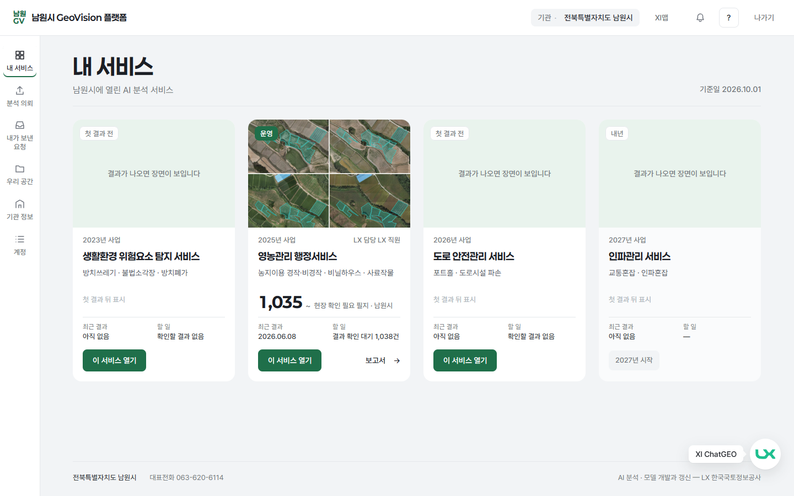 | 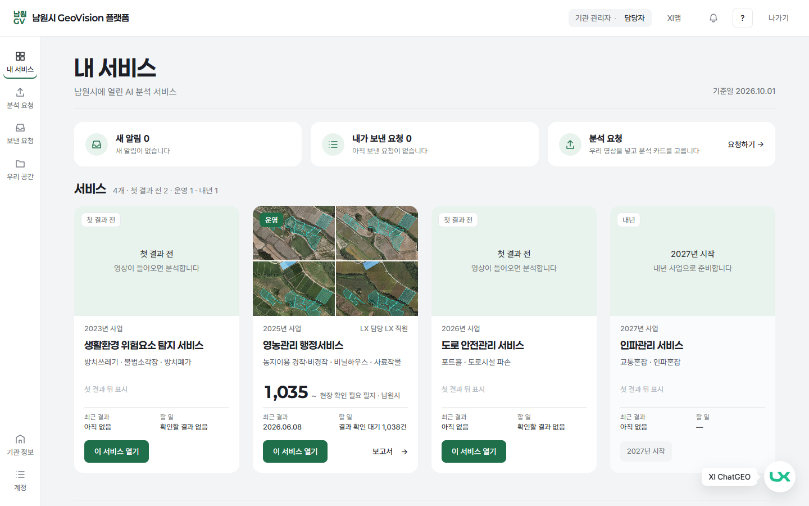 |  |
| 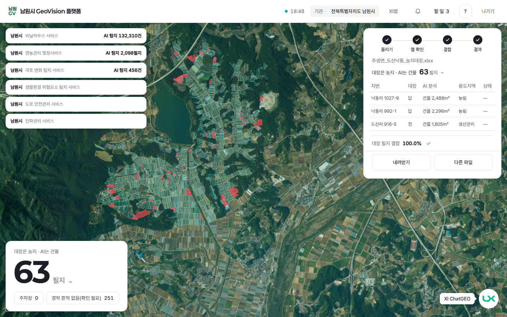 메뉴 없음 | 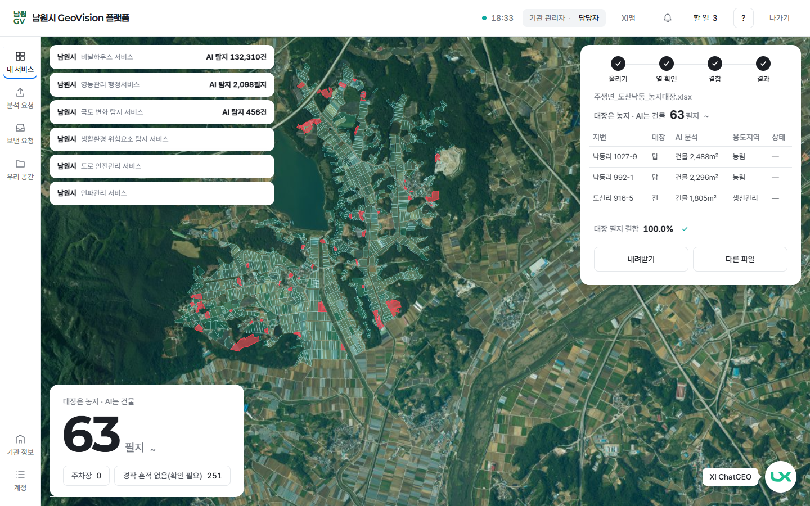 | — |

- 왼쪽 메뉴 = 내 서비스 · 분석 요청 · 보낸 요청 · 우리 공간 + (기관 관리자) 기관 정보 · 계정(레일 아래쪽). 메뉴가 없던 '행정정보와 비교'(gov-fusion) · '필지 목록 · 보고서'(gov-report)에도 같은 메뉴. 휴대폰 아래 탭 다섯(넷 + 메뉴 — 기관 정보 · 계정은 메뉴 안).
- 메뉴 구조는 새로 바꾸지 않았다(시안의 다섯을 맞추기만 · '우리 공간'은 N-1~3 답을 기다리는 중이라 그대로). 이력 · 결과 지도 탭 · 통계 · 요청하기는 다음 설계(기관-1 메모 · 원칙 117 · 120).
- 머리 오른쪽 = LX 역할 칩('기관 · 전북특별자치도 남원시') 대신 **사람**: 기관 관리자 · 이름 / 부서 사용자 = 부서 · 이름(계정 값 그대로 — `/me` 가 부서를 함께 준다). 휴대폰 머리는 모든 기관 화면이 마크 · 알림 · 도움말만.
- 바닥 = 기관 이름 · 대표전화 · 'AI 분석 · 모델 개발과 갱신 — LX 한국국토정보공사'(분석 요청 화면에도).

## 2. 기관 메인(기관-2 ⓐ) — 실제 결과 장면을 작게
| 전 | 후 | 시안 |
|---|---|---|
| 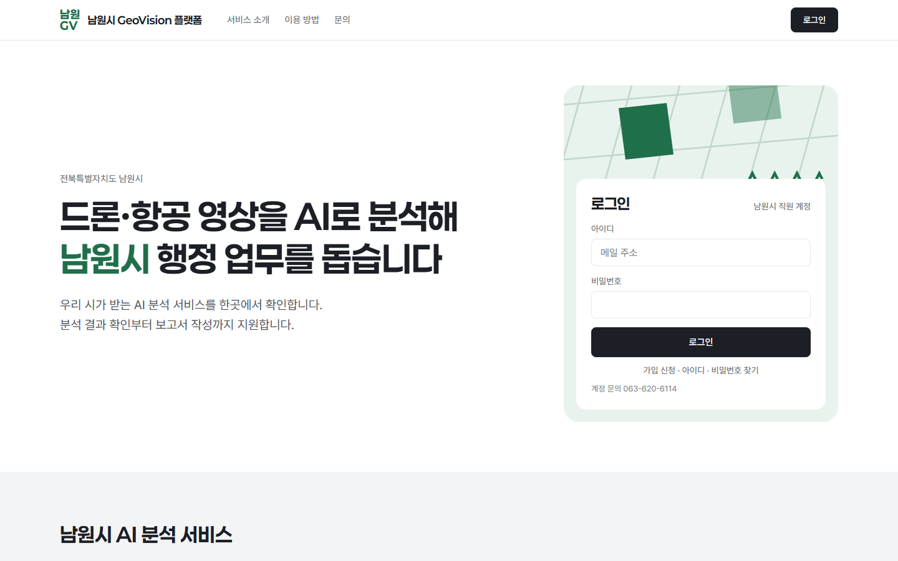 | 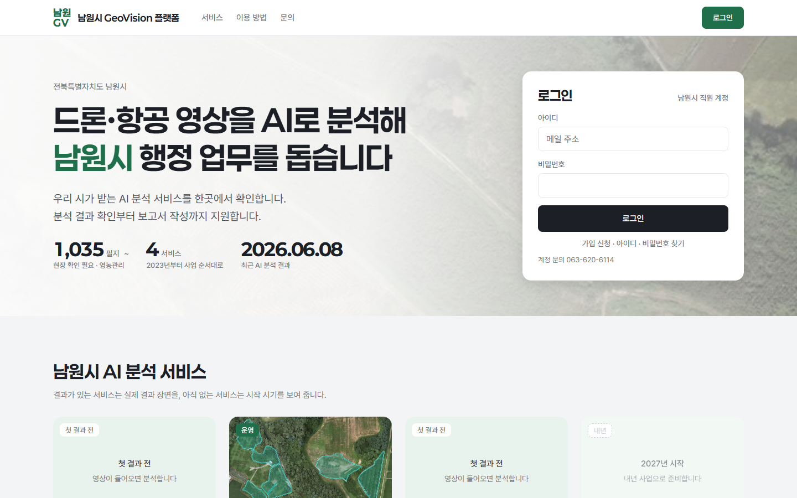 |  |
| 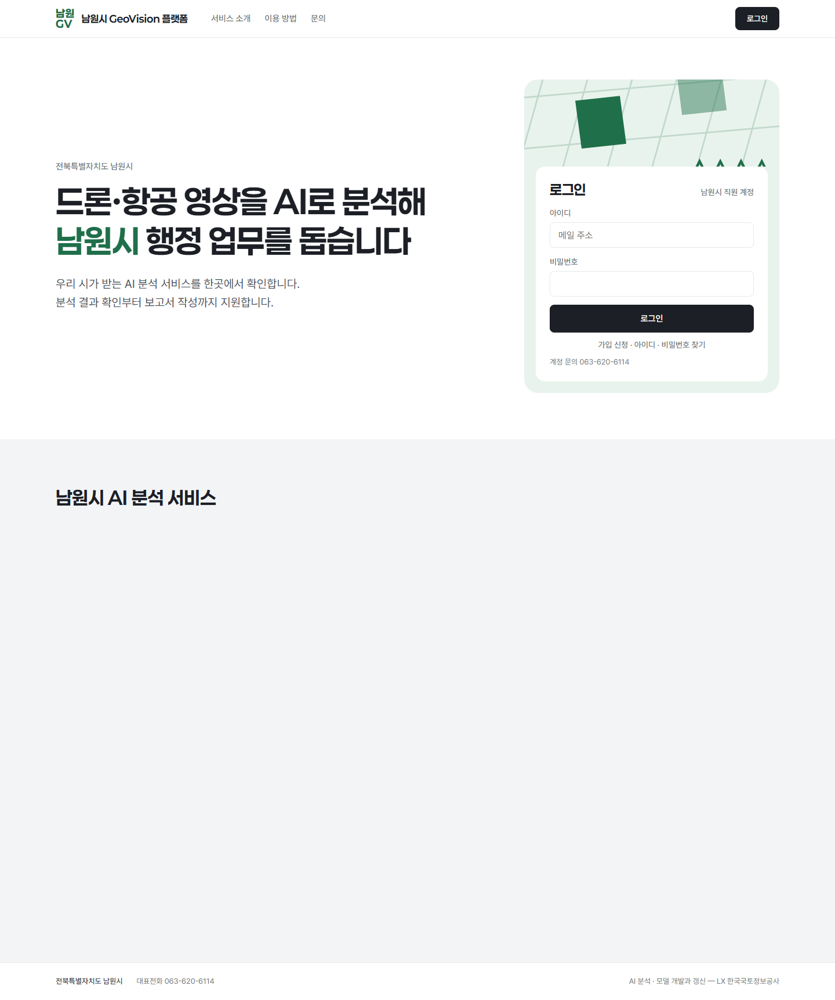 | 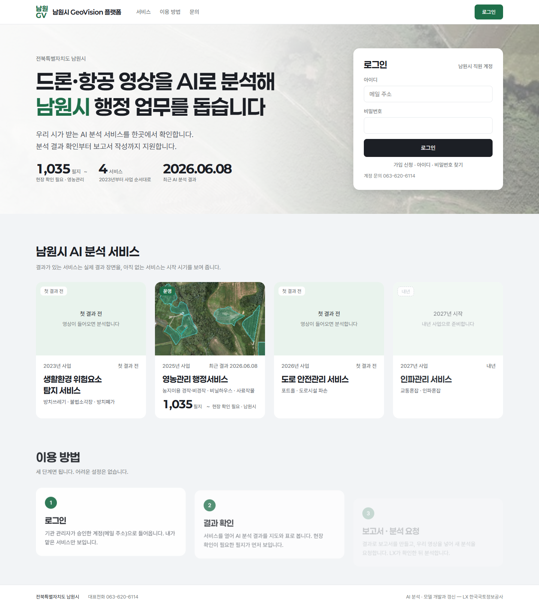 | — |
|  | 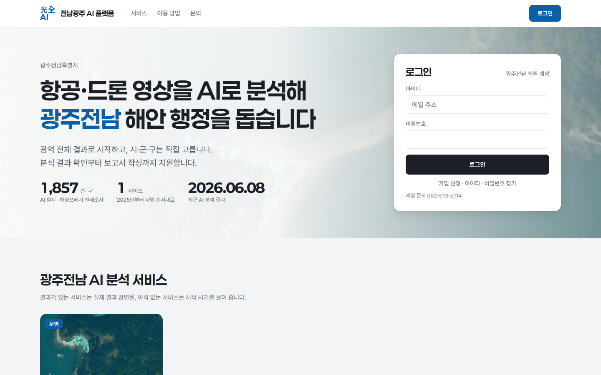 | — |
| 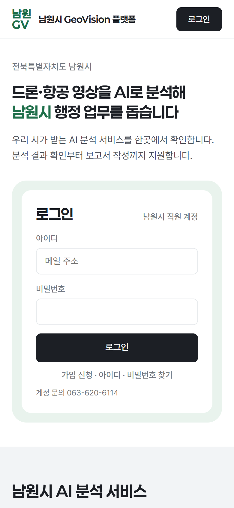 | 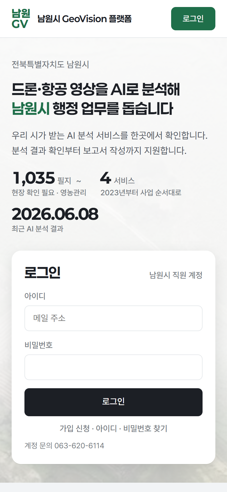 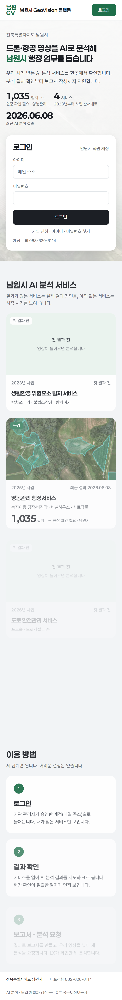 |  |

- 그림판(도형 일러스트) 0. 결과가 있는 서비스 카드만 실제 결과 장면(남원 = 2025 드론영상 위 휴경·전용 의심 필지 · 광주전남 = 여수 2026 드론영상 해안 쓰레기), 나머지는 '첫 결과 전 · 영상이 들어오면 분석합니다' / '2027년 시작 · 내년 사업으로 준비합니다'.
- 바탕 = 그 기관 영상을 흰빛으로 눌러 글이 먼저 읽히게. 로그인 카드는 바탕 위 흰 카드.
- 그림은 **서버 설정 한 곳**(`server/config/gov-main.yaml` · 새 길 `GET /api/v1/brand/{기관}/main`). 로그인 전이므로 서버가 지킨다: 긴 변 800 이하만(원 해상도 · 원본 · 지도 타일 0 — 서버가 재서 넘으면 내지 않음) · 여수 항공처럼 밖으로 낼 수 없는 영상 0(제한 목록) · 그 기관 · 열린 서비스 그림만. 배경 사진을 LX 관리자가 고르는 화면은 다음 설계(원칙 116).
- 업무 결과 셋(시안대로) = 업무 결과 하나(현장 확인 필요 1,035필지 · 영농관리 / 광주전남 = AI 탐지 1,857건 · 해양쓰레기) · 서비스 수(4 · 2023년부터) · 최근 AI 분석 결과(2026.06.08) — 대표 수치 요약과 같은 값. 필지 · 좌표 · 목록은 없다.
- 이용 방법 세 단계도 시안 글로(로그인 · 결과 확인 · 보고서 · 분석 요청).

## 3. 내 서비스(기관-3 ⓐ) — 오늘 띠 셋 + 서비스 카드
| 전 | 후 — 기관 관리자 | 후 — 부서 사용자 | 시안 |
|---|---|---|---|
|  |  | 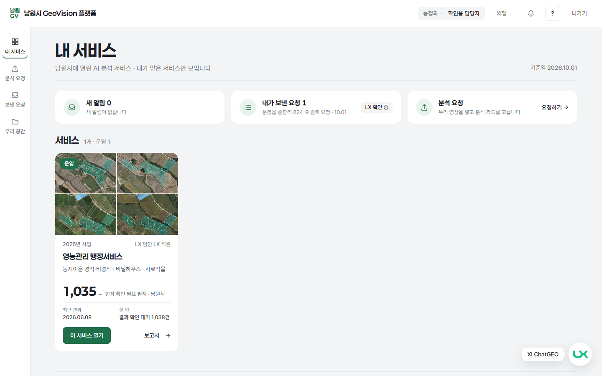 |  |
| 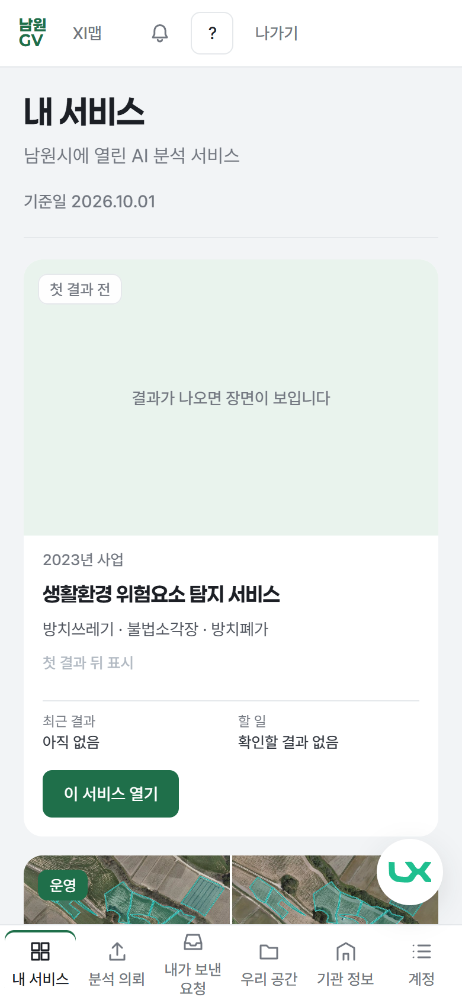 | 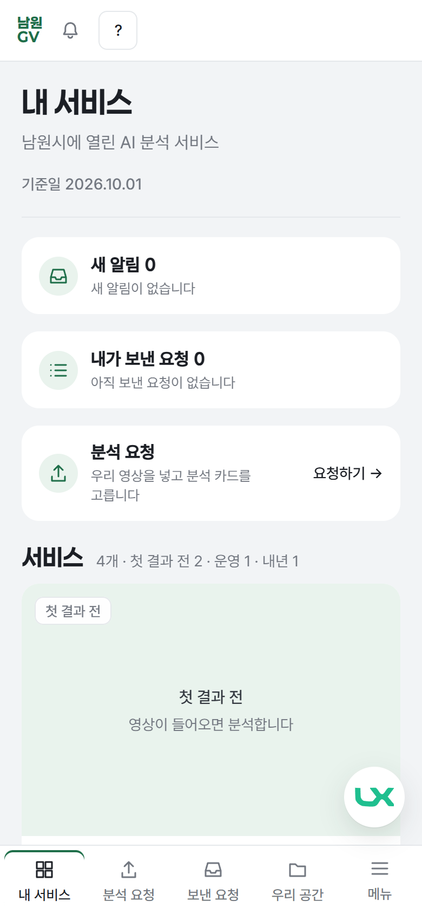 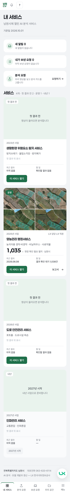 | 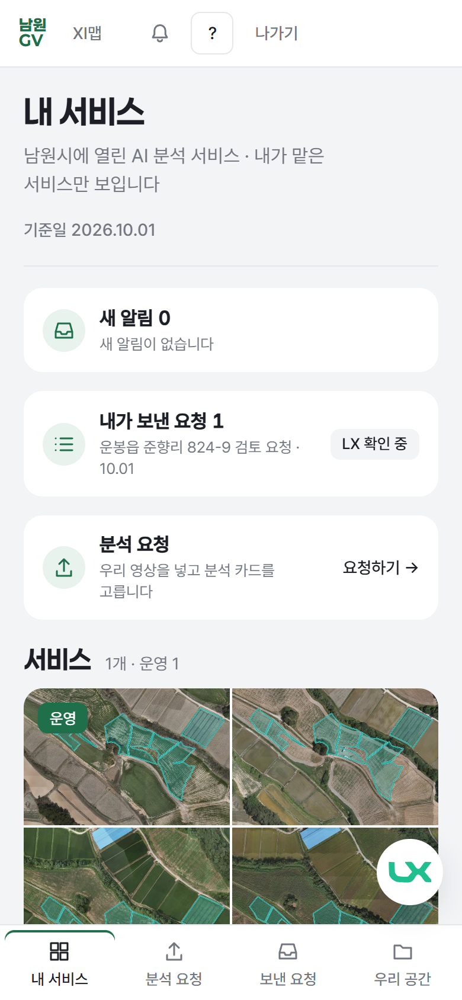 |  |

- 오늘 띠 셋: **새 알림**(머리의 종과 같은 수 · 같은 목록 — 답이 온 검토 요청 한 줄 / 기관 관리자는 가입 신청도) · **내가 보낸 요청**(검토 요청 + 분석 요청 가운데 진행 중인 수 · 가장 최근 한 줄과 상태) · **분석 요청**(요청하기 →).
- 서비스 카드 한 벌을 한 줄에 넷 · 머리에 '4개 · 첫 결과 전 2 · 운영 1 · 내년 1'. 결과가 없는 카드는 그림 대신 시작 시기.
- **부서 사용자는 기관 관리자가 정해 준 서비스만**(서버 덱이 거른다 — 우리 공간의 부서 배정과 같은 기록). 정해 준 것이 없으면 '아직 맡은 서비스가 없습니다'. 캡처는 확인용 부서 계정(농정과 · 영농관리만 배정)으로 찍고 계정은 지웠다.
- 카드의 '최근 결과'는 결과를 분석한 날이다(전에는 '현장 확인 필요'를 센 때 = 늘 오늘이 섞여 2026.10.01로 보였다 → 2026.06.08). 카드의 'LX 담당' = 기관 요청을 실제로 받는 사람(같은 한 출처).

## 4. 서비스 대시보드(기관-4 ⓐ) — 장면 먼저
| 전 | 후 | 시안(최종) |
|---|---|---|
| 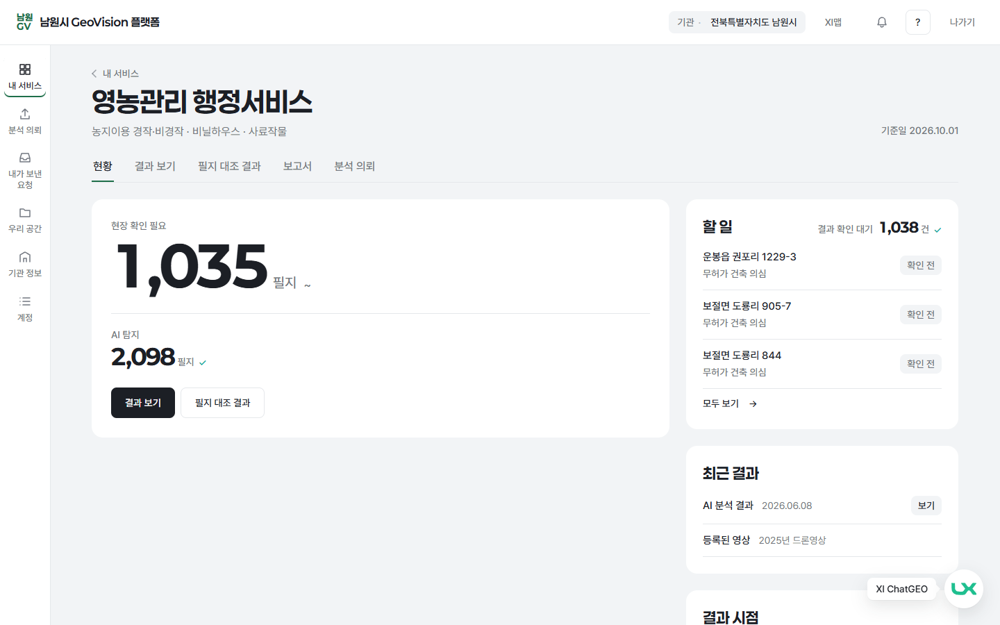 | 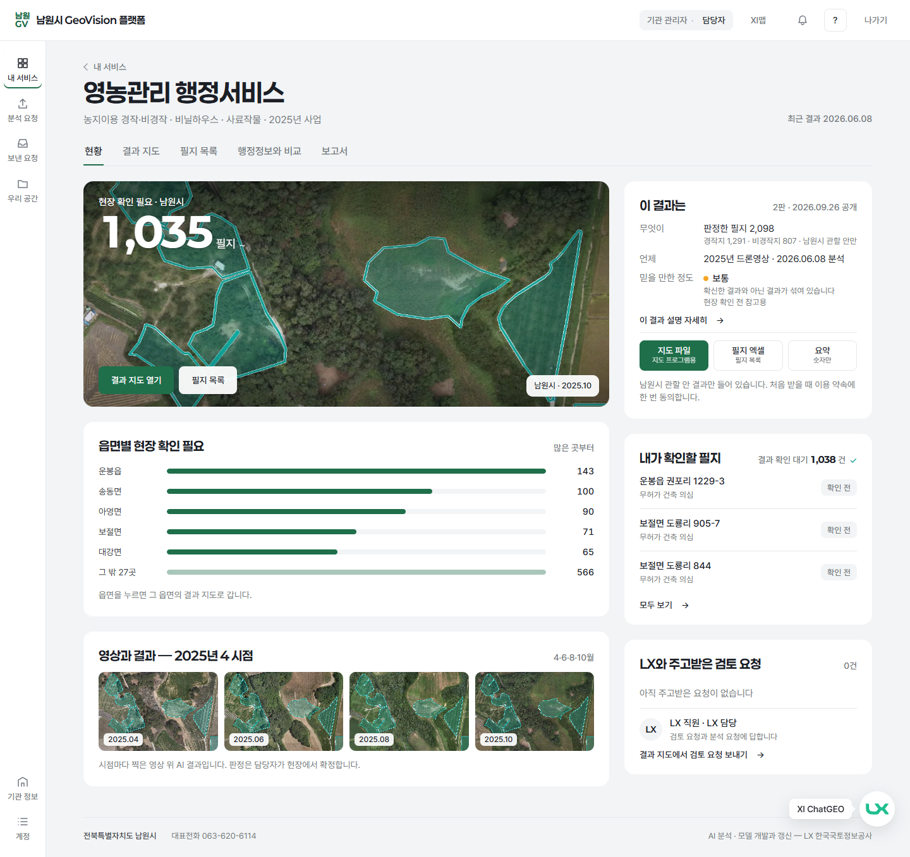 |  |
| — | 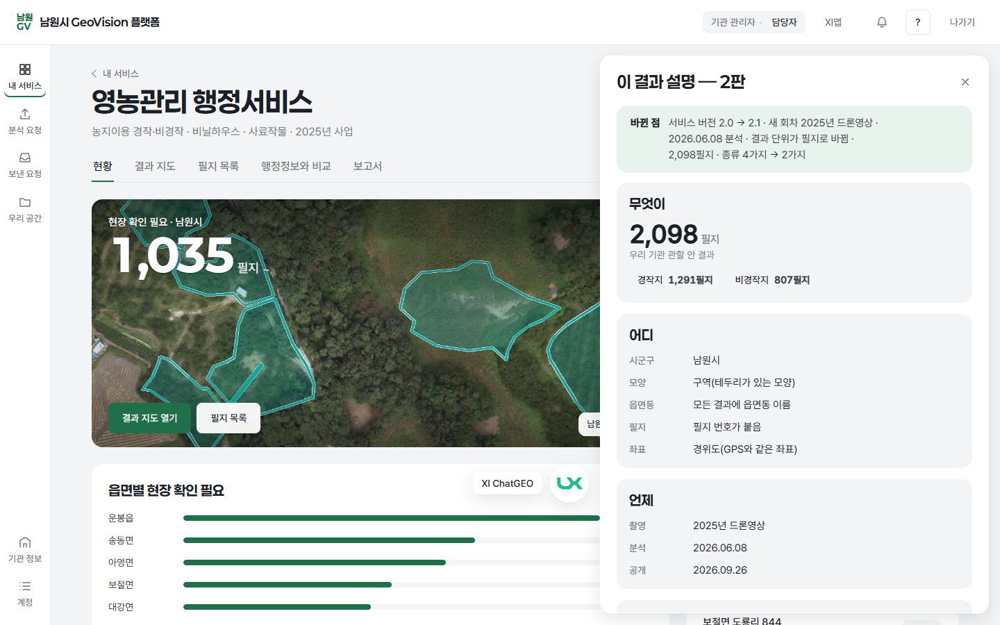 '이 결과 설명 자세히' 서랍 |  |
| — | 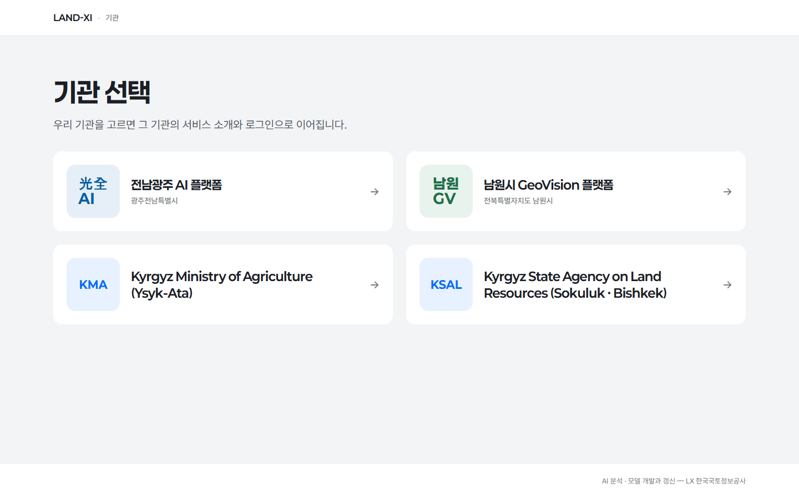 광주전남(광역 · 해양쓰레기) | — |
| 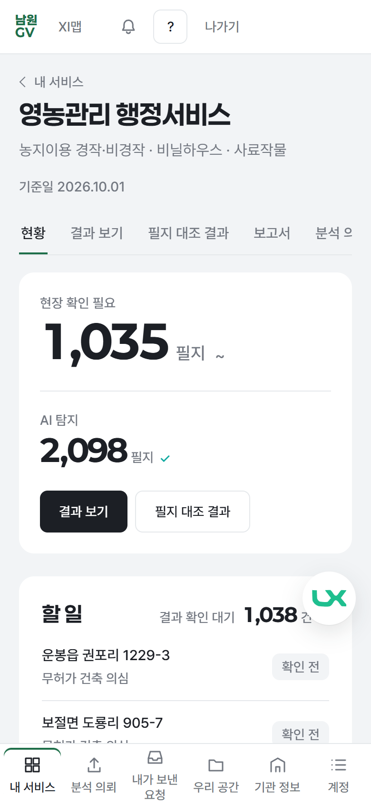 | 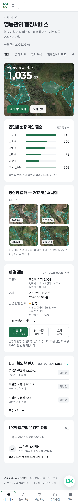 |  |

- 탭 = 현황 · **결과 지도**(XI맵 · 그 시군구) · 필지 목록 · **행정정보와 비교**(지금의 대장 × AI 화면) · 보고서. 필지 목록 · 보고서는 필지 대조가 있는 서비스만.
- 현황(왼쪽): **결과 장면 위 큰 숫자 하나**(현장 확인 필요 1,035필지 · 서버 값 / 광주전남 = AI 탐지 1,857건) + '결과 지도 열기' · '필지 목록'. 장면은 그 기관 관할 장면만(시점이 있는 서비스는 가장 최근 시점 장면).
- **읍면별 현장 확인 필요** 막대(많은 곳부터 다섯 + 그 밖 n곳) — 실태조사 집계에 읍면별 '현장 확인 필요'를 더했다(큰 숫자와 같은 식 · 칸 합 = 1,035). 읍면을 누르면 그 읍면의 결과 지도(가장 먼저 볼 필지)로. 광역 전체에서는 시·군·구별 막대(한 곳뿐이면 막대 없음).
- **영상과 결과 — 시점**: 서비스 카드의 고를 수 있는 장면 가운데 날짜가 적힌 것(관할 것만 · 서버가 거른다) — 남원 2025.04 · 06 · 08 · 10. 날짜 없는 장면은 넣지 않는다.
- 오른쪽: **이 결과는**(무엇이 · 언제 · 믿을 만한 정도 세 줄 + 판 · 공개한 날) · '이 결과 설명 자세히' 서랍(바뀐 점 + 여섯 칸) · 내려받기 셋(지도 파일 · 필지 엑셀 · 요약 — 분기 공간 1단 서버 그대로 · 처음 한 번 이용 약속). **내가 확인할 필지** 셋(결과 확인 대기 1,038건 — 서버 값). **LX와 주고받은 검토 요청**(이 서비스로 보낸 검토 요청 · 분석 요청 · 상태) + LX 담당(요청을 받는 사람 · 없으면 'LX 관리자가 대신 답합니다') + '결과 지도에서 검토 요청 보내기'(필지 카드에서 보낸다).
- 새 결과 한 줄: 이 서비스의 읽지 않은 새 판이 있으면 탭 아래 한 줄(설명서를 열면 읽음).

## 5. 분석 요청(기관-5 ⓐ) — 시안 모양 · 이름 바꾸기
| 전 | 후 | 시안 |
|---|---|---|
| 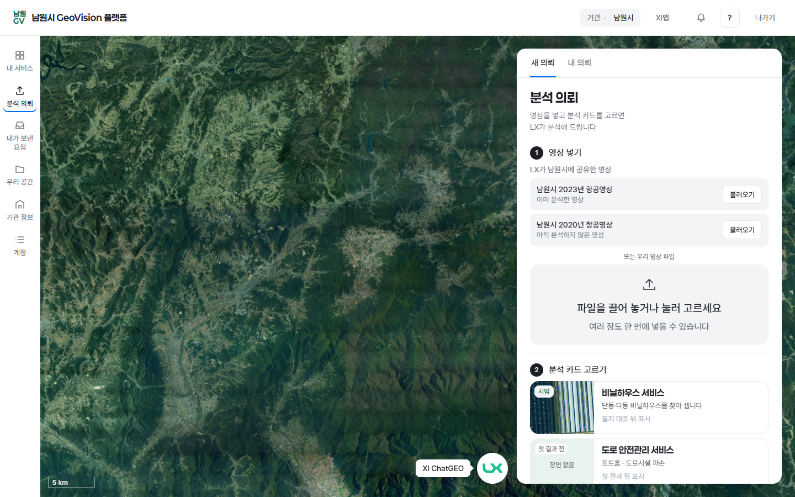 | 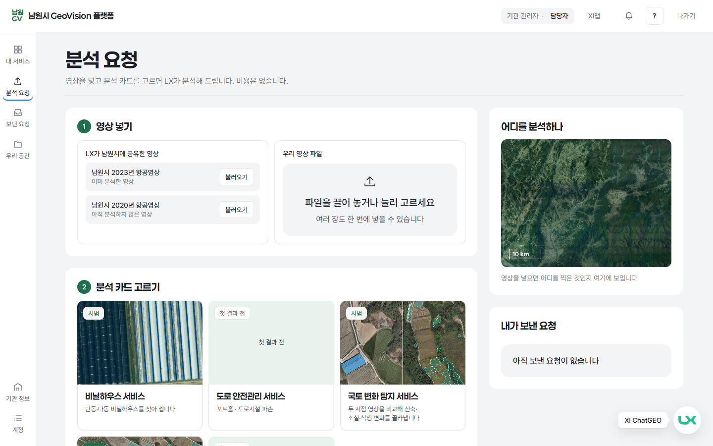 |  |
| — | 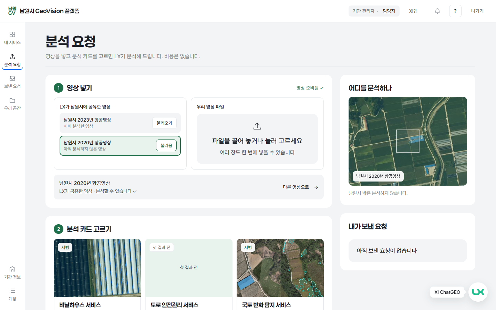 공유 영상을 불러오면 | — |
| 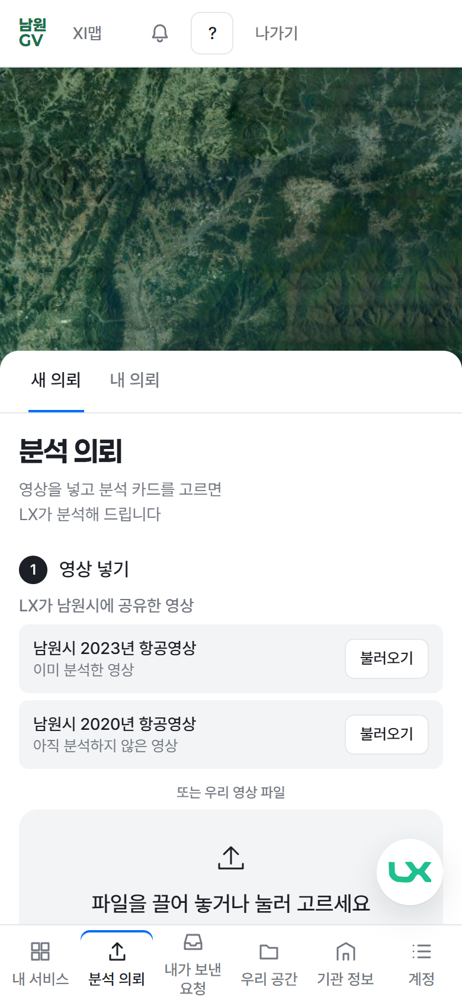 | 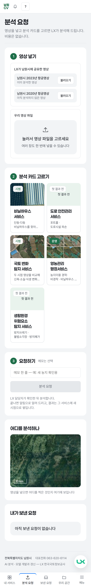 |  |

- 지도 한 장 + 오른쪽 시트(탭 '새 의뢰 · 내 의뢰') → 시안처럼 **왼쪽 세 단계**(① 영상 넣기: LX가 공유한 영상 · 우리 영상 파일 두 칸 ② 분석 카드 고르기: 카드 한 벌 작은 판 3열 ③ 요청하기: 메모 한 줄 · '분석 요청') + **오른쪽 '어디를 분석하나'**(작은 지도 — 처음엔 관할 · 영상을 넣으면 그 범위와 '○○ 일대' · '남원시 밖은 분석하지 않습니다') · **내가 보낸 요청**(목록 · 누르면 상세와 지도).
- 서버 검사 · 올리기 · 쉬운 말 한 줄은 그대로(전문 글 0). 휴대폰은 '눌러서 영상 파일을 고르세요'(끌어 놓기 없음).

이름 '분석 의뢰' → **'분석 요청'**으로 바꾼 곳(화면 글만 · 서버 안쪽 이름 · 표는 그대로):
| 자리 | 바뀐 글 |
|---|---|
| 기관 화면 | 왼쪽 메뉴 · 화면 제목 · 창 제목 · 버튼 알림('분석 요청을 보냈습니다') · '지금은 요청할 수 없습니다' · '아직 보낸 요청이 없습니다' · 서비스 대시보드의 요청 줄 · 메인 이용 방법 |
| 기관 가입 · 알림 | 알림 칸의 다른 할 일('분석 요청 확인 대기' · '담당 서비스 분석 요청') |
| LX 직원 | 요청함 숫자 칸 · 목록 서랍 제목 · 빈 상태 · 설명 · 홈(LX 직원 대시보드)의 요청함 칸 |
| LX 관리자 | 처리 목록의 종류(서버 이름표 · 화면 표) · 기관 서랍 공유 영상 칸('지도 · 분석 요청') |
| 서버가 보내는 글 | '기관 계정만 분석을 요청할 수 있습니다' · '…관할 안의 영상만 분석을 요청할 수 있습니다' · '이미 요청한 묶음입니다' · '이 영상은 이 서비스로 이미 분석했거나 요청했습니다' · '분석 요청이 없습니다' · '이미 결정된 분석 요청입니다' · 작업 이름 '분석 요청 · 기관 · 서비스' · 사용 현황 출처 글 |
| XI ChatGEO | 채팅 갈래가 이미 '분석 요청'으로 답한다(손대지 않음) |

## 6. 요청함의 보낸 사람(기관-8 ⓐ)
| 전 | 후 — LX 관리자 | 후 — LX 직원(받은 사람) |
|---|---|---|
| 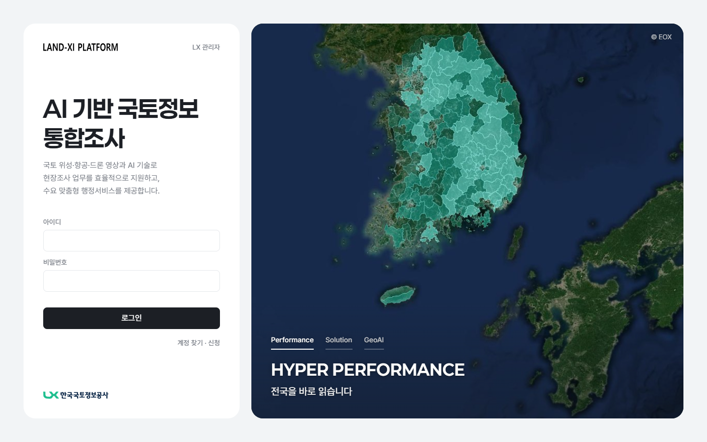 | 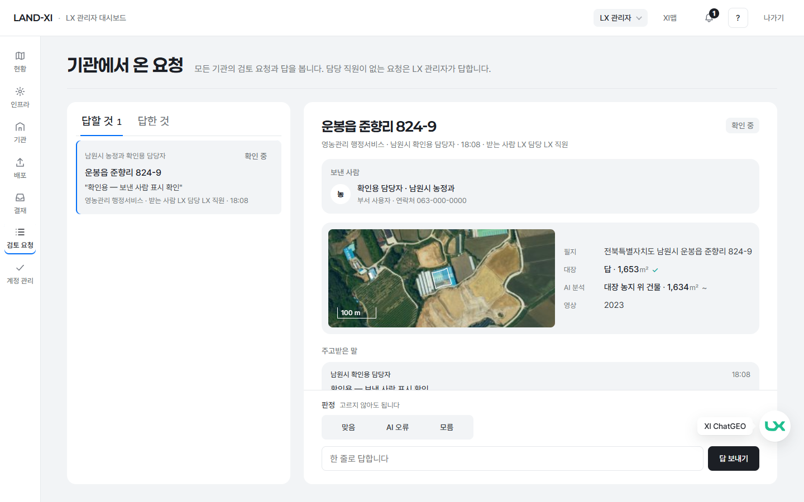 | 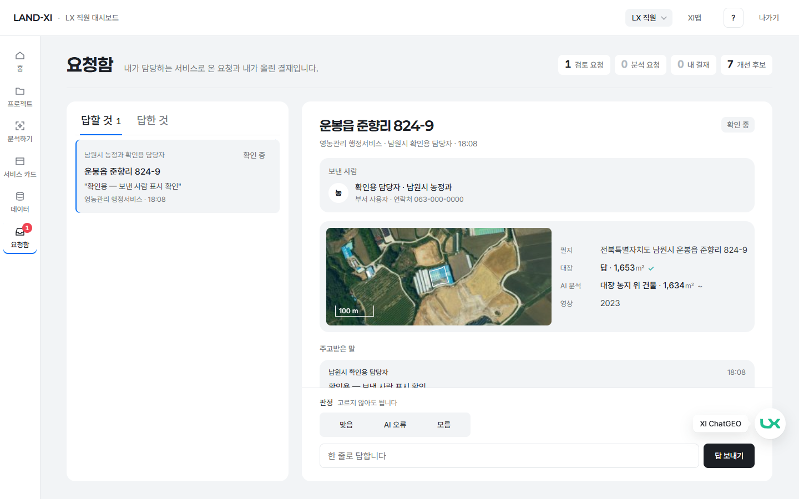 |

- 기관 검토 요청을 열면 **보낸 사람** 칸: 이름 · 기관 부서 / 역할 · 연락처. 목록 줄도 '남원시 농정과 이름'. 분석 요청 목록(요청함 숫자 '분석 요청')에도 보낸 사람 한 줄.
- 연락처는 그 사람이 스스로 적은 경우만 있다 — 기관 가입 신청에 **'연락처(선택)'** 칸을 더했고(동의 항목에도 '연락처(선택 — 적은 경우만)'), 승인되면 그 계정에 옮겨진다. 관리자가 대신 적지 않는다(원칙 105).
- 보는 사람: 그 요청을 받은 LX 담당 직원과 LX 관리자만(새 길 `GET /api/v1/accounts/senders` — 다른 직원의 요청은 빈 칸 · 기관 계정 403).
- 캡처는 확인용 부서 계정(농정과 · 연락처 063-000-0000 — 가짜 번호)으로 검토 요청 한 건을 보내 찍었고, 찍은 뒤 계정 · 배정 · 요청을 모두 지웠다.
- 시안의 '이 서비스의 남원시 담당'(기관 정보의 담당자 표 · 기관-7)은 검토 필요라 만들지 않았다.

## 시험
- 새 서버 시험 `server/tests/test_impl5_gov.py` 8건 통과: 메인 그림 = 저해상(800 이하) · 제한 영상 0 · 그 기관 것만 · 업무 결과 = 요약 같은 값 · 없는 기관 404 / 그림 거르기 단위(원 해상도 · 제한 · 저장소 밖 경로) / 부서 사용자 = 배정한 서비스만 / 읍면별 현장 확인 필요 합 = 큰 숫자 = 요약 / 시점 장면 = 관할 것만 · 최근 결과 = 결과 날짜 / 처리 목록 종류 · 서버 글 '분석 요청' / 가입 신청 연락처 → 승인 때 계정으로 · 30자 / 보낸 사람 = 관리자는 연락처까지 · 받지 않은 직원 0 · 기관 403 · `/me` 부서.
- 다시 돌린 서버 시험: 계정 · 공간 · 브랜드 · 검토 요청 · 대표 수치 · 화면 이름 규칙 52건 통과.
- 화면 시험(이 PC): `impl3-cards` 4건 · `impl3-space` 3건 · `impl2-request` 4건(분석 실행 단계는 GPU 를 쓰지 않게 건너뜀) 통과. 고친 것: 분석 요청 화면 모양(탭 없음 · 시트 → 세 단계) · 처리 목록 종류 이름.
- 화면 시험(바깥 주소): `impl2-gov-branch` 6건 — 대시보드 · 광주전남 · 기관 정보 · LX 관리자 서랍 통과(읍면별 합 = 큰 숫자 · 탭 다섯 · 내려받기 셋 · 네 시점 확인을 더함). 메인 두 건은 바깥 주소 로그인 시도 제한(10분 20번 — 이 PC 의 모든 갈래가 같이 씀)에 걸려 한 번 멈췄고 다시 돌려 확인(아래 '남은 것').
- 금지어(용어표 · 개발 정보) 0 · 가로 넘침 0 — 캡처마다 측정(shoot.mjs 출력).

## 남은 것
- '우리 공간' 메뉴 · 부서 배정 자리 · 결과 지도 탭 · 이력 · 통계 · 요청하기 · 필지 메모 · 기관 정보 정리 → 아래 **2묶음**(18차 확인분)에서 했다.
- 연락처를 본인이 나중에 적거나 고치는 자리 — 기관 쪽 '내 정보'(지금은 가입 신청 때만).
- 공유 영상 줄의 작은 그림(시안의 썸네일) — 공유 영상 미리 보기 그림이 서버에 없어 이름 · 상태만.
- '행정정보와 비교'(gov-fusion) 위쪽 서비스 띠에 비닐하우스 'AI 탐지 132,310건'(분석 칸 도형 수)이 그대로 보인다 — 이번 범위 밖이라 손대지 않음(같은 규칙으로 고칠 것을 제안).
- `impl3-imagery` 화면 시험 하나는 바로 고침 갈래의 '못 읽는 파일은 창으로'(M-2) 바꿈 때문에 기대 글자 자리가 달라져 실패 — 그 갈래 몫.
- 바깥 주소 첫 연결이 20초 걸리던 때가 있었다(17시 30분 무렵 · 지금은 1초 안) — 터널 연결 둘이 떠 있음(점검 제안).

## 이런 것도 필요하지 않을까요?
- **부서 사용자 첫 로그인 때 '맡은 서비스' 안내** — 누가: 부서 사용자. 왜: 정해 준 서비스가 없으면 빈 화면이다. '기관 관리자 ○○에게 서비스를 요청하세요' 한 줄과 기관 관리자 이름을 보여 주면 막히지 않는다.
- **읍면 막대에서 바로 필지 목록 거르기** — 누가: 담당 공무원. 왜: 읍면별로 현장 계획을 세운다. 막대를 누르면 지도 대신 그 읍면만 거른 필지 목록(내려받기 포함)으로 가는 길을 하나 더.
- **메인 업무 결과 숫자를 보일지 기관이 고르기** — 누가: 기관 관리자. 왜: 로그인 전에도 보이는 숫자라 기관마다 공개 여부 판단이 다를 수 있다(지금은 시안대로 보임 · LX 메인은 게스트에게 기관 자료 숫자를 '로그인 후 확인'으로 가린다).

---

# 2묶음 — 18차 확인분(10-01 오후 6:16): 요청하기 · 서비스 안의 결과 설명 · 내려받기 · 알림 · 부서 배정 · 필지 메모 · 기관 정보 · 못 읽는 파일

브리핑 확인: (1) 확인된 것만 — 촬영-1 ⓑ(왼쪽 '요청하기' 메뉴 + 결과 지도 안 '분석 요청') · N-1 ⓐ 묶음(설명 = 현황 카드 + 지도 카드 · 내려받기 = 통계·보고서 탭 한 곳 · 알림 = 종 + 메일 한 줄 · 배정 = 계정 화면) · 기관-9 ⓑ(메모 · 다음 확인 날짜만) · 기관-7 ⓑ(모습 · 소개 글만) · 기관-6 ⓐ 마무리(요청함의 못 읽는 파일 모양). 기관-1(메뉴 다시 그리기) · 기관-10 · 기관-11 · 기관-12 · 내 서비스 '최근 이력'은 손대지 않았다. (2) 분석 요청은 승인 도장이 아니라 관리하는 일(원칙 122) — 새로 만든 화면 글에 승인 도장을 뜻하는 낱말 0. (3) 숫자는 서버 값 한 출처 · 금액 설정은 `server/config/fees.yaml` 한 곳 · 메일 설정은 `server/.env` 한 곳 · 지역 고정값 0.

캡처: 바깥 주소에서 로그인 폼(`shoot2.mjs` · 1440 · 390 · `-full` = 아래까지). '전' = 이번에 고친 화면 파일만 지난 판(커밋된 판)으로 바꿔 끼워 같은 주소에서 찍음. 계정은 1묶음과 같다(비밀번호는 임시 비밀번호 · 대화로만).
증거용으로 만든 것(찍은 뒤 모두 지움): 촬영 요청 한 건(덕과면 1.5㎢ · LX 관리자 답) · 못 읽는 파일 확인 요청 한 건 · 필지 메모 한 줄 · 확인용 부서 사용자 계정.

## 어디서 보나(2묶음)
| 무엇 | 주소 | 누를 곳 |
|---|---|---|
| [기관 분기] 요청하기(분석 요청 · 촬영 요청 · 보낸 요청) | https://namwon.land-xi.dev/ | 로그인 → 왼쪽 '요청하기' → 탭 |
| [기관 분기] 서비스 탭 다섯 · 이력 · 통계·보고서 | 같은 곳 | 내 서비스 → 영농관리 '이 서비스 열기' → 탭 |
| [기관 분기] 결과 지도 카드 · 이 영상으로 분석 요청 · 필지 메모 | 같은 곳 | 서비스 → '결과 지도' 탭 → 필지 누르기 |
| [기관 분기] 새 결과 알림(종) · 메일 상태 | 같은 곳 | 머리의 종 |
| [기관 분기] 부서 배정 | 같은 곳 | 왼쪽 '계정' → 부서 사용자 한 줄 → '볼 수 있는 서비스' |
| [기관 분기] 기관 정보 | 같은 곳 | 왼쪽 '기관 정보' |
| [Land-XI] 촬영 요청 받기 · 답하기 · 못 읽는 파일 | https://admin.land-xi.dev/landxi/v3/lx-inbox/ | '촬영 요청' 단추 · 목록의 '못 읽는 파일' 줄 |

## 7. 요청하기 — 분석 요청 · 촬영 요청 · 보낸 요청(촬영-1 ⓑ)
| 전 | 후 | 시안 |
|---|---|---|
|  | 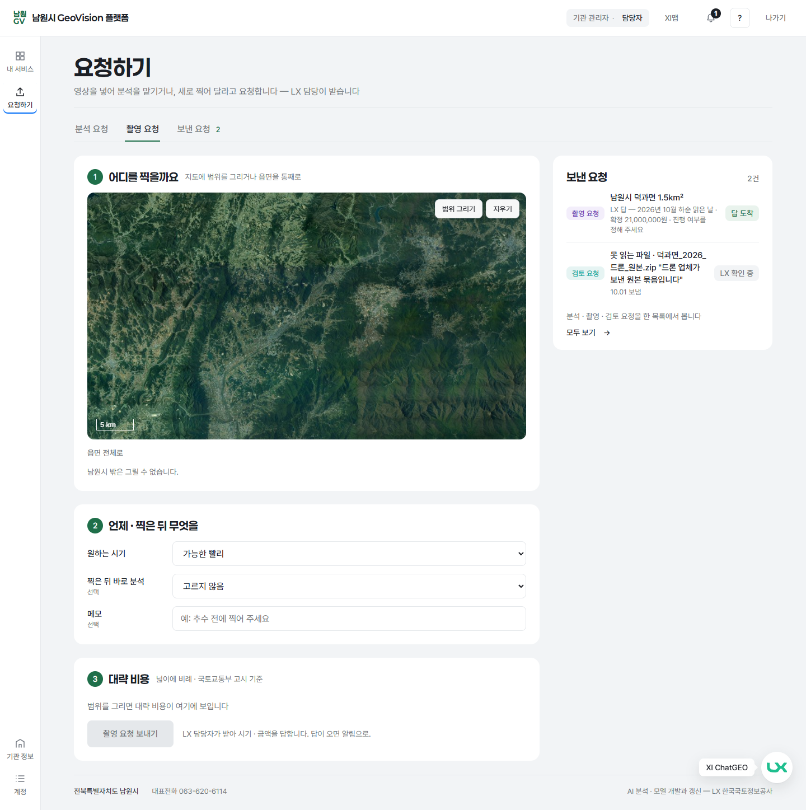 |  |
| — | 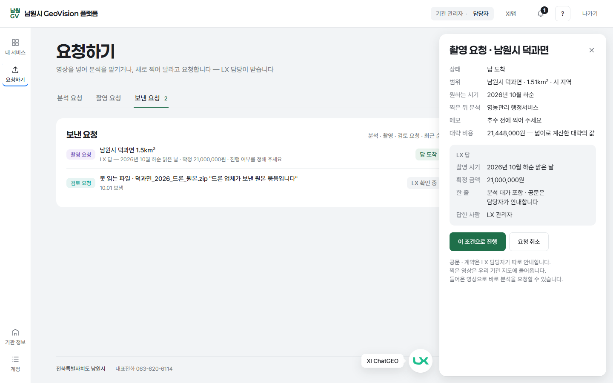 보낸 요청 · LX 답 | — |
| — | 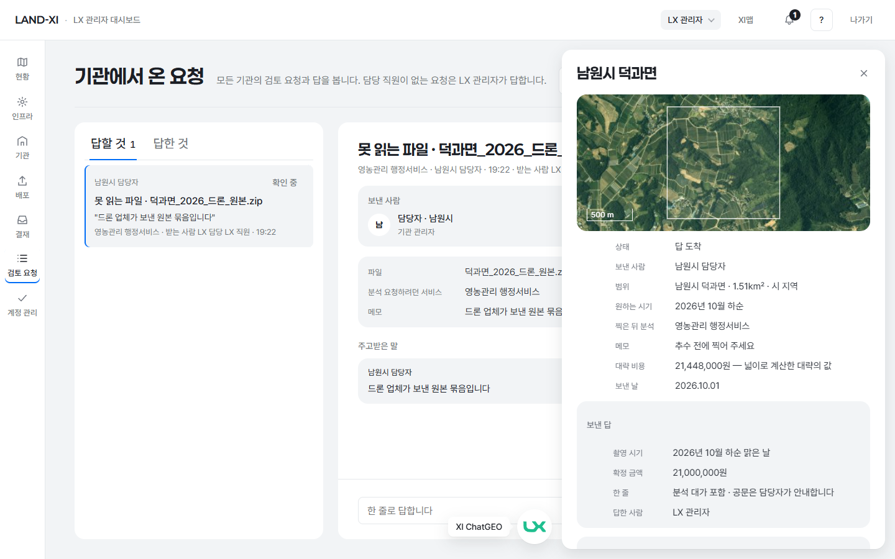 LX 관리자가 받아 답하기 | — |

- 왼쪽 메뉴 = **내 서비스 · 요청하기** + (기관 관리자) 기관 정보 · 계정. '분석 요청' · '보낸 요청' · '우리 공간' 메뉴는 '요청하기' 안 탭과 서비스 안으로 들어갔다. 휴대폰 아래 탭 = 내 서비스 · 요청하기 · 메뉴.
- **촬영 요청**: ① 어디를 찍을까요 — 지도에 '범위 그리기'(끌어서 네모) 또는 읍면 칩(읍면 전체 · 관할 경계는 서버) · 관할 밖은 서버가 받지 않음 ② 언제 · 찍은 뒤 바로 분석할 서비스(선택) · 메모(선택) ③ **대략 비용** = 화면에 보이는 넓이 ÷ 0.25㎢ × 국토교통부 고시 기준 금액(시 · 군 · 구 지역 — 범위 가운데의 시군구 이름으로) · 천 원 단위 · "대략의 값 · LX 담당자가 조정해 확정"(촬영-2 ⓑ · 촬영-3 ⓐ). 금액은 `server/config/fees.yaml` 한 곳 — 화면 · 코드에 금액 0.
- 받는 쪽 = **LX 관리자**(원칙 120 — 담당 지정 화면은 기관-11 '새 화면으로' 다시 설계 중): 기관에서 온 요청 머리의 '촬영 요청 n건 · 답 기다림 m' → 목록 → 한 건(범위 지도 · 넓이 · 원하는 시기 · 찍은 뒤 분석 · 메모 · 대략 비용) → 촬영 시기 · 확정 금액 · 한 줄로 답하거나 사유 한 줄로 반려. 알림 칸(종)에 '촬영 요청 — 답을 기다립니다'.
- 기관은 '보낸 요청'에서 LX 답(시기 · 확정 금액 · 한 줄)을 보고 **이 조건으로 진행 / 요청 취소**. 종에 '촬영 요청에 LX 답이 왔습니다'. 공문 · 계약은 바깥 절차(화면에 한 줄).
- **보낸 요청** 탭 = 분석 요청 · 촬영 요청 · 검토 요청(못 읽는 파일 확인 포함)을 한 목록에 최근 순. 촬영 요청 탭 오른쪽에 세 줄 + '모두 보기'.

## 8. 결과 지도 안의 '보고 있는 결과' · '이 영상으로 분석 요청'(촬영-1 ⓑ · N-1 ⓐ 설명)
| 전 | 후 | 시안 |
|---|---|---|
| 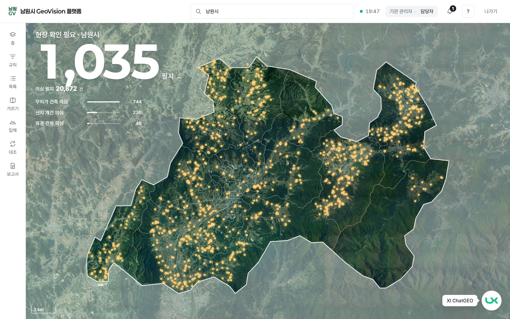 | 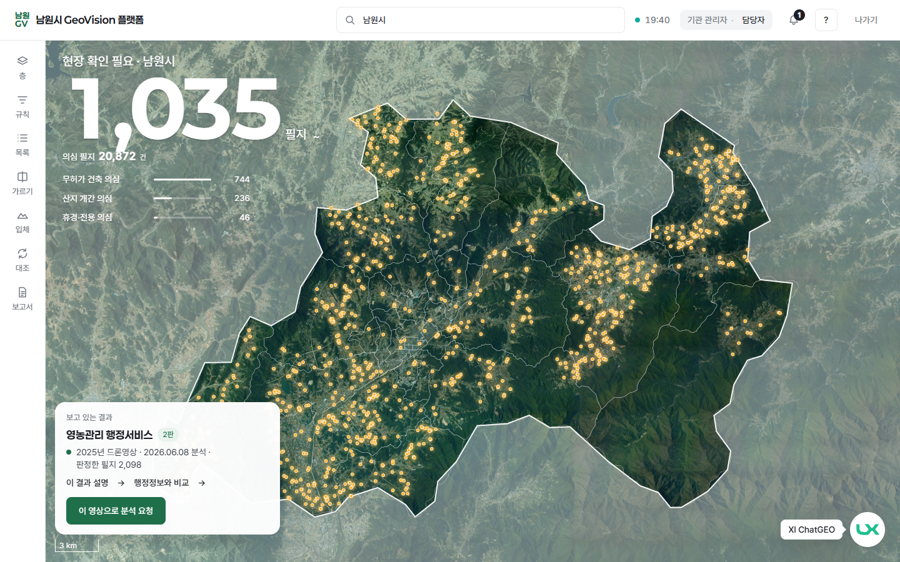 |  |
| — | 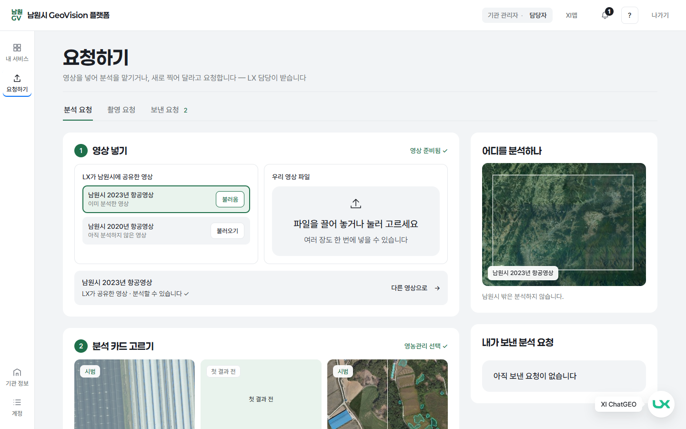 누르면 그 영상 · 서비스가 들어간 채 | — |

- 서비스의 '결과 지도' 탭은 그 서비스를 달고 XI맵을 연다 → 지도 왼쪽 아래 **보고 있는 결과** 카드: 서비스 · 판 · 영상 · 분석한 날 · 업무 결과(현황 '이 결과는'과 같은 값) · '이 결과 설명'(같은 서랍) · '행정정보와 비교' · **이 영상으로 분석 요청**(지금 보는 곳의 LX 공유 영상 · 그 서비스를 고른 채 요청하기가 열림 · 분석할 수 있는 영상이 없으면 '분석 요청'). 휴대폰은 단추만.

## 9. 서비스 탭 다섯 — 현황 · 결과 지도 · 필지 목록 · 이력 · 통계·보고서(N-1 ⓐ)
| 전 | 후 | 시안 |
|---|---|---|
| 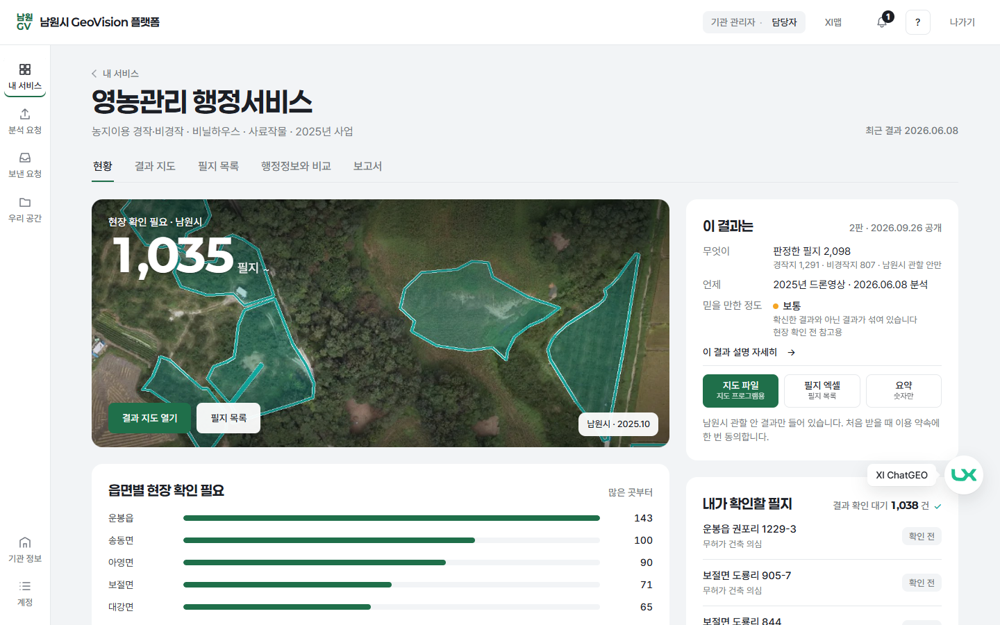 | 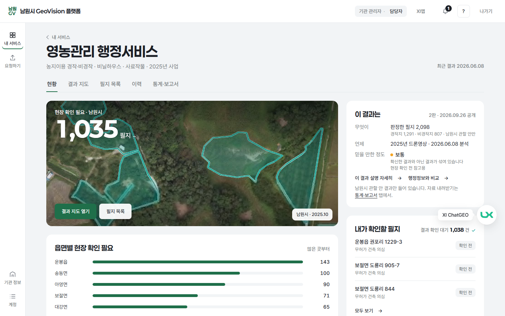 |  |
| — | 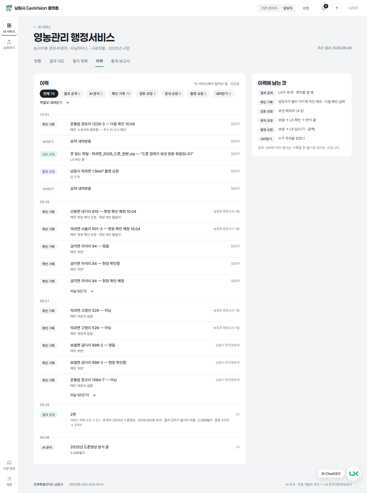 이력 |  |
| — | 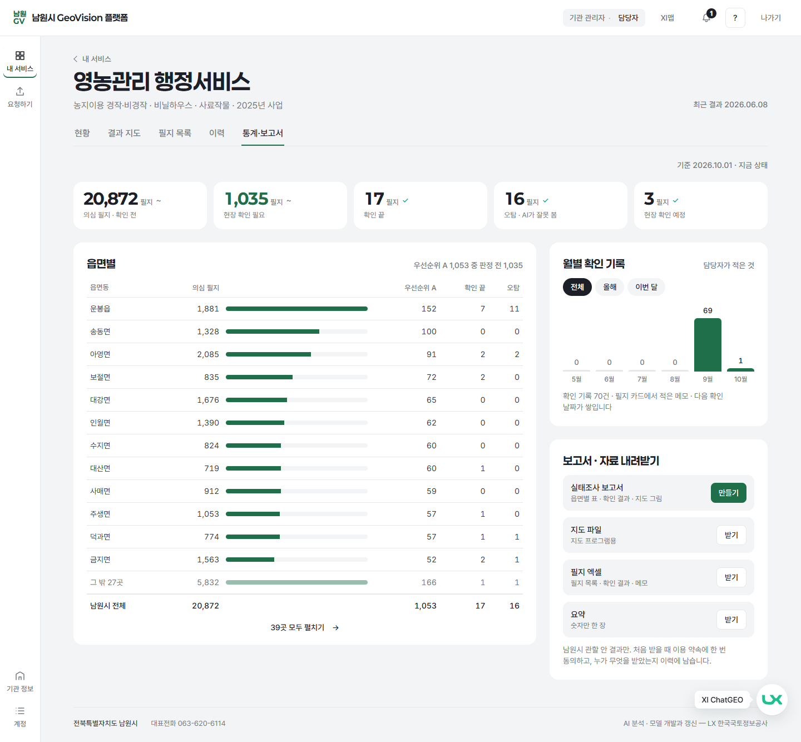 통계·보고서 |  |

- 현황 '이 결과는' = 설명 세 줄 · '이 결과 설명 자세히'(여섯 칸 서랍) · '행정정보와 비교'. **내려받기 셋은 통계·보고서 탭 한 곳**으로 옮겼다(현황 카드 · 서랍에는 그 탭으로 가는 한 줄).
- **이력** = 그 서비스에서 일어난 일 한 줄기(결과 공개 · AI 분석 · 확인 기록 · 검토 요청 · 분석 요청 · 촬영 요청 · 내려받기) · 거르기 칩(종류마다 수) · 날짜별 · 하루 다섯 줄 + '이날 n건 더' · 엑셀(CSV) 내려받기. 새로 적는 칸 0 — 서버에 이미 쌓이는 기록을 사람 말로(필지 상태 기록 · 검토 요청 · 분석 요청 · 촬영 요청 · 내려받기 기록 · 결과 설명서 판).
- **통계·보고서** = 다섯 숫자(의심 필지 · 현장 확인 필요 · 확인 끝 · 오탐 · 현장 확인 예정 — 지금 상태 · 기준일) · 읍면별 표(많은 곳 열두 줄 + 그 밖 + 전체 · 모두 펼치기) · 월별 확인 기록(기간 칩 전체 · 올해 · 이번 달) · 실태조사 보고서 만들기 · 지도 파일 · 필지 엑셀 · 요약 받기(처음 한 번 이용 약속 · 누가 받았는지 이력에).
- 숫자 한 출처: 현장 확인 필요 1,035 = 현황 큰 숫자 = 대표 수치 요약 · 읍면 칸 합 = 전체(의심 필지 20,872 · 우선순위 A 1,053) — 서버 시험으로 확인.

## 10. 새 결과 알림 · 부서 배정 · '우리 공간' 없앰(N-1 ⓐ)
| 전 | 후 |
|---|---|
| 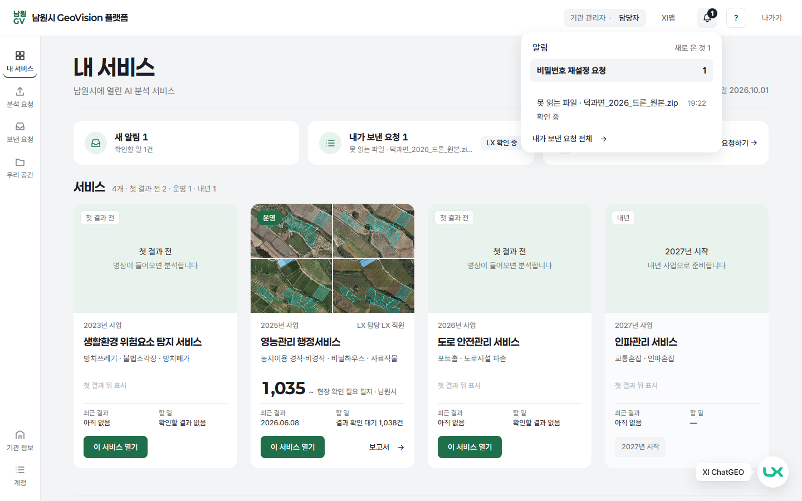 | 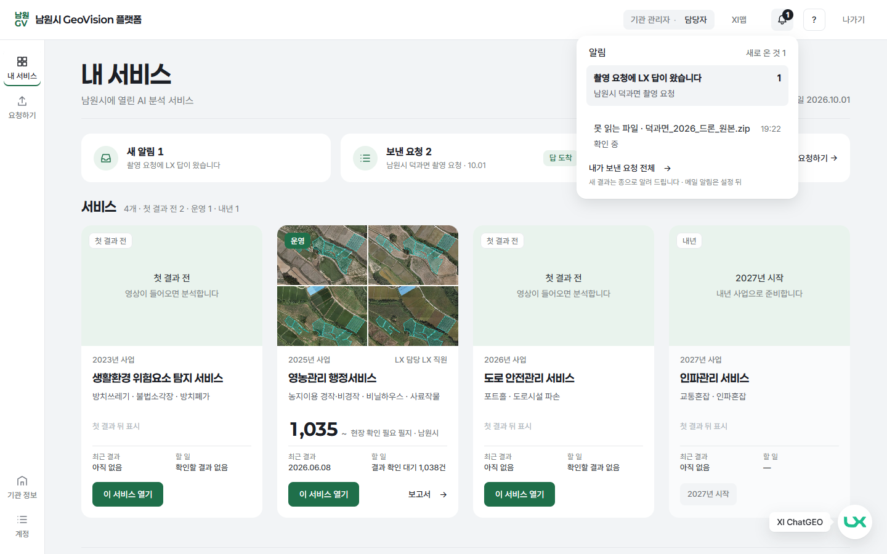 |
| 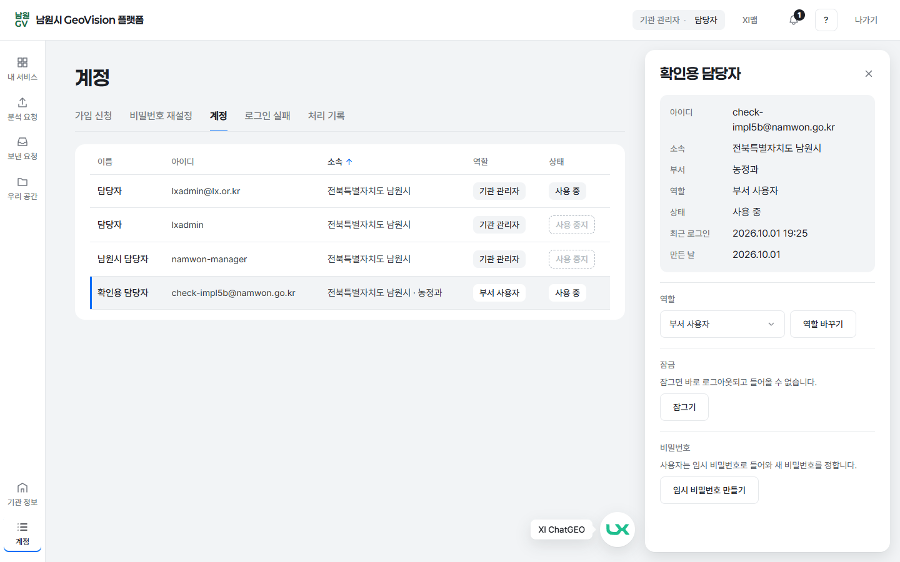 | 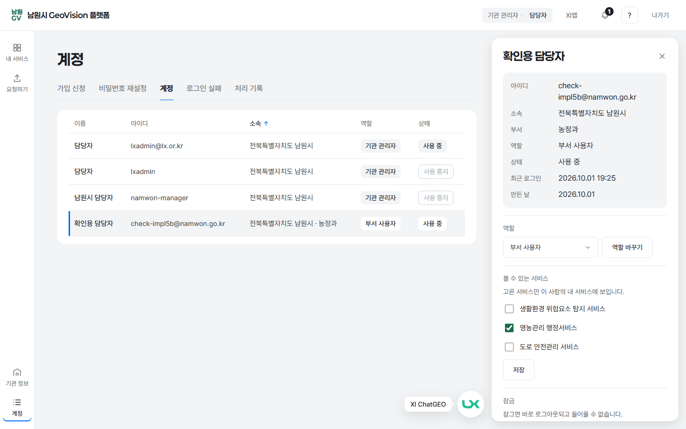 |

- **새 결과** = 머리의 종(다른 할 일 '새 결과' — 볼 수 있는 서비스의 새 판 · 읽으면 빠짐) + **메일 한 줄**(새 판이 생길 때 그 서비스를 볼 수 있는 기관 사람에게 · 원칙 89 알림에만). 메일 서버 설정은 `server/.env`(LX_MAIL_HOST · LX_MAIL_PORT · LX_MAIL_USER · LX_MAIL_PASSWORD · LX_MAIL_FROM)에만 — **지금은 설정이 없어 종만** 오고, 종 칸 아래에 '새 결과는 종으로 알려 드립니다 · 메일 알림은 설정 뒤'.
- **부서 배정** = 계정 화면 → 부서 사용자 한 줄 → **볼 수 있는 서비스**(체크 · 저장) — 우리 공간의 배정과 같은 기록이라 내 서비스 · 이력 · 통계가 바로 그대로 거른다.
- '우리 공간' 메뉴는 없다. 옛 주소(gov-space)는 그 서비스의 통계·보고서 탭(없으면 내 서비스)으로 보낸다. 내 서비스 오늘 띠 = 새 알림 · 보낸 요청 · 요청하기.

## 11. 필지 카드 — 메모 한 줄 + 다음 확인 날짜(기관-9 ⓑ)
| 전 | 후 | 시안 |
|---|---|---|
| 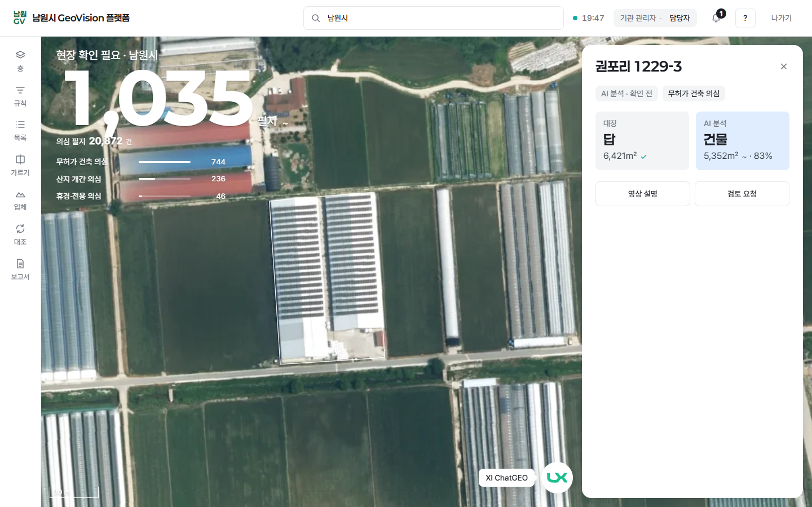 '영상 설명' | 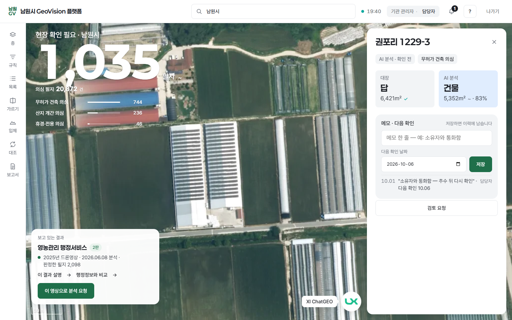 |  |

- 기관 필지 카드(결과 지도 · 행정정보와 비교)에서 '영상 설명'을 뺐고 **메모 한 줄 · 다음 확인 날짜 · 저장**만(맞음 · 아님 버튼 없음). 저장하면 상태는 그대로 두고 기록 한 줄(서버의 필지 상태 기록 · 메모 · 다음 확인 날짜 — 새 칸 0)이 남아 이력 탭 '확인 기록'에 "— 다음 확인 10.06 · 메모 '…'"로 쌓인다. 카드 아래에 그 필지의 최근 메모 세 줄.
- 적기 = 기관 관리자만(지금 서버 규칙 그대로) · 부서 사용자는 읽기만('기관 관리자가 적습니다'). LX 화면의 필지 카드는 그대로('영상 설명' 있음).
- 필지 정보에 연속지적 · LX맵을 잇는 것(18차 기관-9 덧 · 원칙 123)은 다시 설계 중이라 손대지 않았다.

## 12. 기관 정보 — 모습 · 소개 글만(기관-7 ⓑ)
| 후 |
|---|
| 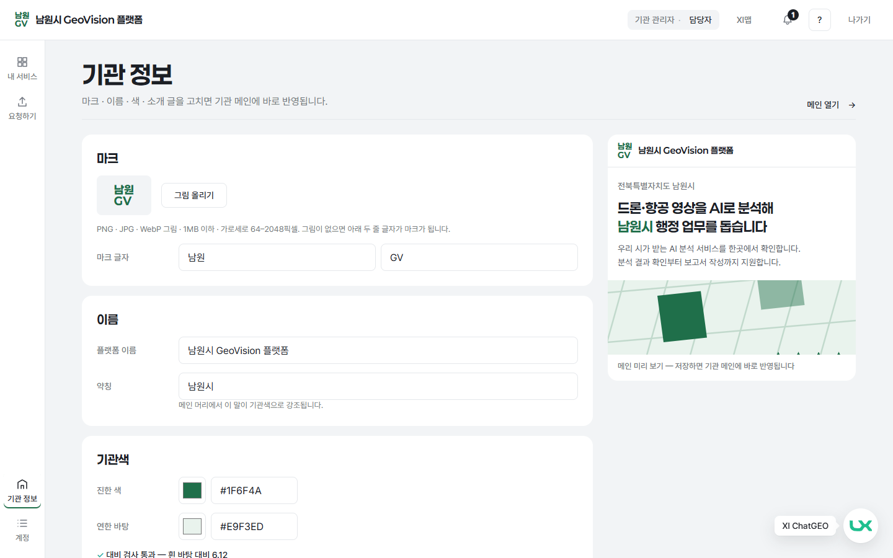 |

- 지금 기관 정보는 이미 마크 · 이름 · 기관색 · 메인 소개 글 · 문의처만 있다(시안의 '서비스별 우리 담당자' 표 · 기록 카드는 만들지 않았음) — 확인만 하고 고친 것 없음.

## 13. 요청함 — '못 읽는 파일' 확인 요청은 파일 모양(기관-6 ⓐ 마무리)
| 전 | 후 |
|---|---|
| 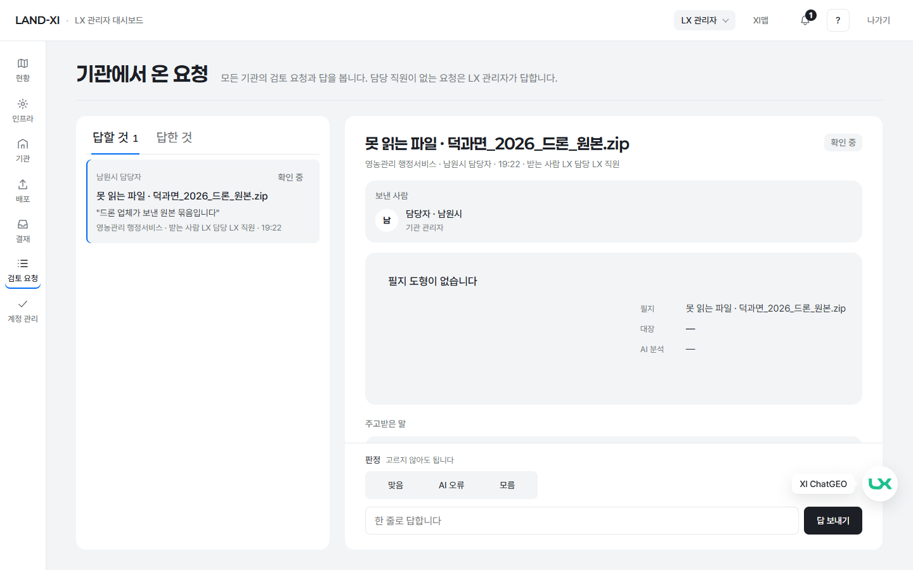 필지 지도 · 판정 칸 | 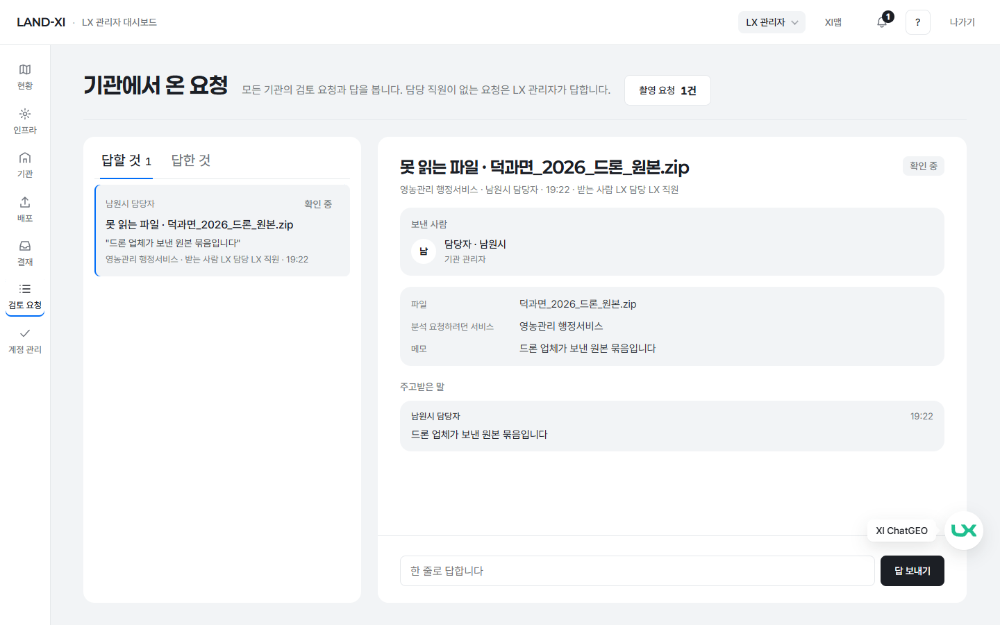 |

- 종류가 '못 읽는 파일'인 건은 **파일 이름 · 분석 요청하려던 서비스 · 보낸 사람(이름 · 부서) · 메모 · 답하기**만 — 필지 지도 · 대장 · AI 분석 · 판정 칸 없음. LX 담당 직원 · LX 관리자 화면 같음.

## 2묶음 — 시안과 다른 점
- **결과 지도는 서비스 안 탭이 아니라 XI맵 화면으로 연다**(시안 A안은 탭 안 지도). 탭 구조를 새로 짜는 일(기관-1 다시 그리기)이 '다시'라 지금 XI맵에 '보고 있는 결과' 카드 · 단추만 붙였다. XI맵의 기관 왼쪽 칸은 지도 도구라 '내 서비스'로는 머리의 마크로 돌아간다.
- 통계의 **기간 칩은 월별 확인 기록에만** 건다 — 다섯 숫자는 지금 상태(기준일)라 기간으로 자르면 같은 이름의 숫자가 둘이 된다(사용자 규칙 3). 숫자 이름도 짧게(의심 필지 · 확인 전 / 현장 확인 필요 / 확인 끝 / 오탐 · AI가 잘못 봄 / 현장 확인 예정).
- 이력 탭의 촬영 · 분석 · 검토 요청 줄은 실제 기록만(시안의 '예시' 줄 없음). 확인 기록은 지금 남원시에 쌓인 그대로.
- 촬영 요청의 대략 비용은 **화면에 보이는 넓이(소수 둘째 자리)로 셈**한다 — 보이는 넓이 × 고시 금액 = 보이는 금액이 되게.
- 메일 알림 '계정에서 끄기'는 아직 없다(메일 서버 설정 뒤 함께).

## 2묶음 — 이름 바꾼 곳
| 화면 | 바꾼 말 |
|---|---|
| 기관 왼쪽 메뉴 | 분석 요청 · 보낸 요청 · 우리 공간 → **요청하기**(탭 분석 요청 · 촬영 요청 · 보낸 요청) |
| 내 서비스 오늘 띠 | 내가 보낸 요청 → 보낸 요청 · 분석 요청 → 요청하기 |
| 서비스 탭 | 현황 · 결과 지도 · 필지 목록 · 행정정보와 비교 · 보고서 → 현황 · 결과 지도 · 필지 목록 · **이력 · 통계·보고서**('행정정보와 비교'는 '이 결과는' 카드 · 지도 카드로) |
| 분석 요청 탭 오른쪽 | 내가 보낸 요청 → 내가 보낸 분석 요청 |
| 기관 필지 카드 | '영상 설명' 단추 → 메모 · 다음 확인 날짜 |

## 2묶음 — 서버
- 새 길(게이트웨이 시작 파일은 그대로 — 공간 라우터에 붙임): 촬영 요청(대략 비용 셈 · 보내기 · 목록 · 한 건 · LX 관리자 답 · 기관 진행 · 취소) · 서비스 이력 · 통계 · 필지 메모 쓰기 · 읽기. 알림 칸에 다른 할 일 셋(새 결과 · 촬영 요청 답 기다림 · 촬영 요청 답 도착)과 메일 설정 여부.
- 새 표 촬영 요청(마이그레이션 0024 · 기관 분리 규칙) · 설정 `server/config/fees.yaml`(고시 금액 · 기준 넓이 · 일반구 · 한 번에 100㎢까지) · 메일 보내기(설정 없으면 0통).

## 2묶음 — 시험
- 새 서버 시험 `server/tests/test_impl5_gov2.py` 6건 통과: 대략 비용 = 보이는 넓이 ÷ 기준 넓이 × 고시 금액 · 관할 밖 400 · LX 계정 403 · 너무 넓으면 나눠 달라 / 보내기 → LX 관리자 목록(기관 · 보낸 사람 · 범위) · LX 직원 403 · 시기 · 사유 필수 · 답 → 기관 종 '답 도착' → 진행 → 취소 409 / 이력 = 그 서비스만 · 시간순 · 종류 수 합 · 배정 없는 부서 사용자 404 · 다른 기관 서비스 404 / 통계 현장 확인 필요 = 요약 · 읍면 합 = 전체 / 메모 = 상태 그대로 · 이력 '다음 확인 M.DD' · 부서 사용자 403 · 지난 날짜 400 / 새 결과 종 · 읽으면 빠짐 · 메일 설정 없으면 0통.
- 다시 돌린 서버 시험: 1묶음 · 검토 요청 · 공간 · 브랜드 · 계정 · 바로 고침 64건 통과.
- 화면 시험(이 PC): `impl3-space`(우리 공간 → 서비스 안 — 여섯 칸 서랍 · 통계·보고서 내려받기 · 동의 · 다른 기관 0으로 고침) · `impl3-cards` 7건 · `impl2-request` 4건(관리자 서랍의 '공유 영상' 칸 선택자를 고침 — 같은 서랍에 배경 사진 칸이 더해짐) 통과. `impl2-gov-branch`(바깥 주소)는 탭 다섯 · 통계 다섯 숫자 = 큰 숫자 · 내려받기 넷 · 이력 · '행정정보와 비교' 링크로 고침.
- 금지어 0 · 가로 넘침 0 — 캡처마다 측정(shoot2.mjs 출력).

## 2묶음 — 남은 것
- 결과 지도를 서비스 탭 안 지도로(기관-1 다시 그리기 답 뒤) · 내 서비스 '최근 이력'(기관-1 메모 — 다시 설계 중).
- 촬영 요청 담당 지정(기관-11 '새 화면으로') — 지금은 LX 관리자만 받는다.
- 메일 서버 설정(server/.env) — 정식 오픈 전 LX 정보보안 · 메일 담당과 확인. 계정에서 메일 끄기는 그 뒤.
- 필지 정보 연속지적 · LX맵 연계(기관-9 덧 · 원칙 123) — 다시 설계 중.

## 2묶음 — 이런 것도 필요하지 않을까요?
- **다음 확인 날짜가 되면 종 · 메일 한 줄** — 누가: 담당 공무원. 왜: 적어 둔 '다음 확인 10.06'이 지나도 아무도 모른다. 새 결과 알림과 같은 길(종 다른 할 일)로 그날 아침에 한 줄.
- **부서 사용자도 맡은 서비스 필지에 메모** — 누가: 현장에 나가는 부서 담당자. 왜: 지금 서버 규칙은 기관 관리자만 적을 수 있어, 실제로 다녀온 사람이 관리자에게 전해 적어야 한다. 배정된 서비스의 필지에만 적게 열면 기록이 바로 남는다.
- **촬영 요청 확정 금액의 근거 한 줄** — 누가: 기관 예산 담당. 왜: 대략 값과 확정 값이 다를 때(끝수 · 부가세 · 분석 대가) 무엇이 더해졌는지 줄로 보이면 기관 안 문서에 바로 붙일 수 있다.
