# 구현 5차 · 프로젝트 한 장 — 재학습 근거 · 기록 · 메모 · 파일 · 프로젝트장 넘기기 · 내 정보

> 2026-10-01 저녁 · 오퍼스(구현). 확인 17차에서 고르신 셋만 만들었습니다 — **P-3 ⓐ 띠 + 누를 때 사유 창 · P-4 ⓐ 최근 3줄 + 모두 보기 서랍(메모 · 파일 포함) · P-5 ⓐ 넘기기 + 내 정보(+ 저장 용량)**.
> 프로젝트 한 장의 배치(P-2 — 검토 필요)와 목록의 '막힌 곳'(P-1 — 다시)은 손대지 않았습니다. 오른쪽 칸(사람 · 재학습) 안에 넣고, 그 아래 기록 칸 하나를 더했습니다. 단계 줄 · 메뉴 · 대시보드 틀도 그대로입니다.
> 화면은 바깥 주소(https://app.land-xi.dev · 관리자는 https://admin.land-xi.dev)에 바로 올라가 있고, 캡처도 바깥 주소에서 로그인 폼으로 들어가 찍었습니다(세션 주입 없음). 학습은 돌리지 않았습니다(GPU 0).

## 어디서 보나
| 무엇 | 주소 · 계정 | 누를 곳 |
|---|---|---|
| 재학습 띠 · 사유 창 · 기록 칸 · 넘기기 | https://app.land-xi.dev/landxi/v3/lx-project/ · test@lx.or.kr · 임시 비밀번호 | 왼쪽 메뉴 '프로젝트' → '비닐하우스 2026' (재학습 · 넘기기 창은 열어 보고 취소 — 누르면 실제로 바뀝니다) |
| 내 정보 | 같은 계정 · 아무 화면 | 머리 오른쪽 'LX 직원 ▾' |
| 재학습 사유가 보이는 결재 | https://admin.land-xi.dev/landxi/v3/ops-core/#/approvals · lxadmin@lx.or.kr | 결재 줄을 열면 '재학습 사유' (재학습 회차에서 올라온 결재가 생길 때만 — 지금은 없음) |

## 시안과 나란히
| 항목 | 시안(설계 8차) | 만든 것 |
|---|---|---|
| P-3 재학습 근거 | 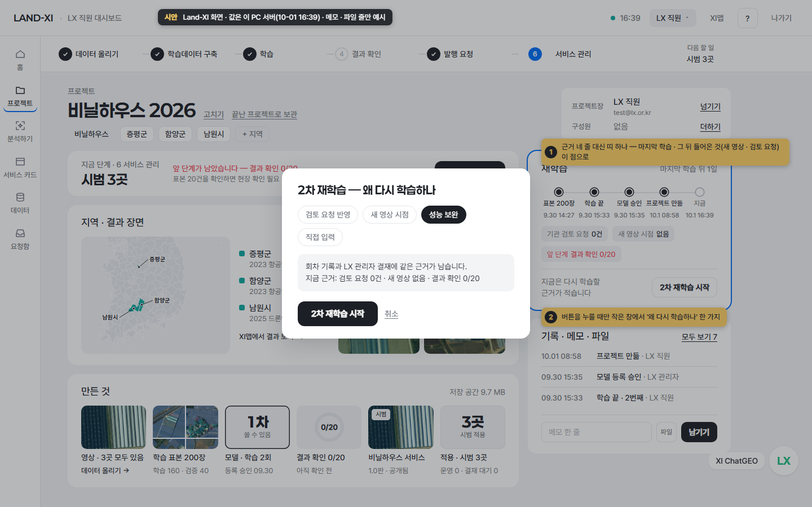 | 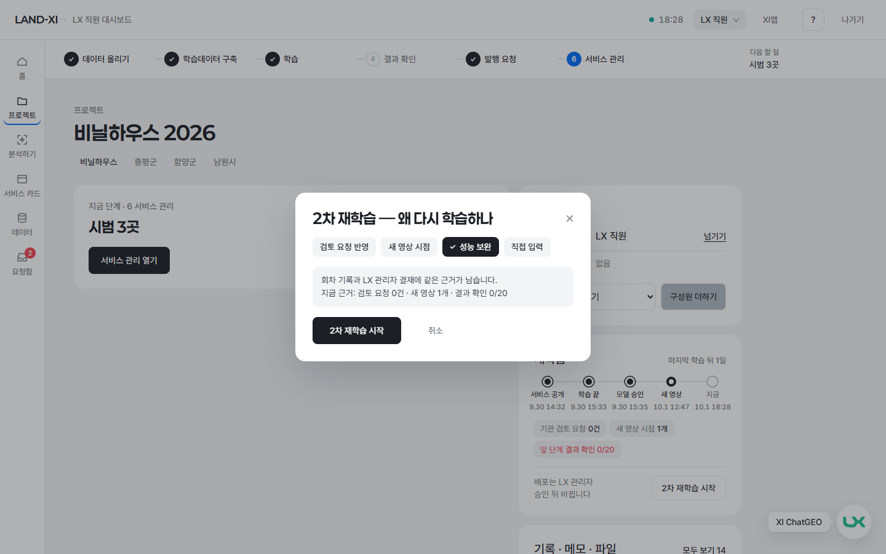 |
| P-4 기록 · 메모 · 파일 | 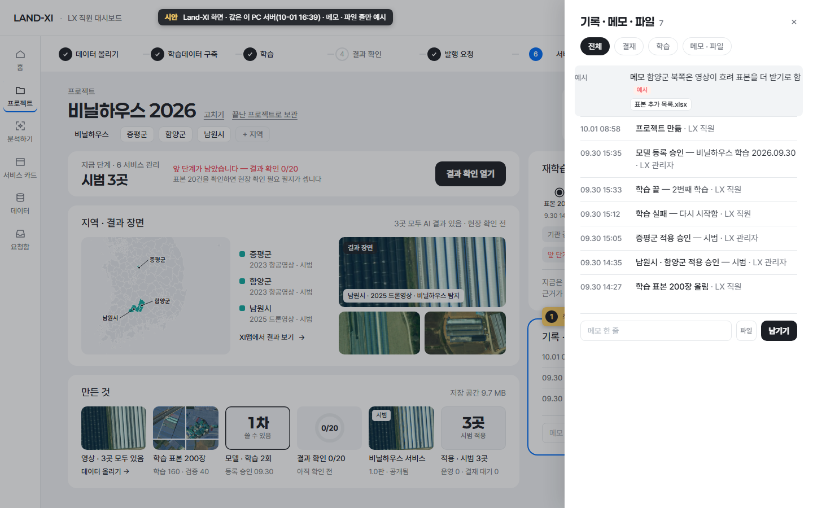 | 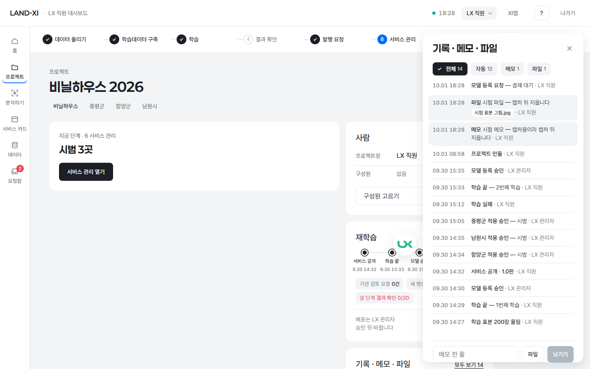 |
| P-5 넘기기 | 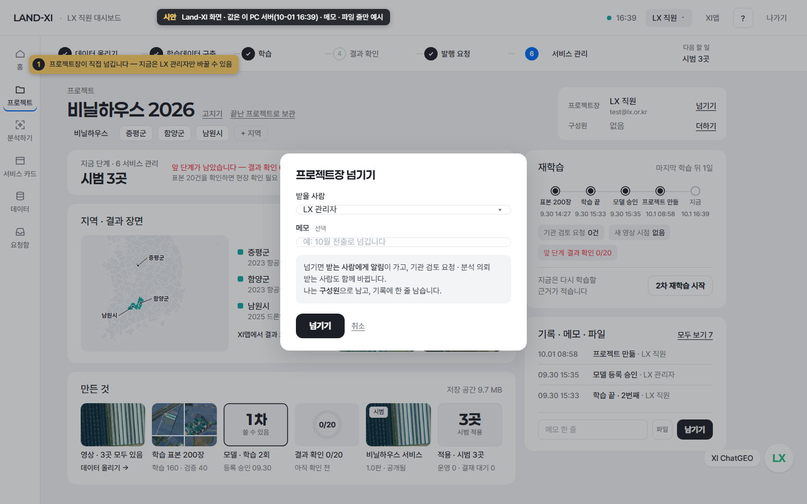 | 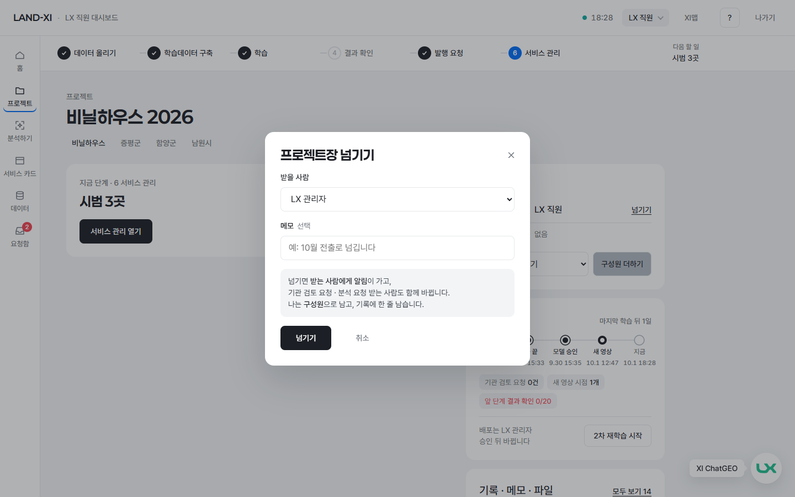 |
| P-5 내 정보 | 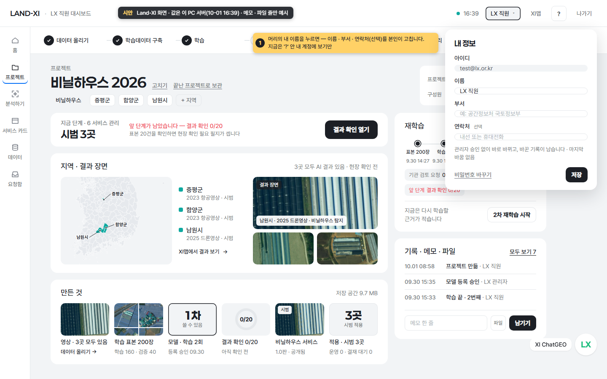 | 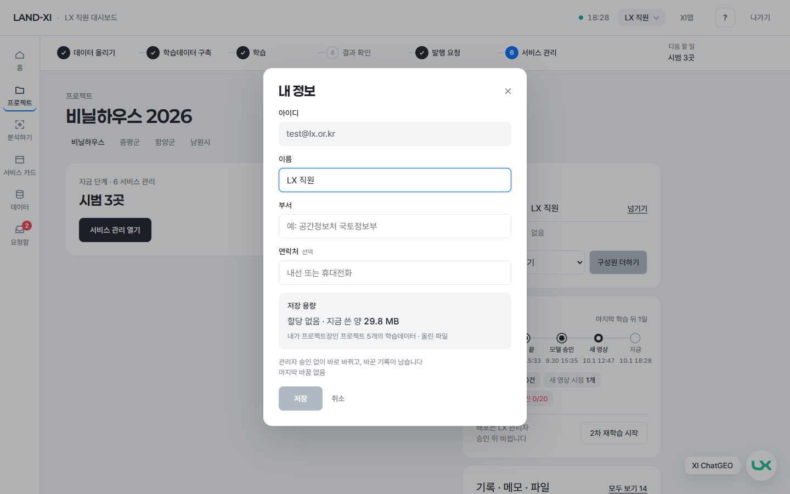 |

시안과 다른 점 — 시안은 이미 지도 · 결과 장면 · 만든 것 그림 칸(P-2)이 있는 화면 위에 그렸지만, P-2 는 검토 중이라 지금 화면의 오른쪽 칸 안에만 넣었습니다(그래서 왼쪽 아래는 아직 비어 있습니다 — P-2 가 정해지면 채웁니다). 내 정보는 시안의 '이름 아래 작은 판' 대신 다른 창들과 같은 가운데 창(휴대폰은 전체 화면)으로 열었습니다.

## 1. 재학습 근거(P-3 ⓐ) — 띠 하나 · 칩 셋 · 누를 때 사유
| 지금(전) | 바뀐 뒤 |
|---|---|
| 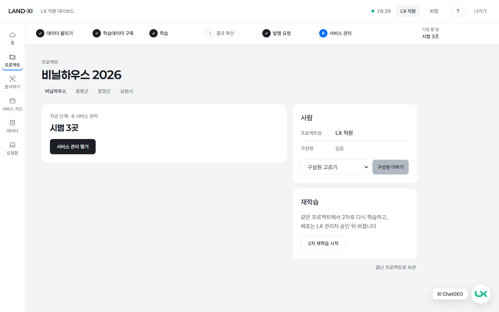 | 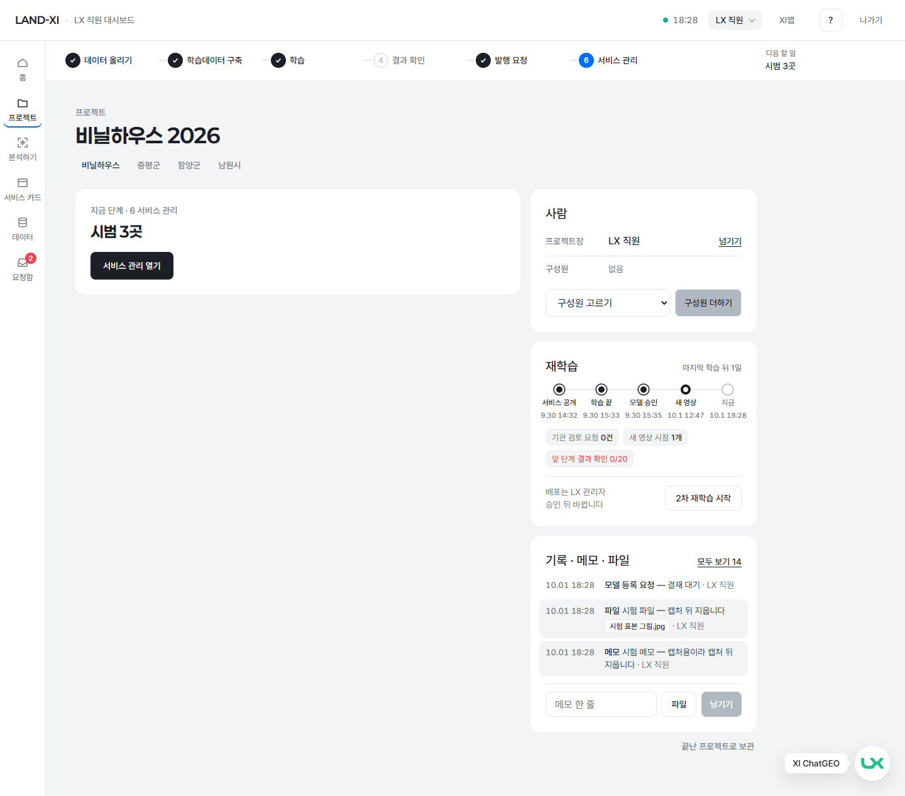 |

- **띠의 점 = 서버 기록의 실제 시각**: 학습 표본 · 학습 끝 · 모델 승인 · 서비스 공개 · n차 시작 · 프로젝트 만듦 · (마지막 학습 뒤) 새 영상 · 기관 검토 요청 가운데 시각순으로 넷 + 지금(빈 점). 넘치면 '프로젝트 만듦'부터, 그다음 오래된 것부터 뺍니다. 마지막 학습 뒤에 들어온 것(새 영상 · 검토 요청)은 속이 빈 굵은 점입니다.
- **칩 셋**: 기관 검토 요청 n건(마지막 학습 뒤 · 이 서비스) · 새 영상 시점 n개 / 없음(마지막 학습 뒤 대상 지역에 등록된 영상) · 앞 단계 남음(목록의 막힌 곳과 같은 말, 빨강).
- 검토 요청도 새 영상도 없으면 회색 한 줄 **'지금은 다시 학습할 근거가 적습니다'** — 막지 않습니다(판단은 프로젝트장). 근거가 있으면 '배포는 LX 관리자 승인 뒤 바뀝니다'.
- **'n차 재학습 시작' → 작은 창**: 검토 요청 반영 · 새 영상 시점 · 성능 보완 · 직접 입력 가운데 하나를 골라야 시작 버튼이 켜집니다. 고른 말은 서버 회차 기록과 프로젝트 기록('2차 재학습 시작 — 사유 성능 보완')에 남고, 그 회차에서 올라온 모델 등록 · 새 판 공개 결재를 관리자가 열면 **'재학습 사유 2차 · 성능 보완'** 으로 보입니다. 재학습은 지금처럼 프로젝트장만(구성원 · 다른 직원 · 관리자는 버튼이 없고 서버도 거절).

| 사유 창(휴대폰) | 관리자 결재에 같은 사유 |
|---|---|
| 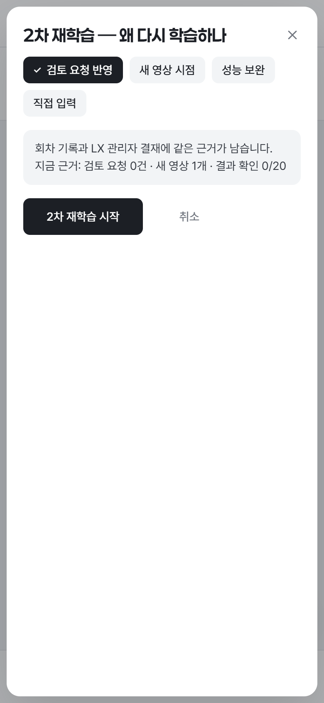 | 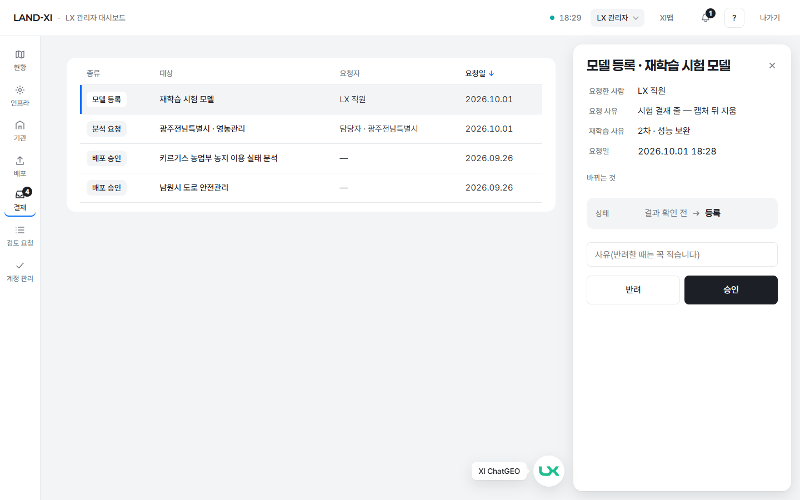 |

관리자 결재 캡처는 학습을 돌리지 않으려고, 2차 회차(사유 '성능 보완')인 시험 프로젝트와 그 회차의 모델 등록 결재 한 줄을 서버에 잠깐 만들어 찍고 바로 지웠습니다(요청 사유 칸의 '시험 결재 줄 — 캡처 뒤 지움').

## 2. 기록 · 메모 · 파일(P-4 ⓐ) — 최근 3줄 + 모두 보기 서랍
- 한 장에는 **최근 3줄 + '모두 보기 n' + 메모 한 줄 · 파일 · 남기기**. 자동 기록은 서버에 이미 있던 기록입니다(만듦 · 표본 올림 · 학습 끝 n번째 · 학습 실패 · 모델 등록 승인 · 서비스 공개 · 지역 적용 승인(시범) · 재학습 시작(사유) · 프로젝트장 넘김 · 구성원 · 보관). 비닐하우스 2026은 11줄.
- **서랍**: 거르기 칩 전체 · 자동 · 메모 · 파일(개수) · 시간순 전체 · 아래에 같은 입력 줄. 휴대폰은 아래에서 올라오는 판.
- **파일**: 문서(PDF · 한글 · 워드 · 엑셀 · 파워포인트 · 글 · CSV)와 그림(PNG · JPG · GIF · WEBP), 한 파일 20MB 까지. 프로젝트 저장 폴더에 들어가고 크기는 프로젝트 저장 공간과 프로젝트장의 저장 용량에 더해집니다. 형식 · 크기가 안 맞으면 창으로 알립니다. 파일 이름을 누르면 내려받습니다(서버 안 위치는 화면 · 응답에 없음).
- **보는 사람**: 구성원 · 프로젝트장 · LX 관리자. 다른 직원과 기관 계정은 서버가 막습니다. 메모는 지우지 않습니다.

| 서랍 — 전체 | 서랍 — 파일만 | 휴대폰 | 관리자도 봄 |
|---|---|---|---|
|  | 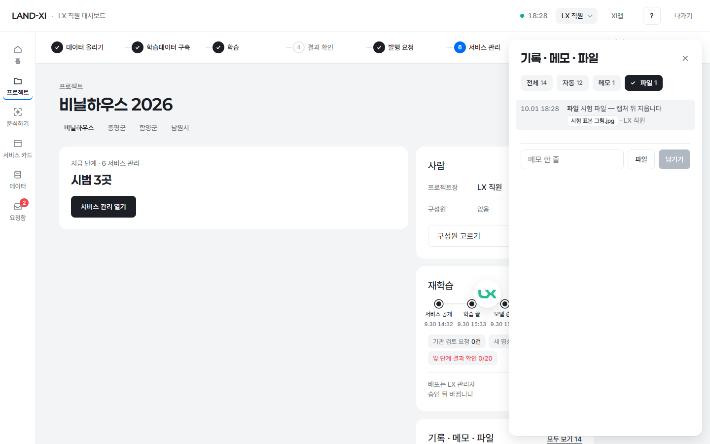 | 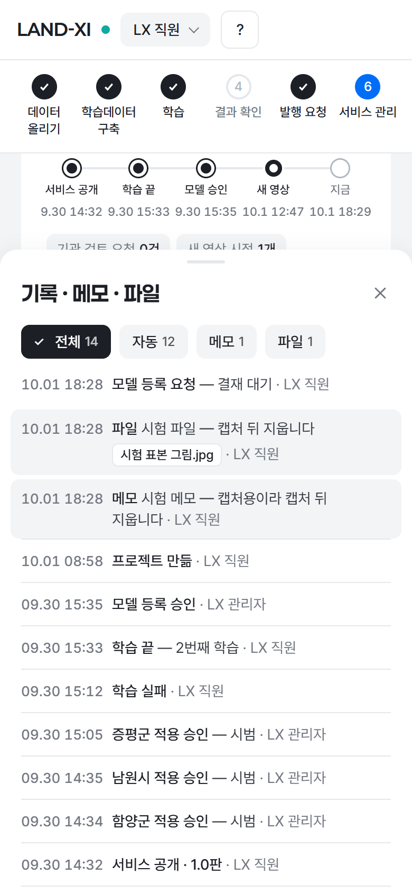 | 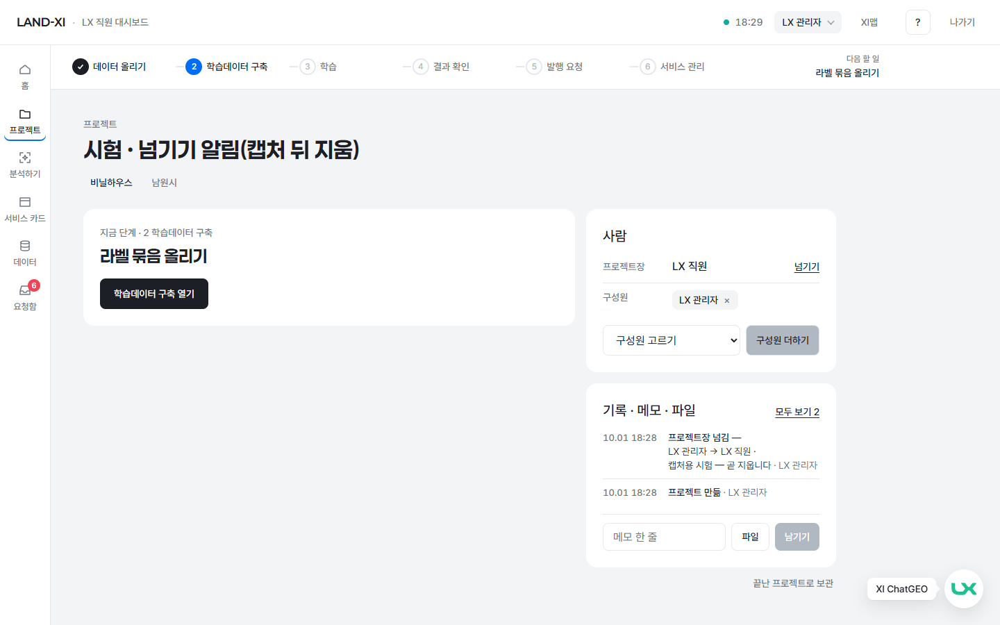 |

캡처의 '시험 메모 — 캡처용이라 캡처 뒤 지웁니다' · '시험 표본 그림.jpg'(설계 8차 시안의 표본 그림)와 '모델 등록 요청 — 결재 대기' 줄은 찍으려고 잠깐 넣은 것이며 찍은 뒤 지웠습니다(비닐하우스 2026 의 기록은 다시 11줄).

## 3. 프로젝트장 넘기기 · 내 정보(P-5 ⓐ)
**넘기기** — 사람 칸 프로젝트장 줄의 '넘기기'(프로젝트장 본인 · LX 관리자에게만). 받을 사람 · 메모(선택) → 받는 사람에게 알림 한 줄(대시보드 '내 프로젝트' · 프로젝트 목록 맨 위 · 열기 / 확인) · 넘긴 사람은 구성원으로 남음 · 기록 한 줄. 아직 답하지 않은 기관 검토 요청 · 확인 대기 분석 요청의 받는 사람도 함께 바뀝니다(새 요청은 원래대로 '그 서비스 프로젝트장'에게). 관리자 화면의 '프로젝트장 바꾸기' 고르기는 같은 창으로 합쳤습니다. 넘길 사람이 없으면 '넘길 사람이 없습니다'.

| 넘기기 창(휴대폰) | 받는 사람 — 대시보드 | 받는 사람 — 프로젝트 목록 | 휴대폰 |
|---|---|---|---|
| 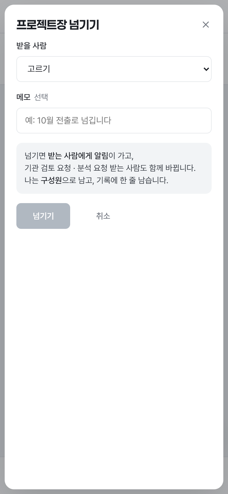 | 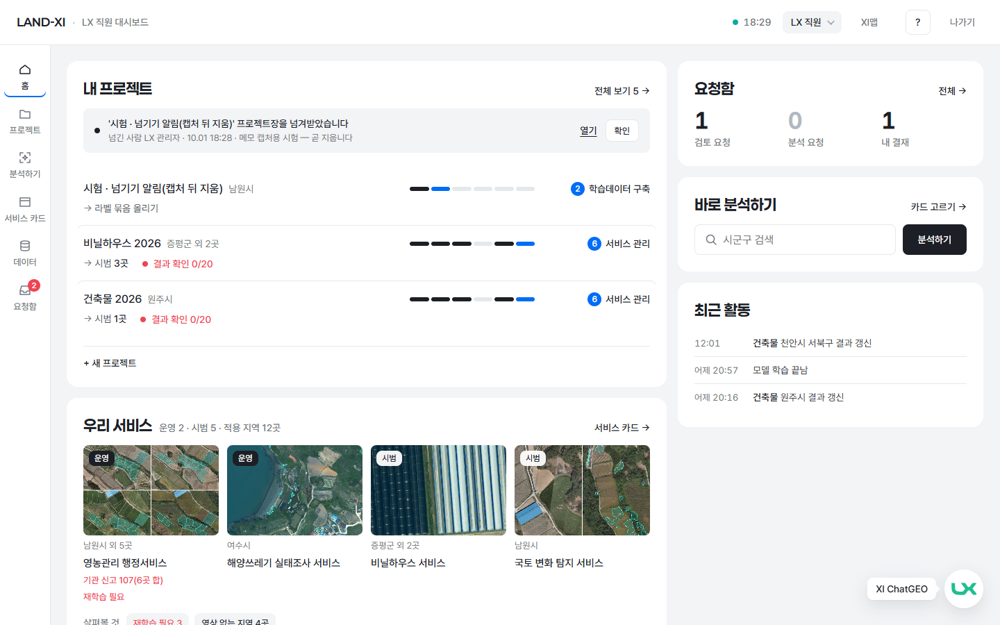 | 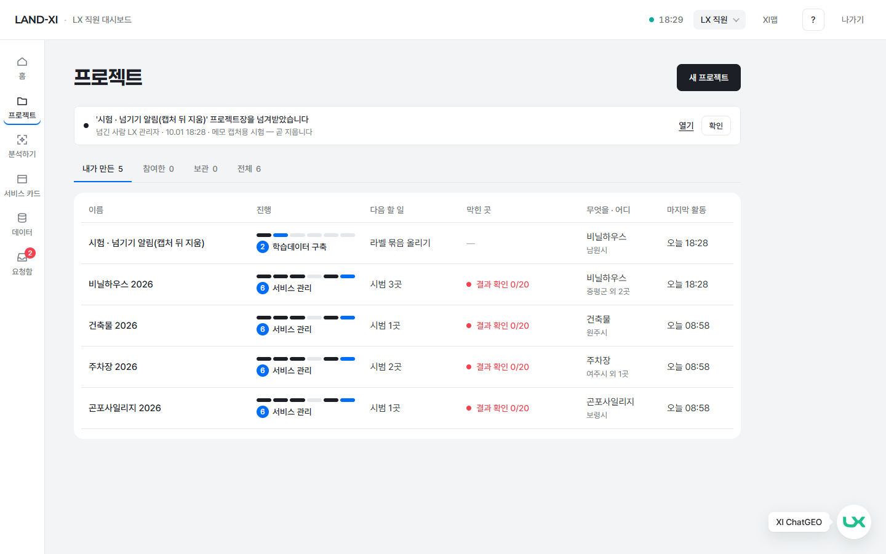 | 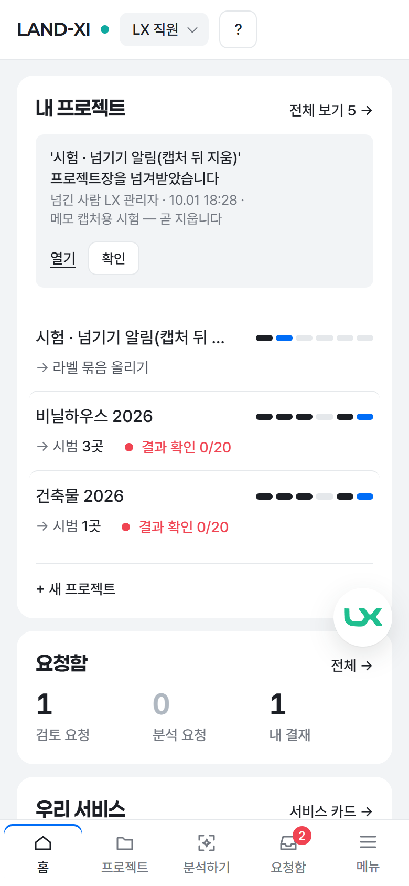 |

알림 캡처는 LX 관리자가 시험 프로젝트를 만들어 test@lx.or.kr 에게 넘긴 장면이며, 찍은 뒤 그 프로젝트와 알림을 지웠습니다.

**내 정보** — 모든 LX 화면(직원 · 관리자 · 영업) 머리의 내 이름을 누르면 창: 아이디(메일 — 고칠 수 없음) · 이름 · 부서 · 연락처(선택). 관리자 승인 없이 바로 바뀌고, 바꾼 칸의 전 · 후가 서버 감사 기록(계정 관리 → 처리 기록에 '내 정보 고침(본인)')에 남습니다. '?' → 내 계정 탭에도 부서 · 연락처 · 저장 용량과 '내 정보 고치기'. 기관 계정에는 두지 않았습니다(확인 범위 밖). 사용 중지 · 맡은 것 · 오래 기다림 알림은 만들지 않았습니다.

| 지금(전) | 바뀐 뒤 | 휴대폰 |
|---|---|---|
| 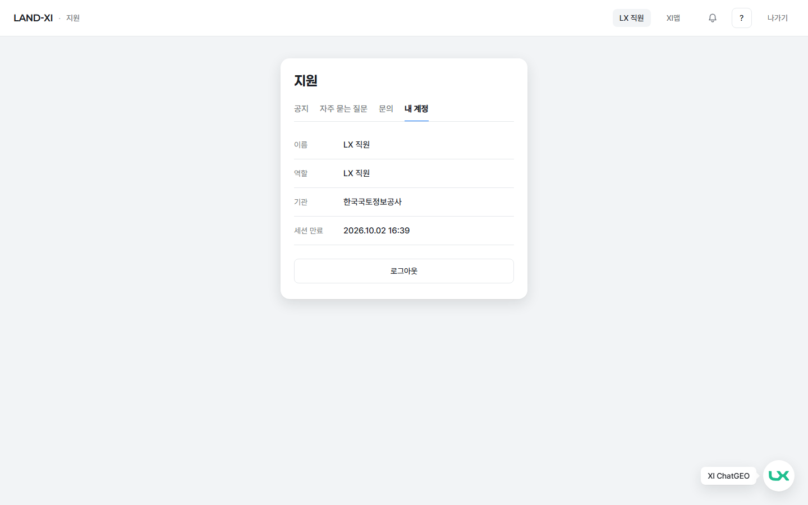 |  | 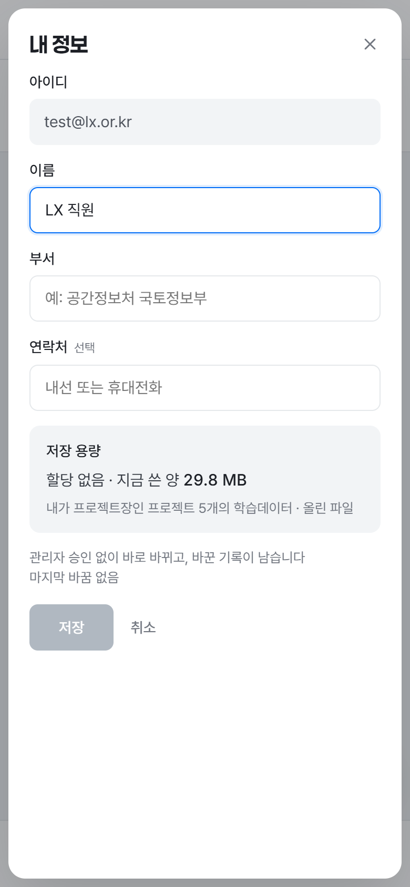 |

### 저장 용량 — 어떻게 보이고 어디서 오나
- 보이는 말: **'할당 없음 · 지금 쓴 양 29.8 MB'** + '내가 프로젝트장인 프로젝트 n개의 학습데이터 · 올린 파일'. 할당이 정해지면 '29.8 MB / 50 GB 할당'과 막대로 바뀝니다.
- **할당** = 계정마다 한 칸(LX 관리자가 정하는 값). 할당 · 요청 · 승인 화면은 아직 확인 전이라 지금 모든 계정이 비어 있고, 비어 있으면 지어내지 않고 '할당 없음'.
- **쓴 양** = 내가 프로젝트장인 프로젝트(진행 중 · 보관)의 저장 공간 합 — 이은 학습데이터 파일(이을 때 잰 크기) + 올린 파일. 프로젝트 한 장의 '저장 공간'과 **같은 계산 한 곳**을 씁니다(숫자 한 출처). 10월 1일 저녁 test@lx.or.kr = 비닐하우스 10.2 MB + 주차장 9.0 MB + 건축물 8.7 MB + 곤포사일리지 1.9 MB = **29.8 MB**(1000 단위 — 서버 사용 현황과 같은 단위). 캡처 때는 넘기기 알림용 시험 프로젝트가 잠깐 있어 '프로젝트 5개'로 보입니다(크기는 0).
- 정직하게 밝힐 점: 지금까지 서버 '사용 현황'은 기관 단위(기관 저장 공간)만 있었고 사람 단위 값은 없었습니다. 이번에 프로젝트 저장 공간을 사람(프로젝트장) 단위로 묶는 한 곳을 만들었습니다. 영상 원본 · 분석 결과처럼 프로젝트에 이어지지 않은 저장은 사람에게 나누지 않았습니다.

## 시험
| 무엇 | 결과 |
|---|---|
| 서버 시험(실서버) — 새 4개: 메모 · 파일(형식 · 20MB 한도 · 거절한 파일 남지 않음) · 보는 사람(다른 직원 · 기관 403, 관리자 200) · 저장 공간 더해짐 / 넘기기(프로젝트장 · 관리자만 · 알림 · 본 뒤 사라짐 · 기록 한 줄) / 재학습 사유가 회차 · 기록 · 관리자 결재 줄에 같은 말 / 내 정보(아이디 고정 · 바로 바뀜 · 감사 기록 · 저장 용량 = 서버 계산) | 통과 |
| 서버 시험 — 기존 프로젝트 · 계정 · 결재 · 검토 요청 · 계약(봉투) · 권한 묶음 | 통과(프로젝트장 바꾸기 시험은 '관리자만' → '프로젝트장 · 관리자'로 고침) |
| 화면 시험(로그인 폼) — 새 3개: 띠 · 칩이 서버 값과 같음 · 사유를 골라야 시작 · 보내는 값에 사유(요청은 가로채 서버에 닿지 않게) / 메모 · 파일 · 거르기 · 넘기기 / 내 정보 | 통과 |
| 화면 시험 — 기존 프로젝트 · 셸 · 프로젝트 목록 16개 | 통과(셸 시험 하나가 프로젝트를 읽기 전에 단계를 누르던 것을 기다리게 고침) |
| 캡처 점검(바깥 주소 · 1440 · 390) | 가로 넘침 0 · 금지어 0 · 한 단어만 남은 줄 0 · 화면 오류 0 |
| 되돌림 | 시험 프로젝트 · 메모 · 파일 · 알림 · 결재 줄 · 내 정보 바꾼 값 모두 지움 / 원래대로. 비닐하우스 2026 회차 1차 그대로 |

다시 찍기(개발자): `node docs/superpowers/final/process/impl-5/project/shoot.mjs --base https://app.land-xi.dev --only staff,notice,admin` — 쓰기 없음(창은 열어 고르기까지만). 알림 · 결재 장면은 시험 자료가 있을 때만 찍힙니다.

## 먼저 드리는 제안(원칙 57)
| 제안 | 누가 · 왜 |
|---|---|
| 저장 용량 할당 · 요청 · 승인 화면(LX 관리자가 사람마다 GB 를 정하고, 직원은 내 정보에서 더 달라고 요청) | LX 관리자 — 7차 데이터-1 '할당-요청-승인'의 나머지 반. 지금은 값을 넣을 자리만 있고 화면이 없습니다 |
| 넘겨받은 프로젝트를 요청함에도 한 줄 | 받는 사람 — 알림 한 줄을 '확인'으로 지나쳐도 할 일 목록에 남게(설계 8차 제안 그대로) |
| 내가 올린 파일 · 메모를 '지움'으로 표시(내용은 남기고 목록에서 흐리게) · 지운 파일은 저장 공간에서 빠지게 | 프로젝트장 — 잘못 올린 파일이 저장 용량을 계속 차지하지 않게. 지금은 지우는 길이 없습니다 |
| 부서를 LX 조직도에서 고르기(정식 오픈 때 사내 계정 연동과 함께) | LX 관리자 — 부서명 표기가 사람마다 달라지지 않게. 지금은 자유 입력 |
